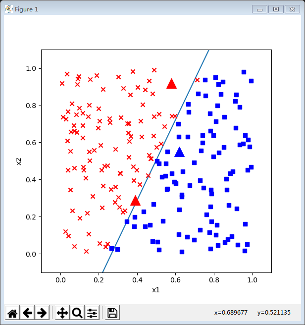
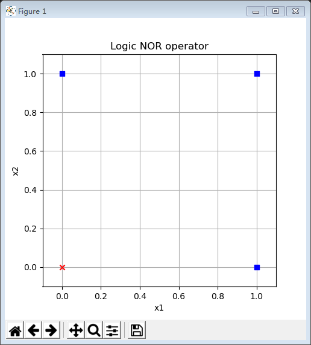
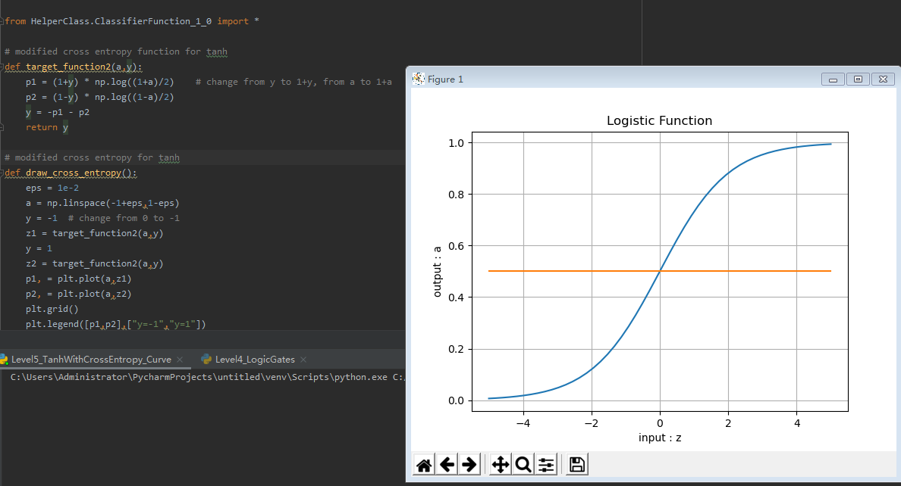

# 第三章  LinearClassification
# 多入单出的单层神经网路
##  线性二分类

### 逻辑回归模型

回归问题可以分为两类：线性回归和逻辑回归。在第二步中，我们学习了线性回归模型，在第三步中，我们将一起学习逻辑回归模型。

逻辑回归的英文是Logistic Regression，逻辑回归是用来计算“事件=Success”和“事件=Failure”的概率。当因变量的类型属于二元（1 / 0，真/假，是/否）变量时，我们就应该使用逻辑回归。

回忆线性回归，使用一条直线拟合样本数据，而逻辑回归是“拟合”0或1两个数值，而不是具体的连续数值，所以它叫广义线性模型。逻辑回归又称logistic回归分析，常用于数据挖掘，疾病自动诊断，经济预测等领域。

例如，探讨引发疾病的危险因素，并根据危险因素预测疾病发生的概率等。以胃癌病情分析为例，选择两组人群，一组是胃癌组，一组是非胃癌组，两组人群必定具有不同的体征与生活方式等。因此因变量就为是否胃癌，值为“是”或“否”；自变量就可以包括很多了，如年龄、性别、饮食习惯、幽门螺杆菌感染等。

自变量既可以是连续的，也可以是分类的。然后通过logistic回归分析，可以得到自变量的权重，从而可以大致了解到底哪些因素是胃癌的危险因素。同时根据该权值可以根据危险因素预测一个人患癌症的可能性。

逻辑回归的另外一个名字叫做分类器，分为线性分类器和非线性分类器，本章中我们学习线性分类器。而无论是线性还是非线性分类器，又分为两种：二分类问题和多分类问题，在本章中我们学习二分类问题。线性多分类问题将会在下一章讲述，非线性分类问题在后续的步骤中讲述。

综上所述，我们本章要学习的路径是：回归问题->逻辑回归问题->线性逻辑回归即分类问题->线性二分类问题。

## 二分类函数

此函数对线性和非线性二分类都适用。

### 二分类函数

对率函数Logistic Function，即可以做为激活函数使用，又可以当作二分类函数使用。而在很多不太正规的文字材料中，把这两个概念混用了，比如下面这个说法：“我们在最后使用Sigmoid激活函数来做二分类”，这是不恰当的。在本书中，我们会根据不同的任务区分激活函数和分类函数这两个概念，在二分类任务中，叫做Logistic函数，而在作为激活函数时，叫做Sigmoid函数。

- 公式

$$a(z) = \frac{1}{1 + e^{-z}}$$

- 导数

$$a^{'}(z) = a(z)(1 - a(z))$$

具体求导过程可以参考8.1节。

- 输入值域

$$(-\infty, \infty)$$

- 输出值域

$$(0,1)$$

- 函数图像


- 使用方式

此函数实际上是一个概率计算，它把$(-\infty, \infty)$之间的任何数字都压缩到$(0,1)$之间，返回一个概率值，这个概率值接近1时，认为是正例，否则认为是负例。

训练时，一个样本x在经过神经网络的最后一层的矩阵运算结果作为输入z，经过Logistic计算后，输出一个$(0,1)$之间的预测值。我们假设这个样本的标签值为0属于负类，如果其预测值越接近0，就越接近标签值，那么误差越小，反向传播的力度就越小。

推理时，我们预先设定一个阈值比如0.5，则当推理结果大于0.5时，认为是正类；小于0.5时认为是负类；等于0.5时，根据情况自己定义。阈值也不一定就是0.5，也可以是0.65等等，阈值越大，准确率越高，召回率越低；阈值越小则相反，准确度越低，召回率越高。

比如：
- input=2时，output=0.88，而0.88>0.5，算作正例
- input=-1时，output=0.27，而0.27<0.5，算作负例

###  正向传播

#### 矩阵运算

$$
z=x \cdot w + b \tag{1}
$$

#### 分类计算

$$
a = Logistic(z)={1 \over 1 + e^{-z}} \tag{2}
$$

#### 损失函数计算

二分类交叉熵损失函数：

$$
loss(w,b) = -[y \ln a+(1-y)\ln(1-a)] \tag{3}
$$

###  反向传播

#### 求损失函数loss对a的偏导

$$
\frac{\partial loss}{\partial a}=-[{y \over a}+{-(1-y) \over 1-a}]=\frac{a-y}{a(1-a)} \tag{4}
$$

#### 求损失函数a对z的偏导

$$
\frac{\partial a}{\partial z}= a(1-a) \tag{5}
$$

#### 求损失函数loss对z的偏导

使用链式法则链接公式4和公式5：

$$
\frac{\partial loss}{\partial z}=\frac{\partial loss}{\partial a}\frac{\partial a}{\partial z}
$$
$$
=\frac{a-y}{a(1-a)} \cdot a(1-a)=a-y \tag{6}
$$

我们惊奇地发现，使用交叉熵函数求导得到的分母，与Logistic分类函数求导后的结果，正好可以抵消，最后只剩下了$a-y$这一项。真的有这么巧合的事吗？实际上这是依靠科学家们的聪明才智寻找出了这种匹配关系，以满足以下条件：
1. 损失函数满足二分类的要求，无论是正例还是反例，都是单调的；
2. 损失函数可导，以便于使用反向传播算法；
3. 让计算过程非常简单，一个减法就可以搞定。

#### 多样本情况

我们用三个样本做实例化推导：

$$Z=
\begin{pmatrix}
  z_1 \\ z_2 \\ z_3
\end{pmatrix},
A=logistic\begin{pmatrix}
  z_1 \\ z_2 \\ z_3
\end{pmatrix}=
\begin{pmatrix}
  a_1 \\ a_2 \\ a_3
\end{pmatrix}
$$
$$
J(w,b)= -[y_1 \ln a_1+(1-y_1)\ln(1-a_1)] 
$$
$$
-[y_2 \ln a_2+(1-y_2)\ln(1-a_2)] 
$$
$$
-[y_3 \ln a_3+(1-y_3)\ln(1-a_3)] 
$$

$$
{\partial J(w,b) \over \partial Z}=
\begin{pmatrix}
  {\partial J(w,b) / \partial z_1} \\
  {\partial J(w,b) / \partial z_2} \\
  {\partial J(w,b) / \partial z_3}
\end{pmatrix} \tag{代入公式6结果}
$$
$$
=\begin{pmatrix}
  a_1-y_1 \\
  a_2-y_2 \\
  a_3-y_3 
\end{pmatrix}=A-Y
$$

所以，用矩阵运算时可以简化为矩阵相减的形式：$A-Y$。

### 对数几率的来历

经过数学推导后可以知道，神经网络实际也是在做这样一件事：经过调整w和b的值，把所有正例的样本都归纳到大于0.5的范围内，所有负例都小于0.5。但是如果只说大于或者小于，无法做准确的量化计算，所以用一个对率函数来模拟。

说到对率函数，还有一个问题，它为啥叫做“对数几率”函数呢？从哪里看出是“对数”了？“几率”是什么意思呢？

我们举例说明：假设有一个硬币，抛出落地后，得到正面的概率是0.5，得到反面的概率是0.5，这两个概率叫做probability。如果用正面的概率除以反面的概率，0.5/0.5=1，这个数值叫做odds，几率。

泛化一下，如果正面的概率是a，则反面的概率就是1-a，则几率等于：

$$odds = \frac{a}{1-a} \tag{9}$$

上式中，如果a是把样本x的预测为正例的可能性，那么1-a就是其负例的可能性，a/(1-a)就是正负例的比值，称为几率(odds)，反映了x作为正例的相对可能性，而对几率取对数就叫做对数几率(log odds, logit)。

如果假设概率如下表：

|a|0|0.1|0.2|0.3|0.4|0.5|0.6|0.7|0.8|0.9|1|
|--|--|--|--|--|--|--|--|--|--|--|--|
|1-a|1|0.9|0.8|0.7|0.6|0.5|0.4|0.3|0.2|0.1|0|
|odds|0|0.11|0.25|0.43|0.67|1|1.5|2.33|4|9|无穷大|
|ln(odds)|N/A|-2.19|-1.38|-0.84|-0.4|0|0.4|0.84|1.38|2.19|N/A|

可以看到0dds的值不是线性的，不利于分析问题，所以在表中第4行对odds取对数，可以得到一组成线性关系的值，即：

$$\ln \frac{a}{1-a} = xw + b \tag{10}$$

对公式10两边取自然指数：

$$\frac{a}{1-a}=e^{xw+b} \tag{11}$$

对公式11取倒数：

$$\frac{1-a}{a}=e^{-(xw+b)}$$

变形：

$$\frac{1}{a}-1=e^{-(xw+b)}$$
$$\frac{1}{a}=1+e^{-(xw+b)}$$
$$a=\frac{1}{1+e^{-(xw+b)}}$$

令$z=e^{-(xw+b)}$：

$$a=\frac{1}{1+e^{-z}} \tag{12}$$

公式12就是公式2！对数几率的函数形式可以认为是这样得到的。

以上推导过程，实际上就是用线性回归模型的预测结果来逼近样本分类的对数几率。这就是为什么它叫做逻辑回归(logistic regression)，但其实是分类学习的方法。这种方法的优点如下：

- 直接对分类可能性建模，无需事先假设数据分布，避免了假设分布不准确所带来的问题
- 不仅预测出类别，而是得到了近似的概率，这对许多需要利用概率辅助决策的任务很有用
- 对率函数是任意阶可导的凸函数，有很好的数学性，许多数值优化算法都可以直接用于求取最优解


## 线性二分类的神经网络实现

###  定义神经网络结构

根据前面的猜测，看来我们只需要一个二入一出的神经元就可以搞定。这个网络只有输入层和输出层，由于输入层不算在内，所以是一层网络。


与上一章的网络结构图的区别是，这次我们在神经元输出时使用了分类函数，所以有个A的输出，而不是以往的Z的直接输出。

#### 输入层

输入经度(x1)和纬度(x2)两个特征：

$$
x=\begin{pmatrix}
x_{1} & x_{2}
\end{pmatrix}
$$

#### 权重矩阵

输入是2个特征，输出一个数，则W的尺寸就是2x1：

$$
w=\begin{pmatrix}
w_{1} \\ w_{2}
\end{pmatrix}
$$

B的尺寸是1x1，行数永远是1，列数永远和W一样。

$$
b=\begin{pmatrix}
b_{1}
\end{pmatrix}
$$

#### 输出层

$$
z = x \cdot w + b
=\begin{pmatrix}
    x_1 & x_2
\end{pmatrix}
\begin{pmatrix}
    w_1 \\ w_2
\end{pmatrix}
$$
$$
=x_1 \cdot w_1 + x_2 \cdot w_2 + b \tag{1}
$$
$$a = Logistic(z) \tag{2}$$

#### 损失函数

二分类交叉熵函损失数：

$$
loss(w,b) = -[yln a+(1-y)ln(1-a)] \tag{3}
$$

### 反向传播

我们在6.1节已经推导了loss对z的偏导数，结论为$A-Y$。接下来，我们求loss对w的导数。本例中，w的形式是一个2行1列的向量，所以求w的偏导时，要对向量求导：

$$
\frac{\partial loss}{\partial w}=
\begin{pmatrix}
    {\partial loss / \partial w_1} \\ 
    {\partial loss / \partial w_2}
\end{pmatrix}
$$
$$
=\begin{pmatrix}
 \frac{\partial loss}{\partial z}\frac{\partial z}{\partial w_1} \\
 \\
 \frac{\partial loss}{\partial z}\frac{\partial z}{\partial w_2}   
\end{pmatrix}
=
\begin{pmatrix}
    (a-y)x_1 \\
    (a-y)x_2
\end{pmatrix}
$$
$$
=(x_1 \ x_2)^T (a-y) \tag{4}
$$

上式中$x_1x_2$是一个样本的两个特征值。如果是多样本的话，公式4将会变成其矩阵形式，以m=3为例：

$$
{\partial J(w,b) \over \partial w}=
\begin{pmatrix}
    x_{11} & x_{12} \\
    x_{21} & x_{22} \\
    x_{31} & x_{32} 
\end{pmatrix}^T
\begin{pmatrix}
    a_1-y_1 \\
    a_2-y_2 \\
    a_3-y_3 
\end{pmatrix}
$$
$$
=X^T(A-Y) \tag{5}
$$

## 线性二分类原理

###  二分类过程

下面我们以单样本双特征值为例来说明神经网络的二分类过程，这是用代数方式来解释其工作原理。

1. 正向计算

$$
z = x_1 w_1+ x_2 w_2 + b  \tag{1}
$$

2. 分类计算

$$
a={1 \over 1 + e^{-z}} \tag{2}
$$

3. 损失函数计算

$$
loss = -[y \ln (a)+(1-y) \ln (1-a)] \tag{3}
$$


###  二分类的几何原理

我们再观察一下下面这张分类正确的图：


假设绿色方块为正类：标签值$y=1$，红色三角形为负类：标签值$y=0$。

从几何关系上理解，如果我们有一条直线，其公式为：$z = w \cdot x_1+b$，如图中的虚线所示，则所有正类的样本的x2都大于z，而所有的负类样本的x2都小于z，那么这条直线就是我们需要的分割线。用正例的样本来表示：

$$
x_2 > z，即正例满足条件：x_2 > w \cdot x_1 + b \tag{4}
$$

那么神经网络用矩阵运算+分类函数+损失函数这么复杂的流程，其工作原理是什么呢？

经典机器学习中的SVM确实就是用这种思路来解决这个问题的，即一个类别的所有样本在分割线的一侧，而负类样本都在线的另一侧。神经网络的正向公式如公式1，2所示，当a>0.5时，判为正类。当a<0.5时，判为负类。z=0即a=0.5时为分割线：


我们用正例来举例：

$$a = Logistic(z) = {1 \over 1 + e^{-z}} > 0.5$$

做公式变形，再两边取自然对数，可以得到：

$$z > 0$$

即：
$$
z = x_1 \cdot w_1 + x_2 \cdot w_2 + b > 0
$$
对上式做一下变形，把x2放在左侧，其他项放在右侧：
$$
x_2 > - {w_1 \over w_2}x_1 - {b \over w_2} \tag{5}
$$
简化一下两个系数，令w'=-w1/w2，b'=-b/w2：
$$
x_2 > w' \cdot x_1 + b' \tag{6}
$$
比较一下公式4和6，
$$
x_2 > w \cdot x_1 + b \tag{4}
$$

一模一样！这就说明神经网络的工作原理和我们在二维平面上的直观感觉是相同的，即当x2大于一条直线时，会被判为正例。如果用负例举例，其结果将会是：$a<0.5，z<0，x_2 \lt w \cdot x_1 + b$，即点处于直线下方。

由此，我们还得到了一个额外的收获，即：

$$w' = - w1 / w2 \tag{7}$$

$$b' = -b/w2 \tag{8}$$

我们可以使用神经网络计算出$w1，w2，b$三个值以后，换算成$w'，b'$，以便在二维平面上画出分割线，来直观地判断神经网络训练结果的正确性。

##  实现逻辑与门和或门

我们第4章用线性回归的方式实现了逻辑非门。在学习了第6章的分类后，我们可以用分类的思想来实现下列4个逻辑门：

- 与门 AND
- 与非门 NAND
- 或门 OR
- 或非门 NOR

以逻辑AND为例，下图中的4个点，分别是4个样本数据，蓝色圆点表示负例，红色三角表示正例：


如果用分类思想的话，根据前面学到的知识，应该在红色点和蓝色点之间划出一条分割线来，可以正好把正例和负例完全分开。由于样本数据稀疏，所以这条分割线的角度和位置可以比较自由，比如图中的三条直线，都可以是这个问题的解。

### 网络模型

依然使用第6.2节中的神经元模型：


因为输入特征值只有两个，输出一个二分类，所以模型和前一节的一样。

### 训练样本

每个类型的逻辑门都只有4个训练样本。

- 逻辑与门的样本

|样本|x1|x2|y|
|---|---|---|---|
|1|0|0|0|
|2|0|1|0|
|3|1|0|0|
|4|1|1|1|

- 逻辑与非门的样本

|样本|x1|x2|y|
|---|---|---|---|
|1|0|0|1|
|2|0|1|1|
|3|1|0|1|
|4|1|1|0|

- 逻辑或门的样本

|样本|x1|x2|y|
|---|---|---|---|
|1|0|0|0|
|2|0|1|1|
|3|1|0|1|
|4|1|1|1|

- 逻辑或非门的样本

|样本|x1|x2|y|
|---|---|---|---|
|1|0|0|1|
|2|0|1|0|
|3|1|0|0|
|4|1|1|0|

### 代码实现

#### 读取数据
  
```Python
class LogicDataReader(SimpleDataReader):
    def Read_Logic_AND_Data(self):
        X = np.array([0,0,0,1,1,0,1,1]).reshape(4,2)
        Y = np.array([0,0,0,1]).reshape(4,1)
        self.XTrain = self.XRaw = X
        self.YTrain = self.YRaw = Y
        self.num_train = self.XRaw.shape[0]

    def Read_Logic_NAND_Data(self):
        ......

    def Read_Logic_OR_Data(self):
        ......

    def Read_Logic_NOR_Data(self):        
        ......
```

以逻辑AND为例，我们从SimpleDataReader派生出自己的类LogicDataReader，并加入特定的数据读取方法Read_Logic_AND_Data()，其它几个逻辑门的方法类似，在此只列出方法名称。

#### 测试函数

```Python
def Test(net, reader):
    X,Y = reader.GetWholeTrainSamples()
    A = net.inference(X)
    print(A)
    diff = np.abs(A-Y)
    result = np.where(diff < 1e-2, True, False)
    if result.sum() == 4:
        return True
    else:
        return False
```

我们知道了神经网络只能给出近似解，但是这个“近似”能到什么程度，是需要我们在训练时自己指定的。相应地，我们要有测试手段，比如当输入为(1，1)时，AND的结果是1，但是神经网络只能给出一个0.721的概率值，这是不满足精度要求的，必须让4个样本的误差都小于1e-2。

#### 训练函数

```Python
def train(reader, title):
    draw_source_data(reader, title)
    plt.show()
    # net train
    params = HyperParameters(eta=0.5, max_epoch=10000, batch_size=1, eps=2e-3, net_type=NetType.BinaryClassifier)
    num_input = 2
    num_output = 1
    net = NeuralNet(params, num_input, num_output)
    net.train(reader, checkpoint=1)
    # test
    print(Test(net, reader))
    # visualize
    draw_source_data(reader, title)
    draw_split_line(net, reader, title)
    plt.show()
```
在超参中指定了最多10000次的epoch，0.5的学习率，最大的loss停止条件2e-3。在训练结束后，要先调用测试函数，需要返回True才能算满足要求，然后用图形显示分类结果。


#  多入单出的单层神经网路

## 线性多分类问题

#### 二分类与多分类的关系

我们已经学习过了使用神经网络做二分类的方法，它并不能用于多分类。在传统的机器学习中，有些二分类算法可以直接推广到多分类，但是在更多的时候，我们会基于一些基本策略，利用二分类学习器来解决多分类问题。

多分类问题一共有三种解法：
1. 一对一
   
每次先只保留两个类别的数据，训练一个分类器。如果一共有N个类别，则需要训练$C^2_N$个分类器。以N=3时举例，需要训练(A|B)，(B|C)，(A|C)三个分类器。


如上图最左侧所示，这个二分类器只关心蓝色和绿色样本的分类，而不管红色样本的情况，也就是说在训练时，只把蓝色和绿色样本输入网络。
   
推理时，(A|B)分类器告诉你是A类时，需要到(A|C)分类器再试一下，如果也是A类，则就是A类。如果(A|C)告诉你是C类，则基本是C类了，不可能是B类，不信的话可以到(B|C)分类器再去测试一下。

2. 一对多
   
如下图，处理一个类别时，暂时把其它所有类别看作是一类，这样对于三分类问题，可以得到三个分类器。


如最左图，这种情况是在训练时，把红色样本当作一类，把蓝色和绿色样本混在一起当作另外一类。

推理时，同时调用三个分类器，再把三种结果组合起来，就是真实的结果。比如，第一个分类器告诉你是“红类”，那么它确实就是红类；如果告诉你是非红类，则需要看第二个分类器的结果，绿类或者非绿类；依此类推。

3. 多对多

假设有4个类别ABCD，我们可以把AB算作一类，CD算作一类，训练一个分类器1；再把AC算作一类，BD算作一类，训练一个分类器2。
    
推理时，第1个分类器告诉你是AB类，第二个分类器告诉你是BD类，则做“与”操作，就是B类。

#### 多分类与多标签

多分类学习中，虽然有多个类别，但是每个样本只属于一个类别。

有一种情况也很常见，比如一幅图中，既有蓝天白云，又有花草树木，那么这张图片可以有两种标注方法：
- 标注为“风景”，而不是“人物”，属于风景图片，这叫做分类
- 被同时标注为“蓝天”、“白云”、“花草”、“树木”等多个标签，这样的任务不叫作多分类学习，而是“多标签”学习，multi-label learning。我们此处不涉及这类问题。

## 7.1 多分类函数

此函数对线性多分类和非线性多分类都适用。

先回忆一下二分类问题，在线性计算后，使用了Logistic函数计算样本的概率值，从而把样本分成了正负两类。那么对于多分类问题，应该使用什么方法来计算样本属于各个类别的概率值呢？又是如何作用到反向传播过程中的呢？我们这一节主要研究这个问题。

### 7.1.1 多分类函数定义 - Softmax

#### 为什么叫做Softmax？

假设输入值是：[3,1,-3]，如果取max操作会变成：[1,0,0]，这符合我们的分类需要。但是有两个不足：
1. 分类结果是[1，0，0]，只保留的非0即1的信息，没有各元素之间相差多少的信息，可以理解是“Hard-Max”
2. max操作本身不可导，无法用在反向传播中。

所以Softmax加了个"soft"来模拟max的行为，但同时又保留了相对大小的信息。

$$
a_j = \frac{e^{z_j}}{\sum\limits_{i=1}^m e^{z_i}}=\frac{e^{z_j}}{e^{z_1}+e^{z_2}+\dots+e^{z_m}}
$$

上式中:
- $z_j$是对第 j 项的分类原始值，即矩阵运算的结果
- $z_i$是参与分类计算的每个类别的原始值
- m 是总的分类数
- $a_j$是对第 j 项的计算结果

假设j=1，m=3，上式为：
  
$$a_1=\frac{e^{z_1}}{e^{z_1}+e^{z_2}+e^{z_3}}$$

用一张图来形象地说明这个过程：


当输入的数据$[z_1,z_2,z_3]$是$[3,1,-3]$时，按照图示过程进行计算，可以得出输出的概率分布是$[0.879,0.119,0.002]$。

总结一下：

|输入原始值|(3, 1, -3)|
|---|---|
|MAX计算|(1, 0, 0)|
|Softmax计算|(0.879, 0.119, 0.002)|

也就是说，在（至少）有三个类别时，通过使用Softmax公式计算它们的输出，比较相对大小后，得出该样本属于第一类，因为第一类的值为0.879，在三者中最大。注意这是对一个样本的计算得出的数值，而不是三个样本，亦即softmax给出了某个样本分别属于三个类别的概率。

它有两个特点：

1. 三个类别的概率相加为1
2. 每个类别的概率都大于0

#### Softmax的工作原理

我们仍假设网络输出的预测数据是z=[3, 1, -3]，而标签值是y=[1, 0, 0]。在做反向传播时，根据前面的经验，我们会用z-y，得到：

$$z-y=[2,1,-3]$$

这个信息很奇怪：
- 第一项是2，我们已经预测准确了此样本属于第一类，但是反向误差的值是2，即惩罚值是2
- 第二项是1，惩罚值是1，预测对了，仍有惩罚值
- 第三项是-3，惩罚值是-3，意为着奖励值是3，明明预测错误了却给了奖励

所以，如果不使用Softmax这种机制，会存在有个问题：
- z值和y值之间，即预测值和标签值之间不可比，比如z[0]=3与y[0]=1是不可比的
- z值中的三个元素之间虽然可比，但只能比大小，不能比差值，比如z[0]>z[1]>z[2]，但3和1相差2，1和-3相差4，这些差值是无意义的

在使用Softmax之后，我们得到的值是a=[0.879, 0.119, 0.002]，用a-y：

$$a-y=[-0.121, 0.119, 0.002]$$

再来分析这个信息：

- 第一项-0.121是奖励给该类别0.121，因为它做对了，但是可以让这个概率值更大，最好是1
- 第二项0.119是惩罚，因为它试图给第二类0.119的概率，所以需要这个概率值更小，最好是0
- 第三项0.002是惩罚，因为它试图给第三类0.002的概率，所以需要这个概率值更小，最好是0

这个信息是完全正确的，可以用于反向传播。Softmax先做了归一化，把输出值归一到[0,1]之间，这样就可以与标签值的0或1去比较，并且知道惩罚或奖励的幅度。

从继承关系的角度来说，Softmax函数可以视作Logistic函数扩展，比如一个二分类问题：

$$
a1 = \frac{e^{z_1}}{e^{z_1} + e^{z_2}} = \frac{1}{1 + e^{z_2 - z_1}}
$$

是不是和Logistic函数形式非常像？其实Logistic函数也是给出了当前样本的一个概率值，只不过是依靠偏近0或偏近1来判断属于正类还是负类。

###  正向传播

#### 矩阵运算

$$
z=x \cdot w + b \tag{1}
$$

#### 分类计算

$$
a_j = \frac{e^{z_j}}{\sum\limits_{i=1}^m e^{z_i}}=\frac{e^{z_j}}{e^{z_1}+e^{z_2}+\dots+e^{z_m}} \tag{2}
$$

#### 损失函数计算

计算单样本时，m是分类数：
$$
loss(w,b)=-\sum_{i=1}^m y_i \ln a_i \tag{3}
$$

计算多样本时，m是分类树，n是样本数：
$$J(w,b) =- \sum_{j=1}^n \sum_{i=1}^m y_{ij} \log a_{ij} \tag{4}$$

图示如下：


### 反向传播

#### 实例化推导

我们先用实例化的方式来做反向传播公式的推导，然后再扩展到一般性上。假设有三个类别，则：

$$
z_1 = x \cdot w+ b_1 \tag{5}
$$
$$
z_2 = x \cdot w + b_2 \tag{6}
$$
$$
z_3 = x \cdot w + b_3 \tag{7}
$$
$$
a_1=\frac{e^{z_1}}{\sum_i e^{z_i}}=\frac{e^{z_1}}{e^{z_1}+e^{z_2}+e^{z_3}}  \tag{8}
$$
$$
a_2=\frac{e^{z_2}}{\sum_i e^{z_i}}=\frac{e^{z_2}}{e^{z_1}+e^{z_2}+e^{z_3}}  \tag{9}
$$
$$
a_3=\frac{e^{z_3}}{\sum_i e^{z_i}}=\frac{e^{z_3}}{e^{z_1}+e^{z_2}+e^{z_3}}  \tag{10}
$$

为了方便书写，我们令：

$$
E ={e^{z_1}+e^{z_2}+e^{z_3}}
$$

$$
loss(w,b)=-(y_1 \ln a_1 + y_2 \ln a_2 + y_3 \ln a_3)  \tag{11}
$$

$$
\frac{\partial{loss}}{\partial{z_1}}= \frac{\partial{loss}}{\partial{a_1}}\frac{\partial{a_1}}{\partial{z_1}} + \frac{\partial{loss}}{\partial{a_2}}\frac{\partial{a_2}}{\partial{z_1}} + \frac{\partial{loss}}{\partial{a_3}}\frac{\partial{a_3}}{\partial{z_1}}  \tag{12}
$$

依次求解公式12中的各项：

$$
{\partial loss \over \partial a_1}=- {y_1 \over a_1} \tag{13}
$$
$$
{\partial loss \over \partial a_2}=- {y_2 \over a_2} \tag{14}
$$
$$
{\partial loss \over \partial a_3}=- {y_3 \over a_3} \tag{15}
$$

$$
{\partial a_1 \over \partial z_1}=({\partial e^{z_1}\over \partial z_1} E -{\partial E \over \partial z_1}e^{z_1})/E^2
$$
$$
={e^{z_1}E - e^{z_1}e^{z_1} \over E^2}=a_1(1-a_1)  \tag{16}
$$

$$
{\partial a_2 \over \partial z_1}=({\partial e^{z_2}\over \partial z_1} E -{\partial E \over \partial z_1}e^{z_2})/E^2
$$
$$
={0 - e^{z_1}e^{z_2} \over E^2}=-a_1 a_2 \tag{17}
$$

$$
{\partial a_3 \over \partial z_1}=({\partial e^{z_3}\over \partial z_1} E -{\partial E \over \partial z_1}e^{z_3})/E^2
$$
$$
={0 - e^{z_1}e^{z_3} \over E^2}=-a_1 a_3  \tag{18}
$$

把公式13~18组合到12中：

$$
{\partial loss \over \partial z_1}=-{y_1 \over a_1}a_1(1-a_1)+{y_2 \over a_2}a_1a_2+{y_3 \over a_3}a_1a_3
$$
$$
=-y_1+y_1a_1+y_2a_1+y_3a_1=-y_1+a_1(y_1+y_2+y_3)
$$
$$
=a_1-y_1 \tag{19}
$$

不失一般性，由公式19可得：
$$
{\partial loss \over \partial z_i}=a_i-y_i \tag{20}
$$

#### 一般性推导

1. Softmax函数自身的求导

由于Softmax涉及到求和，所以有两种情况：

- 求输出项$a_1$对输入项$z_1$的导数，此时：$j=1, i=1, i=j$，可以扩展到i, j为任意相等值
- 求输出项$a_2或a_3$对输入项$z_1$的导数，此时：$j=2或3, i=1, i \neq j$，可以扩展到i, j为任意不等值

Softmax函数的分子：因为是计算$a_j$，所以分子是$e^{z_j}$。

Softmax函数的分母：
$$
\sum\limits_{i=1}^m e^{z_i} = e^{z_1} + \dots + e^{z_j} + \dots +e^{z_m} => E
$$

- $i=j$时（比如输出分类值a1对z1的求导），求$a_j$对$z_i$的导数，此时分子上的$e^{z_j}$要参与求导。参考基本数学导数公式33：

$$\frac{\partial{a_j}}{\partial{z_i}} = \frac{\partial{}}{\partial{z_i}}(e^{z_j}/E)$$
$$= \frac{\partial{}}{\partial{z_j}}(e^{z_j}/E) \tag{因为$z_i=z_j$}$$
$$=\frac{e^{z_j}E-e^{z_j}e^{z_j}}{E^2}$$
$$=\frac{e^{z_j}}{E} - \frac{(e^{z_j})^2}{E^2}$$
$$= a_j-a^2_j=a_j(1-a_j) \tag{21}$$

- $i \neq j$时（比如输出分类值a1对z2的求导，j=1, i=2），$a_j$对$z_i$的导数，分子上的$z_j与i$没有关系，求导为0，分母的求和项中$e^{z_i}$要参与求导。同样是公式33，因为分子$e^{z_j}$对$e^{z_i}$求导的结果是0：

$$
\frac{\partial{a_j}}{\partial{z_i}}=\frac{-(E)'e^{z_j}}{E^2}
$$
求和公式对$e^{z_i}$的导数$(E)'$，除了$e^{z_i}$项外，其它都是0：
$$
(E)' = (e^{z_1} + \dots + e^{z_i} + \dots +e^{z_m})'=e^{z_i}
$$
所以：
$$
\frac{\partial{a_j}}{\partial{z_i}}=\frac{-(E)'e^{z_j}}{(E)^2}=-\frac{e^{z_j}e^{z_i}}{{(E)^2}}=-\frac{e^{z_j}}{{E}}\frac{e^{z_j}}{{E}}=-a_{i}a_{j} \tag{22}
$$

2. 结合损失函数的整体反向传播公式

看上图，我们要求Loss值对Z1的偏导数。和以前的Logistic函数不同，那个函数是一个z对应一个a，所以反向关系也是一对一。而在这里，a1的计算是有z1,z2,z3参与的，a2的计算也是有z1,z2,z3参与的，即所有a的计算都与前一层的z有关，所以考虑反向时也会比较复杂。

先从Loss的公式看，$loss=-(y_1lna_1+y_2lna_2+y_3lna_3)$，a1肯定与z1有关，那么a2,a3是否与z1有关呢？

再从Softmax函数的形式来看：

无论是a1，a2，a3，都是与z1相关的，而不是一对一的关系，所以，想求Loss对Z1的偏导，必须把Loss->A1->Z1， Loss->A2->Z1，Loss->A3->Z1，这三条路的结果加起来。于是有了如下公式：

$$
\frac{\partial{loss}}{\partial{z_i}}= \frac{\partial{loss}}{\partial{a_1}}\frac{\partial{a_1}}{\partial{z_i}} + \frac{\partial{loss}}{\partial{a_2}}\frac{\partial{a_2}}{\partial{z_i}} + \frac{\partial{loss}}{\partial{a_3}}\frac{\partial{a_3}}{\partial{z_i}}$$
$$=\sum_j \frac{\partial{loss}}{\partial{a_j}}\frac{\partial{a_j}}{\partial{z_i}}$$

你可以假设上式中$i=1，j=3$，就完全符合我们的假设了，而且不失普遍性。

前面说过了，因为Softmax涉及到各项求和，A的分类结果和Y的标签值分类是否一致，所以需要分情况讨论：

$$
\frac{\partial{a_j}}{\partial{z_i}} = \begin{cases} a_j(1-a_j), & i = j \\ -a_ia_j, & i \neq j \\ \end{cases}
$$

因此，$\frac{\partial{loss}}{\partial{z_i}}$应该是$i=j和i \neq j$两种情况的和：
- $i = j时，loss通过a_1对z_1求导（或者是通过a_2对z_2求导）$：

$$
\frac{\partial{loss}}{\partial{z_i}} = \frac{\partial{loss}}{\partial{a_j}}\frac{\partial{a_j}}{\partial{z_i}}=-\frac{y_j}{a_j}a_j(1-a_j)=y_j(a_j-1)=y_i(a_i-1) \tag{23}
$$

- $i \neq j，loss通过a_2+a_3对z_1求导$：

$$
\frac{\partial{loss}}{\partial{z_i}} = \frac{\partial{loss}}{\partial{a_j}}\frac{\partial{a_j}}{\partial{z_i}}=\sum_j^m(-\frac{y_j}{a_j})(-a_ja_i)=\sum_j^m(y_ja_i)=a_i\sum_{j \neq i}{y_j} \tag{24}
$$

把两种情况加起来：

$$\frac{\partial{loss}}{\partial{z_i}} = y_i(a_i-1)+a_i\sum_{j \neq i}y_j$$
$$=-y_i+a_iy_i+a_i\sum_{j \neq i}y_j$$
$$=-y_i+a_i(y_i+\sum_{j \neq i}y_j)$$
$$=-y_i + a_i*1$$
$$=a_i-y_i \tag{25}$$

因为$y_j$是取值[1,0,0]或者[0,1,0]或者[0,0,1]的，这三者用$\sum$加起来，就是[1,1,1]，在矩阵乘法运算里乘以[1,1,1]相当于什么都不做，就等于原值。

我们惊奇地发现，最后的反向计算过程就是：$a_i-y_i$，假设当前样本的$a_i=[0.879, 0.119, 0.002]$，而$y_i=[0, 1, 0]$，则：
$$a_i - y_i = [0.879, 0.119, 0.002]-[0,1,0]=[0.879,-0.881,0.002]$$

其含义是，样本预测第一类，但实际是第二类，所以给第一类0.879的惩罚值，给第二类0.881的奖励，给第三类0.002的惩罚，并反向传播给神经网络。

后面对$z=wx+b$的求导，与二分类一样，不再赘述。


## 线性多分类的神经网络实现  

### 定义神经网络结构

从图示来看，似乎在三个颜色区间之间有两个比较明显的分界线，而且是直线，即线性可分的。我们如何通过神经网络精确地找到这两条分界线呢？

- 从视觉上判断是线性可分的，所以我们使用单层神经网络即可
- 输入特征是两个，X1=经度，X2=纬度
- 最后输出的是三个分类，分别是魏蜀吴，所以输出层有三个神经元

如果有三个以上的分类同时存在，我们需要对每一类别分配一个神经元，这个神经元的作用是根据前端输入的各种数据，先做线性处理（Y=WX+B)，然后做一次非线性处理，计算每个样本在每个类别中的预测概率，再和标签中的类别比较，看看预测是否准确，如果准确，则奖励这个预测，给与正反馈；如果不准确，则惩罚这个预测，给与负反馈。两类反馈都反向传播到神经网络系统中去调整参数。

这个网络只有输入层和输出层，由于输入层不算在内，所以是一层网络。


与前面的单层网络不同的是，本图最右侧的输出层还多出来一个Softmax分类函数，这是多分类任务中的标准配置，可以看作是输出层的激活函数，并不单独成为一层，与二分类中的Logistic函数一样。

#### 输入层

输入经度(x1)和纬度(x2)两个特征：

$$
x=\begin{pmatrix}
x_1 & x_2
\end{pmatrix}
$$

#### 权重矩阵w/b

W权重矩阵的尺寸，可以从后往前看，比如：输出层是3个神经元，输入层是2个特征，则W的尺寸就是3x2。

$$
w=\begin{pmatrix}
w_{11} & w_{12} & w_{13}\\
w_{21} & w_{22} & w_{23} 
\end{pmatrix}
$$

b的尺寸是1x3，列数永远和神经元的数量一样，行数永远是1。

$$
b=\begin{pmatrix}
b_1 & b_2 & b_3 
\end{pmatrix}
$$

#### 输出层

输出层三个神经元，再加上一个Softmax计算，最后有A1,A2,A3三个输出，写作：

$$
z = \begin{pmatrix}z_1 & z_2 & z_3 \end{pmatrix}
$$
$$
a = \begin{pmatrix}a_1 & a_2 & a_3 \end{pmatrix}
$$

其中，$Z=X \cdot W+B，A = Softmax(Z)$

### 样本数据

使用SimpleDataReader类读取数据后，观察一下数据的基本属性：

```Python
reader.XRaw.shape
(140, 2)
reader.XRaw.min()
0.058152279749505986
reader.XRaw.max()
9.925126526921046

reader.YRaw.shape
(140, 1)
reader.YRaw.min()
1.0
reader.YRaw.max()
3.0
```
- 训练数据X，140个记录，两个特征，最小值0.058，最大值9.925
- 标签数据Y，140个记录，一个分类值，取值范围是[1,2,3]

#### 样本标签数据

一般来说，在标记样本时，我们会用1，2，3这样的标记，来指明是哪一类。所以样本数据中是这个样子的：
$$
Y = 
\begin{pmatrix}
y_1 \\ y_2 \\ ... \\ y_{140}
\end{pmatrix}=
\begin{pmatrix}3 & 2 & \dots & 1\end{pmatrix}
$$

在有Softmax的多分类计算时，我们用下面这种等价的方式，俗称One-Hot，就是在一个向量中只有一个数据是1，其它都是0。
$$
Y = 
\begin{pmatrix}
y_1 \\ y_2 \\ \dots \\ y_{140}
\end{pmatrix}=
\begin{pmatrix}
0 & 0 & 1 \\
0 & 1 & 0 \\
... & ... & ... \\
1 & 0 & 0
\end{pmatrix}
$$

OneHot的意思，在这一列数据中，只有一个1，其它都是0。1所在的列数就是这个样本的分类类别。

标签数据对应到每个样本数据上，列对齐，只有(1,0,0)，(0,1,0)，(0,0,1)三种组合，分别表示第一类、第二类和第三类。

在SimpleDataReader中实现ToOneHot()方法，把原始标签转变成One-Hot编码：

```Python
class SimpleDataReader(object):
    def ToOneHot(self, num_category, base=0):
        count = self.YRaw.shape[0]
        self.num_category = num_category
        y_new = np.zeros((count, self.num_category))
        for i in range(count):
            n = (int)(self.YRaw[i,0])
            y_new[i,n-base] = 1
```

#### 反向传播

在多分类函数一节详细介绍了反向传播的推导过程，推导的结果很令人惊喜，就是一个简单的减法，与前面学习的拟合、二分类的算法结果都一样。

```Python
class NeuralNet(object):
    def backwardBatch(self, batch_x, batch_y, batch_a):
        m = batch_x.shape[0]
        dZ = batch_a - batch_y
        dB = dZ.sum(axis=0, keepdims=True)/m
        dW = np.dot(batch_x.T, dZ)/m
        return dW, dB
```

#### 计算损失函数值

损失函数不再是均方差和二分类交叉熵了，而是交叉熵函数对于多分类的形式，并且添加条件分支来判断只在网络类型为多分类时调用此损失函数。

```Python
class LossFunction(object):
    # fcFunc: feed forward calculation
    def CheckLoss(self, A, Y):
        m = Y.shape[0]
        if self.net_type == NetType.Fitting:
            loss = self.MSE(A, Y, m)
        elif self.net_type == NetType.BinaryClassifier:
            loss = self.CE2(A, Y, m)
        elif self.net_type == NetType.MultipleClassifier:
            loss = self.CE3(A, Y, m)
        #end if
        return loss
    # end def

    # for multiple classifier
    def CE3(self, A, Y, count):
        p1 = np.log(A)
        p2 =  np.multiply(Y, p1)
        LOSS = np.sum(-p2) 
        loss = LOSS / count
        return loss
    # end def
```

#### 推理函数

```Python
def inference(net, reader):
    xt_raw = np.array([5,1,7,6,5,6,2,7]).reshape(4,2)
    xt = reader.NormalizePredicateData(xt_raw)
    output = net.inference(xt)
    r = np.argmax(output, axis=1)+1
    print("output=", output)
    print("r=", r)
```
注意在推理之前，先做了归一化，因为原始数据是在[0,10]范围的。

函数np.argmax的作用是比较output里面的几个数据的值，返回最大的那个数据的行数或者列数，0-based。比如ouput=(1.02,-3,2.2)时，会返回2，因为2.2最大，所以我们再加1，把返回值变成[1，2，3]的其中一个。

np.argmax函数的参数axis=1，是因为有4个样本参与预测，所以需要在第二维上区分开来，分别计算每个样本的argmax值。


## 线性多分类原理

此原理对线性多分类和非线性多分类都适用。

###  多分类过程

我们在此以具有两个特征值的三分类举例。可以扩展到更多的分类或任意特征值，比如在ImageNet的图像分类任务中，最后一层全连接层输出给分类器的特征值有成千上万个，分类有1000个。

1. 线性计算

$$z_1 = x_1 w_{11} + x_2 w_{21} + b_1 \tag{1}$$
$$z_2 = x_1 w_{12} + x_2 w_{22} + b_2 \tag{2}$$
$$z_3 = x_1 w_{13} + x_2 w_{23} + b_3 \tag{3}$$

2. 分类计算

$$
a_1=\frac{e^{z_1}}{\sum_i e^{z_i}}=\frac{e^{z_1}}{e^{z_1}+e^{z_2}+e^{z_3}}  \tag{4}
$$
$$
a_2=\frac{e^{z_2}}{\sum_i e^{z_i}}=\frac{e^{z_2}}{e^{z_1}+e^{z_2}+e^{z_3}}  \tag{5}
$$
$$
a_3=\frac{e^{z_3}}{\sum_i e^{z_i}}=\frac{e^{z_3}}{e^{z_1}+e^{z_2}+e^{z_3}}  \tag{6}
$$

3. 损失函数计算

单样本时，$n$表示类别数，$j$表示类别序号：

$$
loss(w,b)=-(y_1 \ln a_1 + y_2 \ln a_2 + y_3 \ln a_3)
$$
$$
=-\sum_{j=1}^{n} y_j \ln a_j  \tag{7}
$$

批量样本时，$m$表示样本数，$i$表示样本序号：

$$J(w,b) =- \sum_{i=1}^m (y_{i1} \ln a_{i1} + y_{i2} \ln a_{i2} + y_{i3} \ln a_{i3})$$
$$ =- \sum_{i=1}^m \sum_{j=1}^n y_{ij} \ln a_{ij} \tag{8}$$

在交叉熵函数一节有详细介绍。

假设：

###  数值计算举例

假设：

$$z=[z_1,z_2,z_3]=[3,1,-3]$$

则按公式4、5、6进行计算，可以得出输出的概率分布是：

$$a=[a_1,a_2,a_3]=[0.879,0.119,0.002]$$

#### 如果标签值表明是此样本为第一类

即：

$$y=[1,0,0]$$

则损失函数为：

$$
loss=-(1 \times \ln 0.879 + 0 \times \ln 0.119 + 0 \times \ln 0.002)=0.123
$$

反向传播误差矩阵为：

$$a-y=[-0.121,0.119,0.002]$$

分类正确，所以三个值都不大。

#### 如果标签值表明是此样本为第二类

即：

$$y=[0,1,0]$$

则损失函数为：

$$
loss=-(0 \times \ln 0.879 + 1 \times \ln 0.119 + 0 \times \ln 0.002)=2.128
$$

反向传播误差矩阵为：

$$a-y=[0.879,0.881,0.002]$$

对于此分类错误，本来是第二类，误判为第一类，所以前两个元素的值很大，惩罚的力度就大。

### 多分类的几何原理

在前面的二分类原理中，很容易理解为我们用一条直线分开两个部分。对于多分类问题，是否可以沿用二分类原理中的几何解释呢？答案是肯定的，只不过需要单独判定每一个类别。


如上图，假设一共有三类样本，蓝色为1，红色为2，绿色为3，那么Softmax的形式应该是：

$$
a_j = \frac{e^{z_j}}{\sum\limits_{i=1}^3 e^{z_i}}=\frac{e^{z_j}}{e^{z_1}+e^{z_2}+^{z_3}}
$$


  
##  多分类结果可视化

神经网络到底是一对一方式，还是一对多方式呢？从Softmax公式，好像是一对多方式，因为只取一个最大值，那么理想中的一对多方式应该是：


实际上是什么样子的，我们来看下面的具体分析。

### 显示原始数据图

与二分类时同样的问题，如何直观地理解多分类的结果？三分类要复杂一些，我们先把原始数据显示出来。

```Python
def ShowData(X,Y):
    for i in range(X.shape[0]):
        if Y[i,0] == 1:
            plt.plot(X[i,0], X[i,1], '.', c='r')
        elif Y[i,0] == 2:
            plt.plot(X[i,0], X[i,1], 'x', c='g')
        elif Y[i,0] == 3:
            plt.plot(X[i,0], X[i,1], '^', c='b')
        # end if
    # end for
    plt.show()
```

会画出下面这张图：


###  显示分类结果分割线图

下面的数据是神经网络训练出的权重和偏移值的结果：

```
......
epoch=98
98 1385 0.25640040547970516
epoch=99
99 1399 0.2549651316913006
W= [[-1.43299777 -3.57488388  5.00788165]
 [ 4.47527075 -2.88799216 -1.58727859]]
B= [[-1.821679    3.66752583 -1.84584683]]
......
```

其实在7.2节中讲解多分类原理的时候，我们已经解释了其几何理解，那些公式的推导就可以用于指导我们画出多分类的分割线来。先把几个有用的结论拿过来。

从7.2节中的公式16，把不等号变成等号，即$z_1=z_2$，则代表了那条绿色的分割线，用于分割第一类和第二类的：

$$x_2 = {w_{12} - w_{11} \over w_{21} - w_{22}}x_1 + {b_2 - b_1 \over w_{21} - w_{22}} \tag{1}$$

$$即：y = W_{12} \cdot x + B_{12}$$

由于Python数组是从0开始的，所以公式1中的所有下标都减去1，写成代码：

```Python
b12 = (net.B[0,1] - net.B[0,0])/(net.W[1,0] - net.W[1,1])
w12 = (net.W[0,1] - net.W[0,0])/(net.W[1,0] - net.W[1,1])
```

从7.2节中的公式17，把不等号变成等号，即$z_1=z_3$，则代表了那条红色的分割线，用于分割第一类和第三类的：

$$x_2 = {w_{13} - w_{11} \over w_{21} - w_{23}} x_1 + {b_3 - b_1 \over w_{21} - w_{23}} \tag{2}$$
$$即：y = W_{13} \cdot x + B_{13}$$

写成代码：

```Python
b13 = (net.B[0,0] - net.B[0,2])/(net.W[1,2] - net.W[1,0])
w13 = (net.W[0,0] - net.W[0,2])/(net.W[1,2] - net.W[1,0])
```

从7.2节中的公式24，把不等号变成等号，即$z_2=z_3$，则代表了那条蓝色的分割线，用于分割第二类和第三类的：

$$x_2 = {w_{13} - w_{12} \over w_{22} - w_{23}} x_1 + {b_3 - b_2 \over w_{22} - w_{23}} \tag{3}$$
$$即：y = W_{23} \cdot x + B_{23}$$

写成代码：

```Python
b23 = (net.B[0,2] - net.B[0,1])/(net.W[1,1] - net.W[1,2])
w23 = (net.W[0,2] - net.W[0,1])/(net.W[1,1] - net.W[1,2])
```

完整代码如下：

```Python
def ShowResult(net,X,Y,xt):
    for i in range(X.shape[0]):
        category = np.argmax(Y[i])
        if category == 0:
            plt.plot(X[i,0], X[i,1], '.', c='r')
        elif category == 1:
            plt.plot(X[i,0], X[i,1], 'x', c='g')
        elif category == 2:
            plt.plot(X[i,0], X[i,1], '^', c='b')
        # end if
    # end for

    b13 = (net.B[0,0] - net.B[0,2])/(net.W[1,2] - net.W[1,0])
    w13 = (net.W[0,0] - net.W[0,2])/(net.W[1,2] - net.W[1,0])

    b23 = (net.B[0,2] - net.B[0,1])/(net.W[1,1] - net.W[1,2])
    w23 = (net.W[0,2] - net.W[0,1])/(net.W[1,1] - net.W[1,2])

    b12 = (net.B[0,1] - net.B[0,0])/(net.W[1,0] - net.W[1,1])
    w12 = (net.W[0,1] - net.W[0,0])/(net.W[1,0] - net.W[1,1])

    x = np.linspace(0,1,2)
    y = w13 * x + b13
    p13, = plt.plot(x,y,c='g')

    x = np.linspace(0,1,2)
    y = w23 * x + b23
    p23, = plt.plot(x,y,c='r')

    x = np.linspace(0,1,2)
    y = w12 * x + b12
    p12, = plt.plot(x,y,c='b')

    plt.legend([p13,p23,p12], ["13","23","12"])

    for i in range(xt.shape[0]):
        plt.plot(xt[i,0], xt[i,1], 'o')

    plt.axis([-0.1,1.1,-0.1,1.1])
    plt.show()
```

改一下主函数，增加对以上两个函数ShowData()和ShowResult()的调用：

```Python
if __name__ == '__main__':
    num_category = 3
    reader = SimpleDataReader()
    reader.ReadData()

    ShowData(reader.XRaw, reader.YRaw)

    reader.NormalizeX()
    reader.ToOneHot(num_category, base=1)

    num_input = 2
    params = HyperParameters(num_input, num_category, eta=0.1, max_epoch=100, batch_size=10, eps=1e-3, net_type=NetType.MultipleClassifier)
    net = NeuralNet(params)
    net.train(reader, checkpoint=1)

    xt_raw = np.array([5,1,7,6,5,6,2,7]).reshape(4,2)
    xt = reader.NormalizePredicateData(xt_raw)
    output = net.inference(xt)
    print(output)

    ShowResult(net, reader.XTrain, reader.YTrain, xt)
```

最后可以看到这样的分类结果图，注意，这个结果图和我们在7.2中分析的一样，只是蓝线斜率不同：


上图中的四个圆形的点是需要我们预测的四个坐标值，其中三个点的分类都比较明确，只有那个绿色的点看不清楚在边界那一侧，可以通过在实际的运行结果图上放大局部来观察。

### 理解神经网络的分类方式

上图中：
- 蓝色线是2|3的边界，不考虑第1类
- 绿色线是1|2的边界，不考虑第3类
- 红色线是1|3的边界，不考虑第2类

我们只看蓝色的第1类，当要区分1|2和1|3时，神经网络实际是用了两条直线（绿色和红色）同时作为边界。那么它是一对一方式还是一对多方式呢？

程序的输出图上的分割线是我们令$z_1=z_2, z_2=z_3, z_3=z_1$三个等式得到的，但实际上神经网络的工作方式不是这样的，它不会单独比较两类，而是会同时比较三类，这个从Softmax会同时输出三个概率值就可以理解。比如，当我们想得到第一类的分割线时，需要同时满足两个条件：

$$z_1=z_2，且：z_1=z_3 \tag{4}$$

即，找到第一类和第二类的边界，同时，找到第一类和第三类的边界。

这就意味着公式4其实是一个线性分段函数，而不是两条直线，即下图中红色射线和绿色射线所组成的函数。


同理，用于分开红色点和其它两类的分割线是蓝色射线和绿色射线，用于分开绿色点和其它两类的分割线是红色射线和蓝色射线。

训练一对多分类器时，是把蓝色样本当作一类，把红色和绿色样本混在一起当作另外一类。训练一对一分类器时，是把绿色样本扔掉，只考虑蓝色样本和红色样本。而神经网络并非以上两种方式。而我们在此并没有这样做，三类样本是同时参与训练的。所以我们只能说神经网络从结果上看，是一种一对多的方式，至于它的实质，我们在后面的非线性分类时再进一步探讨。


### 代码运行
1. Level2_BinaryClassification

2. Level3_ShowBinaryResult



3. Level4_LogicGates





4. Level4_TanhAsBinaryClassifier


5. Level5_TanhWithCrossEntropy_Curve



6. Level1_MultipleClassification

7. Level2_ShowMultipleResult


