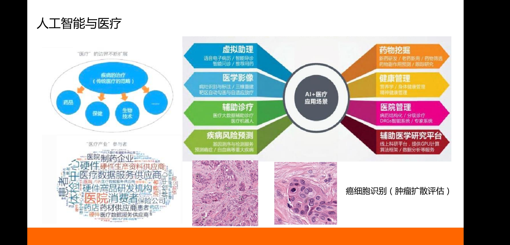
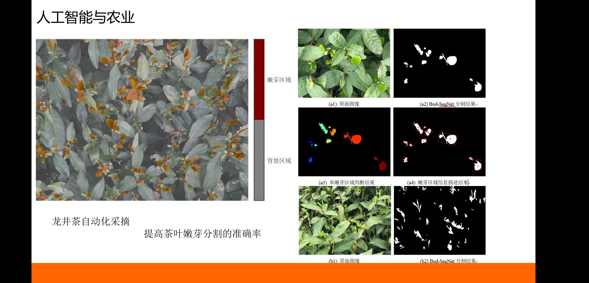

>>>>>>>>   ##  举例说明深度学习的应用

### 深度学习：（人工神经网络研究的概念）
#### 介绍：
 Deep learning是机器学习的分支，是一种以人工神经网络为架构，对数据进行表征学习的算法。
至今已有数种深度学习框架，如深度神经网络、卷积神经网络和深度置信网络和递归神经网络已被应用在计算机视觉、语音识别、自然语言处理、音频识别与生物信息学等领域并获取了极好的效果。另外，“深度学习”已成为类似术语，或者说是神经网络的品牌重塑。
#### 主要技术：
  (线性代数、概率和信息论)、(欠拟合、过拟合、正则化)、(最大似然估计和贝叶斯统计)、(随机梯度下降)、(监督学习和无监督学习)、(深度前馈网络、代价函数和反向传播)、(正则化、稀疏编码和dropout)、(自适应学习算法)、(卷积神经网络)、(循环神经网络)、(递归神经网络)、(深度神经网络和深度堆叠网络)、(LSTM长短时记忆)、(主成分分析)、(正则自动编码器)、(表征学习)、(蒙特卡洛)、(受限波兹曼机)、(深度置信网络)、(转折点)、(增强学习（Q-learning）)、(梯度策略算法)、(动态规划)、(有限马尔科夫)、(语音识别和机器翻译)、(自然语言处理)、(机器视觉和图像识别)、(生成对抗网络和有向生成网络)、(KNN和SVM)、(softmax回归、决策树和聚类算法)

#### LSTM-长短期记忆网络(Long Short-Term Memory Neural NetWork)
  + RNN时间上传递的神经网络，可能“梯度消失”
  + 通过门的开关实现时间上的记忆功能
  + 遗忘门
  + 输入门
  + 输出门
  + Seq2Seq机器翻译
  + Attention Model对话
  + 深度学习算法地图
   

### 人工智能应用：
  - Computer vision：
    - 计算机视觉是指用摄像机和电脑及其他相关设备，对生物视觉进行模拟，它的主要任务是通过对采集的图片或视频进行处理以获得相应场景的三维信息，并进一步做图形处理，使电脑处理成为更适合人眼观察或传送给仪器检测的图像。  
    - 控制过程，比如，一个工业机器人 ；
    - 导航，例如，通过自主汽车或移动机器人；
    - 检测的事件，如，对视频监控和人数统计 ；
    - 组织信息，例如，对于图像和图像序列的索引数据库；
    - 造型对象或环境，如，医学图像分析系统或地形模型；
    - 相互作用，例如，当输入到一个装置，用于计算机人的交互；
    - 自动检测，例如，在制造业的应用程序。
  
  - Autonomous Vehicle：
    - 无人驾驶汽车是智能汽车的一种，也称为轮式移动机器人，主要依靠车内的以计算机系统为主的智能驾驶仪来实现无人驾驶的目的。（总介）
    - 无人驾驶汽车是通过车载传感系统感知道路环境，自动规划行车路线并控制车辆到达预定目标的智能汽车。（技术原理）
    - 集自动控制、体系结构、人工智能、视觉计算等众多技术于一体，是计算机科学、模式识别和智能控制技术高度发展的产物，也是衡量一个国家科研实力和工业水平的一个重要标志，在国防和国民经济领域具有广阔的应用前景。（技术原理）
  
  - Recommendation System：
    - 推荐系统属于资讯过滤的一种应用。推荐系统能够将可能受喜好的资讯或实物（例如：电影、电视节目、音乐、书籍、新闻、图片、网页）推荐给使用者。推荐系统首先收集用户的历史行为数据,然后通过预处理的方法得到用户-评价矩阵,再利用机器学习领域中相关推荐技术形成对用户的个性化推荐。有的推荐系统还搜集用户对推荐结果的反馈,并根据实际的反馈信息实时调整推荐策略,产生更符合用户需求的推荐结果。
    - 推荐系统的作用：
      - 将网站的浏览者转为购买者或者潜在购买者（购物车）；
      - 提高购物网站的交叉销售能力和成交转化率；
      - 提高客户对网站的忠诚度和帮助用户迅速找到产品。 
  
  - Natural Language Processing:
    - 自然人机交互：
      - 人机交互方式更加自然，对话式交互取代关键词搜索成为主流交互方式
      - 一切皆可问答：图片问答、新闻问答、百科问答
    - 深层关系发现/推理
      - 隐式关系发现、深层关系推理将成为智能的主要体现之一  
  
  - Assistant or Killer：VISABOT,PONCHO,Deloitte,SBERBANK......
  
  - Finance:个性化保险政策，信用卡反欺诈，Google股价预测，Anne Hathaway/及其交易
  - (Art):When Program becomes Programmer.
  - Robort:斯坦福无人直升机、黑白照片上色、工业机器人、目标检测、卖保险机器人、大厨机器人、人工智能与医疗，人工智能与农业。
  
    声纹识别文本无关确认
  
  人工智能与医疗
  
  人工智能与农业