>>>>>># 第十五章 网络优化
### 网络优化：
+ 随着网络的加深，训练变得越来越困难，时间越来越长，可能原因是：参数多；数据量大；梯度消失；损失函数坡度平缓

### 权重矩阵初始化
+ 零初始化：
    + 把所有层的W值的初始值都设置为0（$$ W = 0 $$）
    + 但是对于多层网络来说，绝对不能用零初始化，否则权重值不能学习到合理的结果
+ 随机初始化：
    +  把W初始化均值为0，方差为1的矩阵：
        +  $$ W \sim G \begin{bmatrix} 0, 1 \end{bmatrix} $$
+ Xavier初始化方法：
    +  条件：
       + 正向传播时，激活值的方差保持不变；反向传播时，关于状态值的梯度的方差保持不变。
       + $$ W \sim U \begin{bmatrix} -\sqrt{{6 \over n_{input} + n_{output}}}, \sqrt{{6 \over n_{input} + n_{output}}} \end{bmatrix} $$
+ MSRA初始化方法：又叫做He方法
    +  条件：正向传播时，状态值的方差保持不变；反向传播时，关于激活值的梯度的方差保持不变。
+ 代码运行：
    + 
    + 
    + 
    + 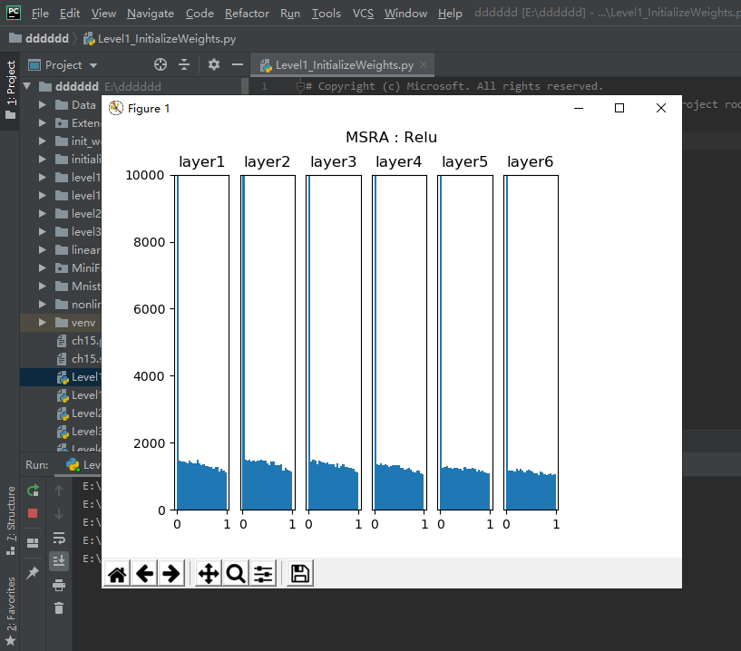
    + 

### 梯度下降优化算法
+ 随机梯度下降 SGD：
    + 输入和参数：$\eta$ - 全局学习率
    + 算法
        + 计算梯度：$g_t = \nabla_\theta J(\theta_{t-1})$
        + 更新参数：$\theta_t = \theta_{t-1} - \eta \cdot g_t$
+ 动量算法Momentum：
    + Momentum算法借用了物理中的动量概念，它模拟的是物体运动时的惯性，即更新的时候在一定程度上保留之前更新的方向，同时利用当前batch的梯度微调最终的更新方向。这样一来，可以在一定程度上增加稳定性，从而学习地更快，并且还有一定摆脱局部最优的能力。Momentum算法会观察历史梯度，若当前梯度的方向与历史梯度一致（表明当前样本不太可能为异常点），则会增强这个方向的梯度。若当前梯度与历史梯方向不一致，则梯度会衰减。
    + 输入参数：
        + $\eta$ - 全局学习率
        + $\alpha$ - 动量参数，一般取值为0.5, 0.9, 0.99
        + $v_t$ - 当前时刻的动量，初值为0
    + 算法：
        + 计算梯度：$g_t = \nabla_\theta J(\theta_{t-1})$
        + 计算速度更新：$v_t = \alpha \cdot v_{t-1} + \eta \cdot g_t$ (公式1)
        + 更新参数：$\theta_t = \theta_{t-1} - v_t$ (公式2)

### 梯度加速算法NAG
+ 输入参数：
    + $\eta$ - 全局学习率
    + $\alpha$ - 动量参数，缺省取值0.9
    + v - 动量，初始值为0
+ 算法：
    + 临时更新：$\hat \theta = \theta_{t-1} - \alpha \cdot v_{t-1}$
    + 前向计算：$f(\hat \theta)$
    + 计算梯度：$g_t = \nabla_{\hat\theta} J(\hat \theta)$  
    + 计算速度更新：$v_t = \alpha \cdot v_{t-1} + \eta \cdot g_t$
    + 更新参数：$\theta_t = \theta_{t-1} - v_t$
+ 核心思想：
    + 注意到 momentum 方法，如果只看 $\alpha \cdot v_{t-1}$ 项，那么当前的θ经过momentum的作用会变成 $\theta - \alpha \cdot v_{t-1}$。既然我们已经知道了下一步的走向，我们不妨先走一步，到达新的位置”展望”未来，然后在新位置上求梯度, 而不是原始的位置。所以，同Momentum相比，梯度不是根据当前位置θ计算出来的，而是在移动之后的位置$\theta - \alpha \cdot v_{t-1}$计算梯度。理由是，既然已经确定会移动$\theta - \alpha \cdot v_{t-1}$，那不如之前去看移动后的梯度。
+ 代码运行：
    + 
    + 
    + 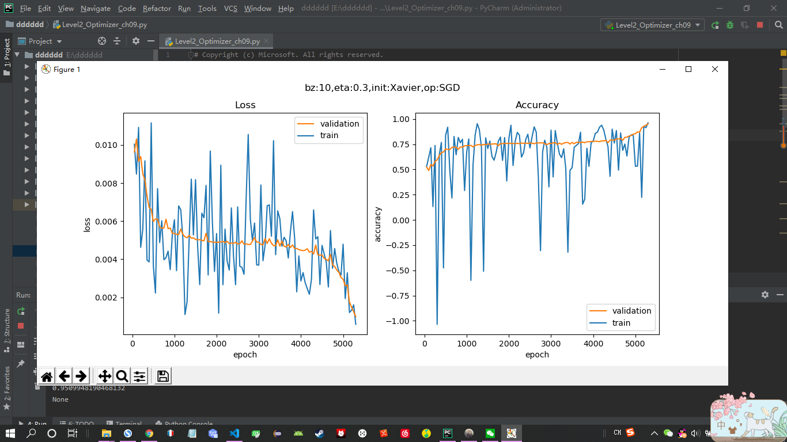
    + 
    + 
    + 
    + 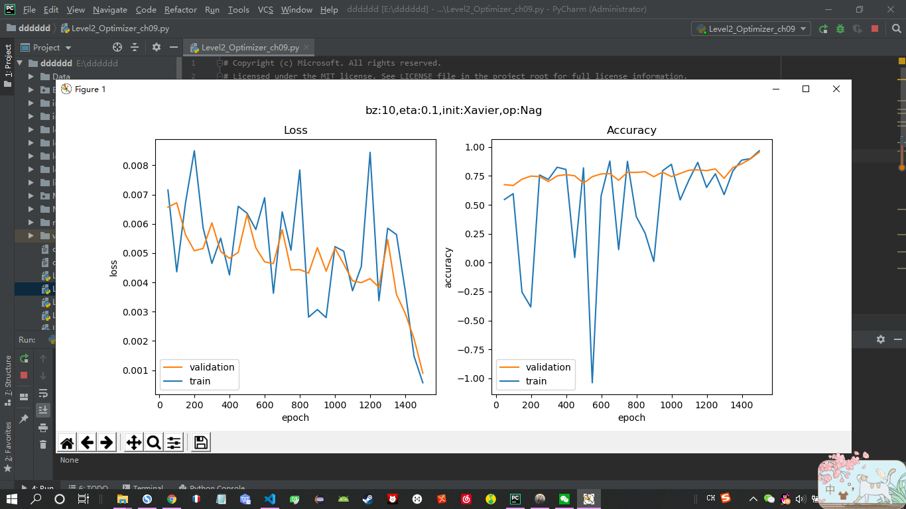
    + 

### 自适应学习率算法
+ AdaGrad：AdaGrad是一个基于梯度的优化算法，它的主要功能是：它对不同的参数调整学习率，具体而言，对低频出现的参数进行大的更新，对高频出现的参数进行小的更新。
    + 输入和参数：
        + $\eta$ - 全局学习率
        + $\epsilon$ - 用于数值稳定的小常数，建议缺省值为1e-6
        + r = 0 初始值
    + 算法：
        + 计算梯度：$g_t = \nabla_\theta J(\theta_{t-1})$
        + 累计平方梯度：$r_t = r_{t-1} + g_t \odot g_t$
        + 计算梯度更新：$\Delta \theta = {\eta \over \epsilon + \sqrt{r_t}} \odot g_t$
        + 更新参数：$\theta_t=\theta_{t-1} - \Delta \theta$
+ AdaDelta：AdaDelta法是AdaGrad 法的一个延伸，它旨在解决它学习率不断单调下降的问题。仅计算在一个大小为w的时间区间内梯度值的累积和。但并不会存储之前梯度的平方值，而是将梯度值累积值按关于过去梯度值的衰减均值，当前时间的梯度均值是基于过去梯度均值和当前梯度值平方的加权平均，其中是类似上述动量项的权值递归地定义。
    + 输入和参数：
        + $\epsilon$ - 用于数值稳定的小常数，建议缺省值为1e-5
        + $\alpha \in [0,1)$ - 衰减速率，建议0.9
        + s - 累积变量，初始值0
        + r - 累积变量变化量，初始为0
+ 均方根反向传播 RMSProp：解决AdaGrad的学习率缩减问题。
    + 输入和参数：
        + $\eta$ - 全局学习率，建议设置为0.001
        + $\epsilon$ - 用于数值稳定的小常数，建议缺省值为1e-8
        + $\alpha$ - 衰减速率，建议缺省取值0.9
        + $r$ - 累积变量矩阵，与$\theta$尺寸相同，初始化为0
    + 算法：
        + 计算梯度：$g_t = \nabla_\theta J(\theta_{t-1})$
        + 累计平方梯度：$r = \alpha \cdot r + (1-\alpha)(g_t \odot g_t)$
        + 计算梯度更新：$\Delta \theta = {\eta \over \sqrt{r + \epsilon}} \odot g_t$
        + 更新参数：$\theta_{t}=\theta_{t-1} - \Delta \theta$
+ Adam - Adaptive Moment Estimation：计算每个参数的自适应学习率。
    + 输入和参数
        + t - 当前迭代次数
        + $\eta$ - 全局学习率，建议缺省值为0.001
        + $\epsilon$ - 用于数值稳定的小常数，建议缺省值为1e-8
        + $\beta_1, \beta_2$ - 矩估计的指数衰减速率，$\in[0,1]$，建议缺省值分别为0.9和0.999
    + 算法：
        + 计算梯度：$g_t = \nabla_\theta J(\theta_{t-1})$
        + 计数器加一：$t=t+1$
        + 更新有偏一阶矩估计：$m_t = \beta_1 \cdot m_{t-1} + (1-\beta_1) \cdot g_t$
        + 更新有偏二阶矩估计：$v_t = \beta_2 \cdot v_{t-1} + (1-\beta_2)(g_t \odot g_t)$
        + 修正一阶矩的偏差：$\hat m_t = m_t / (1-\beta_1^t)$
        + 修正二阶矩的偏差：$\hat v_t = v_t / (1-\beta_2^t)$
        + 计算梯度更新：$\Delta \theta = \eta \cdot \hat m_t /(\epsilon + \sqrt{\hat v_t})$
        + 更新参数：$\theta_t=\theta_{t-1} - \Delta \theta$
+ 代码运行：
    + 
    + 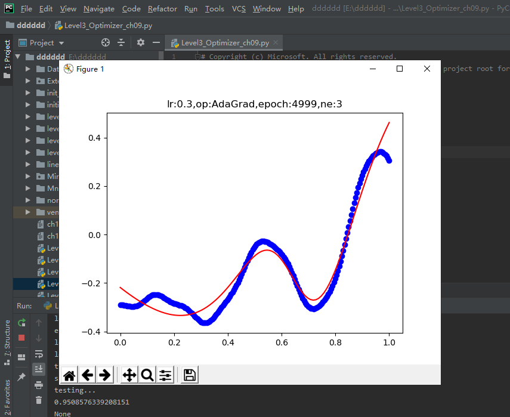
    + 
    + 
    + 
    + 
    + 
    + 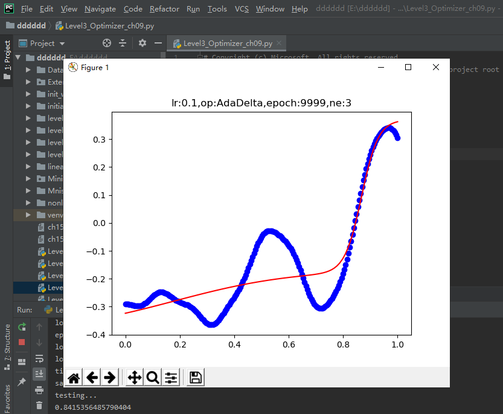
    + 
    + 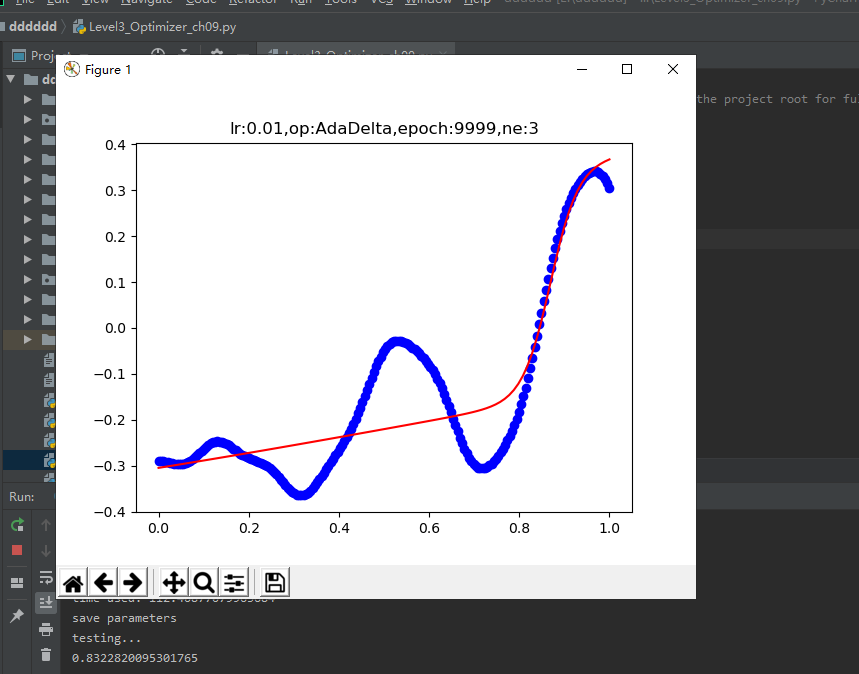
    + 
    + 
    + 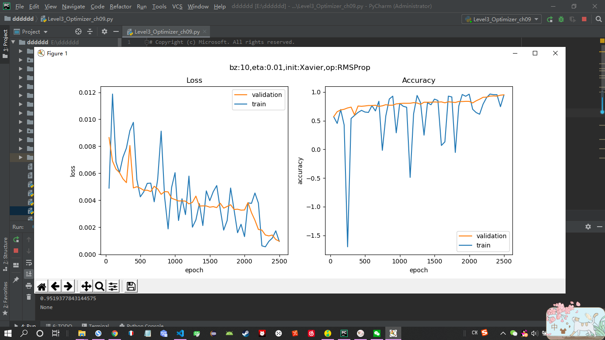
    + 
    + 
    + 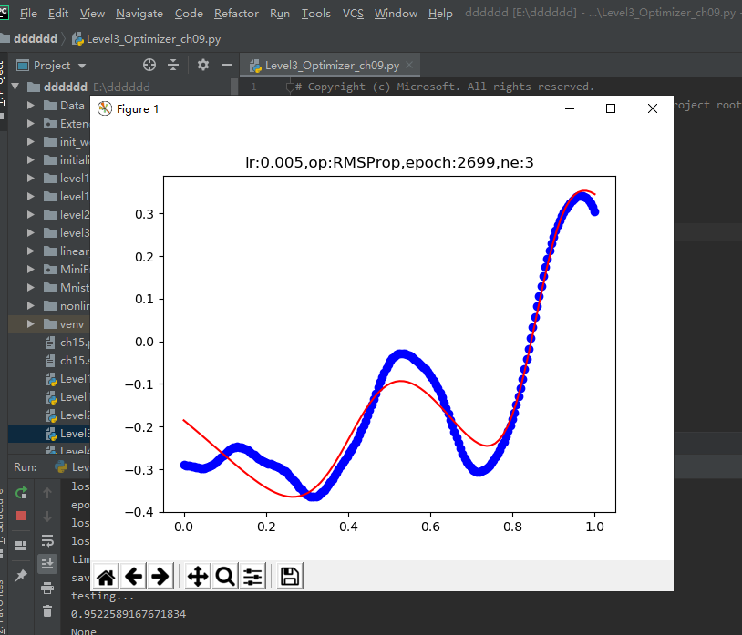
    + 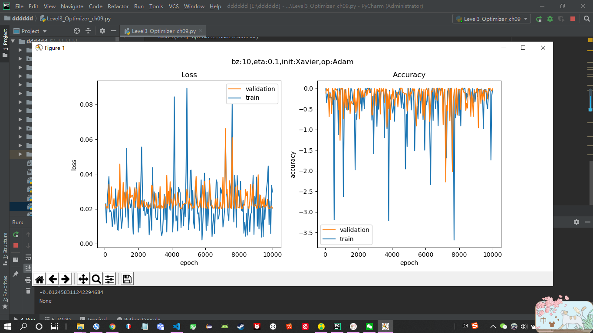
    + 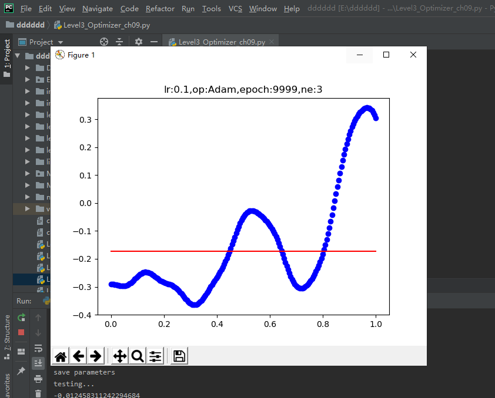
    + 一直在运行

### 算法在等高线图上的效果比较
+ 模拟效果比较：
    + $$z = {x^2 \over 10} + y^2 \tag{1}$$。公式1是模拟均方差函数的形式。
+ 将测试4中方法：
    + 普通SGD, 学习率0.95：每次迭代完全受当前梯度的控制，所以会以折线方式前进。
    + 动量Momentum, 学习率0.1：学习率只有0.1，每次继承上一次的动量方向，所以会以比较平滑的曲线方式前进，不会出现突然的转向。
    + RMPSProp，学习率0.5：有历史梯度值参与做指数加权平均，所以可以看到比较平缓，不会波动太大，都后期步长越来越短也是符合学习规律的。
    + Adam，学习率0.5：因为可以被理解为Momentum和RMSProp的组合，所以比Momentum要平缓一些，比RMSProp要平滑一些。
+ 真实效果比较：
    + 损失函数用的是均方差
        + $$J = {1 \over 2} (Z^2 + Y^2 - 2ZY)$$
+ 代码运行：
    + 
    + 
    + 
    + 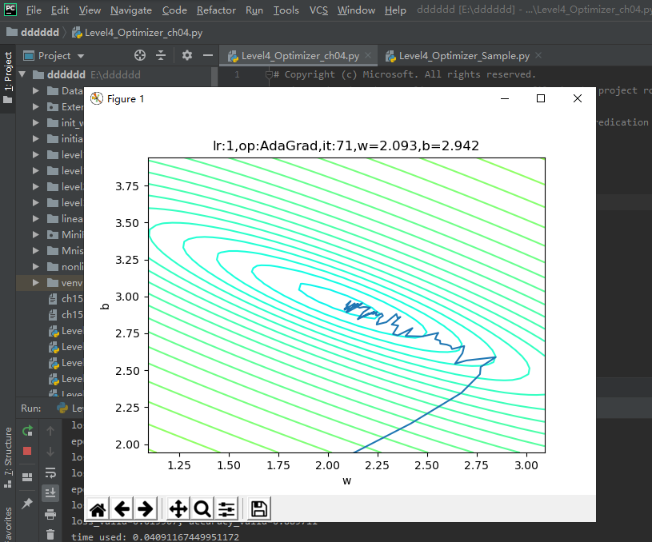
    + 
    + 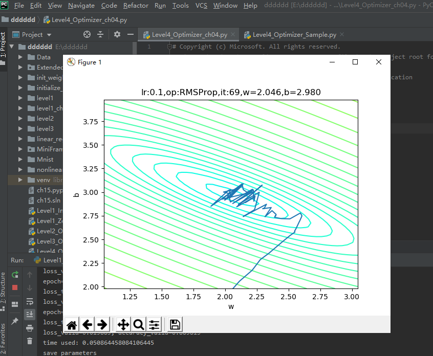
    + 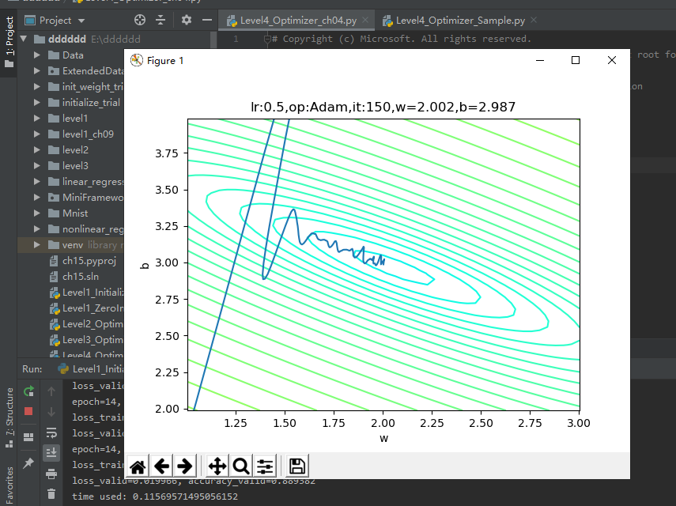
    + 

### 批量归一化的原理
+ 基本数学知识：
    + 正态分布，又叫高斯分布。
+ 深度神经网络的挑战：在深度神经网络中，我们可以将每一层视为对输入的信号做了一次变换：
    + $$ Z = W \cdot X + B \tag{5} $$
    + 可以看到带来的问题是：
        + 在大于2的区域，激活后的值基本接近1了，饱和输出。如果蓝色曲线表示的数据更偏向右侧的话，激活函数就会失去了作用，因为所有的输出值都是0.94、0.95、0.98这样子的数值，区别不大；
        + 导数数值小，只有不到0.1甚至更小，反向传播的力度很小，网络很难收敛。
+ 批量归一化：既然可以把原始训练样本做归一化，那么如果在深度神经网络的每一层，都可以有类似的手段，也就是说把层之间传递的数据移到0点附近，那么训练效果就应该会很理想。
    + 数据在训练过程中，在网络的某一层会发生Internal Covariate Shift，导致数据处于激活函数的饱和区；
    + 经过均值为0、方差为1的变换后，位移到了0点附近。但是只做到这一步的话，会带来两个问题：
        +  在[-1,1]这个区域，Sigmoid激活函数是近似线性的，造成激活函数失去非线性的作用；
        +  在二分类问题中我们学习过，神经网络把正类样本点推向了右侧，把负类样本点推向了左侧，如果再把它们强行向中间集中的话，那么前面学习到的成果就会被破坏；
    + 经过$\gamma、\beta$的线性变换后，把数据区域拉宽，则激活函数的输出既有线性的部分，也有非线性的部分，这就解决了问题a；而且由于$\gamma、\beta$也是通过网络进行学习的，所以以前学到的成果也会保持，这就解决了问题b。
+ 向前计算：
    + $$ \mu_B = {1 \over m}\sum_1^m x_i \tag{6} $$
    + $$ \sigma^2_B = {1 \over m} \sum_1^m (x_i-\mu_B)^2 \tag{7} $$
    + $$ n_i = {x_i-\mu_B \over \sqrt{\sigma^2_B + \epsilon}} \tag{8} $$
    + $$ z_i = \gamma n_i + \beta \tag{9} $$
    + 其中，$\gamma 和 \beta$是训练出来的，$\epsilon$是防止$\mu_B^2$为0时加的一个很小的数值，通常为1e-5。
+ 优点：
    + 可以选择比较大的初始学习率，让你的训练速度提高。
    + 减少对初始化的依赖：一个不太幸运的初始化，可能会造成网络训练实际很长，甚至不收敛。
    + 减少对正则的依赖
+ 代码运行结果：
    + Level5_BatchNormTest.py，验证了代码正确。
    + Level5_NormalDistribution.py是运行结果
        + 
        + 
        + 
        + 
        + 
        + 
        

### 批量归一化的实现:实现一个批量归一化层，来验证BN的实际作用
+ 反向传播：
    + 回传给BN层的误差矩阵是：
        + $$\delta = {dJ \over dZ}，\delta_i = {dJ \over dz_i} \tag{10}$$
    + 求BN层参数梯度：
        + $${dJ \over d\gamma} = \sum_{i=1}^m {dJ \over dz_i}{dz_i \over d\gamma}=\sum_{i=1}^m \delta_i \cdot n_i \tag{11}$$
         + $${dJ \over d\beta} = \sum_{i=1}^m {dJ \over dz_i}{dz_i \over d\beta}=\sum_{i=1}^m \delta_i \tag{12}$$
    + 求BN层的前传误差矩阵：所有乘法都是element-wise的矩阵点乘
+ 运行结果：
    + 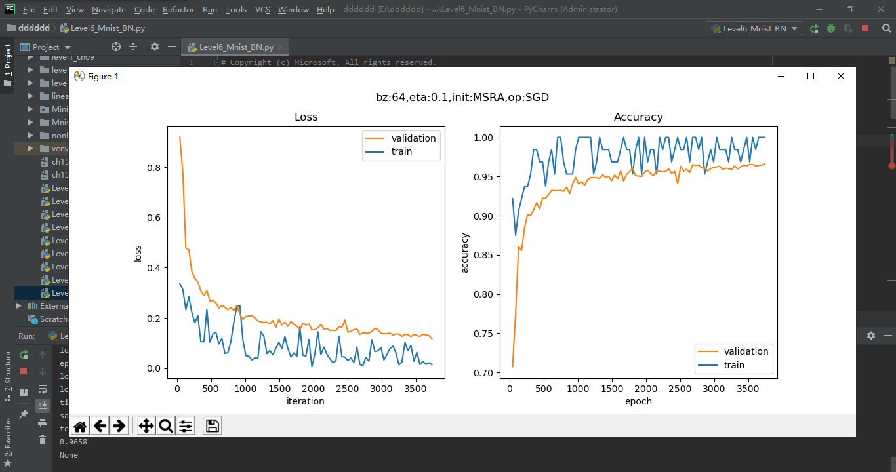
