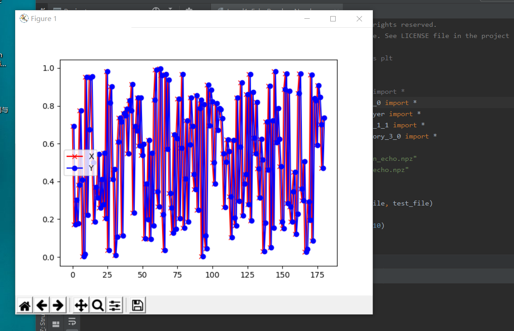
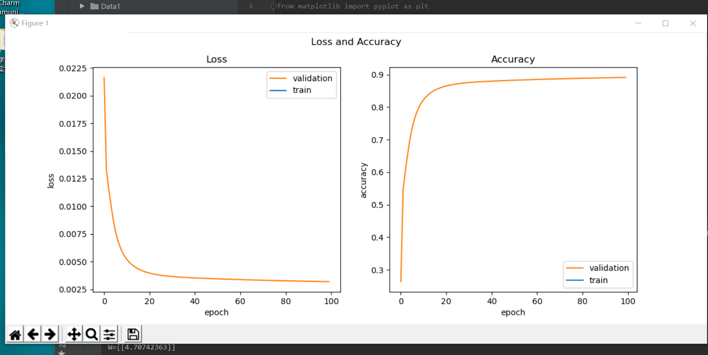
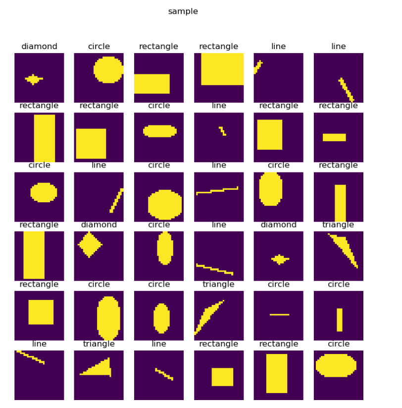
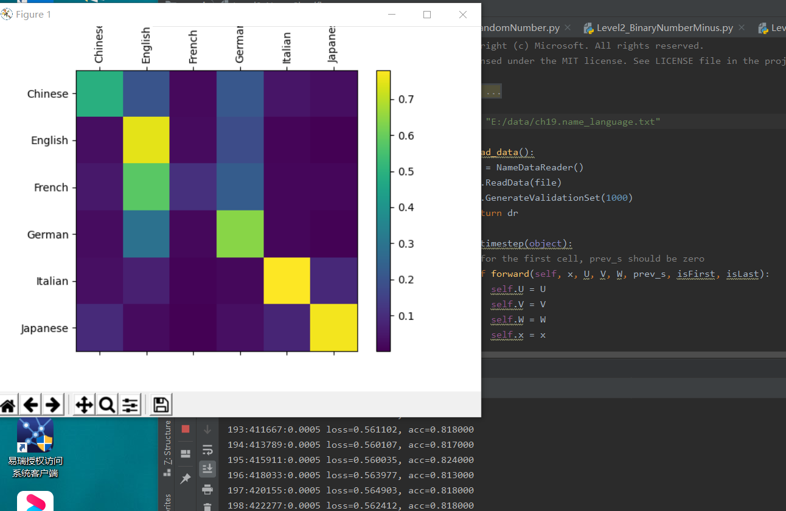

>>>>># 卷积神经网络
### 经典卷积神经网络模型
+ LeNet:CNN的鼻祖
    + 最初CNN的基本的构架：卷积层、池化层、全连接层。
    + 输入为单通道32x32灰度图
    + 使用6组5x5的过滤器，每个过滤器里有一个卷积核，stride=1，得到6张28x28的特征图
    + 使用2x2的池化，stride=2，得到6张14x14的特征图
    + 使用16组5x5的过滤器，每个过滤器里有6个卷积核，对应上一层的6个特征图，得到16张10x10的特征图
    + 池化，得到16张5x5的特征图
    + 接全连接层，120个神经元
    + 接全连接层，84个神经元
    + 接全连接层，10个神经元，softmax输出
+ AlexNet：先卷积然后在全连接
    + AlexNet有60 million个参数和65000个 神经元，五层卷积，三层全连接网络，最终的输出层是1000通道的softmax.
    + 特点：
        + 比LeNet深和宽的网络：使用了5层卷积和3层全连接，一共8层。特征数在最宽初达到384。
        + 数据增强：针对原始图片256x256的数据，做了随机剪裁，得到224x224的图片若干张。
        + 使用ReLU做激活函数：在全连接层使用DropOut
        + 使用LRN：LRN的全称为Local Response Normalizatio，局部响应归一化，是想对线性输出做一个归一化，避免上下越界。发展至今，这个技术已经很少使用了。
+  ZFNet：其网络结构没什么改进，只是调了调参，性能较Alex提升了不少。
+  VGGNe：主要的贡献是展示出网络的深度（depth）是算法优良性能的关键部分
      +  特点：
        +  选择采用3x3的卷积核是因为3x3是最小的能够捕捉像素8邻域信息的的尺寸。
        + 使用1x1的卷积核目的是在不影响输入输出的维度情况下，对输入进行形变，再通过ReLU进行非线性处理，提高决策函数的非线性。
        + 2个3x3卷积堆叠等于1个5x5卷积，3个3x3堆叠等于1个7x7卷积，感受野大小不变，而采用更多层、更小的卷积核可以引入更多非线性（更多的隐藏层，从而带来更多非线性函数），提高决策函数判决力，并且带来更少参数。
        + 每个VGG网络都有3个FC层，5个池化层，1个softmax层。
        +  在FC层中间采用dropout层，防止过拟合。
+ GoogLeNet：
    + 在加深网络的同时（22层），也在网络结构上做了创新，引入Inception结构代替了单纯的卷积+激活的传统操作。
    +  蓝色为卷积运算，红色为池化运算，黄色为softmax分类
+ ResNets:称为残差网络。
    +  基本表示
+ DenseNet：是一种具有密集连接的卷积神经网络
    + 优点：
        + 相比ResNet拥有更少的参数数量
        + 旁路加强了特征的重用
        + 网络更易于训练,并具有一定的正则效果   
        + 缓解了gradient vanishing和model degradation的问题
+ 

### 实现颜色分类：
+ 用DNN解决问题：
    + 数据处理：
        + 由于输入图片是三通道的彩色图片，我们先把它转换成灰度图
    + 搭建模型：
        + 就是一个普通的三层网络，两个隐层，神经元数量分别是128和64，一个输出层，最后接一个6分类Softmax。
+ 用CNN解决问题
+ 1x1卷积：
    + 达到两个目的：
        + 跨通道信息整合
        + 降维以减少学习参数  
+ 颜色分类可视化解释：  
    + 工作原理：
        + 第一行是原始彩色图片，三通道28x28，特意挑出来都是矩形的6种颜色。
        + 第二行是第一卷积组合梯队的第1个卷积核在原始图片上的卷积结果。由于是1x1的卷积核，相当于用3个浮点数分别乘以三通道的颜色值所得到和，只要是最后的值不一样就可以了，因为对于神经网络来说，没有颜色这个概念，只有数值。从人的角度来看，6张图的前景颜色是不同的（因为原始图的前景色是6种不同颜色）。
        + 第三行是第一卷积组合梯队的第2个卷积核在原始图片上的卷积结果。与2相似，只不过3个浮点数的数值不同而已，也是得到6张前景色不同的图。
        + 第四行是第二卷积组合梯队的三个卷积核的卷积结果图，把三个特征图当作RGB通道merge到一起后所生成的彩色图。单独看三个特征图的话，人类是无法理解的，所以我们把三个通道merge到一起，就呈现出了假的彩色图，仍然可以做到6个样本不同色，但是出现了一些边框，可以认为是卷积层从颜色上抽取出的“特征”，也就是说卷积网络“看”到了我们人类不能理解的东西。
        + 第五行是第二卷积组合梯队的激活函数结果，它把红色彻底地变成了“黑色”，红色与粉色的区别是，后者在中间靠下的位置还留了一条“紫色”的线。对于其它几张图，仿佛是去掉了表面的一层半透明的膜，露出了底色。

### 实现几何图形分类：
+ 提出问题：
    + 有一种儿童玩具：在一个平板上面有三种形状的洞：圆形、三角形、正方形，让小朋友们拿着这三种形状的积木从对应的洞中穿过那个平板就算成功。
+ 用DNN解决问题：
    + 搭建一个三层的网络
+ 用CNN解决问题：
+  形状分类可视化解释：
      + 
+ 代码运行
    + 
    + 
    + 

### 实现几何图形及颜色分类
+ 提出问题：
    + 在前两节我们学习了如何按颜色分类和按形状分类几何图形，现在我们自然地想到如果把颜色和图形结合起来，CNN能不能正确分类呢？
    + 一共三种形状及三种颜色：
        + 

### 解决MNIST分类问题
+ 搭建模型：
    + 
+ 可视化：
    + 第一组的卷积可视化：显示了（卷积核数值、卷积核抽象、卷积结果、激活结果、池化结果）
    + 第二组的卷积可视化：输出结果：
        + Conv2：由于是在第一层的特征图上卷积后叠加的结果，所以基本不能理解
        + Relu2：能看出的是如果黑色区域多的话，说明基本没有激活值，此卷积核效果就没用
        + Pool2：池化后分化明显的特征图是比较有用的的特征，比如3、6、12、15、16，信息太多或者太少的特征图，都用途偏小

### Fashion-MNIST分类
+ 提出问题：
    + 用10种物品代替了10个数字，下面是它们的部分样本：
        0. T-Shirt，T恤衫（1-3行）
        1. Trouser，裤子（4-6行）
        2. Pullover，套头衫（7-9行）
        3. Dress，连衣裙（10-12行）
        4. Coat，外套（13-15行）
        5. Sandal，凉鞋（16-18行）
        6. Shirt，衬衫（19-21行）
        7. Sneaker，运动鞋（22-24行）
        8. Bag，包（25-27行）
        9. Ankle Boot，短靴（28-30行）

### Cifar-10分类：
+ 提出问题：使用Cifar-10数据集来进一步检验一下卷积神经网络的能力
    + 样本数据：
        0. airplane，飞机，6000张
        1. automobile，汽车，6000张
        2. bird，鸟，6000张
        3. cat，猫，6000张
        4. deer，鹿，6000张
        5. dog，狗，6000张
        6. frog，蛙，6000张
        7. horse，马，6000张
        8. ship，船，6000张
        9. truck，卡车，6000张
+ 环境搭配:
    + 使用Keras来训练模型：它的抽象思想与我们在前面学习过的各种Layer的概念完全一致
        + 关键的几个包：
    + 代码实现：
        + 在这个模型中：
            + 先用卷积->激活->卷积->激活->池化->丢弃层，做为第一梯队，卷积核32个；
            + 然后再用卷积->激活->卷积->激活->池化->丢弃层做为第二梯队，卷积核64个；
            + Flatten和Dense相当于把池化的结果转成Nx512的全连接层，N是池化输出的尺寸，被Flatten扁平化了；
            + 再接丢弃层，避免过拟合；
            + 最后接10个神经元的全连接层加Softmax输出。
    + 训练结果：
        + 在GPU上训练：
            + 在GPU上训练，每一个epoch大约需要1分钟；而在一个8核的CPU上训练，每个epoch大约需要2分钟（据笔者观察是因为并行计算占满了8个核）
        + 在CPU上训练：
            + 在CPU上训练，只设置了10个epoch，一共半个小时时间，在测试集上达到63.61%的准确率。观察val_loss和val_acc的趋势，随着训练次数的增加，还可以继续优化。

#### 总体运行结果：
+ 
+ 
+ 
+ 
+ 
+ 
+ 
+ 
+ 
+ 
+ 
+ 