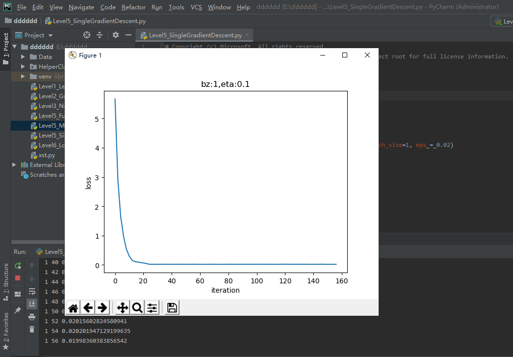
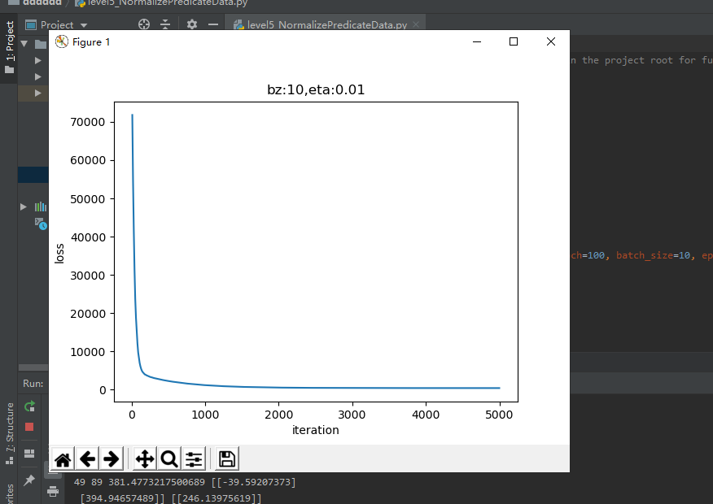

## 0226的每日总结
### 单变量线性回归
#### 最小二乘法
也叫做最小平方法（Least Square），它通过最小化误差的平方和寻找数据的最佳函数匹配。利用最小二乘法可以简便地求得未知的数据，并使得这些求得的数据与实际数据之间误差的平方和为最小。还可用于曲线拟合。
##### 数学原理
线性回归试图学得：$$z(x_i)=w \cdot x_i+b \tag{1}$$  使得：$$z(x_i) \simeq y_i \tag{2}$$ 
+ $x_i$是样本特征值，$y_i$是样本标签值，$z_i$是模型预测值。
##### 运行结果

#### 梯度下降法
##### 数学原理
+ 预设函数（Hypothesis Function）
为一个线性函数：
$$z_i = x_i \cdot w + b \tag{1}$$
+ 损失函数（Loss Function）
为均方差函数：
$$loss(w,b) = \frac{1}{2} (z_i-y_i)^2 \tag{2}$$
##### 梯度计算
+ 计算z的梯度：$$ {\partial loss \over \partial z_i}=z_i - y_i \tag{3} $$
+ 计算w的梯度：$$ {\partial{loss} \over \partial{w}} = \frac{\partial{loss}}{\partial{z_i}}\frac{\partial{z_i}}{\partial{w}}=(z_i-y_i)x_i \tag{4} $$
+ 计算b的梯度：$$ \frac{\partial{loss}}{\partial{b}} = \frac{\partial{loss}}{\partial{z_i}}\frac{\partial{z_i}}{\partial{b}}=z_i-y_i \tag{5} $$
##### 运行结果

#### 神经网络法
##### 定义神经网络结构
+ 如图所示：
+ 输入层
此神经元在输入层只接受一个输入特征，经过参数w,b的计算后，直接输出结果
+ 权重w/b
+ 输出层
$$z_i = x_i \cdot w + b$$
+ 损失函数
$$loss(w,b) = \frac{1}{2} (z_i-y_i)^2$$
##### 反向传播
+ 计算w的梯度：
$$ {\partial{loss} \over \partial{w}} = \frac{\partial{loss}}{\partial{z_i}}\frac{\partial{z_i}}{\partial{w}}=(z_i-y_i)x_i $$
+ 计算b的梯度：
$$ \frac{\partial{loss}}{\partial{b}} = \frac{\partial{loss}}{\partial{z_i}}\frac{\partial{z_i}}{\partial{b}}=z_i-y_i $$
##### 运行结果

#### 梯度下降的三种形式：
##### 运行结果:
+ 全批量梯度下降: 
+ 单批量梯度下降: 
+ 小批量梯度下降:  
### 多变量线性回归
#### 正规方程法
##### 简单的推导法：
+ 在做函数拟合（回归）时，我们假设函数H为：$$h(w,b) = b + x_1 w_1+x_2 w_2+...+x_n w_n \tag{2}$$
+ 令$b=w_0$，则：$$h(w) = w_0 + x_1 \cdot w_1 + x_2 \cdot w_2+...+ x_n \cdot w_n\tag{3}$$
+ x是一个样本的n个特征值，如果我们把m个样本一起计算，将会得到下面这个矩阵：$$H(w) = X \cdot W \tag{4}$$
+ X和W的矩阵形状如下：
    + $$ X^{(m \times (n+1))} = \begin{pmatrix} 1 & x_{1,1} & x_{1,2} & \dots & x_{1,n} \ 1 & x_{2,1} & x_{2,2} & \dots & x_{2,n} \ \dots \ 1 & x_{m,1} & x_{m,2} & \dots & x_{m,n} \end{pmatrix} \tag{5} $$
    + $$ W^{(n+1)}= \begin{pmatrix} w_0 \ w_1 \ \dots \ w_n \end{pmatrix} \tag{6} $$
+ 然后我们期望假设函数的输出与真实值一致，则有：$$H(w) = X \cdot W = Y \tag{7}$$
+ 其中，Y的形状如下：$$ Y^{(m)}= \begin{pmatrix} y_1 \ y_2 \ \dots \ y_m \end{pmatrix} \tag{8} $$
+ 把等式两边同时乘以X的转置矩阵，以便得到X的方阵：$$X^T X W = X^T Y \tag{9}$$
+ 其中，$X^T$是X的转置矩阵，$X^T X$一定是个方阵，并且假设其存在逆矩阵，把它移到等式右侧来：$$W = (X^T X)^{-1}{X^T Y} \tag{10}$$
##### 复杂推导方法：
+ 均方差损失函数：$$J(w,b) = \sum (z_i - y_i)^2 \tag{11}$$
+ 把b看作是一个恒等于1的feature，并把z=XW计算公式带入，并变成矩阵形式：$$J(w) = \sum (x_i w_i -y_i)^2=(XW - Y)^T \cdot (XW - Y) \tag{12}$$
+ 对w求导，令导数为0，就是W的最小值解：$${\partial J(w) \over \partial w} = {\partial \over \partial w}[(XW - Y)^T \cdot (XW - Y)]$$ $$ ={\partial \over \partial w}[(X^TW^T - Y^T) \cdot (XW - Y)]$$ $$ ={\partial \over \partial w}[(X^TXW^TW -X^TW^TY - Y^TXW + Y^TY)] \tag{13}$$
##### 运行结果：

#### 神经网络法
##### 反向传播
+ $$z_i = x_{i1} \cdot w_1 + x_{i2} \cdot w_2 + b$$ $$ =\begin{pmatrix} x_{i1} & x_{i2} \end{pmatrix} \begin{pmatrix} w_1 \ w_2 \end{pmatrix}+b \tag{2} $$
##### 运行结果

#### 样本特征数据归一化
##### 基本概念：
+ 归一化：
    + Min-Max归一化:$$x_{new}={x-x_{min} \over x_{max} - x_{min}} \tag{1}$$
    + Min-Max归一化:$$x_{new}={x-x_{min} \over x_{max} - x_{min}} \tag{1}$$
    + 非线性归一化:对数转换： $$y=log(x) \tag{3}$$;反余切转换： $$y=atan(x) \cdot 2/π \tag{4}$$
+ 标准化：把每个特征值中的所有数据，变成平均值为0，标准差为1的数据，最后为正态分布。Z-score规范化（标准差标准化 / 零均值标准化，其中std是标准差）：$$x_{new} = (x - \bar{x})／std \tag{5}$$
+ 中心化：平均值为0，无标准差要求： $$x_{new} = x - \bar{x} \tag{6}$$
运行结果：
+ 
+ 
#### 归一化的后遗症
运行结果：
+ 
#### 正确的推理预测方法
运行结果：
+ 
#### 对标签值归一化
运行结果：
+ 
### 心得体会
今天学了线性回归，线性回归有单变量和多变量两种，单变量线性回归主要使用梯度下降法，多变量线性回归主要是正规方程法，之后还学习了归一化，了解了归一化对样本特征数据的作用。通过今天的学习，对线性回归有了更深刻的了解。
