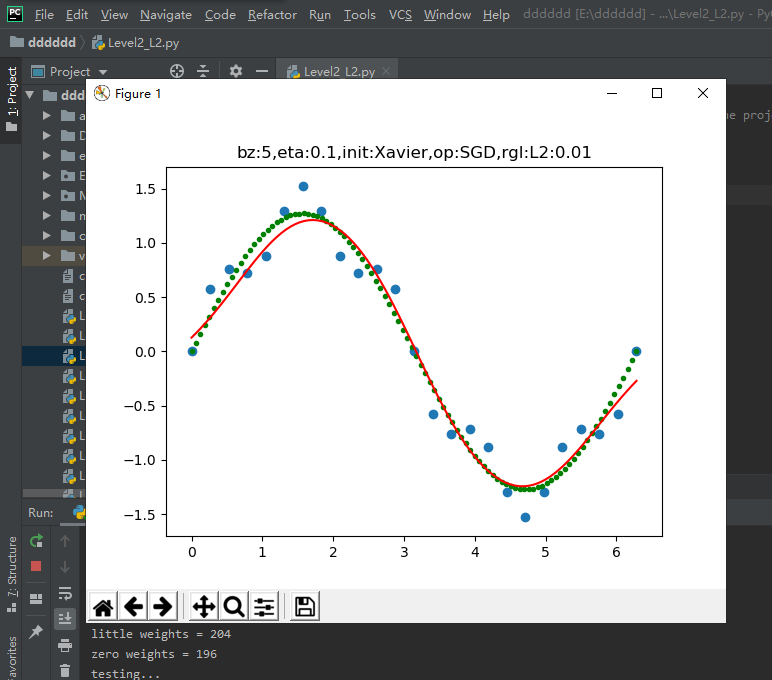
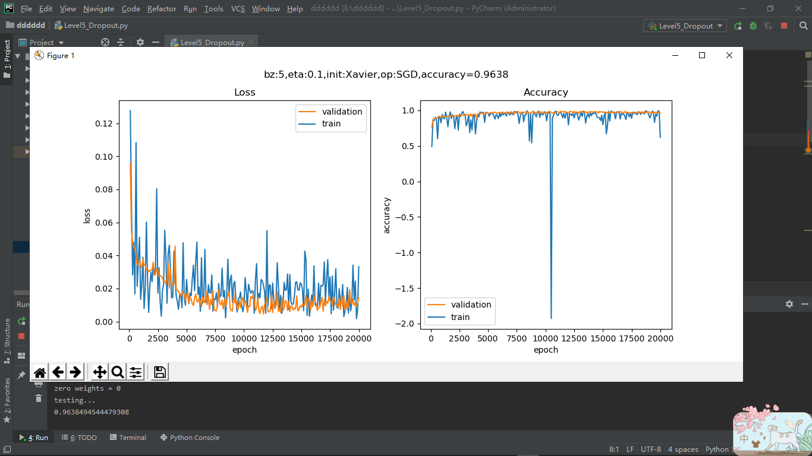

## 0304的每日总结
### 正规化
+ 拟合程度比较：
    + 在深度神经网络中，我们遇到的另外一个挑战，就是网络的泛化问题。
    + 神经网络的两大功能：回归和分类。这两类任务，都会出现欠拟合和过拟合现象。
        + 回归任务：欠拟合、正确的拟合、过拟合。
        + 分类任务：分类欠妥、正确的分类、分类过度。（由于分类可以看作是对分类边界的拟合，所以我们经常也统称其为拟合。）
    + 出现过拟合的原因：
    + 训练集的数量和模型的复杂度不匹配，样本数量级小于模型的参数
    + 训练集和测试集的特征分布不一致
    + 样本噪音大，使得神经网络学习到了噪音，正常样本的行为被抑制
    + 迭代次数过多，过分拟合了训练数据，包括噪音部分和一些非重要特征
+ 正规化用于防止过拟合
#### 偏差与方差
+ 
+ 应对措施
    + 情况一：效果很好，可以考虑进一步降低误差值，提高准确度。
    + 情况二：训练集和验证集同时出现较大的误差，有可能是：迭代次数不够、数据不好、网络设计不好，需要继续训练，观察误差变化情况。
    + 情况三：训练集的误差已经很低了，但验证集误差很高，说明过拟合了，即训练集中的某些特殊样本影响了网络参数，但类似的样本在验证集中并没有出现
    + 情况四：两者误差都很大，目前还看不出来是什么问题，需要继续训练
+ 偏差-分差分解：
    + 偏差：度量了学习算法的期望与真实结果的偏离程度，即学习算法的拟合能力。
    + 方差：训练集与验证集的差异造成的模型表现的差异。
    + 噪声：当前数据集上任何算法所能到达的泛化误差的下线，即学习问题本身的难度
#### L2正规
+ 朴素的想法：从过拟合的现象分析，是因为神经网络的权重矩阵参数过度地学习，即针对训练集，其损失函数值已经逼近了最小值。
+ 基本数学知识：
    + 范数：
        + $$L_p = \lVert x \rVert_p = ({\sum^n_{i=1}\lvert x_i \rvert^p})^{1/p} \tag{1}$$
    + 高斯分布：
        + $$ f(x)={1 \over \sigma\sqrt{2 \pi}} exp{- {(x-\mu)^2} \over 2\sigma^2} \tag{2} $$
+ L2正则化
    + 假设：
        + W参数服从高斯分布，即：$w_j \sim N(0,\tau^2)$
        + Y服从高斯分布，即：$y_i \sim N(w^Tx_i,\sigma^2)$
    + 贝叶斯最大后验估计：
        + $$ argmax_wL(w) = ln \prod_i^n {1 \over \sigma\sqrt{2 \pi}}exp(-(\frac{y_i-w^Tx_i}{\sigma})^2/2) \cdot \prod_j^m{\frac{1}{\tau\sqrt{2\pi}}exp(-(\frac{w_j}{\tau})^2/2)} $$
        + $$ =-\frac{1}{2\sigma^2}\sum_i^n(y_i-w^Tx_i)^2-\frac{1}{2\tau^2}\sum_j^m{w_j^2}-n\ln\sigma\sqrt{2\pi}-m\ln \tau\sqrt{2\pi} \tag{3} $$
        + 因为$\sigma、b、n、\pi、m$等都是常数，所以损失函数J(w)的最小值可以简化为：
            + $$ argmin_wJ(w) = \sum_i^n(y_i-w^Tx_i)^2+\lambda\sum_j^m{w_j^2} \tag{4} $$
+ 损失函数的变化:
    + 假设是均方差损失函数：
        + $$J(w,b)=\frac{1}{2m}\sum_{i=1}^m (z_i-y_i)^2 + {\lambda \over 2m}\sum_{j=1}^n{w_j^2} \tag{5}$$
    + 假设是交叉熵损失函数：
        + $$J(w,b)= -\frac{1}{m} \sum_{i=1}^m [y_i \ln a_i + (1-y_i) \ln (1-a_i)]+ \frac{\lambda}{2m}\sum_{j=1}^n{w_j^2} \tag{6}$$
+ 反向传播的变化：
    + 由于正则项是在损失函数中，在正向计算中，并不涉及到它，所以正向计算公式不用变。但是在反向传播过程中，需要重新推导一下公式。
    + 结果：
        + $$dZ1 = W2^T \times dZ2 \odot A1 \odot (1-A1) \tag{11}$$
        + $$dW1= dZ1 \cdot X^T + \lambda \odot W1 \tag{12}$$
        + $$dB1= dZ1 \tag{13}$$
+ 运行结果：
#### L1正则
+ 朴素的想法： 假设只有两个参数需要学习，那么这两个参数的损失函数就构成了的等高线图。
    + 公式：$$z=x_1 \cdot w_1 + x_2 \cdot w_2 + b$$
+ 基本数学知识：
    + 拉普拉斯分布：
        + $$f(x)=\frac{1}{2b}exp(-\frac{|x-\mu|}{b})$$ $$= \frac{1}{2b} \begin{cases} exp(\frac{x-\mu}{b}), & x \lt \mu \ exp(\frac{\mu-x}{b}), & x \gt \mu \end{cases}$$
    + L0范数与L1范数：
        + L0范数是指向量中非0的元素的个数。如果我们用L0范数来规则化一个参数矩阵W的话，就是希望W的大部分元素都是0，即让参数W是稀疏的。
        + L1范数是指向量中各个元素绝对值之和，也叫“稀疏规则算子”（Lasso regularization）。
+ L1正则化
    + 假设：
        + W参数服从拉普拉斯分布，即$w_j \sim Laplace(0,b)$
        + Y服从高斯分布，即$y_i \sim N(w^Tx_i,\sigma^2)$
        + 贝叶斯最大后验估计： 
            + $$ argmax_wL(w) = ln \prod_i^n {1 \over \sigma\sqrt{2 \pi}}exp(-\frac{1}{2}(\frac{y_i-w^Tx_i}{\sigma})^2) \cdot \prod_j^m{\frac{1}{2b}exp(-\frac{\lvert w_j \rvert}{b})} $$ $$ =-\frac{1}{2\sigma^2}\sum_i^n(y_i-w^Tx_i)^2-\frac{1}{2b}\sum_j^m{\lvert w_j \rvert}-n\ln\sigma\sqrt{2\pi}-m\ln b\sqrt{2\pi} \tag{1} $$
        + 因为$\sigma、b、n、\pi、m$等都是常数，所以损失函数J(w)的最小值可以简化为：
            + $$ argmin_wJ(w) = \sum_i^n(y_i-w^Tx_i)^2+\lambda\sum_j^m{\lvert w_j \rvert} \tag{2} $$
        + 我们仍以两个参数为例，公式2的后半部分的正则形式为：
            + $$L_1 = \lvert w_1 \rvert + \lvert w_2 \rvert \tag{3}$$
        + 因为$w_1、w_2$有可能是正数或者负数，我们令$x=|w_1|、y=|w_2|、c=L_1$，则公式3可以拆成以下4个公式的组合：
            + $$ y=-x+c \quad (当w_1 \gt 0, w_2 \gt 0时) $$ $$ y=\quad x+c \quad (当w_1 \lt 0, w_2 \gt 0时) $$ $$ y=\quad x-c \quad (当w_1 \gt 0, w_2 \lt 0时) $$ $$ y=-x-c \quad (当w_1 \lt 0, w_2 \lt 0时) $$
        + 所以上述4个公式（4条直线）会组成一个二维平面上的一个菱形。
        + 菱形面积越小，惩罚越厉害。
+ 损失函数的变化：
    + 新的损失函数：
        + $$J = J_0 + \frac{\lambda}{m} \sum_i^m \lvert w_i \rvert$$
+ 反向传播的变化：
    + 假设一个两层的神经网络，其前向过程是：
        + $$Z1=W1 \cdot X + B1$$ $$A1 = Sigmoid(Z1)$$ $$Z2=W2 \cdot A1 + B2$$ $$J(w,b) = J_0 + \lambda (\lvert W1 \rvert+\lvert W2 \rvert)$$
    + 则反向过程为：
        + $$dW2=\frac{dJ}{dW2}=\frac{dJ}{dZ2}\frac{dZ2}{dW2}+\frac{dJ}{dW2}$$ $$=dZ2 \cdot A1^T+\lambda \odot sign(W2)$$ $$dW1= dZ1 \cdot X^T + \lambda \odot sign(W1) $$
+ 运行结果：
#### 早停法
+ 理论基础：
    + 早停法，实际上也是一种正则化的策略，可以理解为在网络训练不断逼近最优解的过程种（实际上这个最优解是过拟合的），在梯度等高线的外围就停止了训练，所以其原理上和L2正则是一样的，区别在于得到解的过程。
+ 算法：一般的做法是，在训练的过程中，记录到目前为止最好的validation 准确率，当连续N次Epoch（比如N=10或者更多次）没达到最佳准确率时，则可以认为准确率不再提高了。
+ 后续的步骤：
    + 彻底停止：就是什么也不干。
    + 再次训练：由于第一次早停是通过验证集计算loss值来实现的，所以这次不再分训练集和验证集，记住了早停时的迭代次数，可以重新初始化权重矩阵参数，使用所有数据再次训练，然后到达第一次的$i_{best}$时停止。但样本多，更新批次也变多，可以比较两种策略：
+ 运行结果：
#### 丢弃法
+ 基本原理：
    + Dropout可以作为训练深度神经网络的一种正则方法供选择。在每个训练批次中，通过忽略一部分的神经元（让其隐层节点值为0），可以明显地减少过拟合现象。这种方式可以减少隐层节点间的相互作用。
+ 算法与实现：
    + 向前计算：
        + 正常的隐层公式：
            + $$ Z = W \cdot X + B \tag{1} $$
        + 加入随机丢弃步骤后：
            + $ r \sim Bernoulli(p) \tag{2} $$ $$Y = r \cdot X \tag{3}$$ $$Z = Y \cdot W + B \tag{4} $$
    + 反向传播：在反向传播时，和Relu函数的反向差不多，需要记住正向计算时得到的mask值。
        + 训练和测试/阶段的不同：
            + 在训练阶段，我们使用正向计算的逻辑。在测试时，不能随机丢弃一些神经元，否则会造成测试结果不稳定，比如某个样本的第一次测试，得到了结果A；第二次测试，得到结果B。由于丢弃的神经元的不同，A和B肯定不相同，就会造成无法解释的情况。!
    + 更好的理解Dropout：
        + 直观理解（Hintion的直观解释和理由）：
            + 由于每次用输入网络的样本进行权值更新时，隐含节点都是以一定概率随机出现，因此不能保证每2个隐含节点每次都同时出现，这样权值的更新不再依赖于有固定关系隐含节点的共同作用，阻止了某些特征仅仅在其它特定特征下才有效果的情况。
            + 可以将Dropout看作是模型平均的一种。对于每次输入到网络中的样本（可能是一个样本，也可能是一个batch的样本），其对应的网络结构都是不同的，但所有的这些不同的网络结构又同时share隐含节点的权值。这样不同的样本就对应不同的模型，是Bagging方法的一种极端情况。
            + 还有一个比较有意思的解释是，Dropout类似于性别在生物进化中的角色，物种为了使适应不断变化的环境，性别的出现有效地阻止了过拟合，即避免环境改变时物种可能面临的灭亡。由于性别是一半一半的比例，所以Dropout中的p一般设置为0.5。
        + Dropout率的选择：
            + 经过交叉验证，隐含节点Dropout率等于0.5的时候效果最好，原因是0.5的时候Dropout随机生成的网络结构最多。
            + Dropout也可以被用作一种添加噪声的方法，直接对input进行操作。输入层设为很小的丢弃率，使得输入变化不会太大。
+ 运行结果：
#### 数据增强
##### 图像数据增强
旋转，缩放，平移和添加噪音
+ 其它的图像处理方法
    + 翻转图像，剪裁图像，颜色变化，对比度变化，亮度变化，颜色增强
##### 多样本合成法
+ SMOTE：通过人工合成新样本来处理样本不平衡问题，提升分类器性能。类不平衡现象是数据集中各类别数量不近似相等。
    + 主要思路：
        + 定义好特征空间，将每个样本对应到特征空间中的某一点，根据样本不平衡比例确定采样倍率N；
        + 对每一个小样本类样本$(x,y)$，按欧氏距离找K个最近邻样本，从中随机选取一个样本点，假设选择的近邻点为$(x_n,y_n)$。在特征空间中样本点与最近邻样本点的连线段上随机选取一点作为新样本点，满足以下公式:
                + $$(x_{new},y_{new})=(x,y)+rand(0,1)*((x_n-x),(y_n-y))$$
        + 重复选取取样，直到大、小样本数量平衡。
+ 运行结果：
#### 集成学习
+ 集成方法选择：
    + 平均法：
        + 在回归任务中，输出为一个数值，可以使用平均法来处理多个神经网络的输出值。
            + 简单平均法：所有值加起来除以N。 
                + $$H(x)=\frac{1}{N} \sum_{i=1}^N h_i(x)$$
            + 加权平均法：给每个输出值一个人为定义的权重。 
                + $$H(x)=\sum_{i=1}^N w_i \cdot h_i(x)$$    
    + 投票法：
        + 对于分类任务，将会从类别标签集合${c_1, c_2, ...,c_n}$中预测出一个值，多个神经网络可能会预测出不一样的值，此时可以采样投票法。
            + 绝对多数投票法：当有半数以上的神经网路预测出同一个类别标签时，我们可以认为此预测有效。
            + 加权投票法：与加权平均法类似。
            + 相对多数投票法：即得票最多的标签获胜。如果有多个标签获得相同的票数，随机选一个。
    + 学习法：用另外一个神经网络，通过训练的方式，把9个神经网路的输出结果作为输入，把图片的真实数字作为标签，得到一个强学习器。
+ 运行结果：
### 心得体会
这次学习的是正规化，正规化有L1正规和L2正规，分别对这两种方法有了大致的了解，然后又学习了早停法和丢弃法，对这有两种最开始有些不清楚，但经过实验后，了解的差不多了，希望下次学习遇到这两种方法，不再出现问题。