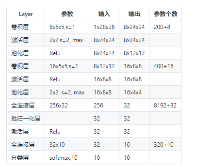

## 0306的每日总结
### 经典卷积神经网络模型
+ LeNet:CNN的鼻祖
    + 最初CNN的基本构架：卷积层、池化层、全连接层。
    + 输入为单通道32x32灰度图
    + 使用6组5x5的过滤器，每个过滤器里有一个卷积核，stride=1，得到6张28x28的特征图
    + 使用2x2的池化，stride=2，得到6张14x14的特征图
    + 使用16组5x5的过滤器，每个过滤器里有6个卷积核，对应上一层的6个特征图，得到16张10x10的特征图
    + 池化，得到16张5x5的特征图
    + 接全连接层，120个神经元
    + 接全连接层，84个神经元
    + 接全连接层，10个神经元，softmax输出
+ AlexNet：先卷积然后在全连接
    + AlexNet有60 million个参数和65000个 神经元，五层卷积，三层全连接网络，最终的输出层是1000通道的softmax.
    + 特点：
        + 比LeNet深和宽的网络：使用了5层卷积和3层全连接，一共8层。特征数在最宽初达到384。
        + 数据增强：针对原始图片256x256的数据，做了随机剪裁，得到224x224的图片若干张。
        + 使用ReLU做激活函数：在全连接层使用DropOut
        + 使用LRN：局部响应归一化，是想对线性输出做一个归一化，避免上下越界。
+  ZFNet
+  VGGNe：展示出网络的深度（depth）是算法优良性能的关键部分
      +  特点：
        +  选择采用3x3的卷积核是因为3x3是最小的能够捕捉像素8邻域信息的的尺寸。
        + 使用1x1的卷积核目的是在不影响输入输出的维度情况下，对输入进行形变，再通过ReLU进行非线性处理，提高决策函数的非线性。
        + 2个3x3卷积堆叠等于1个5x5卷积，3个3x3堆叠等于1个7x7卷积，感受野大小不变，而采用更多层、更小的卷积核可以引入更多非线性（更多的隐藏层，从而带来更多非线性函数），提高决策函数判决力，并且带来更少参数。
        + 每个VGG网络都有3个FC层，5个池化层，1个softmax层。
        +  在FC层中间采用dropout层，防止过拟合。
+ GoogLeNet：
    + 在加深网络的同时（22层），也在网络结构上做了创新，引入Inception结构代替了单纯的卷积+激活的传统操作。
    + 如图所示： 蓝色为卷积运算，红色为池化运算，黄色为softmax分类
+ ResNets:称为残差网络。
+ DenseNet：是一种具有密集连接的卷积神经网络
    + 优点：
        + 相比ResNet拥有更少的参数数量
        + 旁路加强了特征的重用
        + 网络更易于训练,并具有一定的正则效果   
        + 缓解了gradient vanishing和model degradation的问题
#### 实现颜色分类：
+ 用DNN解决问题：
    + 数据处理：
        + 由于输入图片是三通道的彩色图片，我们先把它转换成灰度图
    + 搭建模型：
        + 就是一个普通的三层网络，两个隐层，神经元数量分别是128和64，一个输出层，最后接一个6分类Softmax。
+ 用CNN解决问题
+ 1x1卷积：
    + 达到两个目的：
        + 跨通道信息整合
        + 降维以减少学习参数
#### 实现几何图形分类：
+ 用DNN解决问题：
    + 搭建一个三层的网络
#### 实现几何图形及颜色分类
#### 解决MNIST分类问题

+ 可视化：
    + 第一组的卷积可视化：显示了（卷积核数值、卷积核抽象、卷积结果、激活结果、池化结果）
    + 第二组的卷积可视化：输出结果：
        + Conv2：由于是在第一层的特征图上卷积后叠加的结果，所以基本不能理解
        + Relu2：能看出的是如果黑色区域多的话，说明基本没有激活值，此卷积核效果就没用
        + Pool2：池化后分化明显的特征图是比较有用的的特征，比如3、6、12、15、16，信息太多或者太少的特征图，都用途偏小
#### Fashion-MNIST分类
1. T-Shirt，T恤衫（1-3行）
2. Trouser，裤子（4-6行）
3. Pullover，套头衫（7-9行）
4. Dress，连衣裙（10-12行）
5. Coat，外套（13-15行）
6. Sandal，凉鞋（16-18行）
7. Shirt，衬衫（19-21行）
8. Sneaker，运动鞋（22-24行）
9. Bag，包（25-27行）
10. Ankle Boot，短靴（28-30行）
### Cifar-10分类
1. airplane，飞机，6000张
2. automobile，汽车，6000张
3. bird，鸟，6000张
4. cat，猫，6000张
5. deer，鹿，6000张
6. dog，狗，6000张
7. frog，蛙，6000张
8. horse，马，6000张
9. ship，船，6000张
10. truck，卡车，6000张

