# 基于深度学习框架TensorFlow实现的中文语音识别系统+基于RNN的机器翻译 
## 摘要
自动语音识别目前已经广泛应用于各种领域，它可以作为一种广义的自然语言处理技术，也是用于人与人、人与机器进行更顺畅的交流的技术。语音识别是一个多学科交叉的领域，它与声学、语音学、语言学、数字信号处理理论、信息论、计算机科学等众多学科紧密相连。
机器翻译的目标是利用计算机实现自然语言之间的自动翻译。机器翻译经历了规则机器翻译、统计机器翻译、神经机器翻译。神经机器翻译通过神经网络直接实现自然语言的相互映射。近年来取得迅速发展，已经取代统计机器翻译成为新的主流技术，而现在深度学习显著提升了机器翻译的质量，已经接近普通人的水平。
## 关键词：语音识别，机器翻译，深度学习，神经网络
## 引言
在此次的论文中，我将介绍自己如何完成基于深度学习框架TensorFlow实现的中文语音识别系统与机器翻译。目前网上关于tensorflow 的中文语音识别实现较少，而且结构功能较为简单。百度开源的基于PaddlePaddle的Deepspeech2实现功能强大，简单易用，于是就为设计基于深度学习框架TensorFlow实现的中文语音识别系统提供了基础。机器翻译：即用计算机实现从源语言到目标语言转换的过程，是自然语言处理的重要研究领域之一。现在很多地方，我们都需要用到机器翻译系统，在本文中，我将介绍机器翻译设计的基本原理与设计过程与最终结果测试。
## 一、基本原理
## 1.基于深度学习框架TensorFlow实现的中文语音识别系统原理
## 1.1语音识别概念
语音识别技术就是让智能设备听懂人类的语音。它是一门涉及数字信号处理、人工智能、语言学、数理统计学、声学、情感学及心理学等多学科交叉的科学。这项技术可以提供比如自动客服、自动语音翻译、命令控制、语音验证码等多项应用。近年来，随着人工智能的兴起，语音识别技术在理论和应用方面都取得大突破，开始从实验室走向市场，已逐渐走进我们的日常生活。现在语音识别己用于许多领域，主要包括语音识别听写器、语音寻呼和答疑平台、自主广告平台，智能客服等。
## 1.2语音识别原理
语音识别的本质是一种基于语音特征参数的模式识别，即通过学习，系统能够把输入的语音按一定模式进行分类，进而依据判定准则找出最佳匹配结果。目前，模式匹配原理已经被应用于大多数语音识别系统中。如图是基于模式匹配原理的语音识别系统框图。

一般的模式识别包括预处理，特征提取，模式匹配等基本模块。如图所示首先对输入语音进行预处理，其中预处理包括分帧，加窗，预加重等。其次是特征提取，因此选择合适的特征参数尤为重要。常用的特征参数包括：基音周期，共振峰，短时平均能量或幅度，线性预测系数（LPC），感知加权预测系数（PLP），短时平均过零率，线性预测倒谱系数（LPCC），自相关函数，梅尔倒谱系数（MFCC），小波变换系数，经验模态分解系数（EMD），伽马通滤波器系数（GFCC）等。在进行实际识别时，要对测试语音按训练过程产生模板，最后根据失真判决准则进行识别。常用的失真判决准则有欧式距离，协方差矩阵与贝叶斯距离等。

一个连续语音识别系统（如下图）大致包含了四个主要部分：特征提取、声学模型、语言模型和解码器等。
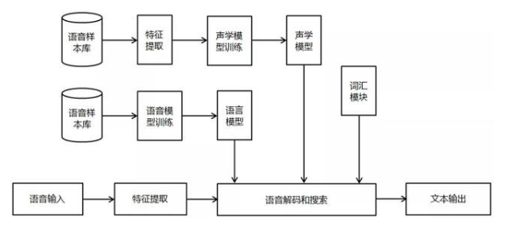
（1）语音输入的预处理模块，对输入的原始语音信号进行处理，滤除掉其中的不重要信息以及背景噪声，并进行语音信号的端点检测。
（2）特征提取，在去除语音信号中对于语音识别无用的冗余信息后，保留能够反映语音本质特征的信息进行处理，并用一定的形式表示出来。
（3）声学模型训练，声学模型可以理解为是对声音的建模，能够把语音输入转换成声学表示的输出，准确的说，是给出语音属于某个声学符号的概率。
（4）语言模型训练，语言模型是用来计算一个句子出现概率的模型，简单地说，就是计算一个句子在语法上是否正确的概率。因为句子的构造往往是规律的，前面出现的词经常预示了后方可能出现的词语。
5）语音解码和搜索算法，解码器是指语音技术中的识别过程。针对输入的语音信号，根据己经训练好的HMM声学模型、语言模型及字典建立一个识别网络，根据搜索算法在该网络中寻找最佳的一条路径，这个路径就是能够以最大概率输出该语音信号的词串，这样就确定这个语音样本所包含的文字了。

## 1.3语音识别技术简介
从语音识别算法的发展来看，语音识别技术主要分为三大类，第一类是模型匹配法，包括矢量量化(VQ) 、动态时间规整(DTW)等；第二类是概率统计方法，包括高斯混合模型(GMM) 、隐马尔科夫模型(HMM)等；第三类是辨别器分类方法，如支持向量机(SVM) 、人工神经网络(ANN)和深度神经网络（DNN）等以及多种组合方法。下面对主流的识别技术做简单介绍：
### （1）动态时间规整（DTW）
语音识别中，由于语音信号的随机性，即使同一个人发的同一个音，只要说话环境和情绪不同，时间长度也不尽相同，因此时间规整是必不可少的。DTW是一种将时间规整与距离测度有机结合的非线性规整技术，在语音识别时，需要把测试模板与参考模板进行实际比对和非线性伸缩，并依照某种距离测度选取距离最小的模板作为识别结果输出。动态时间规整技术的引入，将测试语音映射到标准语音时间轴上，使长短不等的两个信号最后通过时间轴弯折达到一样的时间长度，进而使得匹配差别最小，结合距离测度，得到测试语音与标准语音之间的距离。
### （2）支持向量机（SVM）
支持向量机是建立在VC维理论和结构风险最小理论基础上的分类方法，它是根据有限样本信息在模型复杂度与学习能力之间寻求最佳折中。从理论上说，SVM就是一个简单的寻优过程，它解决了神经网络算法中局部极值的问题，得到的是全局最优解。SVM已经成功地应用到语音识别中，并表现出良好的识别性能。
### （3）矢量量化（VQ）
矢量量化是一种广泛应用于语音和图像压缩编码等领域的重要信号压缩技术，思想来自香农的率-失真理论。其基本原理是把每帧特征矢量参数在多维空间中进行整体量化，在信息量损失较小的情况下对数据进行压缩。因此，它不仅可以减小数据存储，而且还能提高系统运行速度，保证语音编码质量和压缩效率，一般应用于小词汇量的孤立词语音识别系统。
### （4）卷积神经网络（CNN）
CNN早在2012年就被用于语音识别系统，并且一直以来都有很多研究人员积极投身于基于CNN的语音识别系统的研究，但始终没有大的突破。最主要的原因是他们没有突破传统前馈神经网络采用固定长度的帧拼接作为输入的思维定式，从而无法看到足够长的语音上下文信息。另外一个缺陷是他们只是将CNN视作一种特征提取器，因此所用的卷积层数很少，一般只有一到二层，这样的卷积网络表达能力十分有限。针对这些问题，提出了一种名为深度全序列卷积神经网络（Deep Fully Convolutional Neural Network，DFCNN）的语音识别框架，使用大量的卷积层直接对整句语音信号进行建模，更好地表达了语音的长时相关性。

DFCNN的结构如图所示，它直接将一句语音转化成一张图像作为输入，即先对每帧语音进行傅里叶变换，再将时间和频率作为图像的两个维度，然后通过非常多的卷积层和池化（pooling）层的组合，对整句语音进行建模，输出单元直接与最终的识别结果比如音节或者汉字相对应。

### （5）高斯混合模型（GMM）
高斯混合模型是单一高斯概率密度函数的延伸，GMM能够平滑地近似任意形状的密度分布。高斯混合模型种类有单高斯模型（Single Gaussian Model, SGM）和高斯混合模型（Gaussian Mixture Model, GMM）两类。类似于聚类，根据高斯概率密度函数（Probability Density Function, PDF）参数不同，每一个高斯模型可以看作一种类别，输入一个样本x，即可通过PDF计算其值，然后通过一个阈值来判断该样本是否属于高斯模型。很明显，SGM适合于仅有两类别问题的划分，而GMM由于具有多个模型，划分更为精细，适用于多类别的划分，可以应用于复杂对象建模。目前在语音识别领域，GMM需要和HMM一起构建完整的语音识别系统。
### （6）深度神经网络/深信度网络-隐马尔科夫（DNN/DBN-HMM）
ANN，BP等多数分类的学习方法都是浅层结构算法，与深层算法相比存在局限。尤其当样本数据有限时，它们表征复杂函数的能力明显不足。深度学习可通过学习深层非线性网络结构，实现复杂函数逼近，表征输入数据分布式，并展现从少数样本集中学习本质特征的强大能力。在深度结构非凸目标代价函数中普遍存在的局部最小问题是训练效果不理想的主要根源。为了解决以上问题，提出基于深度神经网络(DNN) 的非监督贪心逐层训练算法，它利用空间相对关系减少参数数目以提高神经网络的训练性能。相比传统的基于GMM-HMM的语音识别系统，其最大的改变是采用深度神经网络替换GMM模型对语音的观察概率进行建模。最初主流的深度神经网络是最简单的前馈型深度神经网络（Feedforward Deep Neural Network，FDNN）。

### （7）循环神经网络（RNN）
语音识别需要对波形进行加窗、分帧、提取特征等预处理。训练GMM时候，输入特征一般只能是单帧的信号，而对于DNN可以采用拼接帧作为输入，这些是DNN相比GMM可以获得很大性能提升的关键因素。然而，语音是一种各帧之间具有很强相关性的复杂时变信号，这种相关性主要体现在说话时的协同发音现象上，往往前后好几个字对我们正要说的字都有影响，也就是语音的各帧之间具有长时相关性。采用拼接帧的方式可以学到一定程度的上下文信息。但是由于DNN输入的窗长是固定的，学习到的是固定输入到输入的映射关系，从而导致DNN对于时序信息的长时相关性的建模是较弱的。
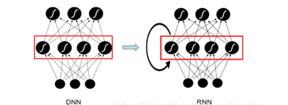

## 2.基于RNN的机器翻译 
## 2.1机器翻译发展历程
从1949年翻译备忘录提出到现在，大约过了七十多年。这期间，机器翻译经历了多个不同的发展阶段，也涌现出了很多方法。总结起来主要有三类，一开始是基于规则的方法，然后发展为基于统计的方法。一直到最近几年出现的基于神经网络的方法。

### （1）基于规则的翻译
基于规则的翻译，翻译知识来自人类专家。找人类语言学家来写规则，这一个词翻译成另外一个词。这个成分翻译成另外一个成分，在句子中的出现在什么位置，都用规则表示出来。这种方法的优点是直接用语言学专家知识，准确率非常高。缺点是它的成本很高，比如说要开发中文和英文的翻译系统，需要找同时会中文和英文的语言学家。要开发另外一种语言的翻译系统，就要再找懂另外一种语言的语言学家。
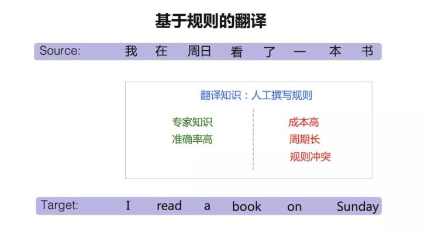
### （2）统计机器翻译
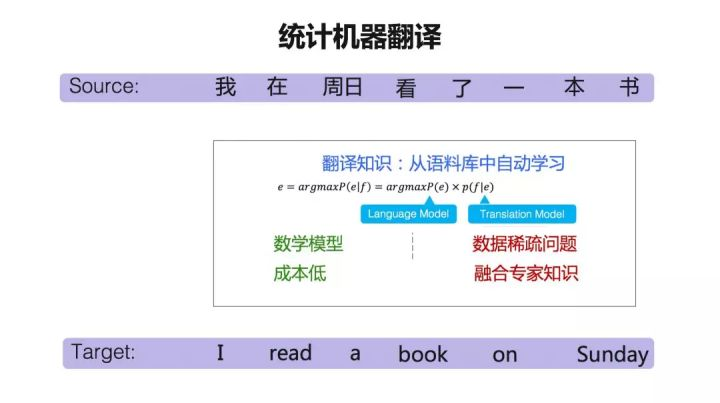
大约到了上世纪九十年代出现了基于统计的方法，我们称之为统计机器翻译。统计机器翻译系统对机器翻译进行了一个数学建模。可以在大数据的基础上进行训练。它的成本是非常低的，因为这个方法是语言无关的。一旦这个模型建立起来以后，对所有的语言都可以适用。统计机器翻译是一种基于语料库的方法，所以如果是在数据量比较少的情况下，就会面临一个数据稀疏的问题。同时，也面临另外一个问题，其翻译知识来自大数据的自动训练。
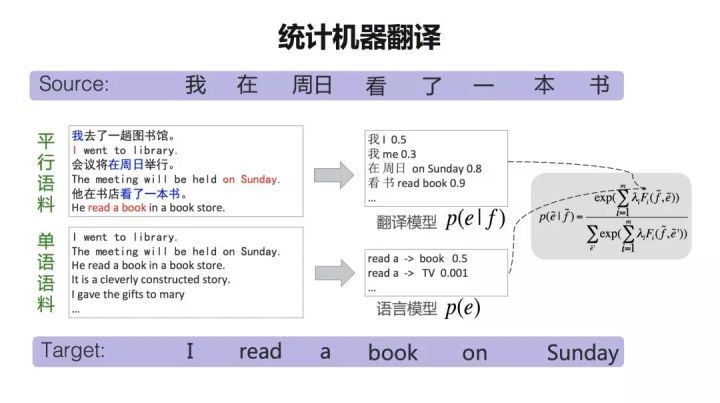
翻译知识主要来自两类训练数据：平行语料，一句中文一句英文，并且这句中文和英文，是互为对应关系的，也叫双语语料；单语语料，比如说只有英文我们叫单语语料。翻译模型能学到类似于词典这样的一个表，一般称为『短语表』。比如说『在周日』可以翻译成『on Sunday』。后面还有一个概率，衡量两个词或者短语对应的可能性。这样，『短语表』就建立起两种语言之间的一种桥梁关系。
### （3）神经网络机器翻译
相比统计机器翻译而言，神经网络翻译从模型上来说相对简单，它主要包含两个部分，一个是编码器，一个是解码器。编码器是把源语言经过一系列的神经网络的变换之后，表示成一个高维的向量。解码器负责把这个高维向量再重新解码（翻译）成目标语言。
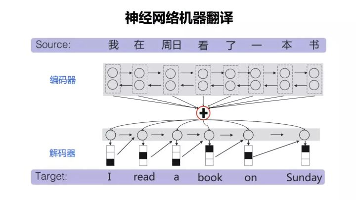
## 2.1机器翻译原理
机器翻译（MT）即是自动翻译，是使用计算机软件将文本从一种自然语言翻译成另一种语言的过程。双向的编码就是把词用词向量来表示。那么如何做到这一点呢？我们首先有一个词向量表，是通过神经网络训练出来的。源语言句子中的词，可以用一个one hot的向量表示。所谓one hot就是，比如上例中中文句子有8个词。哪个词出现了，就把这个词标为1，其他的词标为0。比如第4个词"看"这个词是1，那么其他的都是0。这两个矩阵这么一乘，相当于一个查表的操作。就把其中这个词向量表的一列取出来了，那么这一列的向量就代表了这个词。神经网络里面所有的词都会用向量来表示。得到词的向量表示后，再经过一个循环神经网络的变换，得到另外一个向量，称为Hidden State（隐状态）。
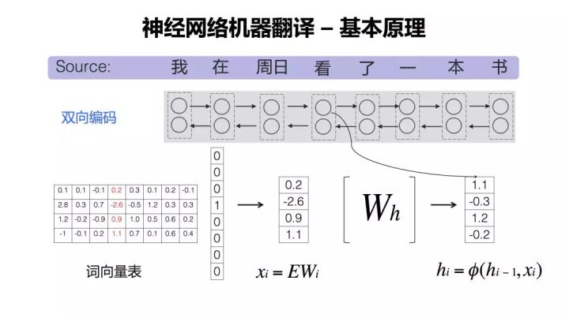
编码完成以后，需要把这个源语言的句子压缩到一个向量里去。一个最简单的方式是把这所有的向量加起来。但是后来大家发现这样其实不太合理。为什么不太合理，因为每一个词都是被作为相同的权重去对待的，那显然是不合理的，这时候就提出了一个注意力机制，叫Attention。这里用不同深度颜色的线去表示Attention的能量强弱，用以衡量产生目标词时，它所对应的源语言词的贡献大小。所以h前面又加一个α，α就表示它的一个权重。
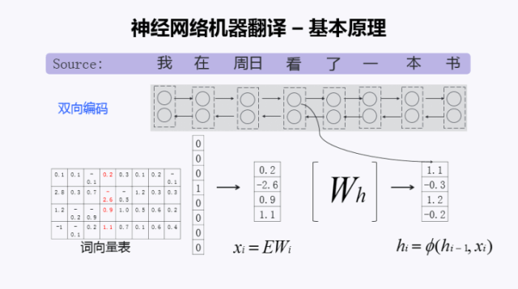
## 2.1RNN神经机器翻译原理
首先我们通过分词得到输入源语言词序列，接下来每个词都用一个词向量进行表示，得到相应的词向量序列，然后用前向的RNN神经网络得到它的正向编码表示。再用一个反向的RNN，得到它的反向编码表示，最后将正向和反向的编码表示进行拼接，然后用注意力机制来预测哪个时刻需要翻译哪个词，通过不断地预测和翻译，就可以得到目标语言的译文。原理如下图：

## 二、基本过程
## 基于深度学习框架TensorFlow实现的中文语音识别系统
该系统实现了基于深度框架的语音识别中的声学模型和语言模型建模，其中声学模型包括CNN-CTC、GRU-CTC、CNN-RNN-CTC，语言模型包含transformer、CBHG，数据集包含stc、primewords、Aishell、thchs30四个数据集。
## 1. 声学模型
声学模型采用CTC进行建模，采用CNN-CTC、DFCNN、DFSMN等模型model_speech，采用keras作为编写框架。
### （1）GRU-CTC
利用循环神经网络可以利用语音上下文相关的信息，得到更加准确地信息，而GUR又能选择性的保留需要的长时信息，使用双向rnn又能够充分的利用上下文信号。
- 网络结构如下：
  ``` C++
      def _model_init(self):
        self.inputs = Input(name='the_inputs', shape=(None, 200, 1))
        x = Reshape((-1, 200))(self.inputs)
        x = dense(512, x)
        x = dense(512, x)
        x = bi_gru(512, x)
        x = bi_gru(512, x)
        x = bi_gru(512, x)
        x = dense(512, x)
        self.outputs = dense(self.vocab_size, x, activation='softmax')
        self.model = Model(inputs=self.inputs, outputs=self.outputs)
        self.model.summary()
    ```
### （2）DFCNN
利用CNN参数共享机制，可以将参数数量下降几个数量级别，且深层次的卷积和池化层能够充分考虑语音信号的上下文信息，且可以在较短的时间内就可以得到识别结果，具有较好的实时性。
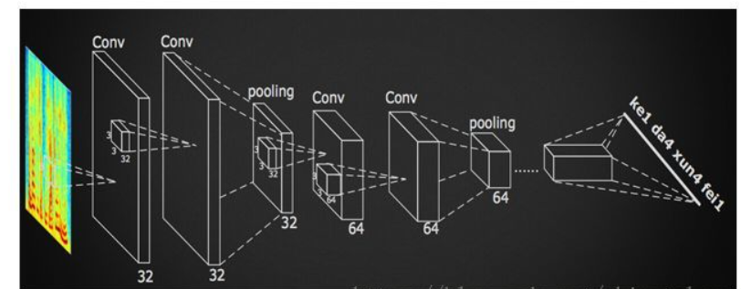
``` C++
def cnn_cell(size, x, pool=True):
    x = norm(conv2d(size)(x))
    x = norm(conv2d(size)(x))
    if pool:
        x = maxpool(x)
    return x

class Am():
    def _model_init(self):
        self.inputs = Input(name='the_inputs', shape=(None, 200, 1))
        self.h1 = cnn_cell(32, self.inputs)
        self.h2 = cnn_cell(64, self.h1)
        self.h3 = cnn_cell(128, self.h2)
        self.h4 = cnn_cell(128, self.h3, pool=False)
        self.h5 = cnn_cell(128, self.h4, pool=False)
        # 200 / 8 * 128 = 3200
        self.h6 = Reshape((-1, 3200))(self.h5)
        self.h7 = dense(256)(self.h6)
        self.outputs = dense(self.vocab_size, activation='softmax')(self.h7)
        self.model = Model(inputs=self.inputs, outputs=self.outputs)
        self.model.summary()
```
### （3）DFSMN
而前馈记忆神经网络也也解决了双向GRU的参数过多和实时性较差的缺点，它利用一个记忆模块，包含了上下几帧信息，能够得到不输于双向GRU-CTC的识别结果，阿里最新的开源系统就是基于DFSMN的声学模型，只不过在kaldi的框架上实现的。我们将考虑使用DFSMN+CTC的结构在python上实现。该网络实质上是用一个特殊的CNN就可以取得相同的效果，我们将CNN的宽设置为memory size，将高度设置为feature dim，将channel设置为hidden units，这样一个cnn的层就可以模仿fsmn的实现了。
结构如下：

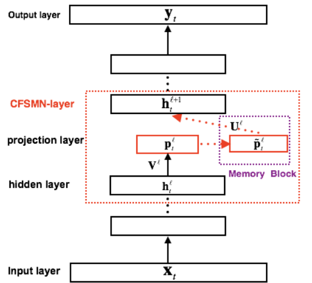

## 2. 语言模型
### （1）n-gram
n元语法是一个非常经典的语言模型。
### （2）CBHG
拼音输入的本质上就是一个序列到序列的模型：输入拼音序列，输出汉字序列。模型初始输入是一个随机采样的拼音字母的character embedding，经过一个CBHG的模型，输出是五千个汉字对应的label。
## 3. 数据集
数据集采用了目前我能找到的所有中文免费数据，包括：thchs-30、aishell、primewords、st-cmd四个数据集，训练集总计大约450个小时，在之前实验过程中，使用thchs-30+aishell+st-cmd数据集对DFCNN声学模型进行训练，以64batch_size训练。


## 4. 配置
data_type: train, test, dev

data_path: 对应解压数据的路径

thchs30, aishell, prime, stcmd: 是否使用该数据集

data_length: 我自己做实验时写小一些看效果用的，正常使用设为None即可

shuffle：正常训练设为True，是否打乱训练顺序

``` C++
def data_hparams():
    params = tf.contrib.training.HParams(
        # vocab
        data_type = 'train',
        data_path = 'data/',
        thchs30 = True,
        aishell = True,
        prime = False,
        stcmd = False,
        batch_size = 1,
        data_length = None,
        shuffle = False)
      return params
```
## 基于RNN的机器翻译 
## 1. 数据准备
### 1.1 下载数据
``` C++
//读取原始数据
with open('cmn.txt', 'r', encoding='utf-8') as f:

    data = f.read()

    data = data.split('\n')

    data = data[:100]

    print(data[-5:])
```
['Tom died.\t汤姆去世了。', 'Tom quit.\t汤姆不干了。', 'Tom swam.\t汤姆游泳了。', 'Trust me.\t相信我。', 'Try hard.\t努力。']

可以发现，每对翻译数据在同一行，左边是英文，右边是中文使用 \t 作为英语与中文的分界。
### 1.2  数据预处理
使用网络训练，需要我们把数据处理成网络可以接收的格式。针对这个数据，具体来说就是需要把字符转换为数字（句子数字化），句子长度归一化处理。

①英文处理

因为英语每个单词都是用空格分开的（除了缩写词，这里缩写词当做一个词处理），还有就是标点符号和单词没有分开，也需要特殊处理一下。
``` C++
def split_dot(strs,dots=", . ! ?"):

    for d in dots.split(" "):

        #print(d)

        strs = strs.replace(d," "+d)

        #print(strs)

    return(strs)
```
使用这个方法来把词个字典化：
``` C++
ef get_eng_dicts(datas):

    w_all_dict = {}

    for sample in datas:

        for token in sample.split(" "):

            if token not in w_all_dict.keys():

                w_all_dict[token] = 1

            else:

                w_all_dict[token] += 1

 

    sort_w_list = sorted(w_all_dict.items(),  key=lambda d: d[1], reverse=True)

 

 

    w_keys = [x for x,_ in sort_w_list[:7000-2]]

    w_keys.insert(0,"<PAD>")

    w_keys.insert(0,"<UNK>")

    

 

    w_dict = { x:i for i,x in enumerate(w_keys) }

    i_dict = { i:x for i,x in enumerate(w_keys) }

    return w_dict,i_dict
```

②中文处理

安装
``` C++
pip install opencc-python-reimplemented

# t2s - 繁体转简体（Traditional Chinese to Simplified Chinese）

# s2t - 简体转繁体（Simplified Chinese to Traditional Chinese）

# mix2t - 混合转繁体（Mixed to Traditional Chinese）

# mix2s - 混合转简体（Mixed to Simplified Chinese）
```
使用方法，把繁体转换为简体：
``` C++
import opencc

cc = opencc.OpenCC('t2s')

s = cc.convert('這是什麼啊？')

print(s)

#这是什么啊？
```
再使用jieba分词的方法来从句子中分出词来：
``` C++
def get_chn_dicts(datas):

    w_all_dict = {}

    for sample in datas:

        for token in jieba.cut(sample):

            if token not in w_all_dict.keys():

                w_all_dict[token] = 1

            else:

                w_all_dict[token] += 1

 

    sort_w_list = sorted(w_all_dict.items(),  key=lambda d: d[1], reverse=True)

 

    w_keys = [x for x,_ in sort_w_list[:10000-4]]

    w_keys.insert(0,"<EOS>")

    w_keys.insert(0,"<GO>")

    w_keys.insert(0,"<PAD>")

    w_keys.insert(0,"<UNK>")

    w_dict = { x:i for i,x in enumerate(w_keys) }

    i_dict = { i:x for i,x in enumerate(w_keys) }

    return w_dict,i_dict
```
下面进行padding
``` C++
def get_val(keys,dicts):

    if keys in dicts.keys():

        val = dicts[keys]

    else:

        keys = "<UNK>"

        val = dicts[keys]

    return(val)

 

def padding(lists,lens=LENS):

    list_ret = []

    for l in lists:

        

        while(len(l)<lens):

            l.append(1)

 

        if len(l)>lens:

            l = l[:lens]

        list_ret.append(l)

    

    return(list_ret)
```
最后统一运行处理一下：
``` C++
if __name__ == "__main__":

    df = read2df("cmn-eng/cmn.txt")

    eng_dict,id2eng = get_eng_dicts(df["eng"])

    chn_dict,id2chn = get_chn_dicts(df["chn"])

    print(list(eng_dict.keys())[:20])

    print(list(chn_dict.keys())[:20])

 

    enc_in = [[get_val(e,eng_dict) for e in eng.split(" ")] for eng in df["eng"]]

    dec_in = [[get_val("<GO>",chn_dict)]+[get_val(e,chn_dict) for e in jieba.cut(eng)]+[get_val("<EOS>",chn_dict)] for eng in df["chn"]]

    dec_out = [[get_val(e,chn_dict) for e in jieba.cut(eng)]+[get_val("<EOS>",chn_dict)] for eng in df["chn"]]

 

    enc_in_ar = np.array(padding(enc_in,32))

    dec_in_ar = np.array(padding(dec_in,30))

    dec_out_ar = np.array(padding(dec_out,30))
``` 
输出结果如下： 
``` C++
(TF_GPU) D:\Files\Prjs\Pythons\Kerases\MNT_RNN>C:/Datas/Apps/RJ/Miniconda3/envs/TF_GPU/python.exe d:/Files/Prjs/Pythons/Kerases/MNT_RNN/mian.py        

Using TensorFlow backend.

       eng    chn

0     Hi .     嗨。

1     Hi .    你好。

2    Run .  你用跑的。

3   Wait !    等等！

4  Hello !    你好。

save csv

Building prefix dict from the default dictionary ...

Loading model from cache C:\Users\xiaos\AppData\Local\Temp\jieba.cache

Loading model cost 0.788 seconds.

Prefix dict has been built succesfully.

['<UNK>', '<PAD>', '.', 'I', 'to', 'the', 'you', 'a', '?', 'is', 'Tom', 'He', 'in', 'of', 'me', ',', 'was', 'for', 'have', 'The']

['<UNK>', '<PAD>', '<GO>', '<EOS>', '。', '我', '的', '了', '你', '他', '？', '在', '汤姆', '是', '她', '吗', '我们', '，', '不', '很']
```
## 2. 构建模型与训练
### 2.1 构建模型与超参数
``` C++
EN_VOCAB_SIZE = 7000

CH_VOCAB_SIZE = 10000

HIDDEN_SIZE = 256


LEARNING_RATE = 0.001

BATCH_SIZE = 50

EPOCHS = 100

from keras.models import Model

from keras.layers import Input, LSTM, Dense, Embedding,CuDNNLSTM

from keras.optimizers import Adam

import numpy as np

 

def get_model():

    

    encoder_inputs = Input(shape=(None,))

    emb_inp = Embedding(output_dim=128, input_dim=EN_VOCAB_SIZE)(encoder_inputs)

    encoder_h1, encoder_state_h1, encoder_state_c1 = CuDNNLSTM(HIDDEN_SIZE, return_sequences=True, return_state=True)(emb_inp)

    encoder_h2, encoder_state_h2, encoder_state_c2 = CuDNNLSTM(HIDDEN_SIZE, return_state=True)(encoder_h1)


    decoder_inputs = Input(shape=(None,))

 

    emb_target = Embedding(output_dim=128, input_dim=CH_VOCAB_SIZE)(decoder_inputs)

    lstm1 = CuDNNLSTM(HIDDEN_SIZE, return_sequences=True, return_state=True)

    lstm2 = CuDNNLSTM(HIDDEN_SIZE, return_sequences=True, return_state=True)

    decoder_dense = Dense(CH_VOCAB_SIZE, activation='softmax')

 

    decoder_h1, _, _ = lstm1(emb_target, initial_state=[encoder_state_h1, encoder_state_c1])

    decoder_h2, _, _ = lstm2(decoder_h1, initial_state=[encoder_state_h2, encoder_state_c2])

    decoder_outputs = decoder_dense(decoder_h2)

 

    model = Model([encoder_inputs, decoder_inputs], decoder_outputs)

 

    # encoder模型和训练相同

    encoder_model = Model(encoder_inputs, [encoder_state_h1, encoder_state_c1, encoder_state_h2, encoder_state_c2])

 

    # 预测模型中的decoder的初始化状态需要传入新的状态

    decoder_state_input_h1 = Input(shape=(HIDDEN_SIZE,))

    decoder_state_input_c1 = Input(shape=(HIDDEN_SIZE,))

    decoder_state_input_h2 = Input(shape=(HIDDEN_SIZE,))

    decoder_state_input_c2 = Input(shape=(HIDDEN_SIZE,))

 

    # 使用传入的值来初始化当前模型的输入状态

    decoder_h1, state_h1, state_c1 = lstm1(emb_target, initial_state=[decoder_state_input_h1, decoder_state_input_c1])

    decoder_h2, state_h2, state_c2 = lstm2(decoder_h1, initial_state=[decoder_state_input_h2, decoder_state_input_c2])

    decoder_outputs = decoder_dense(decoder_h2)

 

    decoder_model = Model([decoder_inputs, decoder_state_input_h1, decoder_state_input_c1, decoder_state_input_h2, decoder_state_input_c2], 

                        [decoder_outputs, state_h1, state_c1, state_h2, state_c2])

 

 

    return(model,encoder_model,decoder_model)
```
## 三、关键代码描述
## 1.基于深度学习框架TensorFlow实现的中文语音识别系统
### （1）声学模型训练
``` C++
import os
import tensorflow as tf
from utils import get_data, data_hparams


准备训练所需数据

data_args = data_hparams()
data_args.data_length = 10
train_data = get_data(data_args)


声学模型训练
from model_speech.cnn_ctc import Am, am_hparams
am_args = am_hparams()
am_args.vocab_size = len(train_data.am_vocab)
am = Am(am_args)
if os.path.exists('logs_am/model.h5'):
    print('load acoustic model...')
    am.ctc_model.load_weights('logs_am/model.h5')

epochs = 10
batch_num = len(train_data.wav_lst) // train_data.batch_size

for k in range(epochs):
    print('this is the', k+1, 'th epochs trainning !!!')
    #shuffle(shuffle_list)
    batch = train_data.get_am_batch()
    am.ctc_model.fit_generator(batch, steps_per_epoch=batch_num, epochs=1)

am.ctc_model.save_weights('logs_am/model.h5')
```

### (2)语言模型训练
``` C++
from model_language.transformer import Lm, lm_hparams
lm_args = lm_hparams()
lm_args.input_vocab_size = len(train_data.pny_vocab)
lm_args.label_vocab_size = len(train_data.han_vocab)
lm = Lm(lm_args)

epochs = 10
with lm.graph.as_default():
    saver =tf.train.Saver()
with tf.Session(graph=lm.graph) as sess:
    merged = tf.summary.merge_all()
    sess.run(tf.global_variables_initializer())
    if os.path.exists('logs_lm/model.meta'):
        print('loading language model...')
        saver.restore(sess, 'logs_lm/model')
    writer = tf.summary.FileWriter('logs_lm/tensorboard', tf.get_default_graph())
    for k in range(epochs):
        total_loss = 0
        batch = train_data.get_lm_batch()
        for i in range(batch_num):
            input_batch, label_batch = next(batch)
            feed = {lm.x: input_batch, lm.y: label_batch}
            cost,_ = sess.run([lm.mean_loss,lm.train_op], feed_dict=feed)
            total_loss += cost
            if (k * batch_num + i) % 10 == 0:
                rs=sess.run(merged, feed_dict=feed)
                writer.add_summary(rs, k * batch_num + i)
        if (k+1) % 5 == 0:
            print('epochs', k+1, ': average loss = ', total_loss/batch_num)
    saver.save(sess, 'logs_lm/model')
    writer.close()
```
### (3)模型测试
①定义解码器
``` C++
import os
import tensorflow as tf
import numpy as np
from keras import backend as K

定义解码器

def decode_ctc(num_result, num2word):
    result = num_result[:, :, :]
    in_len = np.zeros((1), dtype = np.int32)
    in_len[0] = result.shape[1]
    r = K.ctc_decode(result, in_len, greedy = True, beam_width=10, top_paths=1)
    r1 = K.get_value(r[0][0])
    r1 = r1[0]
    text = []
    for i in r1:
        text.append(num2word[i])
    return r1, text
```
②准备测试数据
``` C++
data_args.data_type = 'train'
test_data = get_data(data_args)
am_batch = test_data.get_am_batch()
lm_batch = test_data.get_lm_batch()
```
③加载声学模型和语言模型
``` C++
声学模型

from model_speech.cnn_ctc import Am, am_hparams

am_args = am_hparams()
am_args.vocab_size = len(train_data.am_vocab)
am = Am(am_args)
print('loading acoustic model...')
am.ctc_model.load_weights('logs_am/model.h5')

语言模型

from model_language.transformer import Lm, lm_hparams

lm_args = lm_hparams()
lm_args.input_vocab_size = len(train_data.pny_vocab)
lm_args.label_vocab_size = len(train_data.han_vocab)
print('loading language model...')
lm = Lm(lm_args)
sess = tf.Session(graph=lm.graph)
with lm.graph.as_default():
    saver =tf.train.Saver()
with sess.as_default():
    saver.restore(sess, 'logs_lm/model')
```
### (4)使用语音识别系统
``` C++
for i in range(5):
    print('\n the ', i, 'th example.')
    # 载入训练好的模型，并进行识别
    inputs, outputs = next(am_batch)
    x = inputs['the_inputs']
    y = inputs['the_labels'][0]
    result = am.model.predict(x, steps=1)
    # 将数字结果转化为文本结果
    _, text = decode_ctc(result, train_data.am_vocab)
    text = ' '.join(text)
    print('文本结果：', text)
    print('原文结果：', ' '.join([train_data.am_vocab[int(i)] for i in y]))
    with sess.as_default():
        _, y = next(lm_batch)
        text = text.strip('\n').split(' ')
        x = np.array([train_data.pny_vocab.index(pny) for pny in text])
        x = x.reshape(1, -1)
        preds = sess.run(lm.preds, {lm.x: x})
        got = ''.join(train_data.han_vocab[idx] for idx in preds[0])
        print('原文汉字：', ''.join(train_data.han_vocab[idx] for idx in y[0]))
        print('识别结果：', got)
sess.close()
```
## 2.基于RNN的机器翻译 
### （1）模型应用与预测
从训练集选取部分数据进行测试
``` C++
Train = False
if __name__ == "__main__":

    df = read2df("cmn-eng/cmn.txt")

    eng_dict,id2eng = get_eng_dicts(df["eng"])

    chn_dict,id2chn = get_chn_dicts(df["chn"])

    print(list(eng_dict.keys())[:20])

    print(list(chn_dict.keys())[:20])

    enc_in = [[get_val(e,eng_dict) for e in eng.split(" ")] for eng in df["eng"]]

    dec_in = [[get_val("<GO>",chn_dict)]+[get_val(e,chn_dict) for e in jieba.cut(eng)]+[get_val("<EOS>",chn_dict)] for eng in df["chn"]]

    dec_out = [[get_val(e,chn_dict) for e in jieba.cut(eng)]+[get_val("<EOS>",chn_dict)] for eng in df["chn"]]

 

    enc_in_ar = np.array(padding(enc_in,32))

    dec_in_ar = np.array(padding(dec_in,30))

    dec_out_ar = np.array(padding(dec_out,30))

 

    #dec_out_ar = covt2oh(dec_out_ar)

    if Train:

        pass

    
    else:


        encoder_model,decoder_model = load_model("enc1.h5",custom_objects={"my_acc":my_acc}),load_model("dec1.h5",custom_objects={"my_acc":my_acc})

 

        for k in range(16000-20,16000):

            test_data = enc_in_ar[k:k+1]

            h1, c1, h2, c2 = encoder_model.predict(test_data)

            target_seq = np.zeros((1,1))

            

            outputs = []

            target_seq[0, len(outputs)] = chn_dict["<GO>"]

            while True:

                output_tokens, h1, c1, h2, c2 = decoder_model.predict([target_seq, h1, c1, h2, c2])

                sampled_token_index = np.argmax(output_tokens[0, -1, :])

                #print(sampled_token_index)

                outputs.append(sampled_token_index)

                #target_seq = np.zeros((1, 30))

                target_seq[0, 0] = sampled_token_index

                #print(target_seq)

                if sampled_token_index == chn_dict["<EOS>"] or len(outputs) > 28: break
            print("> "+df["eng"][k])

            print("< "+' '.join([id2chn[i] for i in outputs[:-1]]))

            print()
```
## 四、测试结果
## 1.基于深度学习框架TensorFlow实现的中文语音识别系统测试结果：

## 2.基于RNN的机器翻译测试结果：
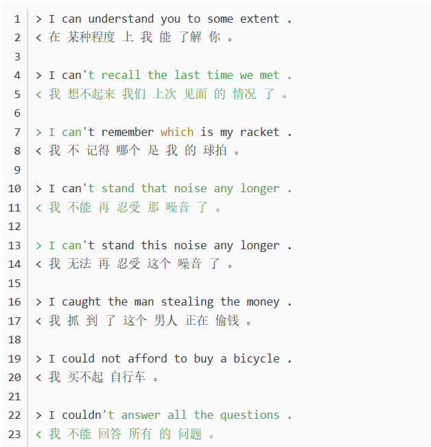
## 五、结果分析及总结
       深度学习是近几年来的研究热点，深度学习是人工智能能爆的关键技术，它的发展促进了人工智能技术的进步。基于深度神经网络的语音识别技术已经达到了95%的精度，基于深度神经网络的机器翻译技术已经接近了人类的平均翻译水平。所以，可以看出深度学习在当今发展的速度之快，它的发展给我们生活带来极大的便利和快捷。
       通过对此门课的学习和自已的了解，我清晰的明白了深度学习的优势。与传统的机器学习算法相比，深度学习技术有两个优点。首先，深度学习技术可以随着数据规模的增加不断提高其性能，而传统的机器学习算法很难利用海量数据来不断提高其性能。第二，深度学习技术可以直接从数据中提取特征，减少了为每个问题设计特征提取器的工作量，而传统的机器学习算法需要手工提取特征。
       这门课我跟着老师的讲解从神经网络的基本原理开始了我的人工智能学习之旅。之后学习了梯度下降、损失函数及交叉熵函数的原理及基本概念。继续跟着老师的步伐，我开始逐渐学习如何搭建神经网络。第一步- 线性回归、多入单出单层-多变量线性回归； 第二步- 线性分类、多入多出单层神经网络-线性多分类；第三步- 非线性回归、单入单出双层-非线性回归；第四步- 非线性分类、多入多出双层-非线性多分类、多入多出三层-多变量非线性分类；第五步- 模型的推理与部署；第六步- 深度神经网络、网络优化、正则化；第七步- 卷积神经网络、经典卷积神经网络模型；第八步 - 循环神经网络、NLP模型。通过这八大步的学习框架，我脑中基本已经建立起了神经网络的学习思维图。我明白神经网络是一个比较复杂的技术，但是通过这么课，我能对课程体系建立起1一个大致的框架，我认为我已经成功了一半，后面一半是具体的理论知识和编程技术，我相信只要在以后的学习和工作中，不断加强自己的理论和编程水平，我会对神经网络学习有一个更深的探索和理解。
## 参考文献

[1]熊晓倩.基于人工智能下语音识别方法与装置及系统的研究[J].科技资讯,2018,16(03):17-18.

[2]刘洋.神经机器翻译前沿进展[J].计算机研究与发展,2017,54(06):1144-1149.

[3]杨南. 基于神经网络学习的统计机器翻译研究[D].中国科学技术大学,2014.

[4]https://xueqiu.com/7788828530/134485026

[5]https://zhuanlan.zhihu.com/p/136356728

[6]https://www.cnblogs.com/libogarvin/p/7574593.html

[7]https://github.com/audier/DeepSpeechRecognition

[8]https://www.csdn.net/gather_2e/MtTaggxsMDU1MC1ibG9n.html