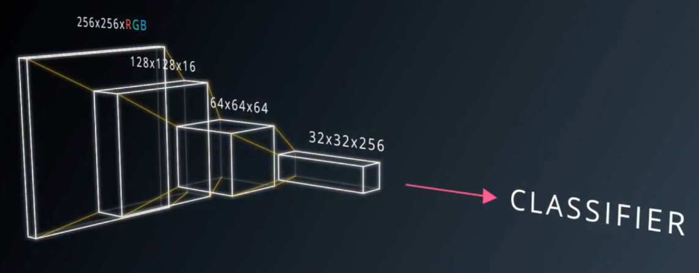
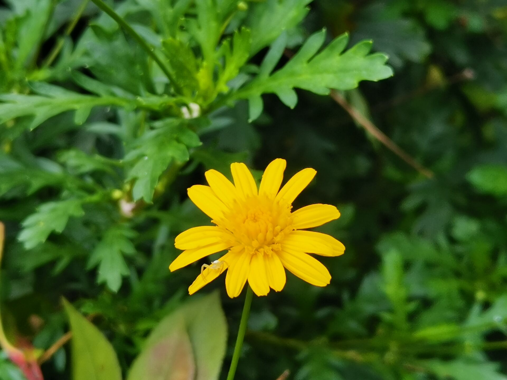
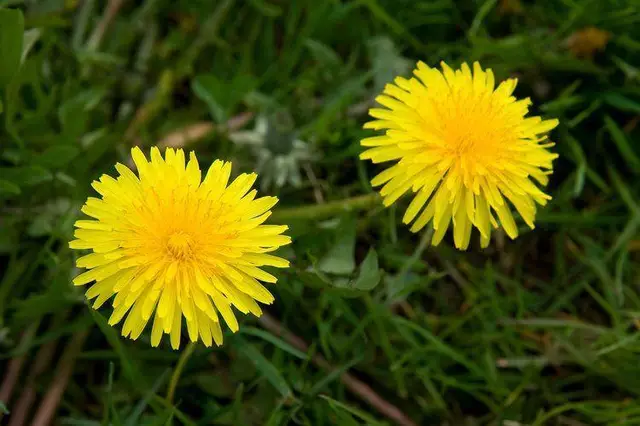
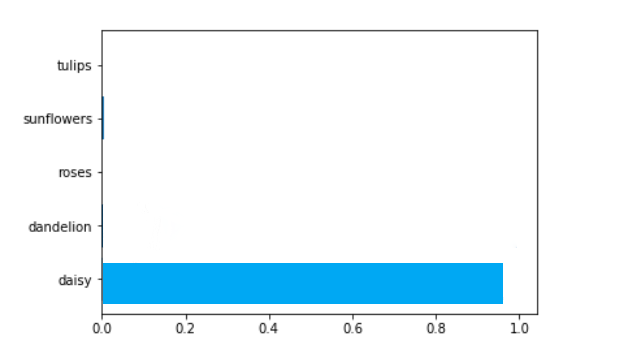
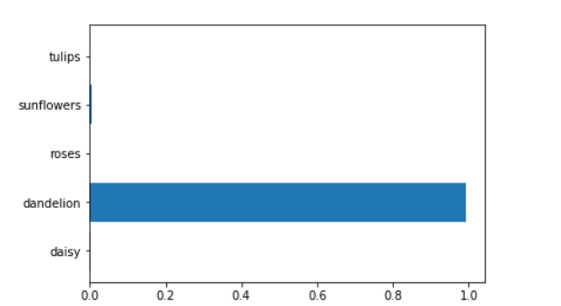

# 
# **基于深度学习花卉识别应用**
>#### 摘要
>>以花卉识别为例子向导，通过学习课程人工智能与机器学习中提到的深度神经网络架构、卷积和池化方法以及反向传播误差等主要方法，进行对自己学习这门课的理解程度和学到的内容实验测评，通过对数据库里5种花卉进行识别训练。
>>
>#### 关键词
>>+ 深度学习
>>+ 卷积神经网络
>>+ 迁移学习
>## 引言
>>通过人工智能与机器学习这门课的认识和学习了解到了很多现代人工智能技术的应用知识，其中深度学习模块可以说是机器学习里的重点，它的应用也是人工智能发展的关键。机器学习与模式识别是人工智能的一个分支，是目前研究最热的智能方向。到目前为止，基于PRML的图像识分类问题非常多。较为常见的有人脸识别、图像分类以及图像标注等等相关研究。其本质就是通过机器从一堆图像中学习到特征并分类，然后标出每个图像对应的标签，人工识别出图片中实物的问题。本文则争对花卉进行识别实验学习，目前花卉识别主要依据的是传统的特征融合的方法，近年来随着机器学习的迅速发展，卷积神经网络也应用于花卉识别当中。
>## 一、技术支持
>>### **深度学习框架**
>>深度学习框架也就像Caffe、tensorflow这些是深度学习的工具，简单来说就是库，编程时需要import caffe、import tensorflow。深度学习框架的出现降低了入门的门槛，你不需要从复杂的神经网络开始编代码，你可以依据需要，使用已有的模型，模型的参数你自己训练得到，你也可以在已有模型的基础上增加自己的layer，或者是在顶端选择自己需要的分类器和优化算法（比如常用的梯度下降法）。
>>### **卷积神经网络**
>>卷积神经网络在图像数据中使用得尤其多，不同于一般的全连接的神经网络需要对上下两层网络中的任意两个节点之间训练权值，每层卷积网络仅仅训练若干个卷积核，下一层的网络的输入即是前一个层的输出的卷积，因此，多层卷积神经网络会把一个薄薄的图片数据，转化为更小但是也更厚的数组，如下图所示卷积神经网络具有良好的统计不变性，而且每个层可以学习到不同层次的知识。比如第一层会学习到识别图片中的简单形状，例如直线和纯色块等。而之后的层将会上升到更高的抽象层次，比如例如形状，物体的组成部分，直到能够识别整个物体。
>>
>>如果我们将卷积神经网络中激活神经元的图像可视化出来，首先第一层能识别出一些对角线和颜色的分界；第二层网络可以学习到了一些稍微复杂的概念；第三层学习到了一些简单的物体，到了更高的层数，卷积神经网络能够识别出越来越复杂的物体，这个过程也非常符合人类识别物体的过程，即从简单模式越来越复杂的模式。
>>### **Max Pooling 和 Drop out**
>>最大池化和 Drop out 都是卷积神经网络中常用的技巧，他们的原理都非常简单，最大池化是一个滤波器，该滤波器按照一定的步长把一个区域内的值选出一个最大值作为这个区域的代表值。这样的做的一个好处是可以使神经网络专注于最重要的元素，减少输入元素的大小。而 Drop out 则是按照一个概率随机丢弃输入特征中的值，这样做的目的是迫使神经网络在学习过程中保持一定程度的冗余度，这样训练出来的模型会更加稳定，而且不容易过拟合。
>>### **VGG**
>>VGG 是视觉领域竞赛 ILSVRC 在 2014 年的获胜模型，以 7.3% 的错误率在 ImageNet 数据集上大幅刷新了前一年 11.7% 的世界纪录。VGG16 基本上继承了 AlexNet 深的思想，并且发扬光大，做到了更深。AlexNet 只用到了 8 层网络，而 VGG 的两个版本分别是 16 层网络版和 19 层网络版。【4】
>>**VGG结构图**
>>
>>### **迁移学习**
>>迁移学习并不是一种特定的机器学习模型，它更像是一种优化技巧。通常来说，机器学习任务要求测试集和训练集有相同的概率分布，然而在一些情况下往往会缺乏足够大的有针对性的数据集来满足一个特定的训练任务。迁移学习提出我们可以在一个通用的大数据集上进行一定量的训练后，再用针对性的小数据集进一步强化训练。
>## 二、设计内容
>>### **软件环境平台**
>>+ Python
>>+ tensorflow
>>+ VGG
>>#### **配置**
>>先保证代码或者jupyter notebook运行的工作目录下有flowerphotos，tensorflowvgg 这两个文件夹，分别是花朵数据集和 tensorflowvgg，然后将之前下载的 VGG16 拷贝到 tensorflowvgg 文件夹中。
```
├── transfer_learning.py（运行代码）

├── flower_phtots

│   ├── daisy

│   ├── dandelion

│   ├── roses

│   └── ...

└── tensorflow_vgg

    ├── vgg16.py

    ├── vgg16.npy

    └── ...
```
然后导入需要用的 python 模块
```

import os

import numpy as np

import tensorflow as tf

 

from tensorflow_vgg import vgg16

from tensorflow_vgg import utils

```
>>### **下载识花数据集**
>>识花数据集就是一个有多张花卉的样本照片组成的集合，将我们需要识别的花与之比对。
>>
>>下载连接：https://pan.baidu.com/s/1jIMOc1S
>>### **加载识花数据集**
>>将 flower_photos 文件夹中的花朵图片都载入到进来，并且用图片所在的子文件夹作为标签值。
```
data_dir = 'flower_photos/'

contents = os.listdir(data_dir)

classes = [each for each in contents if os.path.isdir(data_dir + each)]
 ```

>>### **利用VGG计算特征值**
```
batch_size = 10
codes_list = []
labels = []
batch = []
codes = None

with tf.Session() as sess:

    # 构建VGG16模型对象

    vgg = vgg16.Vgg16()

    input_ = tf.placeholder(tf.float32, [None, 224, 224, 3])

    with tf.name_scope("content_vgg"):

        # 载入VGG16模型

        vgg.build(input_)

    

    # 对每个不同种类的花分别用VGG16计算特征值

    for each in classes:

        print("Starting {} images".format(each))

        class_path = data_dir + each

        files = os.listdir(class_path)

        for ii, file in enumerate(files, 1):

            # 载入图片并放入batch数组中

            img = utils.load_image(os.path.join(class_path, file))

            batch.append(img.reshape((1, 224, 224, 3)))

            labels.append(each)

            

            # 如果图片数量到了batch_size则开始具体的运算

            if ii % batch_size == 0 or ii == len(files):

                images = np.concatenate(batch)

 

                feed_dict = {input_: images}

                # 计算特征值

                codes_batch = sess.run(vgg.relu6, feed_dict=feed_dict)

                

                # 将结果放入到codes数组中

                if codes is None:

                    codes = codes_batch

                else:

                    codes = np.concatenate((codes, codes_batch))

                

                # 清空数组准备下一个batch的计算

                batch = []

                print('{} images processed'.format(ii))
```
>>### **准备训练集、验证集和测试集**
```
from sklearn.preprocessing import LabelBinarizer

lb = LabelBinarizer()

lb.fit(labels)

labels_vecs = lb.transform(labels)
```
```
from sklearn.model_selection import StratifiedShuffleSplit

ss = StratifiedShuffleSplit(n_splits=1, test_size=0.2)

train_idx, val_idx = next(ss.split(codes, labels))


half_val_len = int(len(val_idx)/2)

val_idx, test_idx = val_idx[:half_val_len], val_idx[half_val_len:]

train_x, train_y = codes[train_idx], labels_vecs[train_idx]

val_x, val_y = codes[val_idx], labels_vecs[val_idx]

test_x, test_y = codes[test_idx], labels_vecs[test_idx]


print("Train shapes (x, y):", train_x.shape, train_y.shape)

print("Validation shapes (x, y):", val_x.shape, val_y.shape)

print("Test shapes (x, y):", test_x.shape, test_y.shape)
```
>>### **训练**
```
#运行多少轮次
epochs = 20
#统计训练效果的频率
iteration = 0
#保存模型的保存器

saver = tf.train.Saver()

with tf.Session() as sess:

    sess.run(tf.global_variables_initializer())

    for e in range(epochs):

        for x, y in get_batches(train_x, train_y):

            feed = {inputs_: x,

                    labels_: y}

            # 训练模型

            loss, _ = sess.run([cost, optimizer], feed_dict=feed)

            print("Epoch: {}/{}".format(e+1, epochs),

                  "Iteration: {}".format(iteration),

                  "Training loss: {:.5f}".format(loss))

            iteration += 1

            

            if iteration % 5 == 0:

                feed = {inputs_: val_x,

                        labels_: val_y}

                val_acc = sess.run(accuracy, feed_dict=feed)

                # 输出用验证机验证训练进度

                print("Epoch: {}/{}".format(e, epochs),

                      "Iteration: {}".format(iteration),

                      "Validation Acc: {:.4f}".format(val_acc))

    # 保存模型

    saver.save(sess, "checkpoints/flowers.ckpt")
```
>>### **测试网络**
```

with tf.Session() as sess:

    saver.restore(sess, tf.train.latest_checkpoint('checkpoints'))

    

    feed = {inputs_: test_x,

            labels_: test_y}

    test_acc = sess.run(accuracy, feed_dict=feed)

    print("Test accuracy: {:.4f}".format(test_acc))

```
>>
>## 三、测试结果
>>**识别图片：**
>>##### **雏菊**
>>
>>##### **蒲公英**
>>
>>##### **识别结果：**
>>
>>
>>
>>精确率达到了80%以上，调整 batch 的大小，或者模型的结构可得到不同结果。
>## 四、总结 
>>本次的实验设计让我对人工智能与机器学习这门课程学习到的知识进行应用测试，让我更好的了解消化了课程知识内容。同时认识到了人工智能在未来发展的趋势，对其的学习是在x向新领域的探索，提升机器能力，使其能够更优的为人类服务。
>>
>>本次的实验设计内容与过程主要是跟着网络资料及步骤完成，自己所储备的知识能力尚浅，还需继续努力学习。
>## 五、参考文献
>>+ 【1】沈萍, 赵备. 基于深度学习模型的花卉种类识别[J]. 科技通报, 2017(3). 
>>+ 【2】尹红. 基于深度学习的花卉图像分类算法研究[D]. 
>>+ 【3】中国大学mooc《商务数据分析》
>>+ 【4】《基于深度学习和迁移学习的识花实践》
>>
>>
>>
