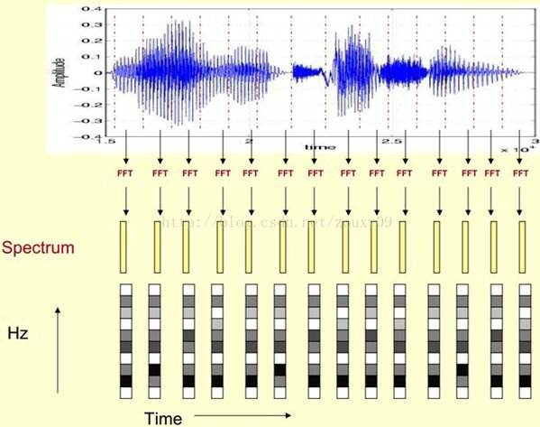

>>>>>>## 商务数据分析课程设计报告
 ## 1. 深度学习简介
   + 深度学习是一种特殊的机器学习，用概念组成的网状层级结构来表示这个世界，每一个概念简单的概念相连，抽象的概念通过没那么抽象的概念计算,深度学习的概念源于人工神经网络的研究，含多隐层的多层感知器就是一种深度学习结构.深度学习通过组合低层特征形成更加抽象的高层表示属性类别或特征，以发现数据的分布式特征表示.深度学习可以让那些拥有多个处理层的计算模型来学习具有多层次抽象的数据的表示。这些方法在很多方面都带来了显著的改善，包含最先进的语音识别、视觉对象识别、对象检測和很多其他领域，比如药物发现和基因组学等。深度学习可以发现大数据中的复杂结构。它是利用BP算法来完毕这个发现过程的。BP算法可以指导机器怎样从前一层获取误差而改变本层的内部參数，这些内部參数可以用于计算表示。深度卷积网络在处理图像、视频、语音和音频方面带来了突破，而递归网络在处理序列数据。比方文本和语音方面表现出了闪亮的一面。深度学习的灵感来自人类大脑过滤信息的方式。深度学习试图模拟新皮层中神经元层的活动。深度学习的目的是模仿人类大脑的工作方式,人类大脑中，大约有1000亿个神经元，每个神经元与大约10万个神经元相连。从本质上说，这就是我们想要创造的，在某种程度上，这对机器来说是可行的。
   + 现代深度学习架构大多数基于人工神经网络（ANN），并使用多层非线性处理单元进行特征提取和转换。每个连续层使用前一层的输出作为其输入。他们学到的东西构成了一个概念层次结构，每个层次都学会将其输入数据转换为抽象和复合的表征。
       这意味着对于图像，例如，输入可能是像素矩阵，而第一层可能编码边框并组成像素，然后下一层可能排列边，再下一层可能编码鼻子和眼睛，然后可能会识别图像包含人脸……虽然你可能需要进行一些微调，但是深度学习过程会自行学习将哪些特性放置在哪个级别。
       深度学习中的“深层”只是指数据转换的层数（它们具有实质的CAP，即从输入到输出的转换链）。对于前馈神经网络，CAP的深度是网络的深度和隐藏层的数量加1（输出层）。对于递归神经网络，一个信号可能会在一个层中传播不止一次，所以上限深度可能是无限的。大多数研究人员认为深度学习CAP depth >2
 + 深度学习是学习样本数据的内在规律和表示层次，这些学习过程中获得的信息对诸如文字，图像和声音等数据的解释有很大的帮助。它的最终目标是让机器能够像人一样具有分析学习能力，能够识别文字、图像和声音等数据。深度学习在搜索技术，数据挖掘，机器学习，机器翻译，自然语言处理，多媒体学习，语音，推荐和个性化技术，以及其他相关领域都取得了很多成果。
+ 深度学习是一类模式分析方法的统称，主要涉及三类方法：
+ 基于卷积运算的神经网络系统，即卷积神经网络（CNN）
+ 基于多层神经元的自编码神经网络，包括自编码以及近年来受到广泛关注的稀疏编码两类。
+ 以多层自编码神经网络的方式进行预训练，进而结合鉴别信息进一步优化神经网络权值的深度置信网络（DBN）。
+ +含多个隐层的深度学习模型，如图：
+ 深度学习的概念源于人工神经网络的研究，含多个隐藏层的多层感知器就是一种深度学习结构。深度学习通过组合低层特征形成更加抽象的高层表示属性类别或特征，以发现数据的分布式特征表示。从一个输入中产生一个输出所涉及的计算可以通过一个流向图来表示：流向图是一种能够表示计算的图，在这种图中每一个节点表示一个基本的计算以及一个计算的值，计算的结果被应用到这个节点的子节点的值。考虑这样一个计算集合，它可以被允许在每一个节点和可能的图结构中，并定义了一个函数族。输入节点没有父节点，输出节点没有子节点。
+ 这种流向图的一个特别属性是深度（depth）：从一个输入到一个输出的最长路径的长度。
+ 特点：
    1. 强调了模型结构的深度。通常有5-6层，甚至有10多层的隐层节点。
    2. 明确了特征学习的重要性。通过逐层特征变换，将样本在原空间的特征表示变换到一个新特征空间，从而使分类或预测更容易。与人工规则构造特征的方法相比，利用大数据来学习特征，更能够刻画数据丰富的内在信息。
## 2. 人工神经网络
   + 现代深度学习架构大多数基于人工神经网络（ANN），并使用多层非线性处理单元进行特征提取和转换。每个连续层使用前一层的输出作为其输入。他们学到的东西构成了一个概念层次结构，每个层次都学会将其输入数据转换为抽象和复合的表征。
   这意味着对于图像，例如，输入可能是像素矩阵，而第一层可能编码边框并组成像素，然后下一层可能排列边，再下一层可能编码鼻子和眼睛，然后可能会识别图像包含人脸……虽然你可能需要进行一些微调，但是深度学习过程会自行学习将哪些特性放置在哪个级别。
   深度学习中的“深层”只是指数据转换的层数（它们具有实质的CAP，即从输入到输出的转换链）。对于前馈神经网络，CAP的深度是网络的深度和隐藏层的数量加1（输出层）。对于递归神经网络，一个信号可能会在一个层中传播不止一次，所以上限深度可能是无限的。大多数研究人员认为深度学习CAP depth >2。神经网络基本模型 例：前向神经网络
## 3.卷积神经网络
+ 重点学习的人工神经网络是卷积神经网络
+ 卷积神经网络是一类包含卷积计算且具有深度结构的前馈神经网络，是深度学习的代表算法之一。卷积神经网络具有表征学习能力，能够按其阶层结构对输入信息进行平移不变分类。也被成为“平移不变人工神经网络”。
+ 卷积神经网络仿造生物的视知觉机制构建，可以进行监督学习和非监督学习。它隐含层内的卷积核参数共享和层间连接的稀疏性使得卷积神经网络能够以较小的计算量对各点化特征。
+ 结构
    1. 输入层：卷积神经网络的输入层可以处理多维数据。它与其它神经网络算法类似，由于使用梯度下降算法进行学习，卷积神经网络的输入特征需要进行标准化处理。输入特征的标准化有利于提升卷积神经网络的学习效率和表现。
    2. 隐含层：卷积神经网络的隐含层包含卷积层、池化层和全连接层3类常见构筑。
    3. 输出层：卷积神经网络中输出层的上游通常是全连接层，因此其结构和工作原理与传统前馈神经网络中的输出层相同。对于图像分类问题，输出层使用逻辑函数或归一化指数函数输出分类标签。
+ 学习范式：
    1. 监督学习：（参见：反向传播算法）卷积神经网络在监督学习中使用BP框架进行学习。卷积神经网络中的BP分为三部分，全连接层与卷积核的反向传播和池化层的反向通路。
    2. 非监督学习：卷积神经网络最初是面向监督学习问题设计的，但其也发展出了非监督学习范式，包括卷积自编码器、卷积受限玻尔兹曼机/卷积深度置信网络和深度卷积生成对抗网络。这些算法也可以视为在非监督学习算法的原始版本中引入卷积神经网络构筑的混合算法。
## 4. 神经网络的本质
   神经网络由大量的节点（或称“神经元”，卷积神经网络中为“特征图”）相互连接构成，每个节点代表一种特定的函数，称为激活函数（Activation Function）。节点之间的连接具有特定的权重，信号经过会进行加权，代表神经网络的记忆。网络的输出则依网络的连接方式、权重值和激活函数的不同而不同。网络本身则代表对自然界某种算法或者函数的逼近，也可以是一种逻辑策略的表达。
## 5. 基于深度学习框架(tinynn)的 MNIST 分类
###  + 组件抽象

    首先考虑神经网络运算的流程，神经网络运算主要包含训练 training 和预测 predict （或 inference） 两个阶段，训练的基本流程是：输入数据 -> 网络层前向传播 -> 计算损失 -> 网络层反向传播梯度 -> 更新参数，预测的基本流程是 输入数据 -> 网络层前向传播 -> 输出结果。从运算的角度看，主要可以分为三种类型的计算：

     + + 数据在网络层之间的流动：前向传播和反向传播可以看做是张量 Tensor（多维数组）在网络层之间的流动（前向传播流动的是输入输出，反向传播流动的是梯度），每个网络层会进行一定的运算，然后将结果输入给下一层
     + + 计算损失：衔接前向和反向传播的中间过程，定义了模型的输出与真实值之间的差异，用来后续提供反向传播所需的信息
     + + 参数更新：使用计算得到的梯度对网络参数进行更新的一类计算
  
    基于这个三种类型，我们可以对网络的基本组件做一个抽象

    tensor 张量，这个是神经网络中数据的基本单位。

    layers 网络层，负责接收上一层的输入，进行该层的运算，将结果输出给下一层，由于 tensor 的流动有前向和反向两个方向，因此对于每种类型网络层我们都需要同时实现 forward 和 backward 两种运算。

    losses 损失，在给定模型预测值与真实值之后，该组件输出损失值以及关于最后一层的梯度。（用于梯度回传）

    optimizer 优化器，负责使用梯度更新模型的参数然后我们还需要一些组件把上面这个 4 种基本组件整合到一起，形成一个 pipeline。

    nn 组件负责管理 tensor 在 layers 之间的前向和反向传播，同时能提供获取参数、设置参数、获取梯度的接口。

    model 组件负责整合所有组件，形成整个 pipeline。即 nn 组件进行前向传播 -> losses 组件计算损失和梯度 -> nn 组件将梯度反向传播 -> optimizer 组件将梯度更新到参数。其基本的框架图如下图

###  + 组件实现
  
    按照上面的抽象，我们可以写出整个流程代码如下。首先定义 net，net 的输入是多个网络层，然后将 net、loss、optimizer 一起传给 model。model 实现了 forward、backward 和 apply_grad 三个接口分别对应前向传播、反向传播和参数更新三个功能。

    # define model
    net = Net([layer1, layer2, ...])

    model = Model(net, loss_fn, optimizer)

    # training
    pred = model.forward(train_X)

    loss, grads = model.backward(pred, train_Y)

    model.apply_grad(grads)

    # inference
    test_pred = model.forward(test_X)
    接下来我们看这里边各个部分分别如何实现。

+ tensor

    tensor 张量是神经网络中基本的数据单位，我们这里直接使用 numpy.ndarray 类作为 tensor 类的实现（numpy 底层使用了 C 和 Fortran，并且在算法层面进行了大量的优化，运算速度也不算慢）

+ layers

    上面流程代码中 model 进行 forward 和 backward，其实底层都是网络层在进行实际运算，因此网络层需要有提供 forward 和 backward 接口进行对应的运算。同时还应该将该层的参数和梯度记录下来。先实现一个基类如下

# layers.py
class Layer(object):

    def __init__(self, name):
        self.name = name

        self.params, self.grads = None, None

    def forward(self, inputs):

        raise NotImplementedError

    def backward(self, grad);

         raise NotImplementedError

最基础的一种网络层是全连接网络层，实现如下。forward 方法接收上层的输入 inputs，实现 的运算；backward 的方法接收来自上层的梯度，计算关于参数 和输入的梯度，然后返回关于输入的梯度。这三个梯度的推导可以见附录，这里直接给出实现。w_init 和 b_init 分别是参数 weight 和 bias 的初始化器，这个我们在另外的一个实现初始化器中文件 initializer.py 去实现，这部分不是核心部件，所以在这里不展开介绍。

# layers.py
class Dense(Layer):
    def __init__(self, num_in, num_out,
                 w_init=XavierUniformInit(),
                 b_init=ZerosInit()):
        super().__init__("Linear")

        self.params = {
            "w": w_init([num_in, num_out]),
            "b": b_init([1, num_out])}

        self.inputs = None

    def forward(self, inputs):
        self.inputs = inputs
        return inputs @ self.params["w"] + self.params["b"]

    def backward(self, grad):
        self.grads["w"] = self.inputs.T @ grad
        self.grads["b"] = np.sum(grad, axis=0)
        return grad @ self.params["w"].T
同时神经网络中的另一个重要的部分是激活函数。激活函数可以看做是一种网络层，同样需要实现 forward 和 backward 方法。我们通过继承 Layer 类实现激活函数类，这里实现了最常用的 ReLU 激活函数。func 和 derivation_func 方法分别实现对应激活函数的正向计算和梯度计算。

# layers.py
class Activation(Layer):

		"""Base activation layer"""
    def __init__(self, name):
        super().__init__(name)
        self.inputs = None

    def forward(self, inputs):
        self.inputs = inputs
        return self.func(inputs)

    def backward(self, grad):
        return self.derivative_func(self.inputs) * grad

    def func(self, x):
        raise NotImplementedError

    def derivative_func(self, x):
        raise NotImplementedError

class ReLU(Activation):

		"""ReLU activation function"""
    def __init__(self):
        super().__init__("ReLU")

    def func(self, x):
        return np.maximum(x, 0.0)

    def derivative_func(self, x):
        return x > 0.0
+ nn

  上文提到 nn 类负责管理 tensor 在 layers 之间的前向和反向传播。forward 方法很简单，按顺序遍历所有层，每层计算的输出作为下一层的输入；backward 则逆序遍历所有层，将每层的梯度作为下一层的输入。这里我们还将每个网络层参数的梯度保存下来返回，后面参数更新需要用到。另外 nn 类还实现了获取参数、设置参数、获取梯度的接口，也是后面参数更新时需要用到

# nn.py
class Net(object):
    def __init__(self, layers):
        self.layers = layers

    def forward(self, inputs):
        for layer in self.layers:
            inputs = layer.forward(inputs)
        return inputs

    def backward(self, grad):
        all_grads = []
        for layer in reversed(self.layers):
            grad = layer.backward(grad)
            all_grads.append(layer.grads)
        return all_grads[::-1]

    def get_params_and_grads(self):
        for layer in self.layers:
            yield layer.params, layer.grads

    def get_parameters(self):
        return [layer.params for layer in self.layers]

    def set_parameters(self, params):
        for i, layer in enumerate(self.layers):
            for key in layer.params.keys():
                layer.params[key] = params[i][key]
+ losses

  上文我们提到 losses 组件需要做两件事情，给定了预测值和真实值，需要计算损失值和关于预测值的梯度。我们分别实现为 loss 和 grad 两个方法，这里我们实现多分类回归常用的 SoftmaxCrossEntropyLoss 损失。这个的损失 loss 和梯度 grad 的计算公式推导进文末附录，这里直接给出结果：
 
  多分类 softmax 交叉熵的损失为

  $$ J_{CE}(y, \hat{y}) = -\sum_{i=1}^N \mathbb{log}(\hat{y_i^{c}}) $$
  梯度稍微复杂一点，目标类别和非目标类别的计算公式不同。对于目标类别维度，其梯度为对应维度模型输出概率减一，对于非目标类别维度，其梯度为对应维度输出概率本身。

  $$ \frac{\partial J_{ce}}{\partial o^c}= \begin{cases} (\hat{y}^c-1) / N & \text{目标类别 } c\\ y^{\tilde{c}} / N & \text{非目标类别 } \tilde{c} \end{cases} $$
  代码实现如下

# losses.py
class BaseLoss(object):
    def loss(self, predicted, actual):
        raise NotImplementedError

    def grad(self, predicted, actual):
        raise NotImplementedError

class CrossEntropyLoss(BaseLoss):
  	def loss(self, predicted, actual):
        m = predicted.shape[0]
        exps = np.exp(predicted - np.max(predicted, axis=1, keepdims=True))
        p = exps / np.sum(exps, axis=1, keepdims=True)
        nll = -np.log(np.sum(p * actual, axis=1))
        return np.sum(nll) / m

    def grad(self, predicted, actual):
        m = predicted.shape[0]
        grad = np.copy(predicted)
        grad -= actual
        return grad / m
+ optimizer

  optimizer 主要实现一个接口 compute_step，这个方法根据当前的梯度，计算返回实际优化时每个参数改变的步长。我们在这里实现常用的 Adam 优化器。

# optimizer.py
class BaseOptimizer(object):
    def __init__(self, lr, weight_decay):
        self.lr = lr
        self.weight_decay = weight_decay

    def compute_step(self, grads, params):
        step = list()
        # flatten all gradients
        flatten_grads = np.concatenate(
            [np.ravel(v) for grad in grads for v in grad.values()])
        # compute step
        flatten_step = self._compute_step(flatten_grads)
        # reshape gradients
        p = 0
        for param in params:
            layer = dict()
            for k, v in param.items():
                block = np.prod(v.shape)
                _step = flatten_step[p:p+block].reshape(v.shape)
                _step -= self.weight_decay * v
                layer[k] = _step
                p += block
            step.append(layer)
        return step

    def _compute_step(self, grad):
        raise NotImplementedError

class Adam(BaseOptimizer):
    def __init__(self, lr=0.001, beta1=0.9, beta2=0.999,
                 eps=1e-8, weight_decay=0.0):
        super().__init__(lr, weight_decay)
        self._b1, self._b2 = beta1, beta2
        self._eps = eps

        self._t = 0
        self._m, self._v = 0, 0

    def _compute_step(self, grad):
        self._t += 1
        self._m = self._b1 * self._m + (1 - self._b1) * grad
        self._v = self._b2 * self._v + (1 - self._b2) * (grad ** 2)
        # bias correction
        _m = self._m / (1 - self._b1 ** self._t)
        _v = self._v / (1 - self._b2 ** self._t)
        return -self.lr * _m / (_v ** 0.5 + self._eps)

+ model

   最后 model 类实现了我们一开始设计的三个接口 forward、backward 和 apply_grad ，forward 直接调用 net 的 forward ，backward 中把 net 、loss、optimizer 串起来，先计算损失 loss，然后反向传播得到梯度，然后 optimizer 计算步长，最后由 apply_grad 对参数进行更新
## 6.应用：深度学习应用 语音识别
#### 1.语音识别系统
+ 原理：
    + 信号处理和特征提取可以视作音频数据的预处理部分。在正式进入声学模型之前，我们需要通过消除噪音和信道增强等预处理技术，将信号从时域转化到频域，然后为之后的声学模型提取有效的特征向量。然后声学模型会将预处理部分得到的特征向量转化为声学模型得分，并且会得到一个语言模型得分。最后解码搜索阶段会针对声学模型得分和语言模型得分进行综合，将得分最高的词序列作为最后的识别结构。

+ 信号处理与特征提取：
    + 声波是一种信号，我们可以具体的称之为音频信号。
    + 最初始的预处理工作就是静音切除，也叫语音激活检测 或者语音边界检测。目的是从音频信号流里识别和消除长时间的静音片段，在截取出来的有效片段上进行后续处理会很大程度上降低静音片段带来的干扰。
    + 然后就是特征提取工作。音频信号中通常包含着非常丰富的特征参数，不同的特征向量表征着不同的声学意义，从音频信号中选择有效的音频表征的过程就是语音特征提取。常用的语音特征包括线性预测倒谱系数和梅尔频率倒谱系数，其中线性预测倒谱系数特征是根据声管模型建立的特征参数，是对声道响应的特征表征。而梅尔频率倒谱系数特征是基于人的听觉特征提取出来的特征参数，是对人耳听觉的特征表征。在提取工作中最经常使用的是梅尔频率倒谱系数。梅尔频率倒谱系数主要由预加重、分帧、加窗、快速傅里叶变换、梅尔滤波器组、离散余弦变换几部分组成，其中傅里叶变换与梅尔滤波器是梅尔频率倒谱系数最重要的部分。
    + 一个完整的梅尔频率倒谱系数算法包括如下步骤：
        + 快速傅里叶变换；
        + 梅尔频率尺度转换；
        + 配置三角形滤波器组并计算每一个三角形滤波器对信号幅度谱滤波后的输出；
        + 对所有滤波器输出作对数运算，再进一步做离散余弦变换，即可得到梅尔频率倒谱系数。
        + 傅里叶变换 
    + 实际的语音研究工作中，不需要从头构造一个梅尔频率倒谱系数特征提取方法，Python为我们提供了pyaudio和librosa等语音处理工作库，可以直接调用梅尔频率倒谱系数算法的相关模块快速实现音频预处理工作。
    + 梅尔频率倒谱系数 
#### 4.基于深度学习的声学模型
+ 最早用于声学模型的神经网络是最普通的深度神经网络（DNN）。GMM等传统的声学模型存在着音频信号表征的低效问题，但是DNN可以在一定程度上解决这个问题。在实际建模的时候，由于音频信号是时序连续信号，DNN则是需要固定大小的输入，所以早期使用DNN来搭建声学模型时需要一种能够处理语音信号长度变化的方法，则用一种将HMM模型和DNN模型结合起来的DNN-HMM混合系统颇具有效性。
+ HMM 用来描述语音信号的动态变化，DNN 则是用来估计观察特征的概率。在给定声学观察特征的条件下，我们可以用 DNN 的每个输出节点来估计 HMM 某个状态的后验概率。
+ 除了DNN之外，经常用于计算机视觉的CNN也可拿来构建语音声学模型。但是CNN经常会与其他模型结合使用。CNN用于声学模型方面主要包括TDNN、CNN-DNN模型、DFCNN、CNN-LSTM-DNN(CLDNN)框架、CNN-DNN-LSTM(CDL)框架、逐层语境扩展和注意CNN框架(LACE)等等。
## 7总结
商务数据分析这门课经过这几个月的学习我了解到包括如何抽象、如何设计组件接口、如何更效率的实现、算法的具体细节等等。当然这只是一些皮毛不过我相信通过不断的获取知识会对这方面有更多的理解。如果能把这门课学好相信在日后的就业中会有不错的吸引力。