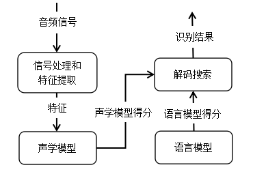
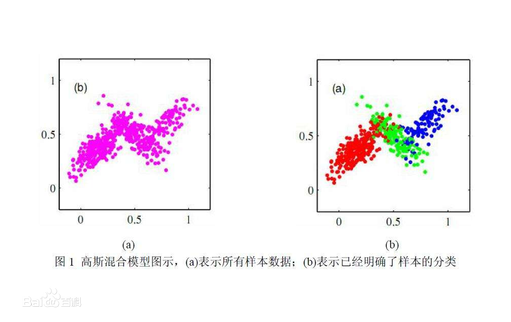
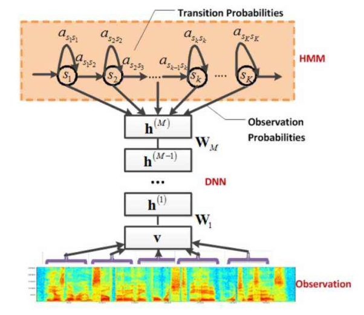
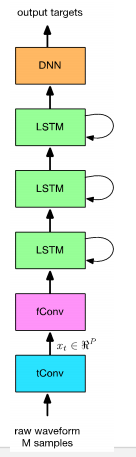

>>>>>>>## 商务数据分析课程设计报告
### 1.神经网络
+ 在这门课中，我们先学习的是神经网络。
+ 人工神经网络从信息处理角度对人脑神经网络进行抽象，建立某种简单模型，按不同的连接方式组成不同的网络。
+ 神经网络是一种运算模型，由大量的节点（或称神经元）之间相互联接构成。每个节点代表一种特定的输出函数，称为激励函数。每两个节点间的连接都代表一个对于通过该连接信号的加权值，称为权重，这相当于人工神经网络的记忆。
+ 网络的输出则以网络的连接方式，权重值和激励函数的不同而不同。

#### 卷积神经网络
+ 重点学习的人工神经网络是卷积神经网络
+ 卷积神经网络是一类包含卷积计算且具有深度结构的前馈神经网络，是深度学习的代表算法之一。卷积神经网络具有表征学习能力，能够按其阶层结构对输入信息进行平移不变分类。也被成为“平移不变人工神经网络”。
+ 卷积神经网络仿造生物的视知觉机制构建，可以进行监督学习和非监督学习。它隐含层内的卷积核参数共享和层间连接的稀疏性使得卷积神经网络能够以较小的计算量对各点化特征。
+ 结构
    + 输入层：卷积神经网络的输入层可以处理多维数据。它与其它神经网络算法类似，由于使用梯度下降算法进行学习，卷积神经网络的输入特征需要进行标准化处理。输入特征的标准化有利于提升卷积神经网络的学习效率和表现。
    + 隐含层：卷积神经网络的隐含层包含卷积层、池化层和全连接层3类常见构筑。
    + 输出层：卷积神经网络中输出层的上游通常是全连接层，因此其结构和工作原理与传统前馈神经网络中的输出层相同。对于图像分类问题，输出层使用逻辑函数或归一化指数函数输出分类标签。
+ 学习范式：
    + 监督学习：（参见：反向传播算法）卷积神经网络在监督学习中使用BP框架进行学习。卷积神经网络中的BP分为三部分，全连接层与卷积核的反向传播和池化层的反向通路。
    + 非监督学习：卷积神经网络最初是面向监督学习问题设计的，但其也发展出了非监督学习范式，包括卷积自编码器、卷积受限玻尔兹曼机/卷积深度置信网络和深度卷积生成对抗网络。这些算法也可以视为在非监督学习算法的原始版本中引入卷积神经网络构筑的混合算法。

#### 深度学习
+ 深度学习是学习样本数据的内在规律和表示层次，这些学习过程中获得的信息对诸如文字，图像和声音等数据的解释有很大的帮助。它的最终目标是让机器能够像人一样具有分析学习能力，能够识别文字、图像和声音等数据。深度学习在搜索技术，数据挖掘，机器学习，机器翻译，自然语言处理，多媒体学习，语音，推荐和个性化技术，以及其他相关领域都取得了很多成果。
+ 深度学习是一类模式分析方法的统称，主要涉及三类方法：
    + 基于卷积运算的神经网络系统，即卷积神经网络（CNN）
    + 基于多层神经元的自编码神经网络，包括自编码以及近年来受到广泛关注的稀疏编码两类。
    + 以多层自编码神经网络的方式进行预训练，进而结合鉴别信息进一步优化神经网络权值的深度置信网络（DBN）。
+ 含多个隐层的深度学习模型，如图：
    + 深度学习的概念源于人工神经网络的研究，含多个隐藏层的多层感知器就是一种深度学习结构。深度学习通过组合低层特征形成更加抽象的高层表示属性类别或特征，以发现数据的分布式特征表示。从一个输入中产生一个输出所涉及的计算可以通过一个流向图来表示：流向图是一种能够表示计算的图，在这种图中每一个节点表示一个基本的计算以及一个计算的值，计算的结果被应用到这个节点的子节点的值。考虑这样一个计算集合，它可以被允许在每一个节点和可能的图结构中，并定义了一个函数族。输入节点没有父节点，输出节点没有子节点。
    + 这种流向图的一个特别属性是深度（depth）：从一个输入到一个输出的最长路径的长度。
+ 特点：
    + 强调了模型结构的深度。通常有5-6层，甚至有10多层的隐层节点。
    + 明确了特征学习的重要性。通过逐层特征变换，将样本在原空间的特征表示变换到一个新特征空间，从而使分类或预测更容易。与人工规则构造特征的方法相比，利用大数据来学习特征，更能够刻画数据丰富的内在信息。
  
### 应用：深度学习应用 语音识别
#### 1.语音识别的输入与输出
+ 将语音片段输入转化为文本输出的过程，称为语音识别。
+ 语音识别过程如下图：
 

#### 2.语音识别系统
+ 原理：
    + 信号处理和特征提取可以视作音频数据的预处理部分。在正式进入声学模型之前，我们需要通过消除噪音和信道增强等预处理技术，将信号从时域转化到频域，然后为之后的声学模型提取有效的特征向量。然后声学模型会将预处理部分得到的特征向量转化为声学模型得分，并且会得到一个语言模型得分。最后解码搜索阶段会针对声学模型得分和语言模型得分进行综合，将得分最高的词序列作为最后的识别结构。

+ 信号处理与特征提取：
    + 声波是一种信号，我们可以具体的称之为音频信号。
    + 最初始的预处理工作就是静音切除，也叫语音激活检测 或者语音边界检测。目的是从音频信号流里识别和消除长时间的静音片段，在截取出来的有效片段上进行后续处理会很大程度上降低静音片段带来的干扰。
    + 然后就是特征提取工作。音频信号中通常包含着非常丰富的特征参数，不同的特征向量表征着不同的声学意义，从音频信号中选择有效的音频表征的过程就是语音特征提取。常用的语音特征包括线性预测倒谱系数和梅尔频率倒谱系数，其中线性预测倒谱系数特征是根据声管模型建立的特征参数，是对声道响应的特征表征。而梅尔频率倒谱系数特征是基于人的听觉特征提取出来的特征参数，是对人耳听觉的特征表征。在提取工作中最经常使用的是梅尔频率倒谱系数。梅尔频率倒谱系数主要由预加重、分帧、加窗、快速傅里叶变换、梅尔滤波器组、离散余弦变换几部分组成，其中傅里叶变换与梅尔滤波器是梅尔频率倒谱系数最重要的部分。
    + 一个完整的梅尔频率倒谱系数算法包括如下步骤：
        + 快速傅里叶变换；
        + 梅尔频率尺度转换；
        + 配置三角形滤波器组并计算每一个三角形滤波器对信号幅度谱滤波后的输出；
        + 对所有滤波器输出作对数运算，再进一步做离散余弦变换，即可得到梅尔频率倒谱系数。
        + 傅里叶变换 
    + 实际的语音研究工作中，不需要从头构造一个梅尔频率倒谱系数特征提取方法，Python为我们提供了pyaudio和librosa等语音处理工作库，可以直接调用梅尔频率倒谱系数算法的相关模块快速实现音频预处理工作。
    + 梅尔频率倒谱系数 

#### 3.传统声学模型
+ 在经过语音特征提取之后，我们就可以将这些音频特征进行进一步的处理，处理的目的是找到语音来自于某个声学符号的概率。这种通过音频特征找概率的模型就称之为声学模型。在深度学习兴起之前，混合高斯模型和隐马尔可夫模型一直作为非常有效的声学模型而被广泛使用，当然即使是在深度学习高速发展的今天，这些传统的声学模型在语音识别领域仍然有着一席之地。所以，作为传统声学模型的代表，我们就简单介绍下 混合高斯模型 和隐马尔可夫模型模型。
+ 所谓高斯混合模型（GMM，用混合的高斯随机变量的分布来拟合训练数据时形成的模型。）
    + 
    + 原始的音频数据经过短时傅里叶变换或者取倒谱后会变成特征序列，在忽略时序信息的条件下，这种序列非常适用于使用 所谓高斯混合模型 进行建模。
    + 在实际的高斯混合模型中，通常采用 EM 算法来进行迭代优化，以求取高斯混合模型中的加权系数及各个高斯函数的均值与方差等参数。高斯混合模型作为一种基于傅里叶频谱语音特征的统计模型，在传统语音识别系统的声学模型中发挥了重要的作用。其劣势在于不能考虑语音顺序信息，高斯混合分布也难以拟合非线性或近似非线性的数据特征。当状态这个概念引入到声学模型的时候，就有了一种新的声学模型——隐马尔可夫模型（HMM）。
    + 隐马尔科夫模型 
  
#### 4.基于深度学习的声学模型
+ 最早用于声学模型的神经网络是最普通的深度神经网络（DNN）。GMM等传统的声学模型存在着音频信号表征的低效问题，但是DNN可以在一定程度上解决这个问题。在实际建模的时候，由于音频信号是时序连续信号，DNN则是需要固定大小的输入，所以早期使用DNN来搭建声学模型时需要一种能够处理语音信号长度变化的方法，则用一种将HMM模型和DNN模型结合起来的DNN-HMM混合系统颇具有效性。
+ HMM 用来描述语音信号的动态变化，DNN 则是用来估计观察特征的概率。在给定声学观察特征的条件下，我们可以用 DNN 的每个输出节点来估计 HMM 某个状态的后验概率。
+ 除了DNN之外，经常用于计算机视觉的CNN也可拿来构建语音声学模型。但是CNN经常会与其他模型结合使用。CNN用于声学模型方面主要包括TDNN、CNN-DNN模型、DFCNN、CNN-LSTM-DNN(CLDNN)框架、CNN-DNN-LSTM(CDL)框架、逐层语境扩展和注意CNN框架(LACE)等等。
  
#### 5.端到端的语音识别系统简介
+ 问题的提出：
    + 特征表示:神经网络既然可以用来做特征学习，是否可以直接从原始音频信号中直接提取特征，不需要手工的提取log-mel特征？
    +  声学建模：DNN,CNN 和 LSTM通常用来进行声学建模，通过结合这些结构是否可以更好建模？
    +  是否可以减少对现有CD-state（通过HMM训练和聚类得到）和aligment的依赖？
  
+ 问题的解决：
    + LSTM的时序建模直接在特征做xt， 对xt进行高维建模可以减少谱变化，能更好的学习时序结构，卷积网络能很好的减少谱差异性，将特征映射到一个说话人空间。考虑到LSTM局限性，CLDNN通过结合三种网络结构，来解决问题：
        + 一是把特征输入到CNN层，降低谱差异性，二是把CNN的输出输入到LSTM建模时序特征，三是把LSTM的输出作为DNN的输入，减少LSTM隐层的变化，使得特征转化到更可分的空间。 
        + CLDNN 的处理过程：
         

#### 6.语音识别成果
+ 将我们输入的声音转化成比特，然后数字采样，然后进行采样预处理，短声音识别字符，最后输出。
+ 