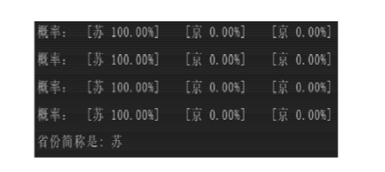
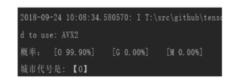

# 深度学习设计报告

## 深度学习课程概述

尽管人类每时每刻都要面临着大量的感知数据，却总能以一种灵巧方式获取值得注意的重要信息。模仿人脑那样高效准确地表示信息一直是人工智能研究领域的核心挑战。神经科学研究人员利用解剖学知识发现哺乳类动物大脑表示信息的方式: 人类感知系统这种明确的层次结构极大地降低了视觉系统处理的数据量，并保留了物体有用的结构信息。对于要提取具有潜在复杂结构规则的自然图像、视频、语音和音乐等结构丰富数据，深度学习能够获取其本质特征。

深度学习是使用深层架构的机器学习方法，已经广泛应用于人工智能所涉及的众多领域，例如语音识别、计算机视觉、自然语言、在线广告等。其灵感来源于脑科学中神经元的构造及它们之间的信息流传播方式。为了解决某一类问题，研究者需要从中 抽象出一种数学模型，即建立具有阶层结构的人工神经网络 (Artifitial Neural Networks，ANNs)。ANNs 对输入信息进行逐层提取和筛选，利用反向传播算法来指导机器修改内部参数，使计算机在使用特征的同时，找到数据隐含在内部的关系，学习如何提取特征。深度学习使学习到的特征更具有表达力，最终通过计算机实现人工智能。

深度学习是一种革命性的机器学习方法，它没有具体的公式， 更不会以某一损失函数为特征。深度学习可以采用扩大数据集或者改进算法的方式来提高学习算法的准确性，在大数据集上的表现明显优于其他机器学习方法。越来越多的领域将会应用到深度学习，深度学习也会促进其他领域的发展。由此，可推测出深度学习在未来有广阔的发展。首先，模型层数会增多，更加深层的模型可以减少训练样本的数量，这也会更加适应数据没有标签的无监督学习。其次，深度学习的成本会降低，训练时的参数、对 硬件的要求都会下降。这使深度神经网络能够在廉价的移动设备上运行，例如已经有突破性进展的无人驾驶领域。最后，深度神经网络将成为其他科研领域研究的重要工具，比如研发新型药物、 医疗诊断等。

深度学习的概念是在 2006 年由 GE Hinton 和 RR Salakhutdinov 正式提出的。为了降低数据的维数，他们采用了神经网络，并通过训练具有小中心层的多层神经网络以重建高维输入向量，将高维数据转换为低维码，巧妙地利用梯度下降法微调这种“自动编码器”网络中的权重。早期的深度学习由于受到硬件的限制进展缓慢，随着计算机技术突飞猛进的发展，计算机的运算能力和运算速度显著提升，支持深度学习中大规模的矩阵运算， 从而使深度学习的应用范围越来越广泛。随着深度学习的发展， 计算机视觉领域取得了不俗的成就，已经广泛应用于医疗、公共安全等与人们生活息息相关的领域。在现代医疗上，由于神经网络经过海量数据集的训练，具有极高的准确度，在判断病人医疗影像时可以利用深度学习的方法让计算机的诊断结果作为重要评判依据，这一方法在诊断恶性肿瘤时尤其有效。在公共安全上， 可通过摄像头采集有关人脸的图像或视频，提取其面部信息，并与数据库中的信息进行对比，当与不法分子的相似度达到阈值时系统会警告当地公安机关采取相应措施。由于人脸识别能做到 24 小时不间断和重要地段无死角的监控，能实时、精准掌控不法分子行踪，在很大程度上减轻了公安部门的工作压力。

## 深度学习架构

### 卷积神经网络

卷积神经网络(Convolutional Neural Networks，CNN)模仿了生物视觉系统结构，即当具有相同参数的神经元应用于前一层的不同位置时，能获取变换不变性的特征，是一类包含卷积计算 且具有深度结构的前馈神经网络(Feedforward Neural Networks)。 卷积神经网络是由多个处理层所构成的。典型的卷积神经网络由输入层 、卷积层 、激励层 、池化层 、全连接层、输出层构成。主要包括前向传导和反向传播过程。前向传导对计算结果进行预测，反向传播对各层参数进行调整CNN 能胜任大型图像处理的工作，在深度学习算法中影响深远。

训练图像识别首先要提取特征，图片中各个部分的“轮廓”是一种低级的形状特征，且其只与相邻近的像素有关，此时可采用卷积神经网络提取。贺秀伟(2017)研究表明，为了提取更高维度的特征，需要构建多层神经网络从低级特征中提取。通俗地说， 卷积神经网络的意义在于过滤出相邻像素之间的“轮廓”。CNN 一 般包括数据输入层(Input layer)、卷积计算层(Convolutional layer)、激励层(一般采用 ReLU)、池化层(Pooling layer)和全 连接层(Fully Connected layer)。前四层通过卷积运算和叠加提取特征，全连接层将卷积层产生的特征图映射成一个长度不变的特征向量，舍弃了图像的位置信息，却通过该向量将图像中特点最鲜明的特征保留了下来，从而实现图像识别、分类等功能。

CNN 采用一个过滤器扫描待测图像，而图像的每个位置是被同样的过滤器扫描，所以权重一样。共享权值减少了权值的数量，导致网络模型的复杂度降低。这种特点在大图像数据的机器学习中具有明显优势，能不断降低复杂图像识别问题的维度，进而实现减少训练用时、使数据可视化等要求。相比于全连接网络， CNN 适应性强，在挖掘数据局部特征时效果非凡，成为多领域的重点研究对象。随着 GPU 并行计算的发展，卷积神经网络逐渐成为深度学习的主流算法。


### 循环神经网络

循环神经网络(Recurrent Neural Network，RNN)输入的数据是序列，所有循环单元按链式连接，递归方向与演进方向相同。 与 CNN 类似，RNN的参数在不同时刻也是共享的。然而 CNN 和人工神经网络均以元素、输入与输出分别相互独立为前提，故不方便处理元素相互关联的问题。RNN 擅长解决序列数据问题， 相比于前馈神经网络，RNN 拥有记忆重要信息，选择性地遗忘次要信息的能力，这让它在语音识别、笔迹鉴定等方面表现突出。

RNN 网络中最小单元的前时刻输出是由记忆和当前时刻的输入等决定的。正因如此，它可以通过一系列参数将复杂的内容整合，再学习这个参数。许多个这样的最小单元之间记忆部分相连，展开就组成了 RNN。为了过滤掉次要信息，RNN 还需要激活函 数通过非线性映射来完成此功能。为了将当前时刻的状态转换成 最终的输出，RNN 依靠另一个全连接神经网络完成此过程，故要求不同时刻用于输出的全连接神经网络中的参数相同。RNN 能有效运用传统神经网络结构所不能建模的信息，却会产生长期依赖、有用信息的间隔大小与长短均不一致的问题。

### 深度置信网络

深度置信网络(Deep Belief Network，DBN)由多个限制玻尔兹曼机(Restricted Boltzmann Machines，RBM)层层叠加组成， 每一个 RBM 都可以单独用作聚类器。王瀚文(2018)研究发现， DBN 通过 RBM 的叠加，逐层学习数据概率分布，提取多种概率特征。传统判别模型的神经网络仅评估了 P(Label|Observation)， 而 DBN 还评估了 P(Observation|Label)。训练 DBN 首先单独无监督地训练每一层 RBM 网络，确保特征向量映射到不同特征空 间时，都尽量保留相关特征信息，最后在末层设置 BP 网络，以 RBM 的输出特征向量作为它的输入，有监督地训练实体关系分类器，调整网络参数。每层 RBM 网络仅能保证自身层内特征向量映射达到最优。为了使 DBN 整体特征向量映射实现最优，需利用反向传播网络微调 DBN 网络。故 DBN 的缺陷在于易陷入局部最优的困境和训练时间长。

DBN 的灵活性很高，所以容易拓展。例如，卷积深度置信网络(CDBNs)能运用邻域像素的空域关系，建立卷积 RBMs 的模型区从而实现生成模型的变换不变性，能变换得到高维图像。 再如堆叠时间 RBMs，能处理观察变量的时间联系。如今，基于序列学习的临时卷积器的研究成为语音信号处理的新研究方向。

## 设计项目：基于TensorFlow实现车牌识别

### 项目概述

车牌字符识别是交通、安防等领域的一项重要技术，具有重要的实际应用价值。近年来，针对车牌上的字符提出了一些有针对性的算法，取得了一定的识别效果。本次课程的设计项目就是在之前深度学习的基础上，根据已有数据集TensorFlow和教程实现车牌识别。通过亲自动手实践操作的方式，来体会深度学习的魅力。

### TensorFlow 平台

TensorFlow 是一个采用数据流图( data graphs)用于数值计算的开源软件库，在其中使用图( graph) 来表示计算任务，图中的节点( nodes) 被称之为 op ( operation 的缩写) 。一个 op 获得 0 个或多个张量 ( Tensor) ，执行计算，产生 0 个或多个 Tensor。每个 Tensor 是一个类型化的多维数组。计算任务在被称为会话( session) 的上下文( context) 中被执行。与其他深度学习框架相比，TensorFlow 具有高度的灵活性和可移植性，可以在 CPU 和 GPU 上运行，以及台式机、服务器以及移动终端设备上运行。

### 数据集

车牌识别数据集收集自互联网以及公开库，本数据集包括训练集图像，训练集标签，测试集图像，其中训练集共包含1250张 各省份简写汉字字符，3640张各英文字母图以及 4200张各阿拉伯数字集，每个样本图像为 32×40 像素大小，每个像素值范围在 0 ~ 255 之间。下图是部分实验样本图。


### 代码实现

原始车牌数据经过图像的识别、切割、灰度化后将车牌分为汉字字符部分，阿拉伯数字部分和英文字母部分。分别将其作为卷积神经网络的输入，经卷积神经网络处理得到识别结果。原始车牌字符图片已裁剪为 32×40 的灰度化图，第一层卷 积层的卷积核大小设置为 18×18，通过卷积运算对 原始图片进行特征提取，提取到 16 张原始图片的低 层次特征，再通过第一层 2×2 的池化层对提取到的 低层次特征进行取样，第二层卷积层的卷积核大小为 5×5 通过与第一层池化进行卷积运算实现特征提 取并得到 32 张高层次特征图，再经过 1×1 的池化 层; 最后通过全连接层实现第二个卷积层到输出层的映射。


第一个卷积层( conv1) ，也是模型的第一层，将输入图片( x_image) 与权重( W_con1) 进行卷积运算，再加上偏置( b_conv1) 值，一维、二维表示卷积核的大小为 8×8 的二维向量，第三维是输入的通道数，因输入的是原始图片所以通道数为 1，第四维是输出的通道数，即卷积运算后生成了 16 张特征图，故对应的偏置为 16。

第二个卷积层( conv2) 与第一个卷积层相似，仅仅在于权重和偏置形状( sharp) 的变化。与第一层相类似，卷积核大小为 5×5 的二维向量，输入通道变成了 32，输出通道为 32，对应的偏置值也变为 32，经 过这一层的卷积运算后得到的输出为 32 张 16×20 大小的特征图。

全连接层( fc1) 也就是模型的第五层，经过前面两层卷积，两层池化的处理，将图片的大小已缩小为 16×20 大小，接着加入第五层全连接层对整张图片进行处理，将 L2_pool 层输出的特征图调整为含有 512 个神经元的行向量，然后与权重矩阵相乘，加上 偏置，最后对其使用 RELU 激活函数。了防止过度拟合，在输出层之前加 Dropout。Dropout 就是在训练过程中以一定的概率让部分神经元输出为 0，但是其当前的权重值保持不变，下次 训练过程中又恢复它的权重。keep_prob 用来定义训练过程中神经元的输出为 0 的概率。

输出层( fc2) ，采用回归线性模型对图片进行分 类，在对多分类问题上有很大的应用，可以解决不同 字符间的分类问题。

#### 省份简称+识别代码

```Python
import sys
import os
import time
import random
import numpy as np
import tensorflow as tf
from PIL import Image
SIZE = 1280
WIDTH = 32
HEIGHT = 40
NUM_CLASSES = 6
iterations = 300
SAVER_DIR = "train-saver/province/"
PROVINCES = ("京","闽","粤","苏","沪","浙")
nProvinceIndex = 0
time_begin = time.time()

x = tf.placeholder(tf.float32, shape=[None, SIZE])
y_ = tf.placeholder(tf.float32, shape=[None, NUM_CLASSES])
x_image = tf.reshape(x, [-1, WIDTH, HEIGHT, 1])
# 定义卷积函数
def conv_layer(inputs, W, b, conv_strides, kernel_size, pool_strides, padding):
    L1_conv = tf.nn.conv2d(inputs, W, strides=conv_strides, padding=padding)
    L1_relu = tf.nn.relu(L1_conv + b)
    return tf.nn.max_pool(L1_relu, ksize=kernel_size, strides=pool_strides, padding='SAME')
# 定义全连接层函数
def full_connect(inputs, W, b):
    return tf.nn.relu(tf.matmul(inputs, W) + b)
if __name__ =='__main__' and sys.argv[1]=='train':
    # 第一次遍历图片目录是为了获取图片总数
    input_count = 0
    for i in range(0,NUM_CLASSES):
        dir = './train_images/training-set/chinese-characters/%s/' % i           # 这里可以改成你自己的图片目录，i为分类标签
        for rt, dirs, files in os.walk(dir):
            for filename in files:
                input_count += 1
 
    # 定义对应维数和各维长度的数组
    input_images = np.array([[0]*SIZE for i in range(input_count)])
    input_labels = np.array([[0]*NUM_CLASSES for i in range(input_count)])
 
    # 第二次遍历图片目录是为了生成图片数据和标签
    index = 0
    for i in range(0,NUM_CLASSES):
        dir = './train_images/training-set/chinese-characters/%s/' % i 
        for rt, dirs, files in os.walk(dir):
            for filename in files:
                filename = dir + filename
                img = Image.open(filename)
                width = img.size[0]
                height = img.size[1]
                for h in range(0, height):
                    for w in range(0, width):
                        # 通过这样的处理，使数字的线条变细，有利于提高识别准确率
                        if img.getpixel((w, h)) > 230:
                            input_images[index][w+h*width] = 0
                        else:
                            input_images[index][w+h*width] = 1
                input_labels[index][i] = 1
                index += 1
    with tf.Session() as sess:
        # 第一个卷积层
        W_conv1 = tf.Variable(tf.truncated_normal([8, 8, 1, 16], stddev=0.1), name="W_conv1")
        b_conv1 = tf.Variable(tf.constant(0.1, shape=[16]), name="b_conv1")
        conv_strides = [1, 1, 1, 1]
        kernel_size = [1, 2, 2, 1]
        pool_strides = [1, 2, 2, 1]
        L1_pool = conv_layer(x_image, W_conv1, b_conv1, conv_strides, kernel_size, pool_strides, padding='SAME')
 
        # 第二个卷积层
        W_conv2 = tf.Variable(tf.truncated_normal([5, 5, 16, 32], stddev=0.1), name="W_conv2")
        b_conv2 = tf.Variable(tf.constant(0.1, shape=[32]), name="b_conv2")
        conv_strides = [1, 1, 1, 1]
        kernel_size = [1, 1, 1, 1]
        pool_strides = [1, 1, 1, 1]
        L2_pool = conv_layer(L1_pool, W_conv2, b_conv2, conv_strides, kernel_size, pool_strides, padding='SAME')
 
        # 全连接层
        W_fc1 = tf.Variable(tf.truncated_normal([16 * 20 * 32, 512], stddev=0.1), name="W_fc1")
        b_fc1 = tf.Variable(tf.constant(0.1, shape=[512]), name="b_fc1")
        h_pool2_flat = tf.reshape(L2_pool, [-1, 16 * 20*32])
        h_fc1 = full_connect(h_pool2_flat, W_fc1, b_fc1)
 
        # dropout
        keep_prob = tf.placeholder(tf.float32)
 
        h_fc1_drop = tf.nn.dropout(h_fc1, keep_prob)
 
        # readout层
        W_fc2 = tf.Variable(tf.truncated_normal([512, NUM_CLASSES], stddev=0.1), name="W_fc2")
        b_fc2 = tf.Variable(tf.constant(0.1, shape=[NUM_CLASSES]), name="b_fc2")
 
        # 定义优化器和训练op
        y_conv = tf.matmul(h_fc1_drop, W_fc2) + b_fc2
        cross_entropy = tf.reduce_mean(tf.nn.softmax_cross_entropy_with_logits(labels=y_, logits=y_conv))
        train_step = tf.train.AdamOptimizer((1e-4)).minimize(cross_entropy)
 
        correct_prediction = tf.equal(tf.argmax(y_conv, 1), tf.argmax(y_, 1))
        accuracy = tf.reduce_mean(tf.cast(correct_prediction, tf.float32))
 
        # 初始化saver
        saver = tf.train.Saver()
 
        sess.run(tf.global_variables_initializer())
 
        time_elapsed = time.time() - time_begin
        print("读取图片文件耗费时间：%d秒" % time_elapsed)
        time_begin = time.time()
 
        print ("一共读取了 %s 个训练图像， %s 个标签" % (input_count, input_count))
 
        # 设置每次训练op的输入个数和迭代次数，这里为了支持任意图片总数，定义了一个余数remainder，譬如，如果每次训练op的输入个数为60，图片总数为150张，则前面两次各输入60张，最后一次输入30张（余数30）
        batch_size = 60
        iterations = iterations
        batches_count = int(input_count / batch_size)
        remainder = input_count % batch_size
        print ("训练数据集分成 %s 批, 前面每批 %s 个数据，最后一批 %s 个数据" % (batches_count+1, batch_size, remainder))
 
        # 执行训练迭代
        for it in range(iterations):
            # 这里的关键是要把输入数组转为np.array
            for n in range(batches_count):
                train_step.run(feed_dict={x: input_images[n*batch_size:(n+1)*batch_size], y_: input_labels[n*batch_size:(n+1)*batch_size], keep_prob: 0.5})
            if remainder > 0:
                start_index = batches_count * batch_size;
                train_step.run(feed_dict={x: input_images[start_index:input_count-1], y_: input_labels[start_index:input_count-1], keep_prob: 0.5})
 
            # 每完成五次迭代，判断准确度是否已达到100%，达到则退出迭代循环
            iterate_accuracy = 0
            if it%5 == 0:
                iterate_accuracy = accuracy.eval(feed_dict={x: val_images, y_: val_labels, keep_prob: 1.0})
                print ('第 %d 次训练迭代: 准确率 %0.5f%%' % (it, iterate_accuracy*100))
                if iterate_accuracy >= 0.9999 and it >= 150:
                    break;
 
        print ('完成训练!')
        time_elapsed = time.time() - time_begin
        print ("训练耗费时间：%d秒" % time_elapsed)
        time_begin = time.time()
 
        # 保存训练结果
        if not os.path.exists(SAVER_DIR):
            print ('不存在训练数据保存目录，现在创建保存目录')
            os.makedirs(SAVER_DIR)
        saver_path = saver.save(sess, "%smodel.ckpt"%(SAVER_DIR))
 
if __name__ =='__main__' and sys.argv[1]=='predict':
    saver = tf.train.import_meta_graph("%smodel.ckpt.meta"%(SAVER_DIR))
    with tf.Session() as sess:
        model_file=tf.train.latest_checkpoint(SAVER_DIR)
        saver.restore(sess, model_file)
 
        # 第一个卷积层
        W_conv1 = sess.graph.get_tensor_by_name("W_conv1:0")
        b_conv1 = sess.graph.get_tensor_by_name("b_conv1:0")
        conv_strides = [1, 1, 1, 1]
        kernel_size = [1, 2, 2, 1]
        pool_strides = [1, 2, 2, 1]
        L1_pool = conv_layer(x_image, W_conv1, b_conv1, conv_strides, kernel_size, pool_strides, padding='SAME')
 
        # 第二个卷积层
        W_conv2 = sess.graph.get_tensor_by_name("W_conv2:0")
        b_conv2 = sess.graph.get_tensor_by_name("b_conv2:0")
        conv_strides = [1, 1, 1, 1]
        kernel_size = [1, 1, 1, 1]
        pool_strides = [1, 1, 1, 1]
        L2_pool = conv_layer(L1_pool, W_conv2, b_conv2, conv_strides, kernel_size, pool_strides, padding='SAME')
 
 
        # 全连接层
        W_fc1 = sess.graph.get_tensor_by_name("W_fc1:0")
        b_fc1 = sess.graph.get_tensor_by_name("b_fc1:0")
        h_pool2_flat = tf.reshape(L2_pool, [-1, 16 * 20*32])
        h_fc1 = full_connect(h_pool2_flat, W_fc1, b_fc1)
 
 
        # dropout
        keep_prob = tf.placeholder(tf.float32)
 
        h_fc1_drop = tf.nn.dropout(h_fc1, keep_prob)
 
 
        # readout层
        W_fc2 = sess.graph.get_tensor_by_name("W_fc2:0")
        b_fc2 = sess.graph.get_tensor_by_name("b_fc2:0")
 
        # 定义优化器和训练op
        conv = tf.nn.softmax(tf.matmul(h_fc1_drop, W_fc2) + b_fc2)
 
        for n in range(1,2):
            path = "test_images/%s.bmp" % (n)
            img = Image.open(path)
            width = img.size[0]
            height = img.size[1]
 
            img_data = [[0]*SIZE for i in range(1)]
            for h in range(0, height):
                for w in range(0, width):
                    if img.getpixel((w, h)) < 190:
                        img_data[0][w+h*width] = 1
                    else:
                        img_data[0][w+h*width] = 0

            result = sess.run(conv, feed_dict = {x: np.array(img_data), keep_prob: 1.0})
            max1 = 0
            max2 = 0
            max3 = 0
            max1_index = 0
            max2_index = 0
            max3_index = 0
            for j in range(NUM_CLASSES):
                if result[0][j] > max1:
                    max1 = result[0][j]
                    max1_index = j
                    continue
                if (result[0][j]>max2) and (result[0][j]<=max1):
                    max2 = result[0][j]
                    max2_index = j
                    continue
                if (result[0][j]>max3) and (result[0][j]<=max2):
                    max3 = result[0][j]
                    max3_index = j
                    continue

            nProvinceIndex = max1_index
            print ("概率：  [%s %0.2f%%]    [%s %0.2f%%]    [%s %0.2f%%]" % (PROVINCES[max1_index],max1*100, PROVINCES[max2_index],max2*100, PROVINCES[max3_index],max3*100))

        print ("省份简称是: %s" % PROVINCES[nProvinceIndex])


```

#### 车牌编号训练+识别代码

```Python
import sys
import os
import time
import random
 
import numpy as np
import tensorflow as tf
 
from PIL import Image
 
SIZE = 1280
WIDTH = 32
HEIGHT = 40
NUM_CLASSES = 34
iterations = 1000
 
SAVER_DIR = "train-saver/digits/"
 
LETTERS_DIGITS = ("0","1","2","3","4","5","6","7","8","9","A","B","C","D","E","F","G","H","J","K","L","M","N","P","Q","R","S","T","U","V","W","X","Y","Z")
license_num = ""
 
time_begin = time.time()
 
# 定义输入节点，对应于图片像素值矩阵集合和图片标签(即所代表的数字)
x = tf.placeholder(tf.float32, shape=[None, SIZE])
y_ = tf.placeholder(tf.float32, shape=[None, NUM_CLASSES])
x_image = tf.reshape(x, [-1, WIDTH, HEIGHT, 1])
 
# 定义卷积函数
def conv_layer(inputs, W, b, conv_strides, kernel_size, pool_strides, padding):
    L1_conv = tf.nn.conv2d(inputs, W, strides=conv_strides, padding=padding)
    L1_relu = tf.nn.relu(L1_conv + b)
    return tf.nn.max_pool(L1_relu, ksize=kernel_size, strides=pool_strides, padding='SAME')
 
# 定义全连接层函数
def full_connect(inputs, W, b):
    return tf.nn.relu(tf.matmul(inputs, W) + b)
 
if __name__ =='__main__' and sys.argv[1]=='train':
    # 第一次遍历图片目录是为了获取图片总数
    input_count = 0
    for i in range(0,NUM_CLASSES):
        dir = './train_images/training-set/%s/' % i           # 这里可以改成你自己的图片目录，i为分类标签
        for rt, dirs, files in os.walk(dir):
            for filename in files:
                input_count += 1
 
    # 定义对应维数和各维长度的数组
    input_images = np.array([[0]*SIZE for i in range(input_count)])
    input_labels = np.array([[0]*NUM_CLASSES for i in range(input_count)])
 
    # 第二次遍历图片目录是为了生成图片数据和标签
    index = 0
    for i in range(0,NUM_CLASSES):
        dir = './train_images/training-set/%s/' % i          # 这里可以改成你自己的图片目录，i为分类标签
        for rt, dirs, files in os.walk(dir):
            for filename in files:
                filename = dir + filename
                img = Image.open(filename)
                width = img.size[0]
                height = img.size[1]
                for h in range(0, height):
                    for w in range(0, width):
                        # 通过这样的处理，使数字的线条变细，有利于提高识别准确率
                        if img.getpixel((w, h)) > 230:
                            input_images[index][w+h*width] = 0
                        else:
                            input_images[index][w+h*width] = 1
                input_labels[index][i] = 1
                index += 1
 
    with tf.Session() as sess:
        # 第一个卷积层
        W_conv1 = tf.Variable(tf.truncated_normal([8, 8, 1, 16], stddev=0.1), name="W_conv1")
        b_conv1 = tf.Variable(tf.constant(0.1, shape=[16]), name="b_conv1")
        conv_strides = [1, 1, 1, 1]
        kernel_size = [1, 2, 2, 1]
        pool_strides = [1, 2, 2, 1]
        L1_pool = conv_layer(x_image, W_conv1, b_conv1, conv_strides, kernel_size, pool_strides, padding='SAME')
 
        # 第二个卷积层
        W_conv2 = tf.Variable(tf.truncated_normal([5, 5, 16, 32], stddev=0.1), name="W_conv2")
        b_conv2 = tf.Variable(tf.constant(0.1, shape=[32]), name="b_conv2")
        conv_strides = [1, 1, 1, 1]
        kernel_size = [1, 1, 1, 1]
        pool_strides = [1, 1, 1, 1]
        L2_pool = conv_layer(L1_pool, W_conv2, b_conv2, conv_strides, kernel_size, pool_strides, padding='SAME')
 
 
        # 全连接层
        W_fc1 = tf.Variable(tf.truncated_normal([16 * 20 * 32, 512], stddev=0.1), name="W_fc1")
        b_fc1 = tf.Variable(tf.constant(0.1, shape=[512]), name="b_fc1")
        h_pool2_flat = tf.reshape(L2_pool, [-1, 16 * 20*32])
        h_fc1 = full_connect(h_pool2_flat, W_fc1, b_fc1)
 
        # dropout
        keep_prob = tf.placeholder(tf.float32)
        h_fc1_drop = tf.nn.dropout(h_fc1, keep_prob)
 
        # readout层
        W_fc2 = tf.Variable(tf.truncated_normal([512, NUM_CLASSES], stddev=0.1), name="W_fc2")
        b_fc2 = tf.Variable(tf.constant(0.1, shape=[NUM_CLASSES]), name="b_fc2")
 
        # 定义优化器和训练op
        y_conv = tf.matmul(h_fc1_drop, W_fc2) + b_fc2
        cross_entropy = tf.reduce_mean(tf.nn.softmax_cross_entropy_with_logits(labels=y_, logits=y_conv))
        train_step = tf.train.AdamOptimizer((1e-4)).minimize(cross_entropy)
 
        correct_prediction = tf.equal(tf.argmax(y_conv, 1), tf.argmax(y_, 1))
        accuracy = tf.reduce_mean(tf.cast(correct_prediction, tf.float32))
 
        sess.run(tf.global_variables_initializer())
 
        time_elapsed = time.time() - time_begin
        print("读取图片文件耗费时间：%d秒" % time_elapsed)
        time_begin = time.time()
 
        print ("一共读取了 %s 个训练图像， %s 个标签" % (input_count, input_count))
 
        # 设置每次训练op的输入个数和迭代次数，这里为了支持任意图片总数，定义了一个余数remainder，譬如，如果每次训练op的输入个数为60，图片总数为150张，则前面两次各输入60张，最后一次输入30张（余数30）
        batch_size = 60
        iterations = iterations
        batches_count = int(input_count / batch_size)
        remainder = input_count % batch_size
        print ("训练数据集分成 %s 批, 前面每批 %s 个数据，最后一批 %s 个数据" % (batches_count+1, batch_size, remainder))
 
        # 执行训练迭代
        for it in range(iterations):
            # 这里的关键是要把输入数组转为np.array
            for n in range(batches_count):
                train_step.run(feed_dict={x: input_images[n*batch_size:(n+1)*batch_size], y_: input_labels[n*batch_size:(n+1)*batch_size], keep_prob: 0.5})
            if remainder > 0:
                start_index = batches_count * batch_size;
                train_step.run(feed_dict={x: input_images[start_index:input_count-1], y_: input_labels[start_index:input_count-1], keep_prob: 0.5})
 
            # 每完成五次迭代，判断准确度是否已达到100%，达到则退出迭代循环
            iterate_accuracy = 0
            if it%5 == 0:
                iterate_accuracy = accuracy.eval(feed_dict={x: val_images, y_: val_labels, keep_prob: 1.0})
                print ('第 %d 次训练迭代: 准确率 %0.5f%%' % (it, iterate_accuracy*100))
                if iterate_accuracy >= 0.9999 and it >= iterations:
                    break;
 
        print ('完成训练!')
        time_elapsed = time.time() - time_begin
        print ("训练耗费时间：%d秒" % time_elapsed)
        time_begin = time.time()
 
        # 保存训练结果
        if not os.path.exists(SAVER_DIR):
            print ('不存在训练数据保存目录，现在创建保存目录')
            os.makedirs(SAVER_DIR)
        # 初始化saver
        saver = tf.train.Saver()            
        saver_path = saver.save(sess, "%smodel.ckpt"%(SAVER_DIR))
 
if __name__ =='__main__' and sys.argv[1]=='predict':
    saver = tf.train.import_meta_graph("%smodel.ckpt.meta"%(SAVER_DIR))
    with tf.Session() as sess:
        model_file=tf.train.latest_checkpoint(SAVER_DIR)
        saver.restore(sess, model_file)
 
        # 第一个卷积层
        W_conv1 = sess.graph.get_tensor_by_name("W_conv1:0")
        b_conv1 = sess.graph.get_tensor_by_name("b_conv1:0")
        conv_strides = [1, 1, 1, 1]
        kernel_size = [1, 2, 2, 1]
        pool_strides = [1, 2, 2, 1]
        L1_pool = conv_layer(x_image, W_conv1, b_conv1, conv_strides, kernel_size, pool_strides, padding='SAME')
 
        # 第二个卷积层
        W_conv2 = sess.graph.get_tensor_by_name("W_conv2:0")
        b_conv2 = sess.graph.get_tensor_by_name("b_conv2:0")
        conv_strides = [1, 1, 1, 1]
        kernel_size = [1, 1, 1, 1]
        pool_strides = [1, 1, 1, 1]
        L2_pool = conv_layer(L1_pool, W_conv2, b_conv2, conv_strides, kernel_size, pool_strides, padding='SAME')
 
        # 全连接层
        W_fc1 = sess.graph.get_tensor_by_name("W_fc1:0")
        b_fc1 = sess.graph.get_tensor_by_name("b_fc1:0")
        h_pool2_flat = tf.reshape(L2_pool, [-1, 16 * 20*32])
        h_fc1 = full_connect(h_pool2_flat, W_fc1, b_fc1)
 
        # dropout
        keep_prob = tf.placeholder(tf.float32)
 
        h_fc1_drop = tf.nn.dropout(h_fc1, keep_prob)

        # readout层
        W_fc2 = sess.graph.get_tensor_by_name("W_fc2:0")
        b_fc2 = sess.graph.get_tensor_by_name("b_fc2:0")
 
        # 定义优化器和训练op
        conv = tf.nn.softmax(tf.matmul(h_fc1_drop, W_fc2) + b_fc2)
 
        for n in range(3,8):
            path = "test_images/%s.bmp" % (n)
            img = Image.open(path)
            width = img.size[0]
            height = img.size[1]
 
            img_data = [[0]*SIZE for i in range(1)]
            for h in range(0, height):
                for w in range(0, width):
                    if img.getpixel((w, h)) < 190:
                        img_data[0][w+h*width] = 1
                    else:
                        img_data[0][w+h*width] = 0

            result = sess.run(conv, feed_dict = {x: np.array(img_data), keep_prob: 1.0})

            max1 = 0
            max2 = 0
            max3 = 0
            max1_index = 0
            max2_index = 0
            max3_index = 0
            for j in range(NUM_CLASSES):
                if result[0][j] > max1:
                    max1 = result[0][j]
                    max1_index = j
                    continue
                if (result[0][j]>max2) and (result[0][j]<=max1):
                    max2 = result[0][j]
                    max2_index = j
                    continue
                if (result[0][j]>max3) and (result[0][j]<=max2):
                    max3 = result[0][j]
                    max3_index = j
                    continue

            license_num = license_num + LETTERS_DIGITS[max1_index]
            print ("概率：  [%s %0.2f%%]    [%s %0.2f%%]    [%s %0.2f%%]" % (LETTERS_DIGITS[max1_index],max1*100, LETTERS_DIGITS[max2_index],max2*100, LETTERS_DIGITS[max3_index],max3*100))

        print ("车牌编号是: 【%s】" % license_num)


```

## 训练结果

车牌识别模型由 3 部分模型组成: 省份识别，城市代号识别以及车牌编号。每个模型在经过200 次迭代训练后，得到 99. 500%以上的准确率后 将其模型保存下来并加载测试集。如下图，测试车牌在经过模型的预测之后得到了车牌各部分准 确的识别结果，其中对于省份的识别精度达到 100%，城市编号识别率达到 99. 90%，车牌编号识别精度结果达到 99.80%( 见图 10) 。根据以上的识别结果分析得，该模型平均识 别精度达到 99. 90%。






车牌识别模型在进行多次迭代训练后模型取得了比较好的预测精度，通过该神经网络模型对从全国各省份汇集而来的车牌进行识别，随机选中江苏、 广州、福建、浙江、上海等省份的车牌，并对选中省份中抽中的车牌进行识别预测，分别统计该模型对汉字字符 、英文字母 、阿拉伯数字的预测精度 ，车牌平均识别精度高达 99. 30%以上。说明该模型具有良好的应用价值和推广能力。

## 总结

为了书写这次报告，我通过找到一个可以理解的项目————识别车牌，来深入理解深度学习的概念，并学会如何使用数据集，理解如何训练数据集，在充分理解后，又将代码进行调试，修改和优化。对我来说收获很大。在设计和实现识别车牌的过程中个人确实学习到了很多东西。以前做过手写数字识别，但是这次的难度要高于手写数字识别，我相信这也是我半学期学习深度学习以来的进步和收获。对于深度学习框架，它通过建模和连接，来研制一种具有学习、联想、记忆和模式识别等智能信息处理功能的人工系统。它的一个重要特性是，能够从环境中学习，并把学习的结果存储在网络的连接中。但我知道，对于深度学习，它是一个终身学习的过程，需要我不断努力，继续前行。