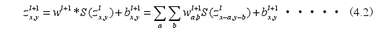
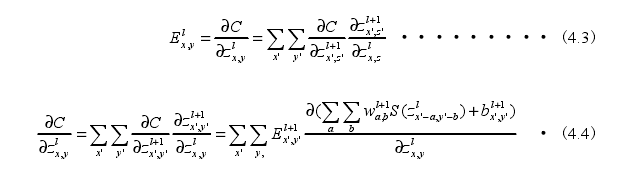
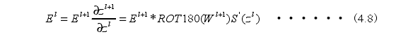
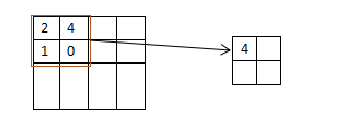

## 深度学习框架scnn
### 深度学习框架研究及其初步实现

 深度神经网络作为机器学习的一个热门分支，在计算机视觉，智能搜索，无人驾驶，模式识别等领域取得了令人瞩目的成就，并将在未来随着深度学习的广泛应用而继续快速发展。近年来，随着深度学习模型的结构变得越来越复杂，普通的编程方法已无法满足要求。开发人员花费大量时间以朴素的编程方法来实现底层算法，这是不必要的研究时间。许多公司和研究机构都希望更快，更有效地开发深度学习，因此已经建立了许多深度学习框架，例如Caffe，Tensor Flow和Torch。这些深度学习框架不仅可以自动完成繁琐的符号操作并通过GPU加速基础操作，而且还提供了更高粒度的模块，甚至可以直接使用的模型。它为研究人员和行业提供了一种方便，高效的发展模式。许多深度学习框架提供了通用的深度学习模型，开发人员可以直接修改或研究现有的神经网络模型。

### scnn的总体设计思想
作为一个神经网络框架scnn包含了四个核心功能：

1.统一的数据类型matrix。scnn框架的基本数据结构是matrix。神经网络中的每一层使用且只使用martix型数据来保存、输入、输出数据。一个matrix至少会存储网络中正向传播所需要的Data和Error信息。

2.基于matrix的各种层（layer).layer是构建神经网络和进行各种计算的基本单元。

3.由一系列layer顺序连接而成的net，即计算图，描述整个神经网络模型。

4. GPU并行加速模型
### 基本数据类型matrix
所有深度学习框架都以张量作为基本数据类型。

matrix是框架中保存和传递实际数据的数据封装包，有读入数据和提取数据的功能。matrix提供统一的内存接口来存储数据。在神经网络中有两类重要的数据，正向传播中的Data和反向传播中Error。也就是说每一个matrix中至少会保存两块数据，即数据和梯度。Data是在网络正向传播中使用的数据，Error是在反向传播中使用的梯度。这两个数据都是以二维数组的形式保存的。有时候，matrix还会存储featuremap的相关数据。

如果layer中的计算有GPU版本，matrix也提供将数据同步至GPU的方法toGPU().对于不同的Layer，toGPU()传输的数据会有所不同，因为并不是所有的layer都需要特征图的参数。因为目前的CUDA不支持原生的四维数组，所以在GPU端数据和误差使用cudaPitchedPtr和cudaExtent共同定义的三维数组存。
### 基于模板layer的设计
深层次的神经网络是一个以层为基础的模型。它由顺序连接的功能层拼接而成。

scnn通过层到层的方法逐层添加功能来构造网络（net).一个网络以输入层开始一直到损失层自底向上构成一个计算图。

在网络的前向传播阶段，逐个运行一个layer的forward（）方法，每一层都有对应的输出。到网络的损失层与期望值比较算出损失值，开始反向传播。从最后一层开始调用backward()方法直到到达第一层，每一次反向传播都会进行一轮权值的更新。

伪代码为：

For i = 0 to len(layers) do

前向传播

For i = len(layers) - 1 to 0 do

反向传播

Layer是scnn的主要构成和调用各种计算的基础单元。框架中的layer分两种，一种与神经网络中“层”的意义形同的layer，另一种是进行内积，激活函数和矩阵转置等运算的功能性layer.

一个layer至少有一个输入matrix和一个输出matrix，大多数layer都带有权值和偏置项。层类型的layer有两大类运算：正向传播和反向传播。其中正向传播的算法是对martix执行某种运算产生一个输出，以matrix的形式传给下一层。
### convolLayer的设计与实现
卷积神经网络中卷积层的功能与相关操作由convoLayer类实现。由构造函数初始化。一个convoLayer的实例的输入和输出都是一个matrix.其中learningRate是学利率，bias是偏移量，weight是保存权值的矩阵，gradient是保存梯度的矩阵，convolLayer的部分类图

（1） 卷积层的前向传播：

forward()方法调用了convolLayer类中与前向传播有关的方法，返回值是卷积层的输出matrix。

设z^1的是输1层的输出，z^(1-1)是1层的输入，S（）是Sigmoid激活函数，W是卷积核，“*”表示卷积运算，b表示偏移量。

根据公式可以得到整个卷积层的输出：

卷积层的反向传播：

Backword()方法用来计算卷积层的误差并反向传播。
首先由getError()获得1层的误差E^1,其中：

最终得到梯度为：

在反向传播中，对权值更新为：

### poolinglayer的设计与实现
meanPooling()方法完成了池化层中唯一的运算：将matrix中的数据矩阵做平均化转换，
池化层是在一些旧有的卷积神经网络中喜欢设计的一层处理层。池化层的作用实际上对Feature Map所做的数据处理又进行了一次所谓的池化处理，再一次减少了参数数量。

常见的池化层处理有两种方式：一种叫MaxPooling,一种叫Mean Pooling，一个做了最大化，一个做了平均化，除此之外还有ChunkMax Pooling,Stochastic Pooling等其他一些池化手段。如下图所示

### NET的设计和实现
NET是由一系列layer实例组成的完整的神经网络模型。

一个NET开始于输入层，在损失层结束，一个网络NET是由一系列按次序排列而成，在一个NET中既包括layer对象，又包括matrix对象，其中matrix对象用于存放每个layer输入/输出中间结果，layer则根据NET描述指定的输入matrix进行某些计算处理.输出结果放到指定的输出matrix中。
### 神经网络模型的并行优化
scnn中以CPU执行的layer块都以串行方式实现的，经测试在神经网络模型的参数较多的情况下模型的训练十分缓慢，而且硬件的利用率也比较低，所以scnn也对部分运算和layer进行了并行化，并可在GPU端运行。
### 总结
卷积神经网络框架scnn的总体设计四星是为了降低深度学习入门的门槛，使用户可以像搭积木一样组装出一个神经网络。因此scnn包含了四大主要的模块，matrix是保存张量的基础数据类型，layer是组成神经网络的基本功能组件，以及由多个layer组成的完整网络net、加速网络的训练速度设计的GPU并行模块。
