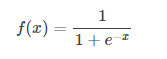

# 第一次作业
本次课学习了神经网络的基本工作原理，并在学习神经网络中知道了一些用到的基本数学导数公式，然后还学习到了线性和非线性传播。
## 一.神经网络
### 基本概念
人工神经网络（Artificial Neural Networks，简写为ANNs）也简称为神经网络（NNs）或称作连接模型（Connection Model），它是一种模仿动物神经网络行为特征，进行分布式并行信息处理的算法数学模型。这种网络依靠系统的复杂程度，通过调整内部大量节点之间相互连接的关系，从而达到处理信息的目的。是一种应用类似于大脑神经突触联接的结构进行信息处理的数学模型。
### 基本工作原理
#### 神经网络模型
所谓神经网络就是将许多个单一“神经元”联结在一起，这样，一个“神经元”的输出就可以是另一个“神经元”的输入。例如，下图就是一个简单的神经网络：

我们使用圆圈来表示神经网络的输入，标上“+1”的圆圈被称为偏置节点，也就是截距项。神经网络最左边的一层叫做输入层，最右的一层叫做输出层（本例中，输出层只有一个节点）。中间所有节点组成的一层叫做隐藏层，因为我们不能在训练样本集中观测到它们的值。同时可以看到，以上神经网络的例子中有3个输入单元（偏置单元不计在内），3个隐藏单元及一个输出单元。
## 二.反向传播
链式法则：若函数 u=ψ(t)，v=ϕ(t)在点t可导，z=f(u,v),有
$$\frac{\partial{z}}{\partial{t}}=\frac{\partial{z}}{\partial{u}} \cdot \frac{\partial{u}}{\partial{t}}+\frac{\partial{z}}{\partial{v}} \cdot \frac{\partial{v}}{\partial{t}}$$

Sigmoid 函数：

其导数

## 总结
本次课程让我学习到了很多知识，在开始课程之前也有了解过深度学习还有神经网络的基本知识，不过经过老师的讲解，我更深刻的知道了其中的内涵和之前没学到的知识。在学习其中，我知道了一个神经元可以有多个输入一个神经元只能有一个输出，这个输出可以同时输入给多个神经元等神经网络的基本概念，还清楚了它的工作原理，在工作原理中可以看出运用了大量的数学基本求导公式，虽然看起来很复杂，但只要弄懂，就不是很难。经过这次的初次学习，让我对神经网络有了深刻的印象，并对以后的学习充满期待。

   