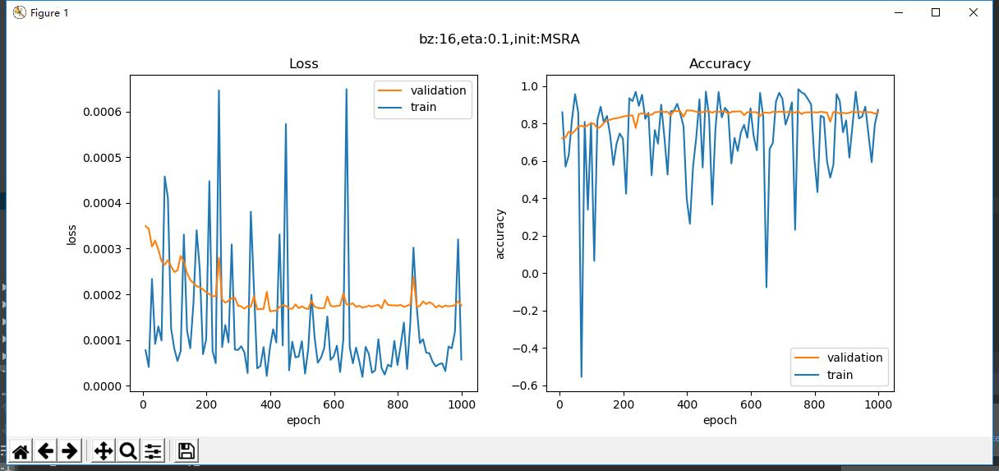
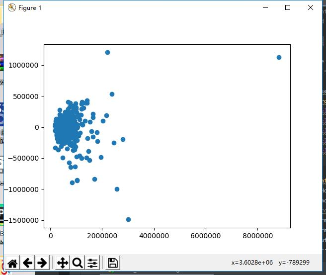
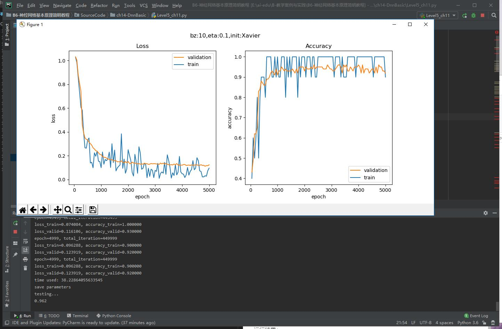
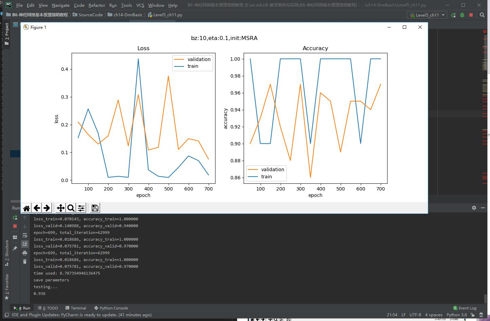

## 第六天学习

### 深度神经网络

#### 搭建深度神经网络框架


### 14.0.2 抽象与设计


#### NeuralNet

我们首先需要一个NeuralNet类，来包装基本的神经网络结构和功能：

- Layers - 神经网络各层的容器，按添加顺序维护一个列表
- Parameters - 基本参数，包括普通参数和超参
- Loss Function - 提供计算损失函数值，存储历史记录并最后绘图的功能
- LayerManagement() - 添加神经网络层
- ForwardCalculation() - 调用各层的前向计算方法
- BackPropagation() - 调用各层的反向传播方法
- PreUpdateWeights() - 预更新各层的权重参数
- UpdateWeights() - 更新各层的权重参数
- Train() - 训练
- SaveWeights() - 保存各层的权重参数
- LoadWeights() - 加载各层的权重参数

#### Layer

是一个抽象类，以及更加需要增加的实际类，包括：
- Fully Connected Layer
- Classification Layer
- Activator Layer
- Dropout Layer
- Batch Norm Layer

将来还会包括：
- Convolution Layer
- Max Pool Layer

每个Layer都包括以下基本方法：
 - ForwardCalculation() - 调用本层的前向计算方法
 - BackPropagation() - 调用本层的反向传播方法
 - PreUpdateWeights() - 预更新本层的权重参数
 - UpdateWeights() - 更新本层的权重参数
 - SaveWeights() - 保存本层的权重参数
 - LoadWeights() - 加载本层的权重参数

#### Activator Layer

激活函数和分类函数：

- Identity - 直传函数，即没有激活处理
- Sigmoid
- Tanh
- Relu

#### Classification Layer

分类函数，包括：
- Sigmoid二分类
- Softmax多分类


 #### Parameters

 基本神经网络运行参数：

 - 学习率
 - 最大epoch
 - batch size
 - 损失函数定义
 - 初始化方法
 - 优化器类型
 - 停止条件
 - 正则类型和条件

#### LossFunction

损失函数及帮助方法：

- 均方差函数
- 交叉熵函数二分类
- 交叉熵函数多分类
- 记录损失函数
- 显示损失函数历史记录
- 获得最小函数值时的权重参数

#### Optimizer

优化器：

- SGD
- Momentum
- Nag
- AdaGrad
- AdaDelta
- RMSProp
- Adam

#### WeightsBias

权重矩阵，仅供全连接层使用：

- 初始化 
  - Zero, Normal, MSRA (HE), Xavier
  - 保存初始化值
  - 加载初始化值
- Pre_Update - 预更新
- Update - 更新
- Save - 保存训练结果值
- Load - 加载训练结果值

#### DataReader

样本数据读取器：

- ReadData - 从文件中读取数据
- NormalizeX - 归一化样本值
- NormalizeY - 归一化标签值
- GetBatchSamples - 获得批数据
- ToOneHot - 标签值变成OneHot编码用于多分类
- ToZeorOne - 标签值变成0/1编码用于二分类
- Shuffle - 打乱样本顺序

从中派生出两个数据读取器：
- MnistImageDataReader - 读取MNIST数据
- CifarImageReader - 读取Cifar10数据

### 回归任务功能测试

训练结果

损失函数值在一段平缓期过后，开始陡降，这种现象在神经网络的训练中是常见的，最有可能的是当时处于一个梯度变化的平缓地带，算法在艰难地寻找下坡路，然后忽然就找到了。这种情况同时也带来一个弊端：我们会经常遇到缓坡，到底要不要还继续训练？是不是再坚持一会儿就能找到出路呢？抑或是模型能力不够，永远找不到出路呢？这个问题没有准确答案，只能靠试验和经验了。

上图左边是拟合的情况，绿色点是测试集数据，红色点是神经网路的推理结果，可以看到除了最左侧开始的部分，其它部分都拟合的不错。注意，这里我们不是在讨论过拟合、欠拟合的问题，我们在这个章节的目的就是更好地拟合一条曲线。

上图右侧是用这个代码生成的：
```Python
    y_test_real = net.inference(dr.XTest)
    axes.scatter(y_test_real, y_test_real-dr.YTestRaw, marker='o')
```

以测试集的真实值为横坐标，以真实值和预测值的差为纵坐标。最理想的情况是所有点都在y=0处排成一条横线。从图上看，真实值和预测值二者的差异明显，但是请注意横坐标和纵坐标的间距相差一个数量级，所以差距其实不大。

### 反向传播四大公式
著名的反向传播四大公式是：

  $$\delta^{L} = \nabla_{a}C \odot \sigma_{'}(Z^L) \tag{80}$$
  $$\delta^{l} = ((W^{l + 1})^T\delta^{l+1})\odot\sigma_{'}(Z^l) \tag{81}$$
  $$\frac{\partial{C}}{\partial{b_j^l}} = \delta_j^l \tag{82}$$
  $$\frac{\partial{C}}{\partial{w_{jk}^{l}}} = a_k^{l-1}\delta_j^l \tag{83}$$


  ### 回归任务真实案例

  根据github上给的代码，通过pycharm运行可得到如下结果



由于标签数据也做了归一化，变换为都是0至1间的小数，所以均方差的数值很小，需要观察小数点以后的第4位。从上图中可以看到，损失函数值很快就降到了0.0002以下，然后就很缓慢地下降。而精度值在不断的上升，相信更多的迭代次数会带来更高的精度。

再看下面的打印输出部分，用R2_Score法得到的值为0.841，而用数据城堡官方的评测标准，得到的MSE值为2384411，还比较大，说明模型精度还应该有上升的空间。

```
......
epoch=999, total_iteration=972999
loss_train=0.000079, accuracy_train=0.740406
loss_valid=0.000193, accuracy_valid=0.857289
time used: 193.5549156665802
testing...
0.8412989144927305
mse= 2384411.5840510926
```

 ### 二分类试验 - 双弧形非线性二分类

超参数说明：
1. 输入层神经元数为2
2. 隐层的神经元数为3，使用Sigmoid激活函数
3. 由于是二分类任务，所以输出层只有一个神经元，用Logistic做二分类函数
4. 最多训练1000轮
5. 批大小=5
6. 学习率=0.1
7. 绝对误差停止条件=0.02


###  二分类任务 - 居民收入

运行结果：


### 多分类功能测试 - “铜钱孔分类”问题
运行结果：





### 多分类任务 - MNIST手写体识别
运行结果：


## 总结
通过上个星期基础知识的学习，这个星期开始正式的神经网络的学习，主要是跑了跑代码，对这门课有了更多的了解。