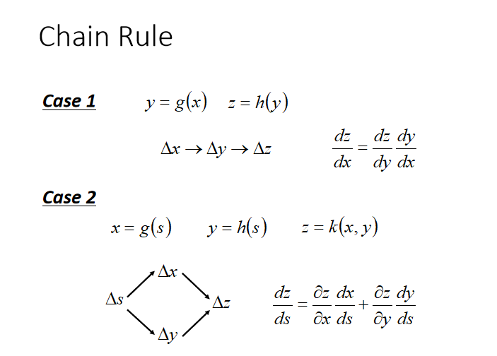

# **反向传播与梯度下降**
>## 梯度下降 

类比想象一个形象一点的过程：一个被随机放在群山中的登山者，在一个看不见前路的黑夜，在对地形一无所知的情况下，如何最快速的从所在位置找到其能找到的最低点呢？

答案是，从所在位置朝下降坡度最大的方向迈步，每迈出一步，判断一下当前位置下降坡度最大的方向，并迈出下一步，直至到达不存在下降坡度的地方。
   
回到当前的问题，这里的群山就是损失函数，登山者就是模型中的参数，随机放入山中指的是，参数初始为随机值。
  
找到最低点就是找到最小的损失函数，而登山者的迈步就是不断修改参数值。

  
梯度下降的数学公式：

$$\theta_{n+1} = \theta_{n} - \eta \cdot \nabla J(\theta) $$

其中：
- $\theta_{n+1}$：下一个值
- $\theta_n$：当前值
- $-$：梯度的反向
- $\eta$：学习率或步长，控制每一步走的距离，不要太快以免错过了最佳景点，不要太慢以免时间太长
- $\nabla$：梯度，函数当前位置的最快上升点
- $J(\theta)$：函数
>#### 单变量函数的梯度下降

假设一个单变量函数：

$$J(x) = x ^2$$

我们的目的是找到该函数的最小值，于是计算其微分：

$$J'(x) = 2x$$

假设初始位置为：

$$x_0=1.2$$

假设学习率：

$$\eta = 0.3$$

根据公式(1)，迭代公式：

$$x_{n+1} = x_{n} - \eta \cdot \nabla J(x)= x_{n} - \eta \cdot 2x\tag{1}$$

假设终止条件为J(x)<1e-2，迭代过程是：
```
x=0.480000, y=0.230400
x=0.192000, y=0.036864
x=0.076800, y=0.005898
x=0.030720, y=0.000944
```

>#### 学习率η的选择
||学习率 大|学习率 小|
|---|---|-|
|学习速度|快|慢|
|使用时间点|刚开始训练时|一定轮数过后|
|副作用|1.易损失值爆炸；2.易振荡。|1.易过拟合；2.收敛速度慢。|

1. 曲线 初始时 上扬 <font color=red>[红线]</font>： Solution：初始 学习率过大 导致 振荡，应减小学习率，并 从头 开始训练 。
 2. 曲线 初始时 强势下降 没多久 归于水平 <font color=rpuple>[紫线]</font>：  Solution：后期 学习率过大 导致 无法拟合，应减小学习率，并 重新训练 后几轮 。
3. 曲线 全程缓慢 <font color=yellow>[黄线]</font>：  Solution：初始 学习率过小 导致 收敛慢，应增大学习率，并从头 开始训练。

>## 反向传播

   
以简单的神经网络为例
   
同样要求得该模型损失函数最小时的参数值，由于神经网络模型中有多个输出，需要将各自输出求和作为总的损失函数。

>### 线性反向传播---正向计算的实例

假设我们有一个函数：

$$z = x \cdot y \tag{1}$$

其中:

$$x = 2w + 3b \tag{2}$$

$$y = 2b + 1 \tag{3}$$
  

   
当w = 3, b = 4时，会得到结果:   
最终的z值，受到了前面很多因素的影响：变量w，变量b，计算式x，计算式y。常数是个定值，不考虑。

>### 反向传播求解w

我们从z开始一层一层向回看，图中各节点关于变量w的偏导计算结果如下：

$$因为z = x \cdot y，其中x = 2w + 3b，y = 2b + 1$$

所以：

$$\frac{\partial{z}}{\partial{w}}=\frac{\partial{z}}{\partial{x}} \cdot \frac{\partial{x}}{\partial{w}}=y \cdot 2=18 \tag{4}$$

其中：

$$\frac{\partial{z}}{\partial{x}}=\frac{\partial{}}{\partial{x}}(x \cdot y)=y=9$$

$$\frac{\partial{x}}{\partial{w}}=\frac{\partial{}}{\partial{w}}(2w+3b)=2$$


>### 反向传播求解b

从复合导数公式来看，这两者应该是相加的关系，所以有：

$$\frac{\partial{z}}{\partial{b}}=\frac{\partial{z}}{\partial{x}} \cdot \frac{\partial{x}}{\partial{b}}+\frac{\partial{z}}{\partial{y}}\cdot\frac{\partial{y}}{\partial{b}}=y \cdot 3+x \cdot 2=63 \tag{7}$$

其中：

$$\frac{\partial{z}}{\partial{x}}=\frac{\partial{}}{\partial{x}}(x \cdot y)=y=9$$
$$\frac{\partial{z}}{\partial{y}}=\frac{\partial{}}{\partial{y}}(x \cdot y)=x=18$$
$$\frac{\partial{x}}{\partial{b}}=\frac{\partial{}}{\partial{b}}(2w+3b)=3$$
$$\frac{\partial{y}}{\partial{b}}=\frac{\partial{}}{\partial{b}}(2b+1)=2$$

>##    [代码运行]  

容易出现的问题：
1. 在检查Δz时的值时，注意要用绝对值，因为有可能是个负数
2. 在计算Δb和Δw时，第一次时，它们对z的贡献值分别是1/63和1/18，但是第二次时，由于b和w值的变化，对于z的贡献值也会有微小变化，所以要重新计算。具体解释如下：

$$
\frac{\partial{z}}{\partial{b}}=\frac{\partial{z}}{\partial{x}} \cdot \frac{\partial{x}}{\partial{b}}+\frac{\partial{z}}{\partial{y}}\cdot\frac{\partial{y}}{\partial{b}}=y \cdot 3+x \cdot 2=3y+2x
$$
$$
\frac{\partial{z}}{\partial{w}}=\frac{\partial{z}}{\partial{x}} \cdot \frac{\partial{x}}{\partial{w}}+\frac{\partial{z}}{\partial{y}}\cdot\frac{\partial{y}}{\partial{w}}=y \cdot 2+x \cdot 0 = 2y
$$
所以，在每次迭代中，要重新计算下面两个值：
$$
\Delta b=\frac{\Delta z}{3y+2x}
$$
$$
\Delta w=\frac{\Delta z}{2y}
$$

以下是程序的运行结果。   


我们简单总结一下反向传播与梯度下降的基本工作原理：

1. 初始化
2. 正向计算
3. 损失函数为我们提供了计算损失的方法
4. 梯度下降是在损失函数基础上向着损失最小的点靠近而指引了网络权重调整的方向
5. 反向传播把损失值反向传给神经网络的每一层，让每一层都根据损失值反向调整权重
6. goto 2，直到精度足够好（比如损失函数值小于0.001）

>## 非线性反向传播


$$c=\sqrt{b}=\sqrt{\ln(a)}=\sqrt{\ln(x^2)}=\sqrt{2\ln(x)}=2.13$$
$$2*\ln{x}=2.13^2=4.5369$$
$$\ln{x}=4.5369/2=2.26854$$
$$两侧取e的次方：e^{\ln{x}} = e^{2.26854}$$
$$x = 9.6653$$
>##  [代码运行] 

到第5轮时，正向计算得到的c=2.129，非常接近2.13了，迭代结束。
   
该组合函数图像（蓝色）和导数图像（绿色）：

>## 损失函数

损失函数的作用，就是计算神经网络每次迭代的前向计算结果与真实值的差距，从而指导下一步的训练向正确的方向进行。

如何使用损失函数呢？具体步骤：

1. 用随机值初始化前向计算公式的参数
2. 代入样本，计算输出的预测值
3. 用损失函数计算预测值和标签值（真实值）的误差
4. 根据损失函数的导数，沿梯度最小方向将误差回传，修正前向计算公式中的各个权重值
5. goto 2, 直到损失函数值达到一个满意的值就停止迭代
>#### 损失函数图像理解

**用二维函数图像理解单变量对损失函数的影响**   
   
上图中，纵坐标是损失函数值，横坐标是变量。不断地改变变量的值，会造成损失函数值的上升或下降。而梯度下降算法会让我们沿着损失函数值下降的方向前进。

1. 假设我们的初始位置在A点，X=x0，Loss值（纵坐标）较大，回传给网络做训练
2. 经过一次迭代后，我们移动到了B点，X=x1，Loss值也相应减小，再次回传重新训练
3. 以此节奏不断向损失函数的最低点靠近，经历了x2 x3 x4 x5
4. 直到损失值达到可接受的程度，就停止训练  

**用等高线图理解双变量对损失函数影响**   
     
上图中，横坐标是一个变量w，纵坐标是另一个变量b。两个变量的组合形成的损失函数值，在图中对应处于等高线上的唯一的一个坐标点。所有的不同的值的组合会形成一个损失函数值的矩阵，我们把矩阵中具有相同（相近）损失函数值的点连接起来，可以形成一个不规则椭圆，**其圆心位置，是损失值为0的位置，也是我们要逼近的目标。**

这个椭圆如同平面地图的等高线，来表示的一个洼地，中心位置比边缘位置要低，通过对损失函数的计算，对损失函数的求导，会带领我们沿着等高线形成的梯子一步步下降，无限逼近中心点。
>#### 神经网络中常用的损失函数
- 均方差函数，主要用于回归

- 交叉熵函数，主要用于分类
>## 均方差函数
MSE - Mean Square Error。

该函数就是最直观的一个损失函数了，计算预测值和真实值之间的欧式距离。预测值和真实值越接近，两者的均方差就越小。   

均方差函数常用于线性回归(linear regression)，即函数拟合(function fitting)。
要想得到预测值a与真实值y的差距，最朴素的想法就是用$Error=a_i-y_i$。

对于单个样本来说，这样做没问题，但是多个样本累计时，$a_i-y_i$有可能有正有负，误差求和时就会导致相互抵消，从而失去价值。所以有了绝对值差的想法，即$Error=|a_i-y_i|$。

假设有三个样本的标签值是$y=[1,1,1]$：

| 样本标签值 | 样本预测值 | 绝对值损失函数        | 均方差损失函数              |
| ---------- | ---------- | --------------------- | --------------------------- |
| $[1,1,1]$  | $[1,2,3]$  | $(1-1)+(2-1)+(3-1)=3$ | $(1-1)^2+(2-1)^2+(3-1)^2=5$ |
| $[1,1,1]$  | $[1,3,3]$  | $(1-1)+(3-1)+(3-1)=4$ | $(1-1)^2+(3-1)^2+(3-1)^2=8$ |
|            |            | 4/3=1.33              | 8/5=1.6                     |
>#### [代码运行]

在平面地图中，我们经常会看到用等高线的方式来表示海拔高度值，下图就是上图在平面上的投影，即损失函数值的等高线图。
    
遍历矩阵中的损失函数值，在具有相同值的位置上绘制相同颜色的点，比如，把所有值为0.72的点绘制成红色，把所有值为0.75的点绘制成蓝色......，这样就可以得到下图：
 
>## 交叉熵损失函数

交叉熵可在神经网络中作为损失函数，p表示真实标记的分布，q则为训练后的模型的预测标记分布，交叉熵损失函数可以衡量p与q的相似性。

**交叉熵函数常用于逻辑回归(logistic regression)，也就是分类(classification)。**   
当y=1时，即标签值是1，是个正例：

$$loss = -log(a)$$

横坐标是预测输出，纵坐标是损失函数值。y=1意味着当前样本标签值是1，当预测输出越接近1时，Loss值越小，训练结果越准确。当预测输出越接近0时，Loss值越大，训练结果越糟糕。

当y=0时，即标签值是0，是个反例：
$$loss = -\log (1-a)$$

此时，损失值与预测值的关系是：
