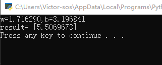
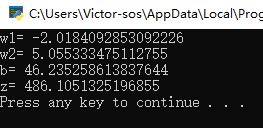

# **线性回归**

>## 单变量线性回归    

### 一元线性回归模型   
回归分析是一种数学模型。当因变量和自变量为线性关系时，它是一种特殊的线性模型。  
     
如上图所示，左侧为线性模型，可以看到直线穿过了一组三角形所形成的区域的中心线，并不要求这条直线穿过每一个三角形。右侧为非线性模型，一条曲线穿过了一组矩形所形成的区域的中心线。就好比是一条街道，可能是直的，也可能有弯曲，街道的两旁是各种建筑。   

接下来逐一介绍解决方法
#### 最小二乘法
**最小二乘法**，也叫做最小平方法（Least Square），它通过最小化误差的平方和寻找数据的最佳函数匹配。利用最小二乘法可以简便地求得未知的数据，并使得这些求得的数据与实际数据之间误差的平方和为最小。**最小二乘法**还可用于曲线拟合。其他一些优化问题也可通过最小化能量或最大化熵用最小二乘法来表达
 
>##### [代码实现]

通过对w和b值的计算函数，找到其最优解   
||
用以上几种方法，最后得出的结果都是一致的，可以起到交叉验证的作用：
```
w1=2.056827, b1=2.965434
w2=2.056827, b2=2.965434
w3=2.056827, b3=2.965434
```

#### 梯度下降法
最小二乘法比较可以看到，梯度下降法和最小二乘法的模型及损失函数是相同的，都是一个线性模型加均方差损失函数，模型用于拟合，损失函数用于评估效果。
#### 计算w的梯度

我们用loss的值作为误差衡量标准，通过求w对它的影响，也就是loss对w的偏导数，来得到w的梯度。由于loss是通过公式2->公式1间接地联系到w的，所以我们使用链式求导法则，通过单个样本来求导。

根据公式1和公式3：

$$
{\partial{loss} \over \partial{w}} = \frac{\partial{loss}}{\partial{z_i}}\frac{\partial{z_i}}{\partial{w}}=(z_i-y_i)x_i \tag{4}
$$

#### 计算b的梯度

$$
\frac{\partial{loss}}{\partial{b}} = \frac{\partial{loss}}{\partial{z_i}}\frac{\partial{z_i}}{\partial{b}}=z_i-y_i \tag{5}
$$

区别在于，最小二乘法从损失函数求导，直接求得数学解析解，而梯度下降以及后面的神经网络，都是利用导数传递误差，再通过迭代方式一步一步逼近近似解。
>##### [代码实现]

 
```
w= [1.71629006]
b= [3.19684087]
```
>#### 神经网络法


#### 定义类

```Python
class NeuralNet(object):
    def __init__(self, eta):
        self.eta = eta
        self.w = 0
        self.b = 0
```
NeuralNet类从object类派生，并具有初始化函数，其参数是eta，也就是学习率，需要调用者指定。另外两个成员变量是w和b，初始化为0。

#### 前向计算
```Python
    def __forward(self, x):
        z = x * self.w + self.b
        return z
```
这是一个私有方法，所以前面有两个下划线，只在NeuralNet类中被调用，不对外公开。

#### 反向传播

下面的代码是通过梯度下降法中的公式推导而得的，也设计成私有方法：

```Python
    def __backward(self, x,y,z):
        dz = z - y
        db = dz
        dw = x * dz
        return dw, db
```
dz是中间变量，避免重复计算。dz又可以写成delta_Z，是当前层神经网络的反向误差输入。

#### 梯度更新

```Python
    def __update(self, dw, db):
        self.w = self.w - self.eta * dw
        self.b = self.b - self.eta * db
```
每次更新好新的w和b的值以后，直接存储在成员变量中，方便下次迭代时直接使用，不需要在全局范围当作参数内传来传去的

在上面的函数中，先获得所有样本点数据，把它们绘制出来。然后在[0,1]之间等距设定10个点做为x值，用x值通过网络推理方法net.inference()获得每个点的y值，最后把这些点连起来，就可以画出下图中的拟合直线：

  

可以看到红色直线虽然穿过了蓝色点阵，但是好像不是处于正中央的位置，应该再逆时针旋转几度才会达到最佳的位置。我们后面小节中会讲到如何提高训练结果的精度问题。
>#### 多样本单特征值计算

**前向计算**
```Python
    def __forwardBatch(self, batch_x):
        Z = np.dot(batch_x, self.w) + self.b
        return Z
```
Python中的矩阵乘法命名有些问题，np.dot()并不是矩阵点乘，而是矩阵叉乘，请读者习惯。  

**损失函数**
```Python
    def __checkLoss(self, dataReader):
        X,Y = dataReader.GetWholeTrainSamples()
        m = X.shape[0]
        Z = self.__forwardBatch(X)
        LOSS = (Z - Y)**2
        loss = LOSS.sum()/m/2
        return loss
```
Python中的矩阵减法运算，不需要对矩阵中的每个对应的元素单独做减法，而是整个矩阵相减即可。做求和运算时，也不需要自己写代码做遍历每个元素，而是简单地调用求和函数即可。
#### 单样本随机梯度下降
SDG(Stochastic Grident Descent):   
就是Batch Size=1，每次计算一个样本，梯度不准确，所以学习率要降低。
 
|损失函数值|梯度下降过程|
|---|---|
|||
左图，由于我们使用了限定的停止条件，即当loss值小于等于0.02时停止训练，所以，单样本方式迭代了300次后达到了精度要求。

右图是w和b共同构成的损失函数等高线图。梯度下降时，开始收敛较快，稍微有些弯曲地向中央地带靠近。到后期波动较大，找不到准确的前进方向，曲折地达到中心附近。

>## 实现逻辑非门

**单层神经网络**，又叫做**感知机**，它可以轻松实现逻辑与、或、非门。由于逻辑与、或门，需要有两个变量输入，目前我们只学习了单变量输入，所以，我们可以先实现非门。


## 多入单出的单层神经网络

>### 多变量线性回归问题
对于一般的应用问题，建立多元线性回归模型时，为了保证回归模型具有优良的解释能力和预测效果，应首先注意自变量的选择，其准则是：

1. 自变量对因变量必须有显著的影响，并呈密切的线性相关；
2. 自变量与因变量之间的线性相关必须是真实的，而不是形式上的；
3. 自变量之间应具有一定的互斥性，即自变量之间的相关程度不应高于自变量与因变量之因的相关程度；
4. 自变量应具有完整的统计数据，其预测值容易确定   

**解决方案**

| 方法       | 正规方程           | 梯度下降       |
| ---------- | ------------------ | -------------- |
| 原理       | 几次矩阵运算       | 多次迭代       |
| 特殊要求   | $X^TX$的逆矩阵存在 | 需要确定学习率 |
| 复杂度     | $O(n^3)$           | $O(n^2)$       |
| 适用样本数 | $m \lt 10000$      | $m \ge 10000$  |

### 正规方程解法
在做函数拟合（回归）时，我们假设函数H为：

$$h(w,b) = b + x_1 w_1+x_2 w_2+...+x_n w_n \tag{2}$$

令$b=w_0$，则：

$$h(w) = w_0 + x_1 \cdot w_1 + x_2 \cdot w_2+...+ x_n \cdot w_n\tag{3}$$

公式3中的x是一个样本的n个特征值，如果我们把m个样本一起计算，将会得到下面这个矩阵：

$$H(w) = X \cdot W \tag{4}$$

公式5中的X和W的矩阵形状如下：

$$
X^{(m \times (n+1))} = 
\begin{pmatrix} 
1 & x_{1,1} & x_{1,2} & \dots & x_{1,n} \\
1 & x_{2,1} & x_{2,2} & \dots & x_{2,n} \\
\dots \\
1 & x_{m,1} & x_{m,2} & \dots & x_{m,n}
\end{pmatrix} \tag{5}
$$

$$
W^{(n+1)}= \begin{pmatrix}
w_0 \\
w_1 \\
\dots \\
 w_n
\end{pmatrix}  \tag{6}
$$

然后我们期望假设函数的输出与真实值一致，则有：

$$H(w) = X \cdot W = Y \tag{7}$$

其中，Y的形状如下：

$$
Y^{(m)}= \begin{pmatrix}
y_1 \\
y_2 \\
\dots \\
y_m
\end{pmatrix}  \tag{8}
$$


直观上看，W = Y/X，但是这里三个值都是矩阵，而矩阵没有除法，所以需要得到X的逆矩阵，用Y乘以X的逆矩阵即可。但是又会遇到一个问题，只有方阵才有逆矩阵，而X不一定是方阵，所以要先把左侧变成方阵，就可能会有逆矩阵存在了。所以，先把等式两边同时乘以X的转置矩阵，以便得到X的方阵：

$$X^T X W = X^T Y \tag{9}$$

其中，$X^T$是X的转置矩阵，$X^T X$一定是个方阵，并且假设其存在逆矩阵，把它移到等式右侧来：

$$W = (X^T X)^{-1}{X^T Y} \tag{10}$$

至此可以求出W的正规方程

>**[代码运行]**


   
我们得到了两个权重值和一个偏移值，然后得到房价预测值z=486万元。

### 神经网络解法
#### 输入层

单独看第一个样本是这样的：

$$
x_1 =
\begin{pmatrix}
x_{11} & x_{12}
\end{pmatrix} = 
\begin{pmatrix}
10.06 & 60
\end{pmatrix} 
$$

$$
y_1 = \begin{pmatrix} 302.86 \end{pmatrix}
$$

一共有1000个样本，每个样本2个特征值，X就是一个$1000 \times 2$的矩阵：

$$
X = 
\begin{pmatrix} 
x_1 \\ x_2 \\ \dots \\ x_{1000}
\end{pmatrix} =
\begin{pmatrix} 
x_{1,1} & x_{1,2} \\
x_{2,1} & x_{2,2} \\
\dots & \dots \\
x_{1000,1} & x_{1000,2}
\end{pmatrix}
$$

$$
Y =
\begin{pmatrix}
y_1 \\ y_2 \\ \dots \\ y_{1000}
\end{pmatrix}=
\begin{pmatrix}
302.86 \\ 393.04 \\ \dots \\ 450.59
\end{pmatrix}
$$


$x1$表示第一个样本，$x_{1,1}$表示第一个样本的一个特征值，$y1$是第一个样本的标签值。

#### 权重W和B

由于输入层是两个特征，输出层是一个变量，所以w的形状是2x1，而b的形状是1x1。

$$
W=
\begin{pmatrix}
w_1 \\ w_2
\end{pmatrix}
$$

$$B=(b)$$

B是个单值，因为输出层只有一个神经元，所以只有一个bias，每个神经元对应一个bias，如果有多个神经元，它们都会有各自的b值。

#### 输出层

由于我们只想完成一个回归（拟合）任务，所以输出层只有一个神经元。由于是线性的，所以没有用激活函数。
$$
z=
\begin{pmatrix}
  x_1 & x_2
\end{pmatrix}
\begin{pmatrix}
  w_1 \\ w_2
\end{pmatrix}
+(b)
=x_1w_1+x_2w_2+b
$$

写成矩阵形式：

$$Z^{(1 \times 1)} = X^{(1 \times 2)} \cdot W^{(2 \times 1)} + B^{(1 \times 1)}$$

上述公式中括号中的数字表示该矩阵的（行x列）数。

对于拟合，可以想象成用一支笔在一堆点中画一条直线或者曲线，而那一个神经元就是这支笔。如果有多个神经元，可以画出多条线来，就不是拟合了，而是分类。

#### 损失函数

因为是线性回归问题，所以损失函数使用均方差函数。

$$loss(w,b) = \frac{1}{2} (z_i-y_i)^2 \tag{1}$$

其中，$z_i$是样本预测值，$y_i$是样本的标签值。
>**[代码实现]**

**正向计算的代码**
  
nan的意思是数值异常，导致计算溢出了


## 样本特征数据归一化
**为什么要归一化**
介于W和B值都很大，到时计算结果为nan，所有的X值（服务器数量除以1000后的值）都是在[0,1]之间的，而本章中的房价数据有两个特征值，一个是公里数，一个是平米数，全都是不是在[0,1]之间的，并且取值范围还不相同。我们不妨把本次样本数据也做一下这样的处理，亦即“归一化”。
>**归一化的基本概念**
1. Min-Max归一化：
   $$x_{new}={x-x_{min} \over x_{max} - x_{min}} \tag{1}$$

2. 平均值归一化

$$x_{new} = {x - \bar{x} \over x_{max} - x_{min}} \tag{2}$$

3. 非线性归一化

对数转换：
$$y=log(x) \tag{3}$$

反余切转换：
$$y=atan(x) \cdot 2/π  \tag{4}$$
|||


