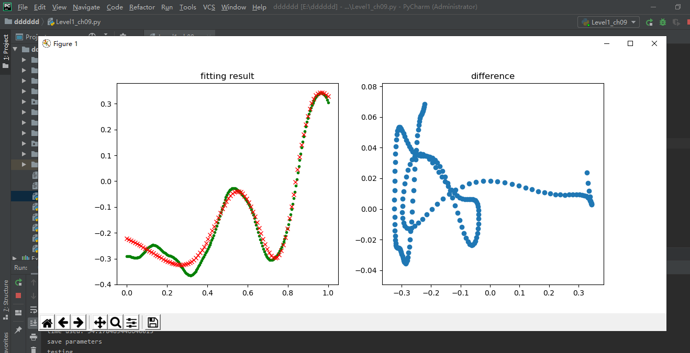
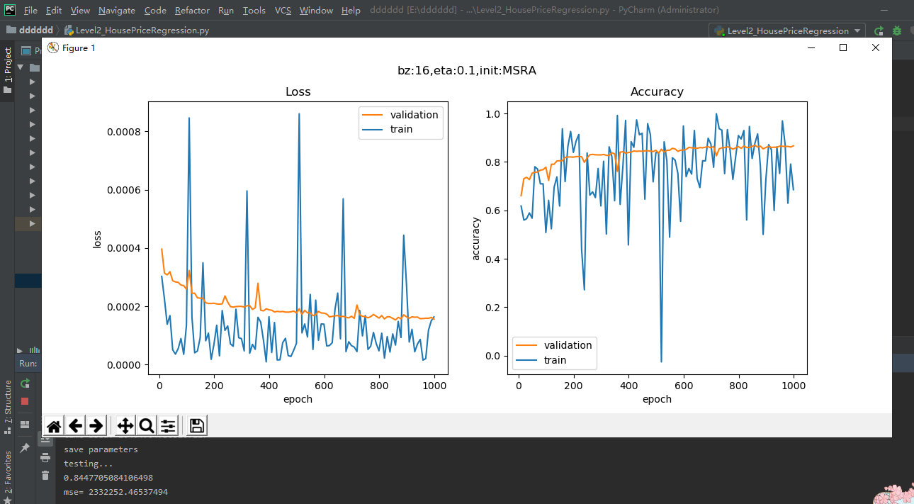
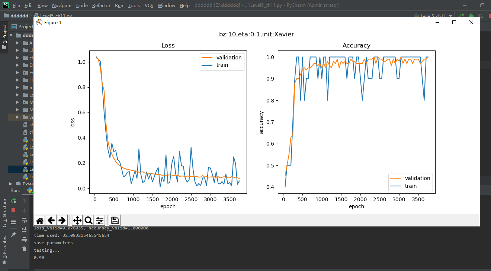
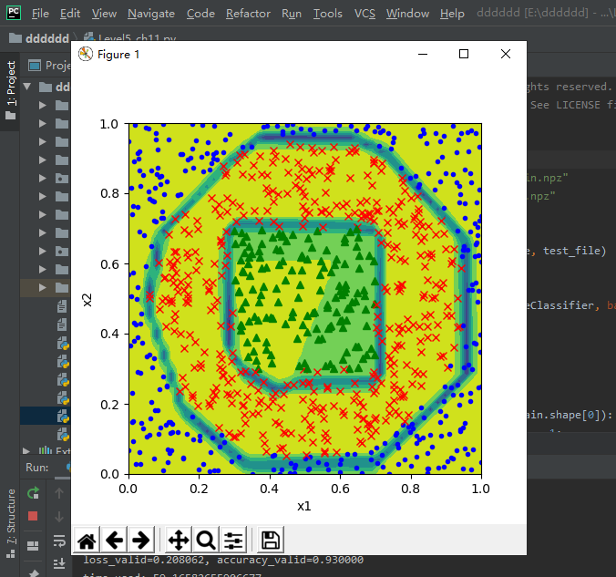

## 0302的每日总结
### 深度神经网络
#### 搭建深度神经网络框架
1. NeuralNet
+ 首先需要一个NeuralNet类，来包装基本的神经网络结构和功能：
  + Layers - 神经网络各层的容器，按添加顺序维护一个列表
  + Parameters - 基本参数，包括普通参数和超参
  + Loss Function - 提供计算损失函数值，存储历史记录并最后绘图的功能
  + LayerManagement() - 添加神经网络层
  + ForwardCalculation() - 调用各层的前向计算方法
  + BackPropagation() - 调用各层的反向传播方法
  + PreUpdateWeights() - 预更新各层的权重参数
  + UpdateWeights() - 更新各层的权重参数
  + Train() - 训练
  + SaveWeights() - 保存各层的权重参数
  + LoadWeights() - 加载各层的权重参数
2. Layer
是一个抽象类，以及更加需要增加的实际类，包括：
  + Fully Connected Layer
  + Classification Layer
  + Activator Layer
  + Dropout Layer
  + Batch Norm Layer
+ 将来还会包括：
  + Convolution Layer
  + Max Pool Layer
 + 每个Layer都包括以下基本方法：
  + ForwardCalculation() - 调用本层的前向计算方法
  + BackPropagation() - 调用本层的反向传播方法
  + PreUpdateWeights() - 预更新本层的权重参数
  + UpdateWeights() - 更新本层的权重参数
  + SaveWeights() - 保存本层的权重参数
  + LoadWeights() - 加载本层的权重参数
3. Activator Layer：激活函数和分类函数
    + Identity：直传函数，即没有激活处理
    + Sigmoid：S型函数，也成S型生长曲线。由于其单增以及反函数单增等性质，在信息科学中，Sigmoid函数常被用作神经网络的阈值函数。
    + Tanh:双曲函数中的一个，tanh()双曲正切。
    + Relu：线性整流函数，又称修正线性单元。
4. Classification Layer：分类函数
    + Sigmoid二分类
    + Softmax多分类
5. Parameters：基本神经网络运行参数：
    + 学习率
    + 最大epoch
    + batch size
    + 损失函数定义
    + 初始化方法
    + 优化器类型
    + 停止条件
    + 正则类型和条件
6. LossFunction：损失函数及帮助方法（之前有学过）
    + 均方差函数
    + 交叉熵函数二分类
    + 交叉熵函数多分类
    + 记录损失函数
    + 显示损失函数历史记录
    + 获得最小函数值时的权重参数
7. Optimizer：优化器
    + SGD：随机梯度下降。以单个样本为训练单元训练速度会很快，但牺牲了向量化运算所带来的便利性，在较大数据集上效率并不高。
    + Momentum：带动量的梯度下降。带动量的梯度下降考虑历史梯度的加权平均值作为速率进行优化。
    + Nag:
    + AdaGrad
    + AdaDelta
    + RMSProp
    + Adam:是在带动量的梯度下降法的基础上融合了一种称为 RMSprop（加速梯度下降）的算法而成的。
8. WeightsBias:权重矩阵，仅供全连接层使用
   + 初始化：
        + Zero, Normal, MSRA (HE), Xavier
        + 保存初始化值
        + 加载初始化值
    + Pre_Update：预更新
    + Update：更新
    + Save：保存训练结果值
    + Load：加载训练结果值
9.  DataReader 样本数据读取器
    + ReadData：从文件中读取数据
    + NormalizeX：归一化样本值
    + NormalizeY：归一化标签值
    + GetBatchSamples：获得批数据
    + ToOneHot：标签值变成OneHot编码用于多分类
    + ToZeorOne：标签值变成0/1编码用于二分类
    + Shuffle：打乱样本顺序
    + MnistImageDataReader：读取MNIST数据
    + CifarImageReader：读取Cifar10数据
#### 回归测试
+ 运行结果：

##### 房价预测
+ 运行结果：

#### 二分类测试
+ 运行结果：

##### 居民收入
+ 运行结果：

#### 多分类功能测试 - “铜钱孔分类”问题
+ 搭建模型
    + 模型一：
        + 模型：使用Sigmoid做为激活函数的两层网络
    + 模型二：
        + 模型：使用Relu做为激活函数的三层网络
+ 运行结果：

#### 多分类任务 - MNIST手写体识别
+ 运行结果：

### 心得体会
今天学习的是深度学习网络，首先，学习了如何搭建深度神经网络框架，然后在深度学习网络框架上，进行了回归测试，房价预测，二分类测试，居民收入等实验。通过实验，加深了对深度学习网络的认识。
