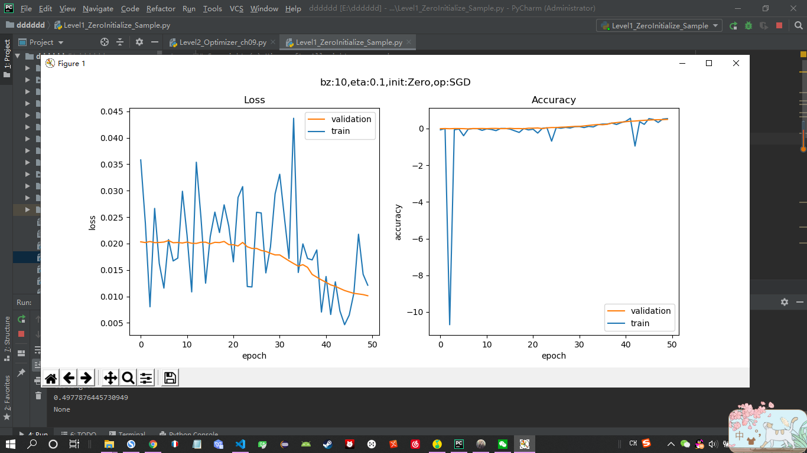
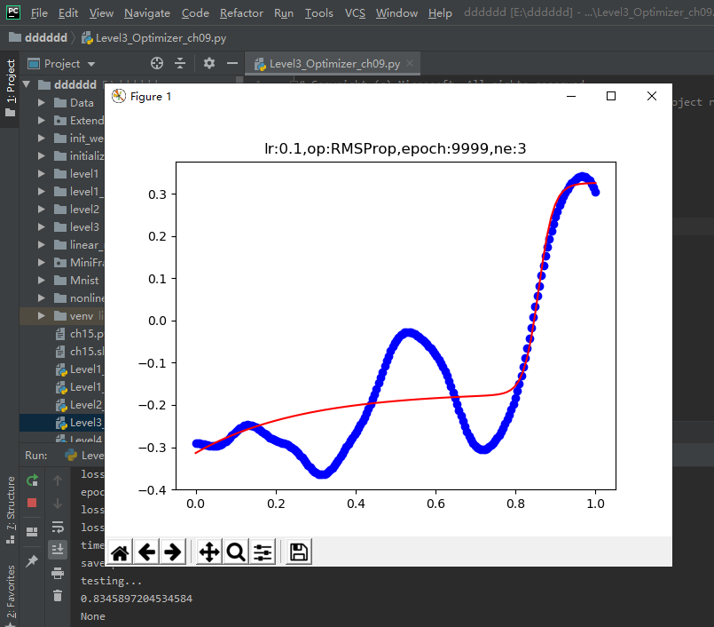
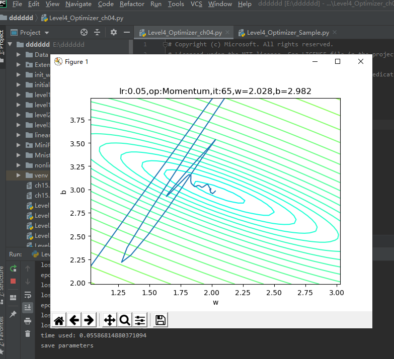

## 0303的每日总结
### 网络优化
#### 权重矩阵初始化
+ 零初始化：
    + 把所有层的W值的初始值都设置为0（$$ W = 0 $$）
    + 但是对于多层网络来说，绝对不能用零初始化，否则权重值不能学习到合理的结果
+ 随机初始化：
    +  把W初始化均值为0，方差为1的矩阵：
        +  $$ W \sim G \begin{bmatrix} 0, 1 \end{bmatrix} $$
+ Xavier初始化方法：
    +  条件：
       + 正向传播时，激活值的方差保持不变；反向传播时，关于状态值的梯度的方差保持不变。
       + $$ W \sim U \begin{bmatrix} -\sqrt{{6 \over n_{input} + n_{output}}}, \sqrt{{6 \over n_{input} + n_{output}}} \end{bmatrix} $$
+ MSRA初始化方法：又叫做He方法
    +  条件：正向传播时，状态值的方差保持不变；反向传播时，关于激活值的梯度的方差保持不变
+ 运行结果：

#### 梯度下降优化算法
+ 随机梯度下降 SGD：
    + 输入和参数：$\eta$ - 全局学习率
    + 算法
        + 计算梯度：$g_t = \nabla_\theta J(\theta_{t-1})$
        + 更新参数：$\theta_t = \theta_{t-1} - \eta \cdot g_t$
+ 动量算法Momentum：
    + 输入参数：
        + $\eta$ - 全局学习率
        + $\alpha$ - 动量参数，一般取值为0.5, 0.9, 0.99
        + $v_t$ - 当前时刻的动量，初值为0
    + 算法：
        + 计算梯度：$g_t = \nabla_\theta J(\theta_{t-1})$
        + 计算速度更新：$v_t = \alpha \cdot v_{t-1} + \eta \cdot g_t$ (公式1)
        + 更新参数：$\theta_t = \theta_{t-1} - v_t$ (公式2)
+ 梯度加速算法NAG：
+ 输入参数：
    + $\eta$ - 全局学习率
    + $\alpha$ - 动量参数，缺省取值0.9
    + v - 动量，初始值为0
+ 算法：
    + 临时更新：$\hat \theta = \theta_{t-1} - \alpha \cdot v_{t-1}$
    + 前向计算：$f(\hat \theta)$
    + 计算梯度：$g_t = \nabla_{\hat\theta} J(\hat \theta)$  
    + 计算速度更新：$v_t = \alpha \cdot v_{t-1} + \eta \cdot g_t$
    + 更新参数：$\theta_t = \theta_{t-1} - v_t$
+ 运行结果：

#### 自适应学习率算法
+ AdaGrad：AdaGrad是一个基于梯度的优化算法，它的主要功能是：它对不同的参数调整学习率，具体而言，对低频出现的参数进行大的更新，对高频出现的参数进行小的更新。
    + 输入和参数：
        + $\eta$ - 全局学习率
        + $\epsilon$ - 用于数值稳定的小常数，建议缺省值为1e-6
        + r = 0 初始值
    + 算法：
        + 计算梯度：$g_t = \nabla_\theta J(\theta_{t-1})$
        + 累计平方梯度：$r_t = r_{t-1} + g_t \odot g_t$
        + 计算梯度更新：$\Delta \theta = {\eta \over \epsilon + \sqrt{r_t}} \odot g_t$
        + 更新参数：$\theta_t=\theta_{t-1} - \Delta \theta$
+ AdaDelta：AdaDelta法是AdaGrad 法的一个延伸，它旨在解决它学习率不断单调下降的问题。仅计算在一个大小为w的时间区间内梯度值的累积和。但并不会存储之前梯度的平方值，而是将梯度值累积值按关于过去梯度值的衰减均值，当前时间的梯度均值是基于过去梯度均值和当前梯度值平方的加权平均，其中是类似上述动量项的权值递归地定义。
    + 输入和参数：
        + $\epsilon$ - 用于数值稳定的小常数，建议缺省值为1e-5
        + $\alpha \in [0,1)$ - 衰减速率，建议0.9
        + s - 累积变量，初始值0
        + r - 累积变量变化量，初始为0
+ 均方根反向传播 RMSProp：解决AdaGrad的学习率缩减问题。
    + 输入和参数：
        + $\eta$ - 全局学习率，建议设置为0.001
        + $\epsilon$ - 用于数值稳定的小常数，建议缺省值为1e-8
        + $\alpha$ - 衰减速率，建议缺省取值0.9
        + $r$ - 累积变量矩阵，与$\theta$尺寸相同，初始化为0
    + 算法：
        + 计算梯度：$g_t = \nabla_\theta J(\theta_{t-1})$
        + 累计平方梯度：$r = \alpha \cdot r + (1-\alpha)(g_t \odot g_t)$
        + 计算梯度更新：$\Delta \theta = {\eta \over \sqrt{r + \epsilon}} \odot g_t$
        + 更新参数：$\theta_{t}=\theta_{t-1} - \Delta \theta$
+ Adam - Adaptive Moment Estimation：计算每个参数的自适应学习率。
    + 输入和参数
        + t - 当前迭代次数
        + $\eta$ - 全局学习率，建议缺省值为0.001
        + $\epsilon$ - 用于数值稳定的小常数，建议缺省值为1e-8
        + $\beta_1, \beta_2$ - 矩估计的指数衰减速率，$\in[0,1]$，建议缺省值分别为0.9和0.999
    + 算法：
        + 计算梯度：$g_t = \nabla_\theta J(\theta_{t-1})$
        + 计数器加一：$t=t+1$
        + 更新有偏一阶矩估计：$m_t = \beta_1 \cdot m_{t-1} + (1-\beta_1) \cdot g_t$
        + 更新有偏二阶矩估计：$v_t = \beta_2 \cdot v_{t-1} + (1-\beta_2)(g_t \odot g_t)$
        + 修正一阶矩的偏差：$\hat m_t = m_t / (1-\beta_1^t)$
        + 修正二阶矩的偏差：$\hat v_t = v_t / (1-\beta_2^t)$
        + 计算梯度更新：$\Delta \theta = \eta \cdot \hat m_t /(\epsilon + \sqrt{\hat v_t})$
        + 更新参数：$\theta_t=\theta_{t-1} - \Delta \theta$
+ 运行结果：

+ 一直在运行
#### 算法在等高线图上的效果比较
+ 模拟效果比较：
    + $$z = {x^2 \over 10} + y^2 \tag{1}$$。公式1是模拟均方差函数的形式。
+ 真实效果比较：
    + 损失函数用的是均方差
    + $$J = {1 \over 2} (Z^2 + Y^2 - 2ZY)$$
+ 运行结果：

#### 批量归一化的原理
+ 向前计算：
    + $$ \mu_B = {1 \over m}\sum_1^m x_i \tag{6} $$
    + $$ \sigma^2_B = {1 \over m} \sum_1^m (x_i-\mu_B)^2 \tag{7} $$
    + $$ n_i = {x_i-\mu_B \over \sqrt{\sigma^2_B + \epsilon}} \tag{8} $$
    + $$ z_i = \gamma n_i + \beta \tag{9} $$
    + 其中，$\gamma 和 \beta$是训练出来的，$\epsilon$是防止$\mu_B^2$为0时加的一个很小的数值，通常为1e-5。
+ 运行结果：

#### 批量归一化的实现:实现一个批量归一化层，来验证BN的实际作用
+ 运行结果：

### 心得体会
这次学习的是网络优化，网络优化有权重矩阵初始化，梯度下降优化算法，自适应学习率算法等方法，其中梯度下降优化算法和自适应学习率算法是这次主要内容，经历了实验以后，基本掌握了这两种算法。