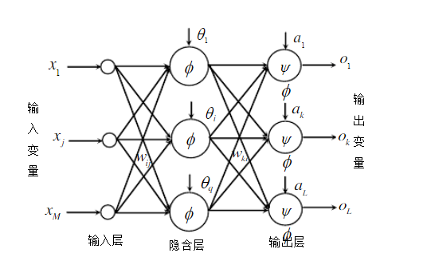

## 
分析BP神经网络的应用

1. BP(back propagation)神经网络是1986年由Rumelhart和McClelland为首的科学家提出的概念，是一种按照误差逆向传播算法训练的多层前馈神经网络，是应用最广泛的神经网络。
2. 基本原理：
人工神经网络无需事先确定输入输出之间映射关系的数学方程，仅通过自身的训练，学习某种规则，在给定输入值时得到最接近期望输出值的结果。作为一种智能信息处理系统，人工神经网络实现其功能的核心是算法。BP神经网络是一种按误差反向传播(简称误差反传)训练的多层前馈网络，其算法称为BP算法，它的基本思想是梯度下降法，利用梯度搜索技术，以期使网络的实际输出值和期望输出值的误差均方差为最小。
基本BP算法包括信号的前向传播和误差的反向传播两个过程。即计算误差输出时按从输入到输出的方向进行，而调整权值和阈值则从输出到输入的方向进行。正向传播时，输入信号通过隐含层作用于输出节点，经过非线性变换，产生输出信号，若实际输出与期望输出不相符，则转入误差的反向传播过程。误差反传是将输出误差通过隐含层向输入层逐层反传，并将误差分摊给各层所有单元，以从各层获得的误差信号作为调整各单元权值的依据。通过调整输入节点与隐层节点的联接强度和隐层节点与输出节点的联接强度以及阈值，使误差沿梯度方向下降，经过反复学习训练，确定与最小误差相对应的网络参数(权值和阈值)，训练即告停止。此时经过训练的神经网络即能对类似样本的输入信息，自行处理输出误差最小的经过非线形转换的信息
3.  基本BP算法公式推导
基本BP算法包括两个方面：信号的前向传播和误差的反向传播。即计算实际输出时按从输入到输出的方向进行，而权值和阈值的修正从输出到输入的方向进行。BP网络结构如图
图中:”xj表示输入层第1个节点的输入，j=1...M; 
wy表示隐含层第i个节点到输入层第j个节点之间的权值;
!表示隐含层第i个节点的阈值;
(x)表示隐含层的激励函数;
Wu表示输出层第k个节点到隐含层第i个节点之间的权值,i=1...q;
“表示输出层第k个节点的阈值,k=1...L;
v(x)表示输出层的激励函数;
+  BP算法程序流程图

4. BP神经网络应用
以股票走势分析作为应用案例进行说明：

   1，挑选样本。选取某日上交所或深交所某日的股票交易数据（该数据可以从任意证卷交易APP上下载），然后挑选其中的2000支上市公司股票的交易数据作为原始样本。

   2，数据归一化。我们从样本数据中可以发现，交易数据的量差非常大如现价可能是几十元、而成交量达到几百万手，因此我们需要对样本数据做归一化处理，将样本数据的范围限制在0-1的区间之内，避免量差过大给模型带来波动。

   3，特征选取。在样本中，我们可以将股票的现价到流通值之间的数据作为特征值X，将股票的涨幅作为目标值y，然后使用PCA主成分分析法，选取对股票涨幅起到关键作用的特征值的集合，记作X1。

   4，模型训练1。使用BP神经网络训练模型，这个模型简称为M1，训练好之后，这个模型中就能通过权重和偏置计算出X1对y的影响，也就是说，如果我们知道了当天的股票交易的数据，就能对股票的涨幅做出合理的预测。

   5，模型训练2。使用回归分析模型，预测当天股票交易数据。我们可以将过去15天某只股票的关键交易信息作为特征值，使用回归分析预测当天的该只股票的交易数据，这个回归模型成为M2。

   6，将M2中预测出的交易数据交给M1，M1就能通过M2预测出的股票交易数据预测出这只股票的涨跌幅度。

