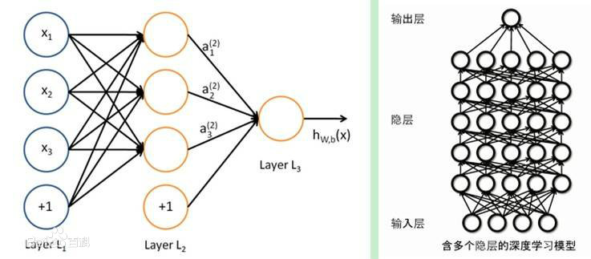

## 
举例说明深度学习的应用

1.  深度学习
深度学习(DL, Deep Learning)是机器学习(ML, Machine Learning)领域中一个新的研究方向，它被引入机器学习使其更接近于最初的目标——人工智能(AI, Artificial Intelligence)。 
深度学习是学习样本数据的内在规律和表示层次，这些学习过程中获得的信息对诸如文字，图像和声音等数据的解释有很大的帮助。它的最终目标是让机器能够像人一样具有分析学习能力，能够识别文字、图像和声音等数据。 深度学习是一个复杂的机器学习算法，在语音和图像识别方面取得的效果，远远超过先前相关技术。  
深度学习在搜索技术，数据挖掘，机器学习，机器翻译，自然语言处理，多媒体学习，语音，推荐和个性化技术，以及其他相关领域都取得了很多成果
 
 深度学习是机器学习的一种，而机器学习是实现人工智能的必经路径。深度学习的概念源于人工神经网络的研究，含多个隐藏层的多层感知器就是一种深度学习结构。深度学习通过组合低层特征形成更加抽象的高层表示属性类别或特征，以发现数据的分布式特征表示。研究深度学习的动机在于建立模拟人脑进行分析学习的神经网络，它模仿人脑的机制来解释数据，例如图像，声音和文本等.
 从一个输入中产生一个输出所涉及的计算可以通过一个流向图（flow graph）来表示：流向图是一种能够表示计算的图，在这种图中每一个节点表示一个基本的计算以及一个计算的值，计算的结果被应用到这个节点的子节点的值。考虑这样一个计算集合，它可以被允许在每一个节点和可能的图结构中，并定义了一个函数族。输入节点没有父节点，输出节点没有子节点。 
这种流向图的一个特别属性是深度（depth）：从一个输入到一个输出的最长路径的长度。 
传统的前馈神经网络能够被看作拥有等于层数的深度（比如对于输出层为隐层数加1）。SVMs有深度2（一个对应于核输出或者特征空间，另一个对应于所产生输出的线性混合.
2. 深度学习典型模型
+ 卷积神经网络模型
在无监督预训练出现之前，训练深度神经网络通常非常困难，而其中一个特例是卷积神经网络。卷积神经网
络受视觉系统的结构启发而产生。第一个卷积神经网络计算模型是在Fukushima(D的神经认知机中提出的，基于神经元之间的局部连接和分层组织图像转换，将有相同参数的神经元应用于前一层神经网络的不同位置，得到一种平移不变神经网络结构形式。后来，Le Cun等人在该思想的基础上，用误差梯度设计并训练卷积神经网络，在一些模式识别任务上得到优越的性能。至今，基于卷积神经网络的模式识别系统是最好的实现系统之一，尤其在手写体字符识别任务上表现出非凡的性能
+ 深度信任网络模型
DBN可以解释为贝叶斯概率生成模型，由多层随机隐变量组成，上面的两层具有无向对称连接，下面的层得到来自上一层的自顶向下的有向连接，最底层单元的状态为可见输入数据向量。DBN由若2F结构单元堆栈组成，结构单元通常为RBM（RestIlcted Boltzmann Machine，受限玻尔兹曼机）。堆栈中每个RBM单元的可视层神经元数量等于前一RBM单元的隐层神经元数量。根据深度学习机制，采用输入样例训练第一层RBM单元，并利用其输出训练第二层RBM模型，将RBM模型进行堆栈通过增加层来改善模型性能。在无监督预训练过程中，DBN编码输入到顶层RBM后，解码顶层的状态到最底层的单元，实现输入的重构。RBM作为DBN的结构单元，与每一层DBN共享参数.
+ 堆栈自编码网络模型
堆栈自编码网络的结构与DBN类似，由若干结构单元堆栈组成，不同之处在于其结构单元为自编码模型( auto-en-coder)而不是RBM。自编码模型是一个两层的神经网络，第一层称为编码层，第二层称为解码层 
3. 深度学习训练过程
将除最顶层的其他层间的权重变为双向的，这样最顶层仍然是一个单层神经网络，而其他层则变为了图模型。向上的权重用于“认知”，向下的权重用于“生成”。然后使用wake-sleep算法调整所有的权重。让认知和生成达成一致，也就是保证生成的最顶层表示能够尽可能正确的复原底层的节点。比如顶层的一个节点表示人脸，那么所有人脸的图像应该激活这个节点，并且这个结果向下生成的图像应该能够表现为一个大概的人脸图像。wake-sleep算法分为醒( wake)和睡(sleep)两个部分。
wake阶段：认知过程，通过外界的特征和向上的权重产生每一层的抽象表示，并且使用梯度下降修改层间的下行权重。  
sleep阶段：生成过程，通过顶层表示和向下权重，生成底层的状态，同时修改层间向上的权重。
4. 应用 
+ 快速的CPU 实现
传统的神经网络是用单台机器的CPU 来训练的。如今，这种做法通常被视为是不可取的。现在，我们通常使用GPU 或者许多台机器的CPU 连接在一起进行计算。在使用这种昂贵配置之前，为论证CPU 无法承担神经网络所需的巨大计算量，研究者们付出了巨大的努力。
描述如何实现高效的数值CPU 代码已经超出了本书的讨论范围，但是我们在这里还是要强调通过设计一些特定的CPU 上的操作可以大大提升效率。例如，在2011 年，最好的CPU 在训练神经网络时使用定点运算能够比浮点运算跑得更快。通过调整定点运算的实现方式，Vanhoucke et al. (2011) 获得了3 倍于一个强浮点运算系统的速度。因为各个新型CPU都有各自不同的特性，所以有时候采用浮点运算实现会更快。一条重要的准则就是，通过特殊设计的数值运算，我们可以获得巨大的回报。除了选择定点运算或者浮点运算以外，其他的策略还包括了如通过优化数据结构避免高速缓存缺失、使用向量指令等。机器学习的研究者们大多会忽略这些实现的细节，但是如果某种实现限制了模型的规模，那该模型的精度就要受到影响。
+ 物体检测
 物体检测是从图像中确定物体的位置，并进行分类的问题，如下图所示要从图像中确定物体的种类和物体的位置。
 
 不难发现，物体检测比物体识别（以整个图像为对象进行识别）更难，因为物体检测需要对图像中的每种类别进行识别并判断其位置。
人们提出了多个基于CNN的方法，其中一个较为有名的方法是R-CNN，下图显示了R-CNN的处理流。图中，“2.Extract region proposals”（候选区域的提取）和“3.Compute CNN features”（CNN特征的计算）的处理部分。这里，首先以某种方法找出形似物体的区域，然后对提取的区域应用CNN进行分类。R-CNN中会将图像变形为正方形，或者在分类时使用SVM.
 
 在R-CNN的前半部分的处理---候选区域的提取（发现形似物体的处理）中，可以使用机器视觉领域积累的各种各样的方法。R-CNN论文中使用了一种被称为Selective Search的方法，最近还提出了一种基于CNN来进行候选区域提取的Fster R-CNN的方法，它用一个CNN来完成所有处理，使得高速处理成为可能。
+ 自动驾驶
 自动驾驶技术中，正确识别周围环境的技术尤为重要。这是因为要正确识别时刻变化的环境、自由来往的车辆和行人是非常困难的。
 在识别周围环境的技术中心，深度学习的力量备受期待。比如，基于CNN的神经网络SegNet,可以像下图那样高精度地识别行驶环境。
 
 该图对输入图像进行了分割（像素水平的判别）。观察结果可知，在某种程度上正确地识别了道路、建筑物、人行道、树木、车辆等.

