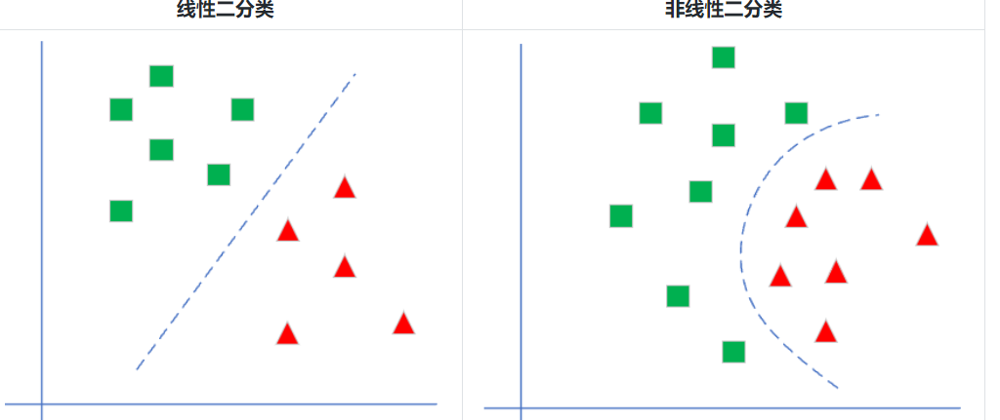
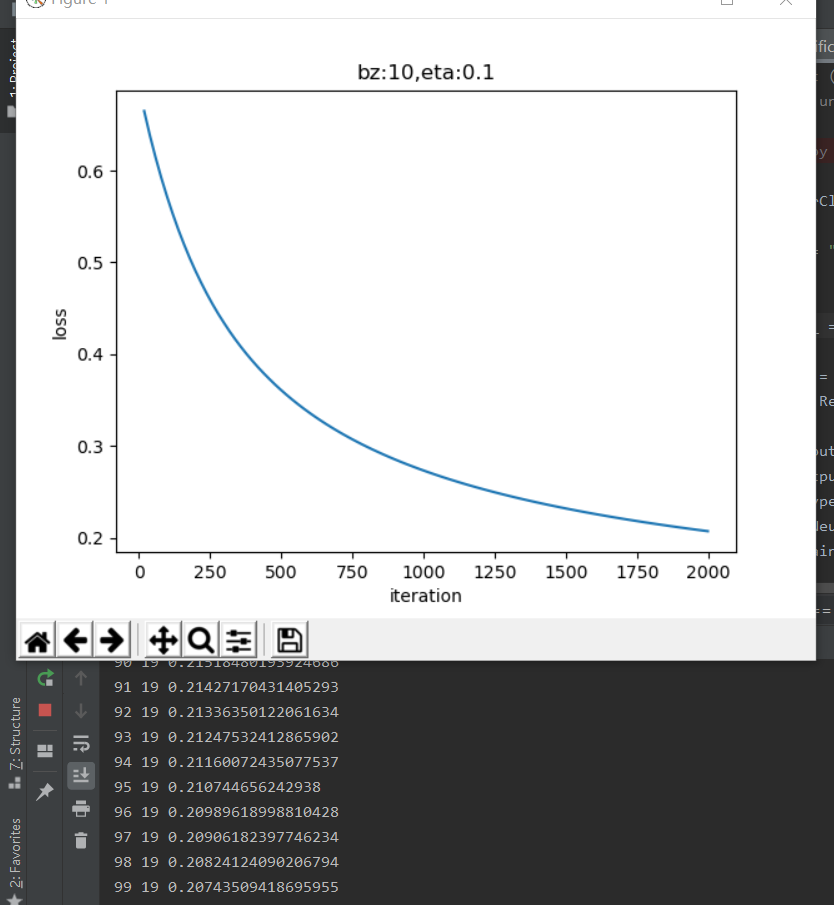
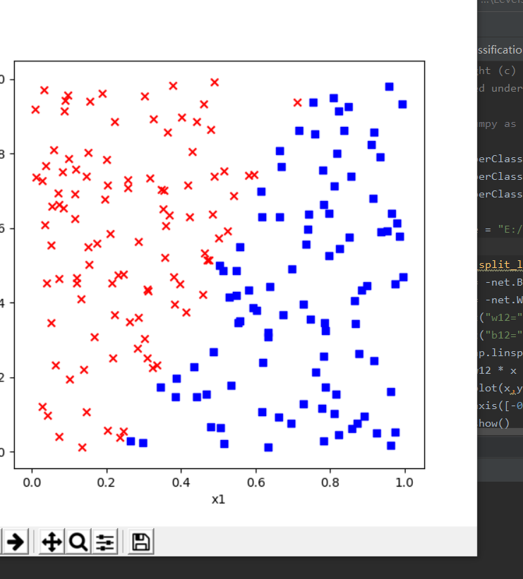
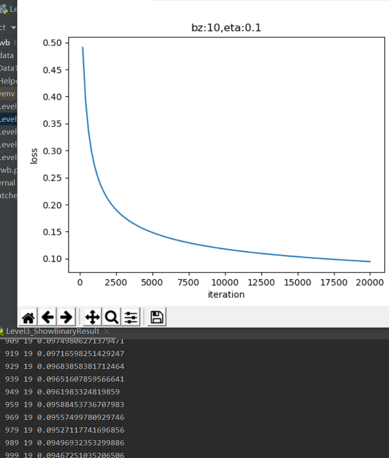
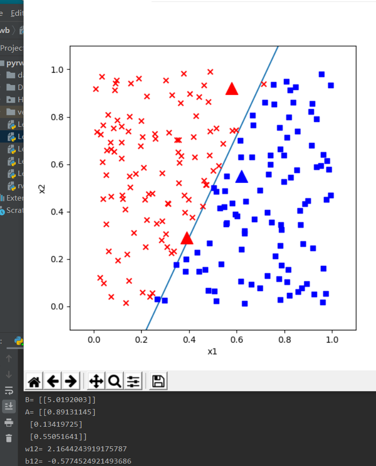
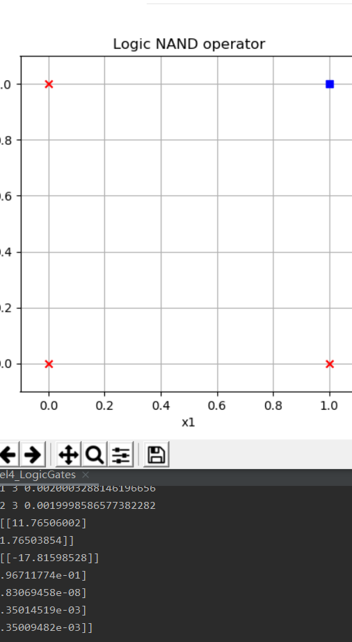
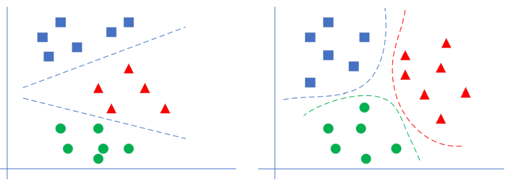
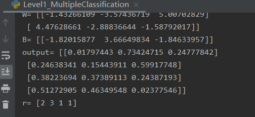

##        
总结

摘要：今天学习了线性分类相关函数，算法分析，相关的神经网络分类与介绍，进一步了解神经网络和其算法。
1. 线性分类：
分类问题在很多资料中都称之为逻辑回归，Logistic Regression，其原因是使用了线性回归中的线性模型，加上一个Logistic二分类函数，共同构造了一个分类器。我们在本书中统称之为分类。
神经网络的一个重要功能就是分类，现实世界中的分类任务复杂多样，但万变不离其宗，我们都可以用同一种模式的神经网络来处理。
2.多入单出的单层神经网路(线性二分类)
+ 逻辑回归模型：回归问题可以分为两类：线性回归和逻辑回归。在第二步中，我们学习了线性回归模型，在第三步中，我们将一起学习逻辑回归模型。
逻辑回归的英文是Logistic Regression，逻辑回归是用来计算“事件=Success”和“事件=Failure”的概率。当因变量的类型属于二元（1 / 0，真/假，是/否）变量时，我们就应该使用逻辑回归。
回忆线性回归，使用一条直线拟合样本数据，而逻辑回归是“拟合”0或1两个数值，而不是具体的连续数值，所以它叫广义线性模型。逻辑回归又称logistic回归分析，常用于数据挖掘，疾病自动诊断，经济预测等领域。
例如，探讨引发疾病的危险因素，并根据危险因素预测疾病发生的概率等。以胃癌病情分析为例，选择两组人群，一组是胃癌组，一组是非胃癌组，两组人群必定具有不同的体征与生活方式等。因此因变量就为是否胃癌，值为“是”或“否”；自变量就可以包括很多了，如年龄、性别、饮食习惯、幽门螺杆菌感染等。
自变量既可以是连续的，也可以是分类的。然后通过logistic回归分析，可以得到自变量的权重，从而可以大致了解到底哪些因素是胃癌的危险因素。同时根据该权值可以根据危险因素预测一个人患癌症的可能性。
  + 逻辑回归的另外一个名字叫做分类器：为线性分类器和非线性分类器，本章中我们学习线性分类器。而无论是线性还是非线性分类器，又分为两种：二分类问题和多分类问题(如图)

+ 二分类函数
+ 对率函数Logistic Function，即可以做为激活函数使用，又可以当作二分类函数使用。而在很多不太正规的文字材料中，把这两个概念混用了，比如下面这个说法：“我们在最后使用Sigmoid激活函数来做二分类”，这是不恰当的。在本书中，我们会根据不同的任务区分激活函数和分类函数这两个概念，在二分类任务中，叫做Logistic函数，而在作为激活函数时，叫做Sigmoid函数。
公式
$$a(z) = \frac{1}{1 + e^{-z}}$$
导数
$$a^{'}(z) = a(z)(1 - a(z))$$
具体求导过程可以参考8.1节。
输入值域
$$(-\infty, \infty)$$
输出值域
$$(0,1)$$
+ 线性二分类的神经网络实现
如何用神经网络在两组不同标签的样本之间画一条明显的分界线。这条分界线可以是直线，也可以是曲线。这就是二分类问题。如果只画一条分界线的话，无论是直线还是曲线，我们可以用一支假想的笔（即一个神经元），就可以达到目的，也就是说笔的走向，完全依赖于这一个神经元根据输入信号的判断
 + 从视觉上判断是线性可分的，所以我们使用单层神经网络即可；
 + 输入特征是经度和纬度，所以我们在输入层设置两个输入X1=经度，X2=维度；
 + 最后输出的是一个二分类，分别是楚汉地盘，可以看成非0即1的二分类问题，所以我们只用一个输出单元就可以了。运行结果： 
+ 线性二分类原理:线性分类和线性回归的异同如图：  
+ 二分类结果可视化
一般我们会把样本分成训练集、验证集、测试集，用测试集来测试训练结果的正确性。在本例中我们没有这样做，原因有二：
样本数据量比较少，一共只有200个样本，如果再分成两部分，会造成数据集覆盖不全面，存在很大的差异，对训练、验证、测试都没有帮助
由于本例的数据特征比较少，所以我们有更好的手段：可视化。在神经网络学习初期，可视化的训练过程与结果会对读者有巨大的帮助。运行结果：  
 
+ 实现逻辑与门和或门
  + 与门 AND
  + 与非门 NAND
  + 或门 OR
  + 或非门 NOR
训练样本
运行结果：   
2. 多入单出的单层神经网路
线性多分类和非线性多分类的区别
下图先示意了线性多分类和非线性多分类的区别:
+ 定义神经网络结构:
从图示来看，似乎在三个颜色区间之间有两个比较明显的分界线，而且是直线，即线性可分的。我们如何通过神经网络精确地找到这两条分界线呢？

从视觉上判断是线性可分的，所以我们使用单层神经网络即可
输入特征是两个，X1=经度，X2=纬度
最后输出的是三个分类，分别是魏蜀吴，所以输出层有三个神经元
如果有三个以上的分类同时存在，我们需要对每一类别分配一个神经元，这个神经元的作用是根据前端输入的各种数据，先做线性处理（Y=WX+B)，然后做一次非线性处理，计算每个样本在每个类别中的预测概率，再和标签中的类别比较，看看预测是否准确，如果准确，则奖励这个预测，给与正反馈；如果不准确，则惩罚这个预测，给与负反馈。两类反馈都反向传播到神经网络系统中去调整参数。
这个网络只有输入层和输出层，由于输入层不算在内，所以是一层网络
运行结果： 