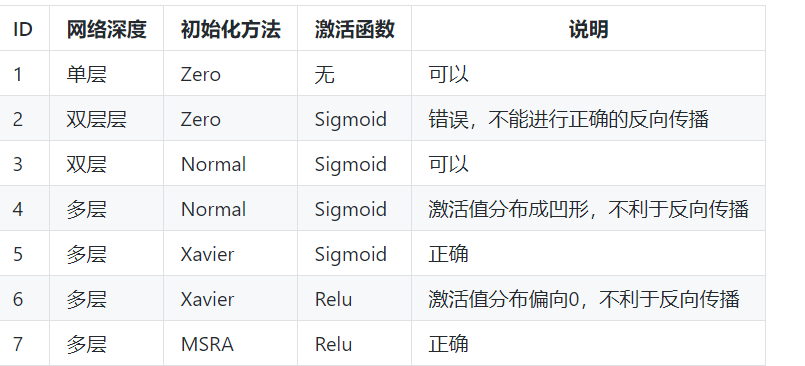
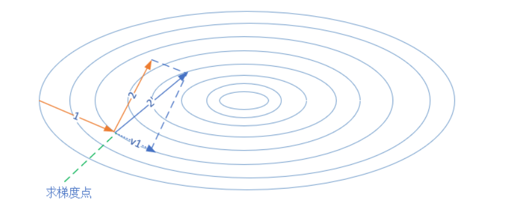
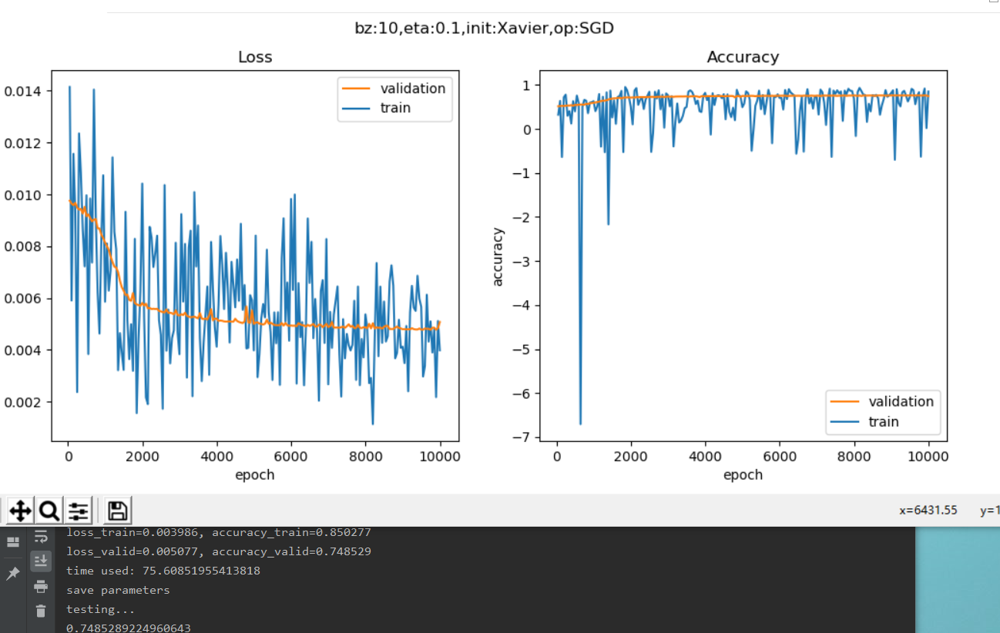
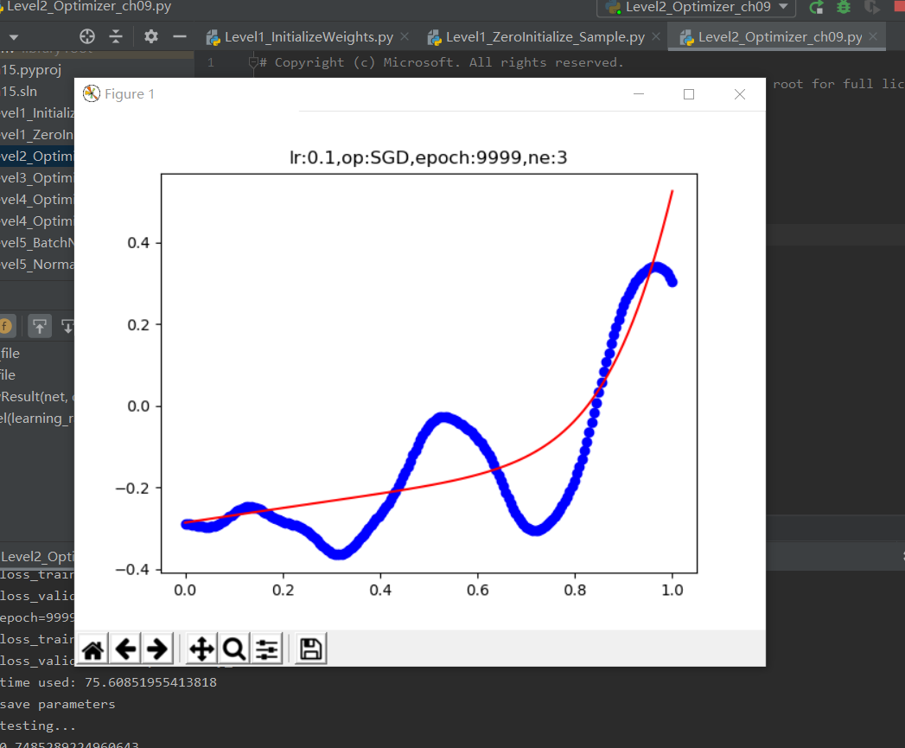
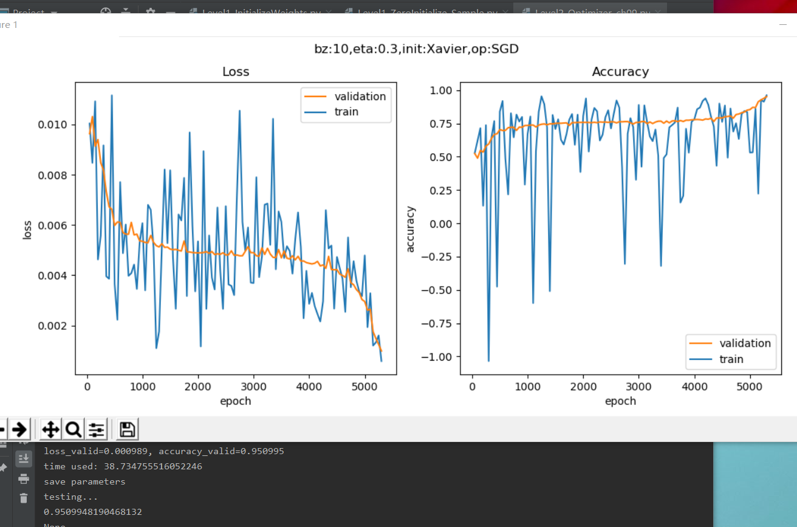
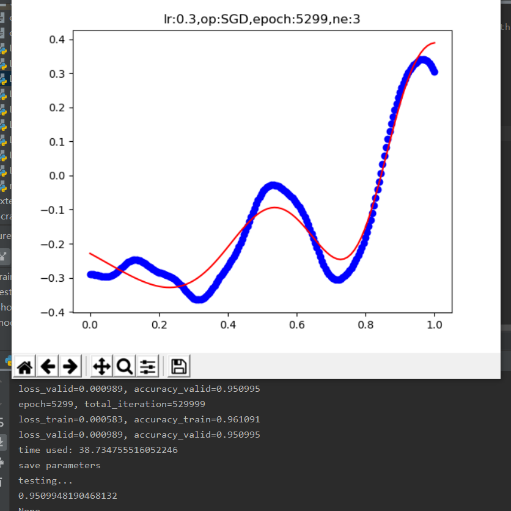
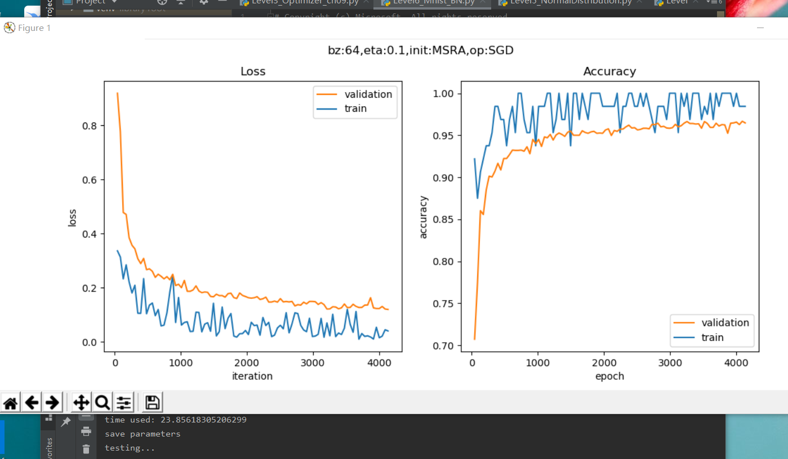
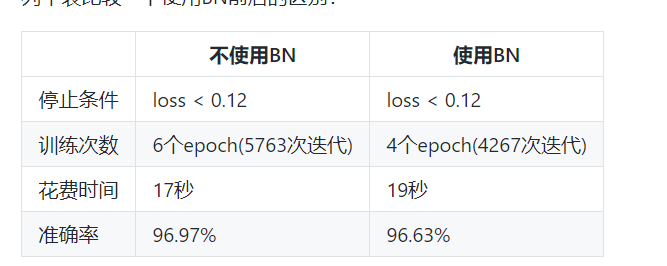

##          
总结

摘要：今天学习网络优化，相关优化算法，批量归一的学习和探究，进一步了解神经网络算法分析，利用代码来实现运行结果和相关算法。提高学习的兴趣和探索。
1.  网络优化
随着网络的加深，训练变得越来越困难，时间越来越长，原因可能是：
参数多，数据量大，梯度消失，损失函数坡度平缓。
为了解决上面这些问题：权重矩阵初始化，批量归一化，梯度下降优化算法，自适应学习率算法。
2. 权重矩阵初始化：
权重矩阵初始化是一个非常重要的环节，是训练神经网络的第一步，选择正确的初始化方法会带了事半功倍的效果。这就好比攀登喜马拉雅山，如果选择从南坡登山，会比从北坡容易很多。而初始化权重矩阵，相当于下山时选择不同的道路，在选择之前并不知道这条路的难易程度，只是知道它可以抵达山下。这种选择是随机的，即使你使用了正确的初始化算法，每次重新初始化时也会给训练结果带来很多影响。
   +  零初始化
即把所有层的W值的初始值都设置为0。$$ W = 0 $$
   + 随机初始化
把W初始化均值为0，方差为1的矩阵：
$$ W \sim G \begin{bmatrix} 0, 1 \end{bmatrix} $$
当目标问题较为简单时，网络深度不大，所以用随机初始化就可以了
   + Xavier初始化方法
条件：正向传播时，激活值的方差保持不变；反向传播时，关于状态值的梯度的方差保持不变。
$$ W \sim U \begin{bmatrix} -\sqrt{{6 \over n_{input} + n_{output}}}, \sqrt{{6 \over n_{input} + n_{output}}} \end{bmatrix} $$
假设激活函数关于0对称，且主要针对于全连接神经网络。适用于tanh和softsign。
即权重矩阵参数应该满足在该区间内的均匀分布。其中的W是权重矩阵，U是Uniform分布，即均匀分布。Xavier初始化方法比直接用高斯分布进行初始化W的优势所在：

一般的神经网络在前向传播时神经元输出值的方差会不断增大，而使用Xavier等方法理论上可以保证每层神经元输入输出方差一致。
    运行结果；     
3. 梯度下降优化算法
    + 随机梯度下降 SGD
先回忆一下随机梯度下降的基本算法，便于和后面的各种算法比较。图中的梯度搜索轨迹为示意图:  输入和参数
$\eta$ - 全局学习率
算法
计算梯度：$g_t = \nabla_\theta J(\theta_{t-1})$
更新参数：$\theta_t = \theta_{t-1} - \eta \cdot g_t$
    + 动量算法 Momentum
SGD方法的一个缺点是其更新方向完全依赖于当前batch计算出的梯度，因而十分不稳定，因为数据有噪音。
Momentum算法借用了物理中的动量概念，它模拟的是物体运动时的惯性，即更新的时候在一定程度上保留之前更新的方向，同时利用当前batch的梯度微调最终的更新方向。这样一来，可以在一定程度上增加稳定性，从而学习地更快，并且还有一定摆脱局部最优的能力。Momentum算法会观察历史梯度，若当前梯度的方向与历史梯度一致（表明当前样本不太可能为异常点），则会增强这个方向的梯度。若当前梯度与历史梯方向不一致，则梯度会衰减。上图中，第一次的梯度更新完毕后，会记录v1的动量值。在“求梯度点”进行第二次梯度检查时，得到2号方向，与v1的动量组合后，最终的更新为2'方向。这样一来，由于有v1的存在，会迫使梯度更新方向具备“惯性”，从而可以减小随机样本造成的震荡。
输入和参数
$\eta$ - 全局学习率
$\alpha$ - 动量参数，一般取值为0.5, 0.9, 0.99
$v_t$ - 当前时刻的动量，初值为0
算法
计算梯度：$g_t = \nabla_\theta J(\theta_{t-1})$
计算速度更新：$v_t = \alpha \cdot v_{t-1} + \eta \cdot g_t$ (公式1)
更新参数：$\theta_t = \theta_{t-1} - v_t$ (公式2)
运行结果：  
  
4. 批量归一化的原理
5. 有的书翻译成归一化，有的翻译成正则化，英文Batch Normalization，简称为BatchNorm，或BN。
基本数学知识
正态分布
正态分布，又叫做高斯分布。
若随机变量X，服从一个位置参数为μ、尺度参数为σ的概率分布，且其概率密度函数为：
$$ f(x)={1 \over \sigma\sqrt{2 \pi} } e^{- {(x-\mu)^2} \over 2\sigma^2} \tag{1} $$
则这个随机变量就称为正态随机变量，正态随机变量服从的分布就称为正态分布，记作：
$$ X \sim N(\mu,\sigma^2) \tag{2} $$
当μ=0,σ=1时，称为标准正态分布：
$$X \sim N(0,1) \tag{3}$$
此时公式简化为：
$$ f(x)={1 \over \sqrt{2 \pi}} e^{- {x^2} \over 2} \tag{4} $$
运行结果：是为了验证代码的正确性，与cs231n中的另一种实现方法做比较，得到的结果为True，表示代码无误。
6. 批量归一化的实现
   + 反向传播
在上一节中，我们知道了BN的正向计算过程，这一节中，为了实现完整的BN层，我们首先需要推导它的反向传播公式，然后用代码实现。本节中的公式序号接上一节，以便于说明。
首先假设已知从上一层回传给BN层的误差矩阵是：
$$\delta = {dJ \over dZ}，\delta_i = {dJ \over dz_i} \tag{10}$$
   + BN层的实际应用
  运行结果：

用BN后，迭代速度提升，但是花费时间多了2秒，这是因为BN的正向和反向计算过程还是比较复杂的，需要花费一些时间，但是BN确实可以帮助网络快速收敛。如果使用GPU的话，花费时间上的差异应该可以忽略。
在准确率上的差异可以忽略，由于样本误差问题和随机初始化参数的差异，会造成最后的训练结果有细微差别。

