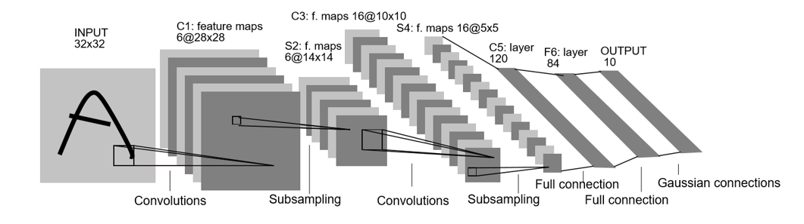
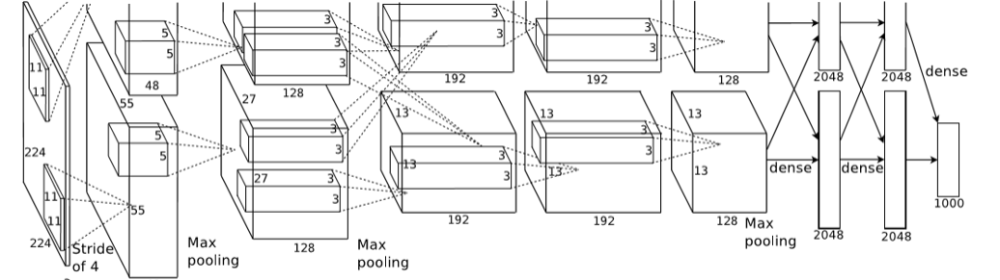
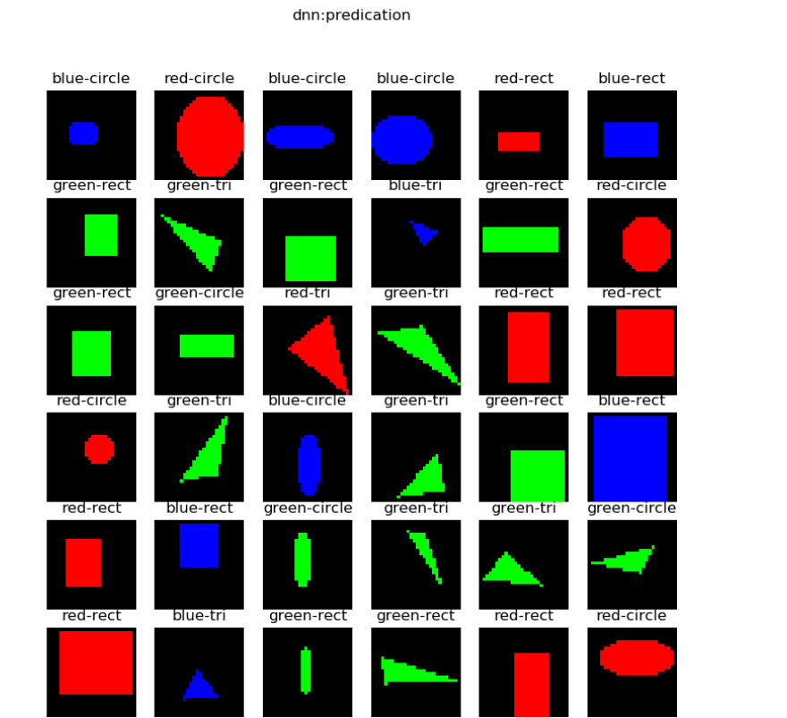
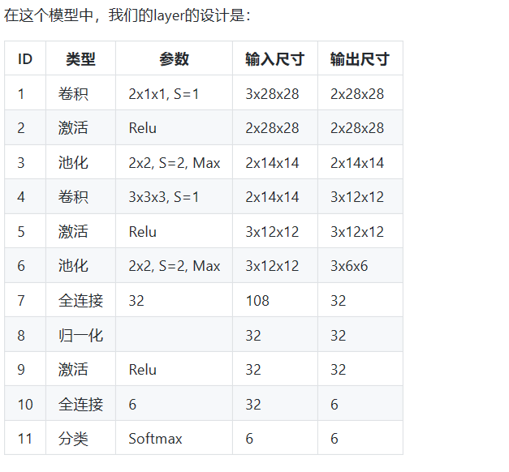

## 总结

今天主要了解了CNN的更深入的内容，了解了CNN的发展过程到图形分类识别，并且了解了DNN和CNN的不同之处也并用这两种方法的识别结果深入学习了神经网络。

## 1. 卷积神经网络模型的演变
如下图

+ LeNet (1998)
CNN的鼻祖。
LeNet是卷积神经网络的开创者LeCun在1998年提出，用于解决手写数字识别的视觉任务。自那时起，CNN的最基本的架构就定下来了：卷积层、池化层、全连接层。

输入为单通道32x32灰度图
使用6组5x5的过滤器，每个过滤器里有一个卷积核，stride=1，得到6张28x28的特征图
使用2x2的池化，stride=2，得到6张14x14的特征图
使用16组5x5的过滤器，每个过滤器里有6个卷积核，对应上一层的6个特征图，得到16张10x10的特征图
池化，得到16张5x5的特征图
接全连接层，120个神经元
接全连接层，84个神经元
接全连接层，10个神经元，softmax输出
如今各大深度学习框架中所使用的LeNet都是简化改进过的LeNet-5（5表示具有5个层），和原始的LeNet有些许不同，比如把激活函数改为了现在很常用的ReLu。LeNet-5跟现有的conv->pool->ReLU的套路不同，它使用的方式是conv1->pool->conv2->pool2再接全连接层，但是不变的是，卷积层后紧接池化层的模式依旧不变。

结构图
+ AlexNet (2012)
AlexNet网络结构在整体上类似于LeNet，都是先卷积然后在全连接。但在细节上有很大不同。AlexNet更为复杂。AlexNet有60 million个参数和65000个 神经元，五层卷积，三层全连接网络，最终的输出层是1000通道的softmax。

AlexNet用两块GPU并行计算，大大提高了训练效率，并且在ILSVRC-2012竞赛中获得了top-5测试的15.3%的error rate，获得第二名的方法error rate是26.2%，差距非常大，足以说明这个网络在当时的影响力。

结构图

+ ZFNet (2013)

ZFNet是2013年ImageNet分类任务的冠军，其网络结构没什么改进，只是调了调参，性能较Alex提升了不少。ZF-Net只是将AlexNet第一层卷积核由11变成7，步长由4变为2，第3，4，5卷积层转变为384，384，256。这一年的ImageNet还是比较平静的一届，其冠军ZF-Net的名堂也没其他届的经典网络架构响亮。
但是ZFNet首次系统化地对CNN做了可视化的研究，从而找到了AlexNet的缺点并加以改正，提高了网络的能力。总的来说，通过CNN学习后，我们学习到的特征，是具有辨别性的特征，比如要我们区分人脸和狗头，那么通过CNN学习后，背景部位的激活度基本很少，我们通过可视化就可以看到我们提取到的特征忽视了背景，而是把关键的信息给提取出来了。

从Layer 1、Layer 2学习到的特征基本上是颜色、边缘等低层特征。

Layer 3则开始稍微变得复杂，学习到的是纹理特征，比如上面的一些网格纹理。

Layer 4学习到的则是比较有区别性的特征，比如狗头；Layer 5学习到的则是完整的，具有辨别性关键特征。
结构图

+ VGGNet (2015)

VGG Net由牛津大学的视觉几何组（Visual Geometry Group）和 Google DeepMind公司的研究员一起研发的的深度卷积神经网络，在 ILSVRC 2014 上取得了第二名的成绩，将 Top-5错误率降到7.3%。它主要的贡献是展示出网络的深度（depth）是算法优良性能的关键部分。目前使用比较多的网络结构主要有ResNet（152-1000层），GooleNet（22层），VGGNet（19层），大多数模型都是基于这几个模型上改进，采用新的优化算法，多模型融合等。到目前为止，VGG Net 依然经常被用来提取图像特征。
结构图

+ GoogLeNet (2014)
GoogLeNet在2014的ImageNet分类任务上击败了VGG-Nets夺得冠军，其实力肯定是非常深厚的，GoogLeNet跟AlexNet,VGG-Nets这种单纯依靠加深网络结构进而改进网络性能的思路不一样，它另辟幽径，在加深网络的同时（22层），也在网络结构上做了创新，引入Inception结构代替了单纯的卷积+激活的传统操作（这思路最早由Network in Network提出）。GoogLeNet进一步把对卷积神经网络的研究推上新的高度。

模型结构图：

蓝色为卷积运算，红色为池化运算，黄色为softmax分类。

+ ResNets (2015)
2015年何恺明推出的ResNet在ISLVRC和COCO上横扫所有选手，获得冠军。ResNet在网络结构上做了大创新，而不再是简单的堆积层数，ResNet在卷积神经网络的新思路，绝对是深度学习发展历程上里程碑式的事件。

+ DenseNet (2017)
DenseNet 是一种具有密集连接的卷积神经网络。在该网络中，任何两层之间都有直接的连接，也就是说，网络每一层的输入都是前面所有层输出的并集，而该层所学习的特征图也会被直接传给其后面所有层作为输入。下图是 DenseNet 的一个dense block示意图，一个block里面的结构如下，与ResNet中的BottleNeck基本一致：BN-ReLU-Conv(1×1)-BN-ReLU-Conv(3×3) ，而一个DenseNet则由多个这种block组成。每个DenseBlock的之间层称为transition layers，由BN−>Conv(1×1)−>averagePooling(2×2)组成：
结构图

DenseNet作为另一种拥有较深层数的卷积神经网络，具有如下优点：

 相比ResNet拥有更少的参数数量
 旁路加强了特征的重用
 网络更易于训练,并具有一定的正则效果
 缓解了gradient vanishing和model degradation的问题

 ## 2. 实现几何图形分类

 工智能现在还是初期阶段，它能否达到3岁儿童的能力呢？先看一下样本数据：

一共有5种形状：圆形、菱形、直线、矩形、三角形。上图中列出了一些样本，由于图片尺寸是28x28的灰度图，所以在放大显示后可以看到很多锯齿，读者可以忽略。需要强调的是，每种形状的尺寸和位置在每个样本上都是有差异的，它们的大小和位置都是随机的，比如圆形的圆心位置和半径都是不一样的，还有可能是个椭圆。

 + DNN 
 + CNN 
 
 ## 3. 实现颜色分类
CNN可以在图像分类上发挥作用，而一般的图像都是彩色的，也就是说除了形状以外，CNN也应该可以判别颜色的。这一节中我们来测试一下颜色分类问题，也就是说，不管几何图形是什么样子的，只针对颜色进行分类。
  + DNN 
  + CNN  

## 4. 循环神经网络

+ 概念

循环神经网络（Recurrent Neural Network, RNN）是一类以序列（sequence）数据为输入，在序列的演进方向进行递归（recursion）且所有节点（循环单元）按链式连接的递归神经。

+ 用DNN的知识来解决问题

搭建网络
我们回忆一下，在验证万能近似定理时，我们学习了曲线拟合问题，即带有一个隐层和非线性激活函数的前馈神经网络，可以拟合任意曲线。但是在这个问题里，有几点不同：
不是连续值，而是时间序列的离散值
完全随机的离散值，而不是满足一定的规律
测试数据不在样本序列里，完全独立
所以，即使使用DNN技术中曲线拟合技术得到了一个拟合网络，也不能正确地预测不在样本序列里的测试集数据。但是，我们可以把DNN做一个变形，让它能够处理时间序列数据：
测试结果：   

+ + 搭建多个时序的网络
从DNN的结构扩展到含有4个时序的网络结构：

图一：含有4个时序的网络结构图

图一中，最左侧的简易结构是通常的RNN的画法，而右侧是其展开后的细节，由此可见细节有很多，如果不展开的话，对于初学者来说很难理解，而且也不利于我们进行反向传播的推导。

再重复一下，请读者记住，t1是二进制数的最低位，但是由于我们把样本倒序了，所以，现在的t1就是样本的第0个单元的值。并且由于涉及到被减数和减数，所以每个样本的第0个单元（时间步）都有两个特征值，其它3个单元也一样。

在图一中，连接x和h的是一条线标记为U，在19.1节的例子中，U是一个参数，但是在本节中，U是一个 1x4 的参数矩阵，V是一个 4x1 的参数矩阵，而W就是一个 4x4 的参数矩阵。我们把它们展开画成下图（其中把s和h合并在一起了）：
测试结果：

+  更多时序的RNN
提出问题
在加减法运算中，总会遇到进位或者退位的问题，我们以二进制为例，比如13-6=7这个十进制的减法，变成二进制后如下所示：
被减数13变成了[1, 1, 0, 1]
减数6变成了[0, 1, 1, 0]
结果的7变成了[0, 1, 1, 1]
在减法过程中：
x1和x2的最后一位是1和0，相减为1
倒数第二位是0和1，需要从前面借一位，相减后得1
倒数第三位本来是1和1，借位后变成了0和1，再从前面借一位，相减后得1
倒数第四位现在是0和0，相减为0