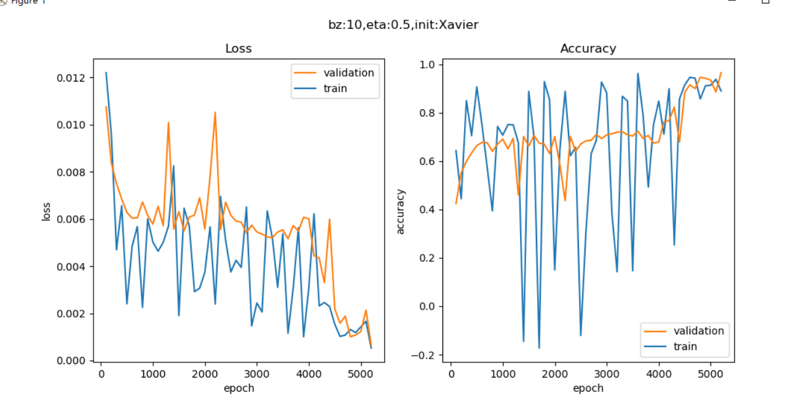
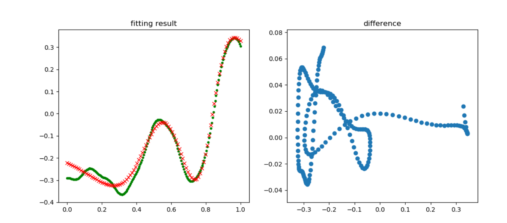
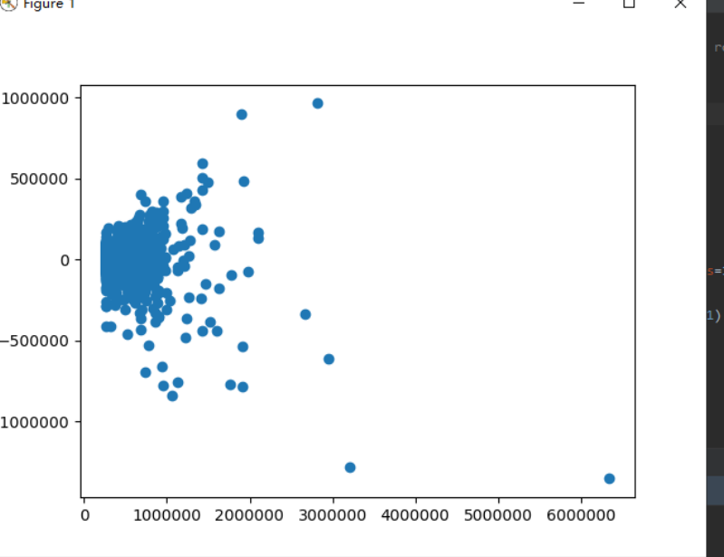

# 第六次上课总结
在前面的几步中，我们用简单的案例，逐步学习了众多的知识，使得我们可以更轻松地接触深度学习。

从这一部分开始，探讨深度学习的一些细节，如权重矩阵初始化、梯度下降优化算法、批量归一化等高级知识。

由于深度网络的学习能力强的特点，会造成网络对样本数据过分拟合，从而造成泛化能力不足，因此我们需要一些手段来改善网络的泛化能力。
## 第14章 搭建深度神经网络框架
### 功能模式分析
```Python
def forward3(X, dict_Param):
    ...
    # layer 1
    Z1 = np.dot(W1,X) + B1
    A1 = Sigmoid(Z1)
    # layer 2
    Z2 = np.dot(W2,A1) + B2
    A2 = Tanh(Z2)
    # layer 3
    Z3 = np.dot(W3,A2) + B3
    A3 = Softmax(Z3)
    ...    
```

1，2，3三层的模式完全一样：矩阵运算+激活/分类函数。

再看看反向传播：

```Python
def backward3(dict_Param,cache,X,Y):
    ...
    # layer 3
    dZ3= A3 - Y
    dW3 = np.dot(dZ3, A2.T)
    dB3 = np.sum(dZ3, axis=1, keepdims=True)
    # layer 2
    dZ2 = np.dot(W3.T, dZ3) * (1-A2*A2) # tanh
    dW2 = np.dot(dZ2, A1.T)
    dB2 = np.sum(dZ2, axis=1, keepdims=True)
    # layer 1
    dZ1 = np.dot(W2.T, dZ2) * A1 * (1-A1)   #sigmoid
    dW1 = np.dot(dZ1, X.T)
    dB1 = np.sum(dZ1, axis=1, keepdims=True)
    ...
```
每一层的模式也非常相近：计算本层的dZ，再根据dZ计算dW和dB。

因为三层网络比两层网络多了一层，所以会在初始化、前向、反向、更新参数等四个环节有所不同，但却是有规律的。再加上前面章节中，为了实现一些辅助功能，我们已经写了很多类。所以，现在可以动手搭建一个深度学习的mini框架了。

### 14.0.2 抽象与设计
#### NeuralNet

我们首先需要一个NeuralNet类，来包装基本的神经网络结构和功能：

- Layers - 神经网络各层的容器，按添加顺序维护一个列表
- Parameters - 基本参数，包括普通参数和超参
- Loss Function - 提供计算损失函数值，存储历史记录并最后绘图的功能
- LayerManagement() - 添加神经网络层
- ForwardCalculation() - 调用各层的前向计算方法
- BackPropagation() - 调用各层的反向传播方法
- PreUpdateWeights() - 预更新各层的权重参数
- UpdateWeights() - 更新各层的权重参数
- Train() - 训练
- SaveWeights() - 保存各层的权重参数
- LoadWeights() - 加载各层的权重参数

#### Layer

是一个抽象类，以及更加需要增加的实际类，包括：
- Fully Connected Layer
- Classification Layer
- Activator Layer
- Dropout Layer
- Batch Norm Layer

将来还会包括：
- Convolution Layer
- Max Pool Layer

每个Layer都包括以下基本方法：
 - ForwardCalculation() - 调用本层的前向计算方法
 - BackPropagation() - 调用本层的反向传播方法
 - PreUpdateWeights() - 预更新本层的权重参数
 - UpdateWeights() - 更新本层的权重参数
 - SaveWeights() - 保存本层的权重参数
 - LoadWeights() - 加载本层的权重参数

#### Activator Layer

激活函数和分类函数：

- Identity - 直传函数，即没有激活处理
- Sigmoid
- Tanh
- Relu

#### Classification Layer

分类函数，包括：
- Sigmoid二分类
- Softmax多分类


 #### Parameters

 基本神经网络运行参数：

 - 学习率
 - 最大epoch
 - batch size
 - 损失函数定义
 - 初始化方法
 - 优化器类型
 - 停止条件
 - 正则类型和条件

#### LossFunction

损失函数及帮助方法：

- 均方差函数
- 交叉熵函数二分类
- 交叉熵函数多分类
- 记录损失函数
- 显示损失函数历史记录
- 获得最小函数值时的权重参数

#### Optimizer

优化器：

- SGD
- Momentum
- Nag
- AdaGrad
- AdaDelta
- RMSProp
- Adam

#### WeightsBias

权重矩阵，仅供全连接层使用：

- 初始化 
  - Zero, Normal, MSRA (HE), Xavier
  - 保存初始化值
  - 加载初始化值
- Pre_Update - 预更新
- Update - 更新
- Save - 保存训练结果值
- Load - 加载训练结果值

#### DataReader

样本数据读取器：

- ReadData - 从文件中读取数据
- NormalizeX - 归一化样本值
- NormalizeY - 归一化标签值
- GetBatchSamples - 获得批数据
- ToOneHot - 标签值变成OneHot编码用于多分类
- ToZeorOne - 标签值变成0/1编码用于二分类
- Shuffle - 打乱样本顺序

从中派生出两个数据读取器：
- MnistImageDataReader - 读取MNIST数据
- CifarImageReader - 读取Cifar10数据
### 回归测试-万能近似定理
#### 搭建模型
一个双层的神经网络，第一层后面接一个Sigmoid激活函数，第二层直接输出拟合数据。
1. 超参数说明：
    + 输入层1个神经元，因为只有一个x值
    + 隐层4个神经元，对于此问题来说应该是足够了，因为特征很少
    + 输出层1个神经元，因为是拟合任务
    + 学习率=0.5
    + 最大epoch=10000轮
    + 批量样本数=10
    + 拟合网络类型
    + Xavier初始化
    + 绝对损失停止条件=0.001 
2. 训练结果：代码测试：
    + 
    + 
### 反向传播四大公式推导

著名的反向传播四大公式是：

  $$\delta^{L} = \nabla_{a}C \odot \sigma_{'}(Z^L) \tag{80}$$
  $$\delta^{l} = ((W^{l + 1})^T\delta^{l+1})\odot\sigma_{'}(Z^l) \tag{81}$$
  $$\frac{\partial{C}}{\partial{b_j^l}} = \delta_j^l \tag{82}$$
  $$\frac{\partial{C}}{\partial{w_{jk}^{l}}} = a_k^{l-1}\delta_j^l \tag{83}$$
  ### 回归任务 - 房价预测
  #### 数据处理：
  * 原始数据只有一个数据集，需要自己把它分成训练集和测试集，比例大概为4:1。此数据集为csv文件格式，为了方便，我们把它转换成了两个扩展名为npz的numpy压缩形式：
  * house_Train.npz，训练数据集
        + house_Test.npz，测试数据集 
#### 搭建模型：
  * 一个模型包含了四组全连接层-Relu层的组合，最后是一个单输出做拟合。
  +  超参数说明：
        + 学习率=0.1
        + 最大epoch=1000
        + 批大小=16
        + 拟合网络
        + 初始化方法Xavier
        + 停止条件为相对误差1e-7
        + net.train()函数是一个阻塞函数，只有当训练完毕后才返回
#### 代码运行结果：


### 二分类试验 - 双弧形非线性二分类

### 搭建模型

同样是一个双层神经网络，但是最后一层要接一个Logistic二分类函数来完成二分类任务：


```Python

def model(dataReader):
    num_input = 2
    num_hidden = 3
    num_output = 1

    max_epoch = 1000
    batch_size = 5
    learning_rate = 0.1

    params = HyperParameters_4_0(
        learning_rate, max_epoch, batch_size,
        net_type=NetType.BinaryClassifier,
        init_method=InitialMethod.Xavier,
        stopper=Stopper(StopCondition.StopLoss, 0.02))

    net = NeuralNet_4_0(params, "Arc")

    fc1 = FcLayer_1_0(num_input, num_hidden, params)
    net.add_layer(fc1, "fc1")
    sigmoid1 = ActivationLayer(Sigmoid())
    net.add_layer(sigmoid1, "sigmoid1")
    
    fc2 = FcLayer_1_0(num_hidden, num_output, params)
    net.add_layer(fc2, "fc2")
    logistic = ClassificationLayer(Logistic())
    net.add_layer(logistic, "logistic")

    net.train(dataReader, checkpoint=10, need_test=True)
    return net
```

超参数说明：
1. 输入层神经元数为2
2. 隐层的神经元数为3，使用Sigmoid激活函数
3. 由于是二分类任务，所以输出层只有一个神经元，用Logistic做二分类函数
4. 最多训练1000轮
5. 批大小=5
6. 学习率=0.1
7. 绝对误差停止条件=0.02

### 运行结果


### 二分类任务 - 居民收入

我们用一个真实的数据级来实现一个二分类任务：收入调查与预测，即给定一个居民的各种情况，如工作、家庭、学历等，来预测该居民的年收入是否可以大于$50K/年，所以大于$50K的就是正例，而小于等于$50K的就是负例。
#### 数据字段解读

标签值：>50K，<=50K。

属性字段：

- age: continuous. 
- workclass: Private, Self-emp-not-inc, Self-emp-inc, Federal-gov, Local-gov, State-gov, Without-pay, Never-worked. 
- fnlwgt: continuous. 
- education: Bachelors, Some-college, 11th, HS-grad, Prof-school, Assoc-acdm, Assoc-voc, 9th, 7th-8th, 12th, Masters, 1st-4th, 10th, Doctorate, 5th-6th, Preschool. 
- education-num: continuous. 
- marital-status: Married-civ-spouse, Divorced, Never-married, Separated, Widowed, Married-spouse-absent, Married-AF-spouse. 
- occupation: Tech-support, Craft-repair, Other-service, Sales, Exec-managerial, Prof-specialty, Handlers-cleaners, Machine-op-inspct, Adm-clerical, Farming-fishing, Transport-moving, Priv-house-serv, Protective-serv, Armed-Forces. 
- relationship: Wife, Own-child, Husband, Not-in-family, Other-relative, Unmarried. 
race: White, Asian-Pac-Islander, Amer-Indian-Eskimo, Other, Black. 
- sex: Female, Male. 
- capital-gain: continuous. 
- capital-loss: continuous. 
- hours-per-week: continuous. 
- native-country: United-States, Cambodia, England, Puerto-Rico, Canada, Germany, Outlying-US(Guam-USVI-etc), India, Japan, Greece, South, China, Cuba, Iran, Honduras, Philippines, Italy, Poland, Jamaica, Vietnam, Mexico, Portugal, Ireland, France, Dominican-Republic, Laos, Ecuador, Taiwan, Haiti, Columbia, H

中文含义：

- 年龄：连续值
- 工作性质：枚举型，类似私企、政府之类的
- 权重：连续值
- 教育程度：枚举型，如学士、硕士等
- 受教育的时长：连续值
- 婚姻状况：枚举型，已婚、未婚、离异等
- 职业：枚举型，包含的种类很多，如技术支持、维修工、销售、农民渔民、军人等
- 家庭角色：枚举型，丈夫、妻子等
- 性别：枚举型
- 资本收益：连续值
- 资本损失：连续值
- 每周工作时长：连续值
- 祖籍：枚举型

#### 数据处理

数据分析和数据处理实际上是一门独立的课，超出类本书的范围，所以我们只做一些简单的数据处理，以便神经网络可以用之训练。

对于连续值，我们可以直接使用原始数据。对于枚举型，我们需要把它们转成连续值。以性别举例，Female=0，Male=1即可。对于其它枚举型，都可以用从0开始的整数编码。

一个小技巧是利用python的list功能，取元素下标，即可以作为整数编码：

```Python
sex_list = ["Female", "Male"]
array_x[0,9] = sex_list.index(row[9].strip())
```

strip()是trim掉前面的空格，因为是csv格式，读出来会是这个样子："_Female"，前面总有个空格。index是取列表下标，这样对于字符串"Female"取出的下标为0，对于字符串"Male"取出的下标为1。

把所有数据按行保存到numpy数组中，最后用npz格式存储：
```Python
np.savez(data_npz, data=self.XData, label=self.YData)
```
原始数据已经把train data和test data分开了，所以我们针对两个数据集分别调用数据处理过程一次，保存为Income_Train.npz和Income_Test.npz。

#### 加载数据

```Python
train_file = "../../Data/ch14.Income.train.npz"
test_file = "../../Data/ch14.Income.test.npz"

def LoadData():
    dr = DataReader_2_0(train_file, test_file)
    dr.ReadData()
    dr.NormalizeX()
    dr.Shuffle()
    dr.GenerateValidationSet()
    return dr
```

因为属性字段众多，取值范围相差很大，所以一定要先调用NormalizeX()函数做归一化。由于是二分类问题，在做数据处理时，我们已经把大于$50K标记为1，小于等于$50K标记为0，所以不需要做标签值的归一化。

#### 搭建模型

我们搭建一个与14.2一样的网络结构，不同的是为了完成二分类任务，在最后接一个Logistic函数：

```Python
def model(dr):
    num_input = dr.num_feature
    num_hidden1 = 32
    num_hidden2 = 16
    num_hidden3 = 8
    num_hidden4 = 4
    num_output = 1

    max_epoch = 100
    batch_size = 16
    learning_rate = 0.1

    params = HyperParameters_4_0(
        learning_rate, max_epoch, batch_size,
        net_type=NetType.BinaryClassifier,
        init_method=InitialMethod.MSRA,
        stopper=Stopper(StopCondition.StopDiff, 1e-3))

    net = NeuralNet_4_0(params, "Income")

    fc1 = FcLayer_1_0(num_input, num_hidden1, params)
    net.add_layer(fc1, "fc1")
    a1 = ActivationLayer(Relu())
    net.add_layer(a1, "relu1")
    
    fc2 = FcLayer_1_0(num_hidden1, num_hidden2, params)
    net.add_layer(fc2, "fc2")
    a2 = ActivationLayer(Relu())
    net.add_layer(a2, "relu2")

    fc3 = FcLayer_1_0(num_hidden2, num_hidden3, params)
    net.add_layer(fc3, "fc3")
    a3 = ActivationLayer(Relu())
    net.add_layer(a3, "relu3")

    fc4 = FcLayer_1_0(num_hidden3, num_hidden4, params)
    net.add_layer(fc4, "fc4")
    a4 = ActivationLayer(Relu())
    net.add_layer(a4, "relu4")

    fc5 = FcLayer_1_0(num_hidden4, num_output, params)
    net.add_layer(fc5, "fc5")
    logistic = ClassificationLayer(Logistic())
    net.add_layer(logistic, "logistic")

    net.train(dr, checkpoint=1, need_test=True)
    return net
```

超参数说明：

1. 学习率=0.1
2. 最大epoch=100
3. 批大小=16
4. 二分类网络类型
5. MSRA初始化
6. 相对误差停止条件1e-3

net.train()函数是一个阻塞函数，只有当训练完毕后才返回。
#### 运行结果

### 多分类功能测试 - “铜钱孔分类”问题

在第11章里，我们讲解了如何使用神经网络做多分类。在本节我们将会用Mini框架重现那个教学案例，然后使用一个真实的案例验证多分类的用法。
#### 模型

使用Sigmoid做为激活函数的两层网络
#### 超参数说明

1. 隐层8个神经元
2. 最大epoch=5000
3. 批大小=10
4. 学习率0.1
5. 绝对误差停止条件=0.08
6. 多分类网络类型
7. 初始化方法为Xavier

net.train()函数是一个阻塞函数，只有当训练完毕后才返回。

#### 运行结果


## 总结与心得体会
通过本节课的学习，搭建深度神经网络框架，对回归任务进行功能测试，对回归任务真实案例的测试分析，还有二分类任务功能测试以及真实案例的分析，使我对神经网络又有了更深一步的理解，为之后更加深层次的学习打下了深厚的基础。
