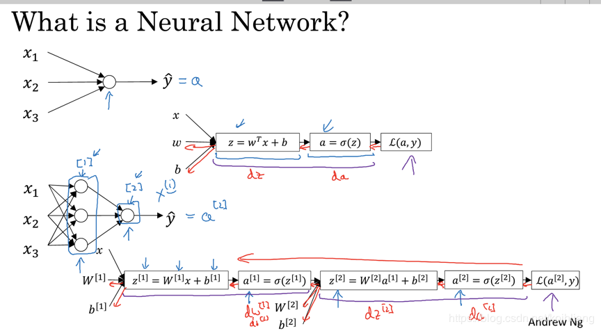

# 第四节课上课总结
## 线性分类
### 摘要
分类问题在很多资料中都称之为逻辑回归，Logistic Regression，其原因是使用了线性回归中的线性模型，加上一个Logistic二分类函数，共同构造了一个分类器。我们在本书中统称之为分类。

神经网络的一个重要功能就是分类，现实世界中的分类任务复杂多样，但万变不离其宗，我们都可以用同一种模式的神经网络来处理。

本部分中，我们从最简单的线性二分类开始学习，包括其原理，实现，训练过程，推理过程等等，并且以可视化的方式来帮助大家更好地理解这些过程。

在第二步中，我们学习了实现逻辑非门，在本部分中，我们将利用学到的二分类知识，实现逻辑与门、与非门，或门，或非门。

做二分类时，我们一般用Sigmoid函数做分类函数，那么和Sigmoid函数长得特别像的双曲正切函数能不能做分类函数呢？我们将会探索这件事情，从而对分类函数、损失函数、样本标签有更深的理解。

然后我们将进入线性多分类的学习。多分类时，可以一对一、一对多、多对多，那么神经网络使用的是哪种方式呢？

Softmax函数是多分类问题的分类函数，通过对它的分析，我们学习多分类的原理、实现、以及可视化结果，从而理解神经网络的工作方式。
### 逻辑回归模型
回归问题可以分为两类：线性回归和逻辑回归。

逻辑回归的英文是Logistic Regression，逻辑回归是用来计算“事件=Success”和“事件=Failure”的概率。当因变量的类型属于二元（1 / 0，真/假，是/否）变量时，我们就应该使用逻辑回归。

逻辑回归的另外一个名字叫做分类器，分为线性分类器和非线性分类器，本章中我们学习线性分类器。而无论是线性还是非线性分类器，又分为两种：二分类问题和多分类问题

对于逻辑回归模型，可以理解成是有两个步骤的模型，第一步是计算w^{i_{}}^{_{}}x+b，第二步是计算sigmoid函数 

构建上图最上面的单层的神经网络，其实是希望通过样本数据（x_{k}^{m}，y^{m}），其中m表示样本的个数，k表示输入值x的特征向量数，得到一个全局成本函数的值最小的w_{k}和b。当有输入新的输入数据x时(新的输入数据x也必须要包含k个特征向量)时，根据w_{k}和b，能够得到y的预测值
### 线性二分类实现
#### 定义神经网络结构
我们只需要一个二入一出的神经元就可以搞定。这个网络只有输入层和输出层，由于输入层不算在内，所以是一层网络。

这次我们第一次使用了分类函数，所以有个A的输出，而不是以往的Z的输出。
#### 代码实现
从第5章的代码库ch05中，把一些已经写好的函数copy过来，形成一个BaseClassification.py文件，其中会包括神经网络训练的基本过程函数，加载数据，数据的归一化函数，结果显示函数等等。
#### 加载数据
基本的加载数据和对样本数据的归一化工作，都可以用前一章的代码来完成，统一集成在BaseClassification.py中了，下面代码中的from BaseClassification import *就是完成了代码引入的工作。但是对于标签数据，需要一个特殊处理。

遍历标签数据YData中所有记录，设置类别为1的标签为负例0，设置类别为2的标签为正例1。下载的数据中，被标记为1和2，表示第1类和第2类，需要转换成0/1。
#### 向前计算
前向计算需要增加分类函数调用：

#### 计算损失函数值
损失函数不再是均方差了，而是交叉熵函数对于二分类的形式。

#### 推理函数

#### 主程序

#### 运行结果

* 经纬度相对值为(5,1)时，概率为0.33，属于楚
* 经纬度相对值为(6,9)时，概率为0.93，属于汉
* 经纬度相对值为(5,5)时，概率为0.87，属于汉
#### 损失函数值记录

### 二分结果可视化
#### 可视化的重要性
我们虽然得到了结果，但都是一些神秘的数字，我们如何知道它们是正确还是错误的呢？

后面我们会讲到，在实际的工程实践中，一般我们会把样本分成训练集、验证集、测试集，用测试集来测试训练结果的正确性。在本例中我们没有这样做，原因有二：

1. 样本数据量比较少，一共只有200个样本，如果再分成两部分，会造成数据集覆盖不全面，存在很大的差异，对训练、验证、测试都没有帮助
2. 由于本例的数据特征比较少，所以我们有更好的手段：可视化。在神经网络学习初期，可视化的训练过程与结果会对读者有巨大的帮助。

神经网络的可视化，说简单也很简单，说难也很难，关键是对框架系统的理解，对运行机制和工作原理的理解，掌握了这些，可视化就会使一件轻而易举且令人愉快的事情。
## 总结与心得体会
通过本节课的学习，我了解了什么是二分类函数，对率函数Logistic Function，即可以做为激活函数使用，又可以当作二分类函数使用。而在很多不太正规的文字材料中，把这两个概念混用了，比如下面这个说法：“我们在最后使用Sigmoid激活函数来做二分类”，这是不恰当的。在本书中，我们会根据不同的任务区分激活函数和分类函数这两个概念，在二分类任务中，叫做Logistic函数，而在作为激活函数时，叫做Sigmoid函数。还学习了线性二分类的工作原理和可视化，以及实现逻辑与门和或门，本节课的学习，使我对神经网络的算法有了更深一步的理解，也为之后更加深层次的学习打下了良好的基础。
