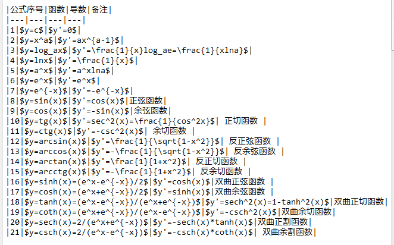

## 第一次课堂总结
通过本节课的学习，我们了解了神经网络的基本原理以及它的工作原理等内容。了解了神经网络基本的训练和工作原理，以及反向传播和梯度下降，梯度下降是神经网络的基本学习方法，配合图示化的图解崽运用单变量和双变量的方法
### 1.0 神经网络的基本工作原理
#### 1.0.1神经元细胞的数学模型
  神经网络是由基本的神经元组成，下图就是一个神经元的数学模型，便于我们用程序来实现。
 
（1）.输入 input：（x1,x2,xx3)是外界输入信号，一般是一个训练数据样本的多个属性。

（2）.权重 weights:(w1,w2,w3)是每个输入信号的权重值，权重值相加之后可以不是1。
（3）.偏移 bias:$y=wx+b$，b是偏移值，使得直线能够沿Y轴上下移动。从生物学上解释，在脑神经细胞中，一定是输入信号的电平/电流大于某个临界值时，神经元细胞才会处于兴奋状态，这个b实际就是那个临界值。
(4).求和计算sum：
(5).激活函数activation:求和之后，神经细胞已经处于兴奋状态了，已经决定要向下一个神经元传递信号了，但是要传递多强烈的信号，要由激活函数来确定：
$$A=a{(Z)}$$
#### 1.0.2 神经网络的训练过程
假设我们有以下训练数据样本：
|Id|x1|x2|x3|Y| |---|---|---|---|---| |1|0.5|1.4|2.7|3| |2|0.4|1.3|2.5|5| |3|0.1|1.5|2.3|9| |4|0.5|1.7|2.9|1|
其中，x1，x2，x3是每一个样本数据的三个特征值，Y是样本的真实结果值：

(1). 随机初始化权重矩阵，可以根据高斯分布或者正态分布等来初始化。这一步可以叫做“蒙”，但不是瞎蒙。
(2). 拿一个或一批数据作为输入，带入权重矩阵中计算，再通过激活函数传入下一层，最终得到预测值。在本例中，我们先用Id-1的数据输入到矩阵中，得到一个A值，假设A=5
(3). 拿到Id-1样本的真实值Y=3
(4). 计算损失，假设用均方差函数 $Loss = (A-Y)^2=(5-3)^2=4$
(5). 根据一些神奇的数学公式（反向微分），把Loss=4这个值用大喇叭喊话，告诉在前面计算的步骤中，影响A=5这个值的每一个权重矩阵，然后对这些权重矩阵中的值做一个微小的修改（当然是向着好的方向修改，这一点可以用数学家的名誉来保证）
(6). 用Id-2样本作为输入再次训练（goto 2）
(7). 这样不断地迭代下去，直到以下一个或几个条件满足就停止训练：损失函数值非常小；迭代了指定的次数；

训练完成后，我们会把这个神经网络中的结构和权重矩阵的值导出来，形成一个计算图（就是矩阵运算加上激活函数）模型，然后嵌入到任何可以识别/调用这个模型的应用程序中，根据输入的值进行运算，输出预测值。
#### 1.0.3 神经网络中的矩阵运算
#### 1.0.4神经网络的主要功能
(1).回归、拟合Regression/fitting
(2).分类Classification
### 基本数学导学公式
#### 1.1.1基本函数及其倒数

#### 1.1.2导数的四则运算
$$[u(x) + v(x)]' = u'(x) + v'(x) \tag{30}$$
$$[u(x) - v(x)]' = u'(x) - v'(x) \tag{31}$$
$$[u(x)*v(x)]' = u'(x)*v(x) + v'(x)*u(x) \tag{32}$$
$$[\frac{u(x)}{v(x)}]'=\frac{u'(x)v(x)-v'(x)u(x)}{v^2(x)} \tag{33}$$
####  1.1.3 偏导数
如$Z=f(x,y)$，则Z对x的偏导可以理解为当y是个常数时，Z单独对x求导：

$$Z'_x=f'_x(x,y)=\frac{\partial{Z}}{\partial{x}} \tag{40}$$

则Z对y的偏导可以理解为当x是个常数时，Z单独对y求导：

$$Z'_y=f'_y(x,y)=\frac{\partial{Z}}{\partial{y}} \tag{41}$$

在二元函数中，偏导的何意义，就是对任意的$y=y_0$的取值，在二元函数曲面上做一个$y=y_0$切片，得到$Z = f(x, y_0)$的曲线，这条曲线的一阶导数就是Z对x的偏导。对$x=x_0$同样，就是Z对y的偏导。
#### 1.1.4 掌握复合函数求导即链式法则
#### 1.1.5 了解了矩阵求导以及标量对矩阵倒数的定义和矩阵迹导数的部分性质
### 总结
  通过本节课的学习，我对基本数学导数公式有了初步的了解，熟练掌握了基本函数及其导数的运算，也同时学习了神经网络的基本工作原理，神经网络是通过对人脑的基本单元——神经元的建模和联接，探索模拟人脑神经系统功能的模型，并研制一种具有学习、联想、记忆和模式识别等智能信息处理功能的人工系统。神经网络的一个重要特性是它能够从环境中学习，并把学习的结果分布存储于网络的突触连接中。神经网络的学习是一个过程，在其所处环境的激励下，相继给网络输入一些样本模式，并按照一定的规则学习算法调整网络各层的权值矩阵，待网络各层权值都收敛到一定值，学习过程结束。