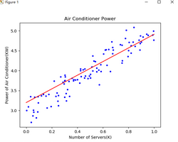
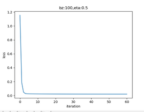
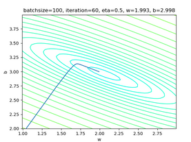
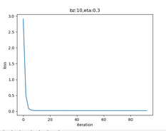
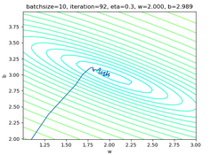
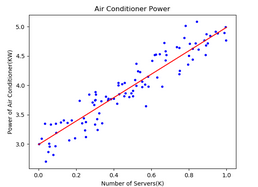
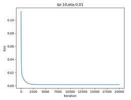

## 第三次课堂总结
 通过本节课的学习，我了解了线性回归方面的一系列问题，以及多变量线性回归的有关问题
 ### 对最小二乘法的理解
 (1)  最小二乘法，也叫做最小平方法（Least Square），它通过最小化误差的平方和寻找数据的最佳函数匹配。利用最小二乘法可以简便地求得未知的数据，并使得这些求得的数据与实际数据之间误差的平方和为最小。最小二乘法还可用于曲线拟合。

(2) 数学原理

线性回归试图学得：
$$z(xi)=w \cdot xi+b \tag{1}$$

使得：
$$z(xi) \simeq yi \tag{2}$$

其中，$xi$是样本特征值，$yi$是样本标签值，$z_i$是模型预测值。

### 对梯度下降的理解
(1) 数学原理:在下面的公式中，我们规定x是样本特征值（单特征），y是样本标签值，z是预测值，下标 $i$ 表示其中一个样本。

预设函数（Hypothesis Function）

为一个线性函数：
$$zi = xi \cdot w + b \tag{1}$$

损失函数（Loss Function）

为均方差函数：
$$loss(w,b) = \frac{1}{2} (zi-yi)^2 \tag{2}$$

(2) 梯度计算

计算z的梯度
根据公式2： $$ {\partial loss \over \partial zi}=zi - y_i \tag{3} $$

计算w的梯度

我们用loss的值作为误差衡量标准，通过求w对它的影响，也就是loss对w的偏导数，来得到w的梯度。由于loss是通过公式2->公式1间接地联系到w的，所以我们使用链式求导法则，通过单个样本来求导。
根据公式1和公式3：
$$ {\partial{loss} \over \partial{w}} = \frac{\partial{loss}}{\partial{zi}}\frac{\partial{zi}}{\partial{w}}=(z_i-yi)xi \tag{4} $$

计算b的梯度
$$ \frac{\partial{loss}}{\partial{b}} = \frac{\partial{loss}}{\partial{zi}}\frac{\partial{zi}}{\partial{b}}=zi-yi \tag{5} $$

### 对神经网络法的理解
(1)定义神经网络结构

1.输入层

2.权重w/b

3.输出层

输出层1个神经元，线性预测公式是：
$$zi = xi \cdot w + b$$
z是模型的预测输出，y是实际的样本标签值，下标 $i$ 为样本。

4.损失函数:
因为是线性回归问题，所以损失函数使用均方差函数。
$$loss(w,b) = \frac{1}{2} (zi-yi)^2$$

(2) 反向传播

计算w的梯度:
$$ {\partial{loss} \over \partial{w}} = \frac{\partial{loss}}{\partial{zi}}\frac{\partial{zi}}{\partial{w}}=(z_i-yi)xi $$

计算b的梯度:
$$ \frac{\partial{loss}}{\partial{b}} = \frac{\partial{loss}}{\partial{zi}}\frac{\partial{zi}}{\partial{b}}=zi-yi $$

(3)运行结果

### 多样本单特征值计算
(1) 前向计算

(2) 损失函数

(3) 求w的梯度

用 J 的值作为基准，去求 w 对它的影响，也就是 J 对 w 的偏导数，就可以得到w的梯度了。从公式3看 J 的计算过程，$z1、z2、z3$都对它有贡献；再从公式2看$z1、z2、z3$的生成过程，都有w的参与。所以，J 对 w 的偏导应该是这样的：

$$ \frac{\partial{J}}{\partial{w}}=\frac{\partial{J}}{\partial{z1}}\frac{\partial{z1}}{\partial{w}}+\frac{\partial{J}}{\partial{z2}}\frac{\partial{z2}}{\partial{w}}+\frac{\partial{J}}{\partial{z3}}\frac{\partial{z3}}{\partial{w}} $$ $$ =\frac{1}{3}[(z1-y1)x1+(z2-y2)x2+(z3-y3)x3] $$ $$ =\frac{1}{3} \begin{pmatrix} x1 & x2 & x3 \end{pmatrix} \begin{pmatrix} z1-y1 \ z2-y2 \ z3-y3 \end{pmatrix} \tag{m=3} $$ $$ =\frac{1}{m} X^T \cdot (Z-Y) \tag{4} $$ $$ =\frac{1}{m} \sum^m{i=1} (zi-yi)xi \tag{5} $$

其中： $$X = \begin{pmatrix} x1 \ x2 \ x3 \end{pmatrix}, X^T = \begin{pmatrix} x1 & x2 & x3 \end{pmatrix} $$

公式4和公式5其实是等价的，只不过公式5用求和方式计算每个样本，公式4用矩阵方式做一次性计算。

(4) 求b的梯度

$$ \frac{\partial{J}}{\partial{b}}=\frac{\partial{J}}{\partial{z1}}\frac{\partial{z1}}{\partial{b}}+\frac{\partial{J}}{\partial{z2}}\frac{\partial{z2}}{\partial{b}}+\frac{\partial{J}}{\partial{z3}}\frac{\partial{z3}}{\partial{b}} $$ $$ =\frac{1}{3}[(z1-y1)+(z_2-y2)+(z3-y3)] $$ $$ =\frac{1}{m} \sum^m{i=1} (zi-yi) \tag{6} $$ $$ =\frac{1}{m}(Z-Y) \tag{7} $$

公式6和公式7也等价，在python中，可以直接用公式7求矩阵的和，免去了一个个计算$zi-yi$最后再求和的麻烦，速度还快。

Python def __backwardBatch(self, batch_x, batch_y, batch_z): m = batch_x.shape[0] dZ = batch_z - batch_y dW = np.dot(batch_x.T, dZ)/m dB = dZ.sum(axis=0, keepdims=True)/m return dW, dB
### 梯度下降的三种形式
(1) 全批量梯度下降

(2) 单批量梯度下降

(3) 小批量梯度下降

### 实现逻辑非门
单层神经网络，又叫做感知机，它可以轻松实现逻辑与、或、非门。由于逻辑与、或门，需要有两个变量输入，目前我们只学习了单变量输入，所以，我们可以先实现非门。

很多阅读材料上会这样介绍：有公式 $z=wx+b$，令$w=-1,b=1$，则：
当x=0时，$z = -1 \times 0 + 1 = 1$
当x=1时，$z = -1 \times 1 + 1 = 0$

(1) 简单的推导方法

做函数拟合（回归）时，我们假设函数H为：
$$h(w,b) = b + x1 w1+x2 w2+...+xn wn \tag{2}$$
令$b=w_0$，则：

$$h(w) = w0 + x1 \cdot w1 + x2 \cdot w2+...+ xn \cdot w_n\tag{3}$$

公式3中的x是一个样本的n个特征值，如果我们把m个样本一起计算，将会得到下面这个矩阵：
$$H(w) = X \cdot W \tag{4}$$

公式5中的X和W的矩阵形状如下：
$$ X^{(m \times (n+1))} = \begin{pmatrix} 1 & x{1,1} & x{1,2} & \dots & x{1,n} \ 1 & x{2,1} & x{2,2} & \dots & x{2,n} \ \dots \ 1 & x{m,1} & x{m,2} & \dots & x_{m,n} \end{pmatrix} \tag{5} $$
$$ W^{(n+1)}= \begin{pmatrix} w0 \ w1 \ \dots \ w_n \end{pmatrix} \tag{6} $$

然后我们期望假设函数的输出与真实值一致，则有：
$$H(w) = X \cdot W = Y \tag{7}$$

其中，Y的形状如下：
$$ Y^{(m)}= \begin{pmatrix} y1 \ y2 \ \dots \ y_m \end{pmatrix} \tag{8} $$

直观上看，W = Y/X，但是这里三个值都是矩阵，而矩阵没有除法，所以需要得到X的逆矩阵，用Y乘以X的逆矩阵即可。但是又会遇到一个问题，只有方阵才有逆矩阵，而X不一定是方阵，所以要先把左侧变成方阵，就可能会有逆矩阵存在了。所以，先把等式两边同时乘以X的转置矩阵，以便得到X的方阵：
$$X^T X W = X^T Y \tag{9}$$

其中，$X^T$是X的转置矩阵，$X^T X$一定是个方阵，并且假设其存在逆矩阵，把它移到等式右侧来：
$$W = (X^T X)^{-1}{X^T Y} \tag{10}$$

至此可以求出W的正规方程。

(2) 复杂的推导方法

我们仍然使用均方差损失函数：
$$J(w,b) = \sum (zi - yi)^2 \tag{11}$$

把b看作是一个恒等于1的feature，并把z=XW计算公式带入，并变成矩阵形式：
$$J(w) = \sum (xi wi -y_i)^2=(XW - Y)^T \cdot (XW - Y) \tag{12}$$

对w求导，令导数为0，就是W的最小值解：
$${\partial J(w) \over \partial w} = {\partial \over \partial w}[(XW - Y)^T \cdot (XW - Y)]$$ $$ ={\partial \over \partial w}[(X^TW^T - Y^T) \cdot (XW - Y)]$$ $$ ={\partial \over \partial w}[(X^TXW^TW -X^TW^TY - Y^TXW + Y^TY)] \tag{13}$$

求导后：
第一项的结果是：$2X^TXW$

第二项和第三项的结果都是：$X^TY$

第四项的结果是：0
再令导数为0：
$$ J'(w)=2X^TXW - 2X^TY=0 \tag{14} $$ $$ X^TXW = X^TY \tag{15} $$ $$ W=(X^TX)^{-1}X^TY \tag{16} $$

结论和公式10一样。
以上推导的基本公式可以参考第0章的公式60-69。

逆矩阵$(X^TX)^{-1}$可能不存在的原因是： 1. 特征值冗余，比如$x2=x^21$，即正方形的边长与面积的关系，不能做为两个特征同时存在 2. 特征数量过多，比如特征数n比样本数m还要大

以上两点在我们这个具体的例子中都不存在。
### 样本特征数据归一化
(1) 归一化的基本概念

有三个类似的概念，归一化，标准化，中心化。
归一化

把数据线性地变成[0,1]或[-1,1]之间的小数，把带单位的数据（比如米，公斤）变成无量纲的数据，区间缩放。归一化有三种方法:

1.Min-Max归一化： $$x{new}={x-x{min} \over x{max} - x{min}} \tag{1}$$

2.平均值归一化

$$x{new} = {x - \bar{x} \over x{max} - x_{min}} \tag{2}$$

3.非线性归一化
对数转换： $$y=log(x) \tag{3}$$
反余切转换： $$y=atan(x) \cdot 2/π \tag{4}$$

标准化：
把每个特征值中的所有数据，变成平均值为0，标准差为1的数据，最后为正态分布。

Z-score规范化（标准差标准化 / 零均值标准化，其中std是标准差）：
$$x_{new} = (x - \bar{x})／std \tag{5}$$

中心化：
平均值为0，无标准差要求： $$x_{new} = x - \bar{x} \tag{6}$$

(2) 运行结果

### 正确的推理预测方法
我们在针对训练数据做归一化时，得到的最重要的数据是训练数据的最小值和最大值，我们只需要把这两个值记录下来，在预测时使用它们对预测数据做归一化，这就相当于把预测数据“混入”训练数据。前提是预测数据的特征值不能超出训练数据的特征值范围，否则有可能影响准确程度。
### 对标签值归一化
