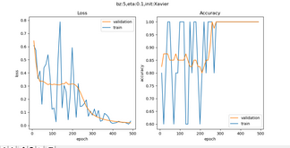
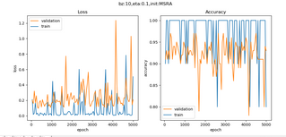

## 第五次课堂总结
  通过本节课的学习，我了解了深度神经网络相关的知识、二分类任务以及多分类任务的有关问题。
  ### 搭建深度神经网络框架
  #### NeuralNet
需要一个NeuralNet类，来包装基本的神经网络结构和功能：
+ Layers - 神经网络各层的容器，按添加顺序维护一个列表
+ Parameters - 基本参数，包括普通参数和超参
+ Loss Function - 提供计算损失函数值，存储历史记录并最后绘图的功能
+ LayerManagement() - 添加神经网络层
+ ForwardCalculation() - 调用各层的前向计算方法
+ BackPropagation() - 调用各层的反向传播方法
+ PreUpdateWeights() - 预更新各层的权重参数
+ UpdateWeights() - 更新各层的权重参数
+ Train() - 训练
+ SaveWeights() - 保存各层的权重参数
+ LoadWeights() - 加载各层的权重参数
#### Layer
是一个抽象类，以及更加需要增加的实际类，包括： - Fully Connected Layer - Classification Layer - Activator Layer - Dropout Layer - Batch Norm Layer

将来还会包括： - Convolution Layer - Max Pool Layer

每个Layer都包括以下基本方法： - ForwardCalculation() - 调用本层的前向计算方法 - BackPropagation() - 调用本层的反向传播方法 - PreUpdateWeights() - 预更新本层的权重参数 - UpdateWeights() - 更新本层的权重参数 - SaveWeights() - 保存本层的权重参数 - LoadWeights() - 加载本层的权重参数

#### Activator Layer
激活函数和分类函数：
+ Identity - 直传函数，即没有激活处理
+ Sigmoid
+ Tanh
+ Relu
#### Classification Layer
分类函数，包括： - Sigmoid二分类 - Softmax多分类
#### Parameters
基本神经网络运行参数：
+ 学习率
+ 最大epoch
+ batch size
+ 损失函数定义
+ 初始化方法
+ 优化器类型
+ 停止条件
+ 正则类型和条件
#### LossFunction
损失函数及帮助方法：
+ 均方差函数
+ 交叉熵函数二分类
+ 交叉熵函数多分类
+ 记录损失函数
+ 显示损失函数历史记录
+ 获得最小函数值时的权重参数
#### Optimizer
优化器：
+ SGD
+ Momentum
+ Nag
+ AdaGrad
+ AdaDelta
+ RMSProp
+ Adam
#### WeightsBias
权重矩阵，仅供全连接层使用：
+ 初始化
Zero,Normal, MSRA (HE), Xavier

保存初始化值

加载初始化值
+ Pre_Update - 预更新
+ Update - 更新
+ Save - 保存训练结果值
+ Load - 加载训练结果值
#### DataReader
样本数据读取器：
+ ReadData - 从文件中读取数据
+ NormalizeX - 归一化样本值
+ NormalizeY - 归一化标签值
+ GetBatchSamples - 获得批数据
+ ToOneHot - 标签值变成OneHot编码用于多分类
+ ToZeorOne - 标签值变成0/1编码用于二分类
+ Shuffle - 打乱样本顺序
### 回归试验 - 万能近似定理
代码实现：

### 反向传播四大公式推导
$$\delta^{L} = \nabla{a}C \odot \sigma{'}(Z^L) \tag{80}$$ $$\delta^{l} = ((W^{l + 1})^T\delta^{l+1})\odot\sigma{'}(Z^l) \tag{81}$$ $$\frac{\partial{C}}{\partial{bj^l}} = \deltaj^l \tag{82}$$ $$\frac{\partial{C}}{\partial{w{jk}^{l}}} = ak^{l-1}\deltaj^l \tag{83}$$
### 双弧形非线性二分类

### 多分类功能测试 - “铜钱孔分类”问题
+ 搭建模型一

模型

使用Sigmoid做为激活函数的两层网络：

运行代码：

+ 搭建模型二

模型

使用Relu做为激活函数的三层网络：

用两层网络也可以实现，但是使用Relu函数时，训练效果不是很稳定，用三层比较保险。

运行代码：

### 多分类任务 - MNIST手写体识别
运行代码：

