## 第六次课堂总结
  通过本节课的学习，我了解网络优化相关的问题，以及批量化归一化的原理及其实现。
### 权重矩阵初始化
(1) 零初始化

即把所有层的W值的初始值都设置为0。

$$ W = 0 $$

但是对于多层网络来说，绝对不能用零初始化，否则权重值不能学习到合理的结果。看下面的零值初始化的权重矩阵值打印输出： W= [[-0.82452497 -0.82452497 -0.82452497]] B= [[-0.01143752 -0.01143752 -0.01143752]] W= [[-0.68583865] [-0.68583865] [-0.68583865]] B= [[0.68359678]]

可以看到W1、B1、W2内部3个单元的值都一样，这是因为初始值都是0，所以梯度均匀回传，导致所有w的值都同步更新，没有差别。这样的话，无论多少论，最终的结果也不会正确。

(2) 随机初始化

把W初始化均值为0，方差为1的矩阵：

$$ W \sim G \begin{bmatrix} 0, 1 \end{bmatrix} $$

(3) Xavier初始化方法

条件：正向传播时，激活值的方差保持不变；反向传播时，关于状态值的梯度的方差保持不变。

$$ W \sim U \begin{bmatrix} -\sqrt{{6 \over n{input} + n{output}}}, \sqrt{{6 \over n{input} + n{output}}} \end{bmatrix} $$

假设激活函数关于0对称，且主要针对于全连接神经网络。适用于tanh和softsign。

即权重矩阵参数应该满足在该区间内的均匀分布。其中的W是权重矩阵，U是Uniform分布，即均匀分布。

(4) MSRA初始化方法

又叫做He方法，因为作者姓何。

条件：正向传播时，状态值的方差保持不变；反向传播时，关于激活值的梯度的方差保持不变。
### 梯度下降优化算法
(1) 随机梯度下降 SGD

输入和参数

$\eta$ - 全局学习率

算法

计算梯度：$gt = \nabla\theta J(\theta_{t-1})$

更新参数：$\thetat = \theta{t-1} - \eta \cdot g_t$

(2)动量算法 Momentum

Momentum算法借用了物理中的动量概念，它模拟的是物体运动时的惯性，即更新的时候在一定程度上保留之前更新的方向，同时利用当前batch的梯度微调最终的更新方向。这样一来，可以在一定程度上增加稳定性，从而学习地更快，并且还有一定摆脱局部最优的能力。Momentum算法会观察历史梯度，若当前梯度的方向与历史梯度一致（表明当前样本不太可能为异常点），则会增强这个方向的梯度。若当前梯度与历史梯方向不一致，则梯度会衰减。

输入和参数

+ $\eta$ - 全局学习率
+ $\alpha$ - 动量参数，一般取值为0.5, 0.9, 0.99
+ $v_t$ - 当前时刻的动量，初值为0

算法

计算梯度：$gt = \nabla\theta J(\theta_{t-1})$

计算速度更新：$vt = \alpha \cdot v{t-1} + \eta \cdot g_t$ (公式1)

更新参数：$\thetat = \theta{t-1} - v_t$ (公式2)

(3) 梯度加速算法 NAG

输入和参数
+ $\eta$ - 全局学习率
+ $\alpha$ - 动量参数，缺省取值0.9
+ v - 动量，初始值为0

算法

+ 临时更新：$\hat \theta = \theta{t-1} - \alpha \cdot v{t-1}$
+ 前向计算：$f(\hat \theta)$
+ 计算梯度：$gt = \nabla{\hat\theta} J(\hat \theta)$
+ 计算速度更新：$vt = \alpha \cdot v{t-1} + \eta \cdot g_t$
+ 更新参数：$\thetat = \theta{t-1} - v_t$

代码运行：

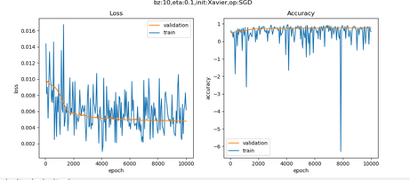

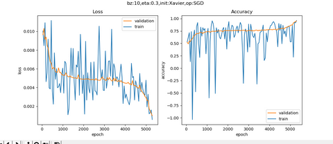

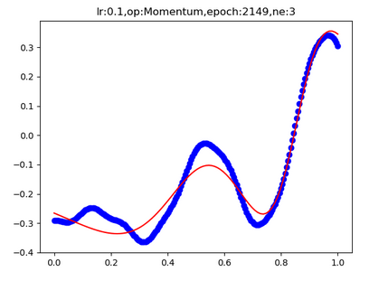

### 自适应学习率算法

(1)AdaGrad

 输入和参数
+ $\eta$ - 全局学习率
+ $\epsilon$ - 用于数值稳定的小常数，建议缺省值为1e-6
+ r = 0 初始值

算法

+ 计算梯度：$gt = \nabla\theta J(\theta_{t-1})$
+ 累计平方梯度：$rt = r{t-1} + gt \odot gt$
+ 计算梯度更新：$\Delta \theta = {\eta \over \epsilon + \sqrt{rt}} \odot gt$
+ 更新参数：$\thetat=\theta{t-1} - \Delta \theta$

从AdaGrad算法中可以看出，随着算法不断迭代，r会越来越大，整体的学习率会越来越小。所以，一般来说AdaGrad算法一开始是激励收敛，到了后面就慢慢变成惩罚收敛，速度越来越慢。r值的变化如下：
+ $r_0 = 0$
+ $r1=g1^2$
+ $r2=g1^2+g_2^2$
+ $r3=g1^2+g2^2+g3^2$

(2)  AdaDelta

输入和参数
+ $\epsilon$ - 用于数值稳定的小常数，建议缺省值为1e-5
+ $\alpha \in [0,1)$ - 衰减速率，建议0.9
s - 累积变量，初始值0
r - 累积变量变化量，初始为0

算法
+ 计算梯度：$gt = \nabla\theta J(\theta_{t-1})$
+ 累积平方梯度：$st = \alpha \cdot s{t-1} + (1-\alpha) \cdot gt \odot gt$
+ 计算梯度更新：$\Delta \theta = \sqrt{r{t-1} + \epsilon \over st + \epsilon} \odot g_t$
+ 更新梯度：$\thetat = \theta{t-1} - \Delta \theta$
+ 更新变化量：$r = \alpha \cdot r_{t-1} + (1-\alpha) \cdot \Delta \theta \odot \Delta \theta$

(3) 均方根反向传播 RMSProp

输入和参数
+ $\eta$ - 全局学习率，建议设置为0.001
+ $\epsilon$ - 用于数值稳定的小常数，建议缺省值为1e-8
+ $\alpha$ - 衰减速率，建议缺省取值0.9
+ $r$ - 累积变量矩阵，与+ $\theta$尺寸相同，初始化为0

算法
+ 计算梯度：$gt = \nabla\theta J(\theta_{t-1})$
+ 累计平方梯度：$r = \alpha \cdot r + (1-\alpha)(gt \odot gt)$
+ 计算梯度更新：$\Delta \theta = {\eta \over \sqrt{r + \epsilon}} \odot g_t$
+ 更新参数：$\theta{t}=\theta{t-1} - \Delta \theta$

(4) Adam - Adaptive Moment Estimation

输入和参数
+ t - 当前迭代次数
+ $\eta$ - 全局学习率，建议缺省值为0.001
+ $\epsilon$ - 用于数值稳定的小常数，建议缺省值为1e-8
+ $\beta1, \beta2$ - 矩估计的指数衰减速率，$\in[0,1)$，建议缺省值分别为0.9和0.999

算法
+ 计算梯度：$gt = \nabla\theta J(\theta_{t-1})$
+ 计数器加一：$t=t+1$
+ 更新有偏一阶矩估计：$mt = \beta1 \cdot m_{t-1} + (1-\beta1) \cdot gt$
+ 更新有偏二阶矩估计：$vt = \beta2 \cdot v{t-1} + (1-\beta2)(gt \odot gt)$
+ 修正一阶矩的偏差：$\hat mt = mt / (1-\beta_1^t)$
+ 修正二阶矩的偏差：$\hat vt = vt / (1-\beta_2^t)$
+ 计算梯度更新：$\Delta \theta = \eta \cdot \hat mt /(\epsilon + \sqrt{\hat vt})$
+ 更新参数：$\thetat=\theta{t-1} - \Delta \theta$

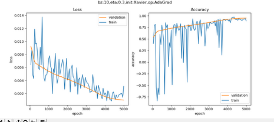

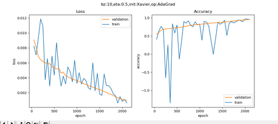

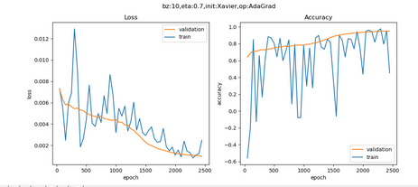

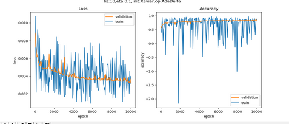

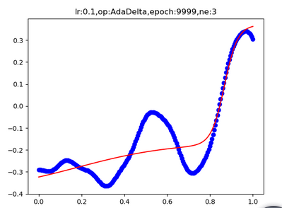

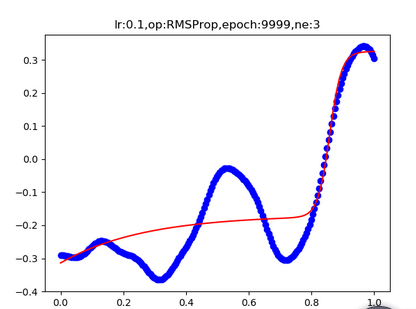

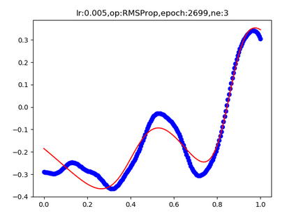

### 算法在等高线图上的效果比较

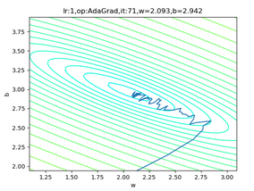

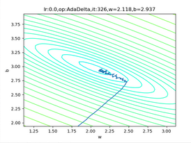

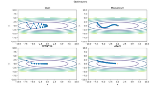

### 批量归一化的原理
(1) 前向计算

符号表

下表中，m表示batch_size的大小，比如32或64个样本/批；n表示features数量，即样本特征值数量。

|符号|数据类型|数据形状| |:---------:|:-----------:|:---------:| |$X$| 输入数据矩阵 | [m, n] | |$xi$|输入数据第i个样本| [1, n] | |$N$| 经过归一化的数据矩阵 | [m, n] | |$ni$| 经过归一化的单样本 | [1, n] | |$\mu_B$| 批数据均值 | [1, n] | |$\sigma^2B$| 批数据方差 | [1, n] | |$m$|批样本数量| [1] | |$\gamma$|线性变换参数| [1, n] | |$\beta$|线性变换参数| [1, n] | |$Z$|线性变换后的矩阵| [1, n] | |$zi$|线性变换后的单样本| [1, n] | |$\delta$| 反向传入的误差 | [m, n] |

如无特殊说明，以下乘法为元素乘，即element wise的乘法。

在训练过程中，针对每一个batch数据，m是批的大小。进行的操作是，将这组数据正则化，之后对其进行线性变换。
具体的算法步骤是：

$$ \muB = {1 \over m}\sum1^m x_i \tag{6} $$
$$ \sigma^2B = {1 \over m} \sum1^m (xi-\muB)^2 \tag{7} $$
$$ ni = {xi-\muB \over \sqrt{\sigma^2B + \epsilon}} \tag{8} $$
$$ zi = \gamma ni + \beta \tag{9} $$

其中，$\gamma 和 \beta$是训练出来的，$\epsilon$是防止$\mu_B^2$为0时加的一个很小的数值，通常为1e-5。

计算图（示意）

下图是一张示意的计算图，用于帮助我们搞清楚正向和反向的过程：

$X1,X2,X3$表示三个样本（实际上一般用32，64这样的批大小），我们假设每个样本只有一个特征值（否则X将会是一个样本数乘以特征值数量的矩阵）。 1. 先从一堆X中计算出$\muB$； 2. 再用X和$\muB$计算出$\sigmaB$； 3. 再用X和$\muB$、$\sigmaB$计算出$ni$，每个x对应一个n； 4. 最后用$\gamma 和 \beta$，把n转换成z，每个z对应一个n。

###  测试和推理时的归一化方法

批量归一化的“批量”两个字，表示在训练过程中需要有一小批数据，比如32个样本。而在测试过程或推理时，我们只有一个样本的数据，根本没有mini-batch的概念，无法计算算出正确的均值。因此，我们使用的均值和方差数据是在训练过程中样本值的平均。也就是：

$$ E[x] = E[\muB] $$ $$ Var[x] = {m \over m-1} E[\sigma^2B] $$

一种做法是，我们把所有批次的$\mu$和$\sigma$都记录下来，然后在最后训练完毕时（或做测试时）平均一下。

另外一种做法是使用类似动量的方式，训练时，加权平均每个批次的值，权值$\alpha$可以为0.9：

$$m{t} = \alpha \cdot m{t-1} + (1-\alpha) \cdot \mut$$ $$v{t} = \alpha \cdot v{t-1} + (1-\alpha) \cdot \sigmat$$

测试或推理时，直接使用$mt和vt$的值即可。
###  算法在等高线图上的效果比较
(1) 模拟效果比较

我们依次测试4种方法：
普通SGD, 学习率0.95
动量Momentum, 学习率0.1
RMPSProp，学习率0.5
Adam，学习率0.5
每种方法都迭代20次，记录下每次反向过程的(x,y)坐标点，绘图如下：

SGD算法，每次迭代完全受当前梯度的控制，所以会以折线方式前进。

Momentum算法，学习率只有0.1，每次继承上一次的动量方向，所以会以比较平滑的曲线方式前进，不会出现突然的转向。

RMSProp算法，有历史梯度值参与做指数加权平均，所以可以看到比较平缓，不会波动太大，都后期步长越来越短也是符合学习规律的。

Adam算法，因为可以被理解为Momentum和RMSProp的组合，所以比Momentum要平缓一些，比RMSProp要平滑一些。

(2) 代码运行

