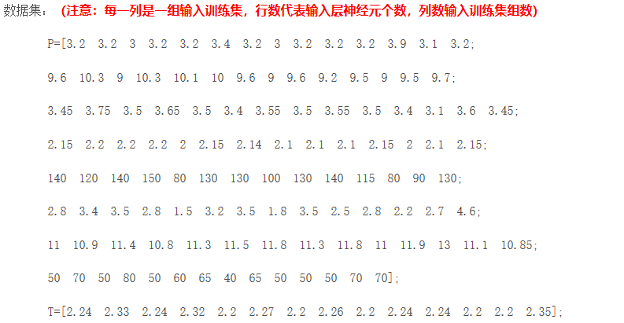
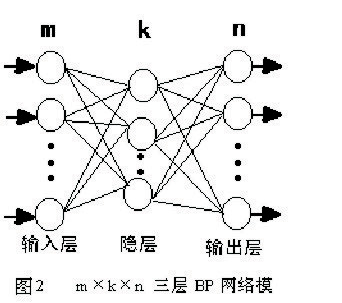
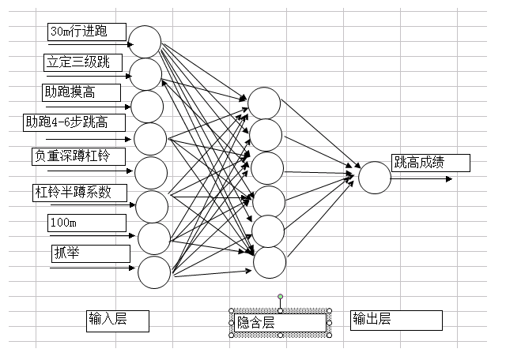

# 作业一
请举例分析BP神经网络的应用，思路尽量具体

## 数据预测之BP神经网络具体应用（跳高成绩预测）
### 数据整理
我们将前14组国内男子跳高运动员各项素质指标作为输入，即（30m行进跑，立定三级跳远，助跑摸高，助跑4-6步跳高，负重深蹲杠铃，杠铃半蹲系数，100m，抓举），将对应的跳高成绩作为输出。并用matlab自带的premnmx()函数将这些数据归一化处理。

###  模型建立
#### BP网络模型
BP网络（Back-ProPagation Network）又称反向传播神经网络， 通过样本数据的训练，不断修正网络权值和阈值使误差函数沿负梯度方向下降，逼近期望输出。它是一种应用较为广泛的神经网络模型，多用于函数逼近、模型识别分类、数据压缩和时间序列预测等。

P网络由输入层、隐层和输出层组成，隐层可以有一层或多层，图2是m×k×n的三层BP网络模型，网络选用S型传递函数， 通过反传误差函数 （ （Ti为期望输出、Oi为网络的计算输出），不断调节网络权值和阈值使误差函数E达到极小。
BP网络具有高度非线性和较强的泛化能力，但也存在收敛速度慢、迭代步数多、易于陷入局部极小和全局搜索能力差等缺点。可以先用遗传算法对“BP网络”进行优化在解析空间找出较好的搜索空间，再用BP网络在较小的搜索空间内搜索最优解。
### 模型求解
#### 网络结构设计
1. 输入输出层的设计
该模型由每组数据的各项素质指标作为输入，以跳高成绩作为输出，所以输入层的节点数为8，输出层的节点数为1。
2. 隐层设计
有关研究表明, 有一个隐层的神经网络, 只要隐节点足够多, 就可以以任意精度逼近一个非线性函数。因此, 本文采用含有一个隐层的三层多输入单输出的BP网络建立预测模型。在网络设计过程中, 隐层神经元数的确定十分重要。隐层神经元个数过多, 会加大网络计算量并容易产生过度拟合问题; 神经元个数过少, 则会影响网络性能, 达不到预期效果。网络中隐层神经元的数目与实际问题的复杂程度、输入和输出层的神经元数以及对期望误差的设定有着直接的联系。目前, 对于隐层中神经元数目的确定并没有明确的公式, 只有一些经验公式, 神经元个数的最终确定还是需要根据经验和多次实验来确定。本文在选取隐层神经元个数的问题上参照了以下的经验公式:

其中, n为输入层神经元个数, m 为输出层神经元个数, a 为[ 1, 10]之间的常数。 
根据上式可以计算出神经元个数为4-13个之间，在本次实验中选择隐层神经元个数为6.
网络结构示意图如下：

#### 激励函数的选取
BP神经网络通常采用Sigmoid可微函数和线性函数作为网络的激励函数。本文选择S型正切函数tansig作为隐层神经元的激励函数。而由于网络的输出归一到[ -1, 1]范围内, 因此预测模型选取S 型对数函数tansig作为输出层神经元的激励函数。
#### 模型的实现
此次预测选用MATLAB中的神经网络工具箱进行网络的训练, 预测模型的具体实现步骤如下:
将训练样本数据归一化后输入网络, 设定网络隐层和输出层激励函数分别为tansig和logsig函数, 网络训练函数为traingdx, 网络性能函数为mse,隐层神经元数初设为6。设定网络参数。网络迭代次数epochs为5000次, 期望误差goal为0.00000001, 学习速率lr为0. 01。设定完参数后, 开始训练网络。

该网络通过24次重复学习达到期望误差后则完成学习。
网络训练完成后，只需要将各项素质指标输入网络即可得到预测数据。

预测结果为：2.20