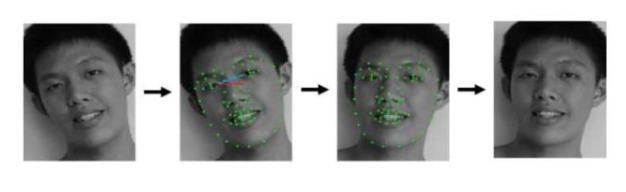

# 作业三
举例说明卷积神经网络的应用
## 卷积神经网络在人脸识别技术中的应用
首先介绍一下深度学习和机器学习的关系。人工智能包含了机器学习这一个子领域，机器学习又包含了表示学习（一种能自动抽取特征的学习方式），而深度学习则是表示学习中最具代表性的一种学习。 CNN 即卷积神经网络，就是深度学习中的一种。

机器学习的核心思想其实就是利用特征来学习到我们所需要的知识，因而一种新的工作出现了，那就是专门做特征工程的一类工程师。而特征工程的好坏，会影响机器学习最终效果。科学家们就想到，能不能让机器自动学习特征，而不需要让人去做特征工程呢？结论是：可以。表示学习就是利用特征去学习。深度学习的使用，其实非常简单，就是端到端的学习，只需要三步：第一，把数据给它（机器）；第二，等深度学习处理完；第三，拿到结果。
### 卷积神经网络概念
它的核心是卷积操作。
可以参考下图，左上角是一个 5*5 的绿色矩阵，矩阵中的黄色区域是一个 3*3 的卷积核。黄色区域的作用，是把覆盖在矩阵上的数进行加权求和，计算出来的数（见紫色区域）将会被放入一个新的矩阵。

然后看右上角的第二张图片，黄色的区域向右移动一位，就是一步，这个「步」指的是步长——CNN 里面的另一个参数（一个参数是卷积核），这里的步长被设置为 1 步。移动 1 步后，同样对黄色区域进行加权求和，又得出一个新的数（与第一个数一起被放入紫色区域）。
我们可以将整个黄色区域看成一个相框，大小、长宽都是固定的，顺序为从左往右、从上往下，移动三次，依次会出现三个新的数，再依次放到下一个矩阵中进行计算。这是一种局部操作，原始数据（5*5 的输入）经过 9 次卷积，就能得到卷积后的结果。这个结果叫做卷积特征，它是一个新的 3*3 矩阵——这个矩阵又作为下一层操作的输入，并进行一些池化操作。
### 人脸识别应用
总体分为四步：第一步就是人脸边框检测，第二步就是图像校准，第三步是图像转向量，第四步是向量对比。
1. 人脸边框检测。一张图片上，有可能不止一张脸，而是有多张脸。不管有多少张脸，我们先把符合人脸特征的边框找到，并且把边框给截取出来。根据定位截取。就是根据人脸特征来进行定位，就像刚刚所说的，如果某个位置有一只眼睛，其对称的地方也有一只眼睛，那（机器）就能找到眼部位置，进而也能找到眼角部分。在人脸识别中，边框特征范围非常重要，因为机器依靠这些，就可以划出完整的脸部位置。机器可以参照的主要特征之一是下巴，因为嘴角可以张开或者合闭，但是下巴一般不会有太大变动。第二个是眉毛——找到眼睛了，眉毛就好找了。第三个是鼻梁、鼻尖，上、下嘴唇。将这些特征都找到后，就要找到脸的边框——可能为方脸、瓜子脸以及圆脸，机器会在脸部边框上生成一些点，之后使用图形边框（如圆边框）去进行对比，发现差了一点，它就会不停调整系数，直到完全符合。但截取时，脸附近需要留出一定距离，不能完全按照边框去截取，例如，上图中的头发部分，（人）可能戴了帽子，因此机器就不能进行完全截取，而是在周围留出一定空间，再把图片截取出来。如果一张脸有多个点，那就截出多个人脸的边框。
   
2. 就是校准图像。这个概念其实跟计算机处理数据的思路一致。不管你给机器图片、语音、数字、字符串，或者是别的一些数据，它都会将其转化为计算机可以识别的数据。人脸校准也是，给机器的头不管是歪头、低头还是仰着头——位置都不正，那就先将脸边框截出来，为每个点进行定位（如下图中的绿点），再根据点定位出一个坐标，跟真正摆正的脸的坐标进行对比，二者相差的角度，就是头歪的角度，将图像反向旋转一下，图像就变正了。的计算上面——这个思想很重要。
   
3. 是图像转向量。该图像转向量是怎么生成的？就是卷积、池化操作过后生成的图像向量。向量既有大小又有方向，如果两个向量间的夹角非常小，那这两个向量就非常接近。
通过比较向量间的夹角，可以判断两个目标是否相似。例如，我们需要判断计算机视觉相关的两篇文章是否相似，首先我们要找到两篇文章，将其中一篇文章的关键词提取出来——一个关键词就是一个向量，所有关键词都找出来以后，计算一下向量的方向和大小。另外一篇也进行同样的操作，最后机器再对两组向量进行对比，如果几乎重合，则说明两篇文章的内容非常相似。向量的作用，在机器学习中是非常重要的。图像转向量之后，就需要把这个向量计算出来，然后和目标函数的向量做对比，再用余项定理求出它们之间的夹角——前面两篇相似文章的对比，就使用了这一定理。这一向量与目标向量不一定要完全重合，夹角在很小的情况下，只要在阈值之内，就可以判断二者相似，而阈值都是人为设置好的。
4. 向量对比。相同的人脸，对应的向量距离小；不同的人脸，向量距离自然就大。
向量计算中的有一个名词——内积，它是对应元素乘积的求和，可以计算出刚才上面所提到的夹角。夹角越小，说明两张人脸越相似。