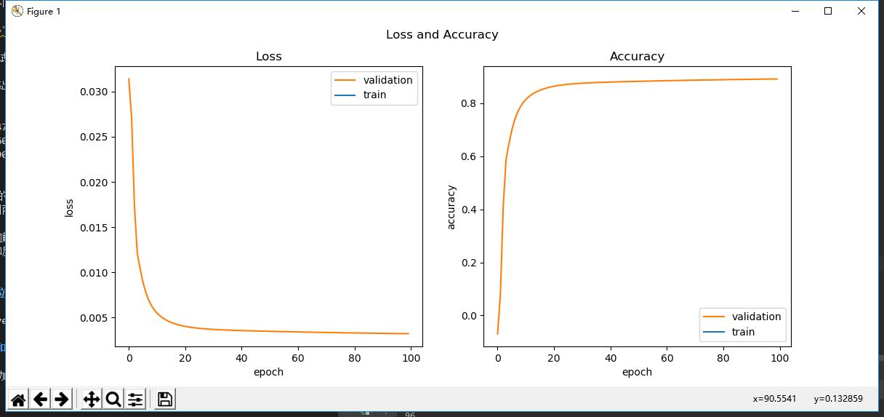
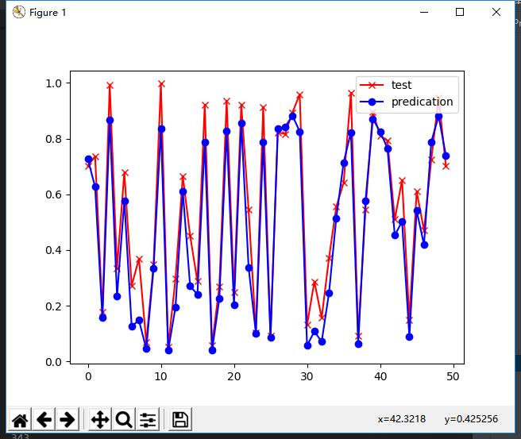

       ##  第十天学习

 ### RNN
 RNN（Recurrent Neural Network）是一类用于处理序列数据的神经网络。首先我们要明确什么是序列数据，摘取百度百科词条：时间序列数据是指在不同时间点上收集到的数据，这类数据反映了某一事物、现象等随时间的变化状态或程度。这是时间序列数据的定义，当然这里也可以不是时间，比如文字序列，但总归序列数据有一个特点——后面的数据跟前面的数据有关系。

我们先用一个最简单的序列问题来了解一下RNN的基本运作方式。

假设有一个随机信号发射器，每秒产生一个随机信号，随机值为(0,1)之间。信号发出后，碰到一面墙壁反射回来，来回的时间相加正好是1秒，于是接收器就收到了1秒钟之前的信号。对于接收端来说，可以把接收到的数据序列列表如下：

|时刻|t1|t2|t3|t4|t5|t6|...|
|---|---|---|---|---|---|---|---|
|发射随机信号X|0.35|0.46|0.12|0.69|0.24|0.94|...|
|接收回波信号Y|0|0.35|0.46|0.12|0.69|0.24|...|

具体的描述此问题：当接收端接收到两个连续的值，如0.35、0.46时，系统响应为0.35；下一个时间点接收到了0.12，考虑到上一个时间点的0.46，则二者组合成0.46、0.12序列，此时系统响应为0.46；依此类推，即接收到第二个数值时，总要返回相邻的第一个数值。

我们可以把发射信号看作X，把接收信号看作是Y，则此问题变成了给定样本X和标签值Y，训练一个神经网络，令其当接收到两个序列的值时，总返回第一个值。

读者可能会产生疑问：这个问题用一个最简单不过的程序就可以解决，我们为什么还要大动干戈地使用神经网络呢？如：

```Python
def echo(x1,x2):
    return x2
```

因为这是一个最基本的序列问题，我们先用它投石问路，逐步地理解RNN的精髓所在。

如果把发射信号和回波信号绘制成图，如下图所示：

局部放大图


图一：信号及回波样本序列

其中，红色叉子为样本数据点，蓝色圆点为标签数据点，它总是落后于样本数据一个时间步。还可以看到以上数据形成的曲线完全随机，毫无规律。

与前面学习的DNN和CNN的样本数据都不同，此时的样本数据为三维：
- 第一维：样本 x[0,:,:]表示第0个样本
- 第二维：时间 x[:,1,:]表示第1个时间点
- 第三维：特征 x[:,:,2]表示第2个特征

举个例子来说，x[10, 2, 4] 表示第10个样本的第2个时间点的第4个特征数据。

标签数据为两维：
- 第一维：样本
- 第二维：标签值


代码运行结果

图二：损失函数值和准确度的历史记录曲线

从图二的训练过程看，网络收敛情况比较理想。由于使用单样本训练，所以train loss和train accuracy计算不准确，所以在图中没有画出。

以下是打印输出的最后几行信息：

```
...
98
loss=0.001396, acc=0.952491
99
loss=0.001392, acc=0.952647
testing...
loss=0.002230, acc=0.952609
```

使用完全不同的测试集数据，得到的准确度为95.26%。最后在测试集上得到的拟合结果：

红色x是测试集样本，蓝色圆点是模型的预测值，可以看到波动的趋势全都预测准确，具体的值上面有一些微小的误差。

以下是训练出来的各个参数的值：

```
U=[[-0.54717934]], bh=[[0.26514691]],
V=[[0.50609376]], bz=[[0.53271514]],
W=[[-4.39099762]]
```

可以看到W的值比其他值大出一个数量级，这就意味着在t2上的输出主要来自于t1的样本输入，这也符合我们的预期，即：接收到两个序列的数值时，返回第一个序列的数值。

至此，我们解决了本章开始时提出的问题。注意，我们没有使用到RNN的任何概念，而是完全通过以前学习到的DNN的概念来做正向和反向推导。但是通过t1、t2两个时序的衔接，我们已经可以体会到RNN的妙处了，后面我们会用它来解决更复杂的问题。

含有4个时序的网络结构图

最左侧的简易结构是通常的RNN的画法，而右侧是其展开后的细节，由此可见细节有很多，如果不展开的话，对于初学者来说很难理解，而且也不利于我们进行反向传播的推导。
t1是二进制数的最低位，但是由于我们把样本倒序了，所以，现在的t1就是样本的第0个单元的值。并且由于涉及到被减数和减数，所以每个样本的第0个单元（时间步）都有两个特征值，其它3个单元也一样。

在图中，连接x和h的是一条线标记为U，在19.1节的例子中，U是一个参数，但是在本节中，U是一个 1x4 的参数矩阵，V是一个 4x1 的参数矩阵，而W就是一个 4x4 的参数矩阵。我们把它们展开画成下图（其中把s和h合并在一起了）：


U和V都比较容易理解，而W是一个连接相邻时序的参数矩阵，并且共享相同的参数值，这一点在刚开始接触RNN时不太容易理解。图中把W绘制成3种颜色，代表它们在不同的时间步中的作用，并不代表它们是不同的值。
运行结果：


更多时序的RNN
代码运行结果


不定长时序的RNN
代码运行结果


对角线上的方块越亮，表示识别越准确。对于左侧的French，它对应的最亮区为上端的English，也就是说很多法语名字被识别成了英语，这与英语名字的数量多有关系。

## 总结
这是直播上课的最后一次课，通过这次课我了解到了RNN，相比较前面两个神经网络，这一章就讲的比较抽象，需要课下多花时间去了解，总体来说，这门课程的代码都跑了一下，除了有些环境没配好无法执行的，收获也很多，后面的时间要去理解代码。直播结课并不代表着这门课就结课了，后面还要通过中国大学mooc去了解并学习更多关于神经网络的知识，在这段特殊时期，需要花费更多的时间来获得更多的知识。