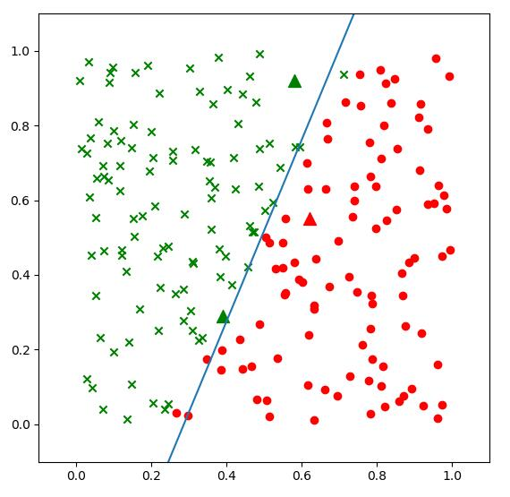
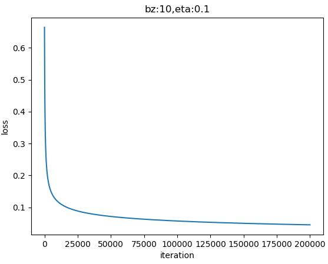
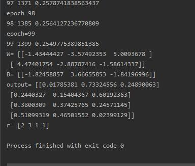
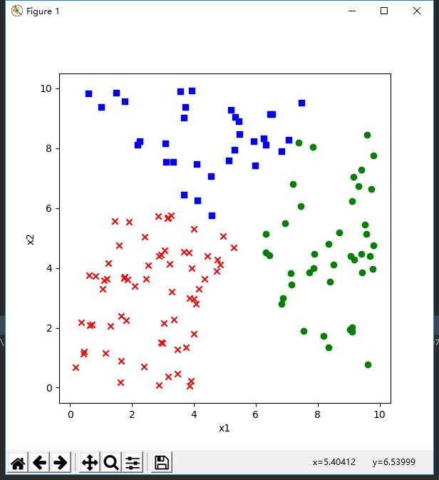
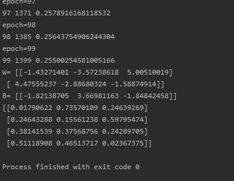

## 第四天学习

### 线性分类
#### 线性二分类

对率函数Logistic Function，即可以做为激活函数使用，又可以当作二分类函数使用。而在很多不太正规的文字材料中，把这两个概念混用了，比如下面这个说法：“我们在最后使用Sigmoid激活函数来做二分类”，这是不恰当的。在本书中，我们会根据不同的任务区分激活函数和分类函数这两个概念，在二分类任务中，叫做Logistic函数，而在作为激活函数时，叫做Sigmoid函数。

- 公式

$$a(z) = \frac{1}{1 + e^{-z}}$$

- 导数

$$a^{'}(z) = a(z)(1 - a(z))$$

具体求导过程可以参考8.1节。

- 输入值域

$$(-\infty, \infty)$$

- 输出值域

$$(0,1)$$

- 函数图像
 

 - 使用方式

此函数实际上是一个概率计算，它把$(-\infty, \infty)$之间的任何数字都压缩到$(0,1)$之间，返回一个概率值，这个概率值接近1时，认为是正例，否则认为是负例。

训练时，一个样本x在经过神经网络的最后一层的矩阵运算结果作为输入z，经过Logistic计算后，输出一个$(0,1)$之间的预测值。我们假设这个样本的标签值为0属于负类，如果其预测值越接近0，就越接近标签值，那么误差越小，反向传播的力度就越小。

推理时，我们预先设定一个阈值比如0.5，则当推理结果大于0.5时，认为是正类；小于0.5时认为是负类；等于0.5时，根据情况自己定义。阈值也不一定就是0.5，也可以是0.65等等，阈值越大，准确率越高，召回率越低；阈值越小则相反，准确度越低，召回率越高。

比如：
- input=2时，output=0.88，而0.88>0.5，算作正例
- input=-1时，output=0.27，而0.27<0.5，算作负例

### 代码运行结果

通过github上给的代码，得到结果

 
  
 
```
epoch=95
95 19 0.2107366003875905
epoch=96
96 19 0.20989241623899846
epoch=97
97 19 0.20905641456530918
epoch=98
98 19 0.20823454980498363
epoch=99
99 19 0.20742586902509108
W= [[-7.66469954]
 [ 3.15772116]]
B= [[2.19442993]]
A= [[0.65791301]
 [0.30556477]
 [0.53019727]]
```
在实际的工程实践中，一般我们会把样本分成训练集、验证集、测试集，用测试集来测试训练结果的正确性。在本例中我们没有这样做，原因有二：

1. 样本数据量比较少，一共只有200个样本，如果再分成两部分，会造成数据集覆盖不全面，存在很大的差异，对训练、验证、测试都没有帮助
2. 由于本例的数据特征比较少，所以我们有更好的手段：可视化。在神经网络学习初期，可视化的训练过程与结果会对读者有巨大的帮助。

神经网络的可视化，说简单也很简单，说难也很难，关键是对框架系统的理解，对运行机制和工作原理的理解，掌握了这些，可视化就会使一件轻而易举且令人愉快的事情。


把max_epoch从100改成了10000


```
W= [[-42.62417571]
 [ 21.36558218]]
B= [[10.5773054]]
A= [[0.99597669]
 [0.01632475]
 [0.53740392]]
w12= 1.994992477013739
b12= -0.49506282174794675
```

### 多分类函数 Softmax
从图示来看，似乎在三个颜色区间之间有两个比较明显的分界线，而且是直线，即线性可分的。我们如何通过神经网络精确地找到这两条分界线呢？

- 从视觉上判断是线性可分的，所以我们使用单层神经网络即可
- 输入特征是两个，X1=经度，X2=纬度
- 最后输出的是三个分类，分别是魏蜀吴，所以输出层有三个神经元

如果有三个以上的分类同时存在，我们需要对每一类别分配一个神经元，这个神经元的作用是根据前端输入的各种数据，先做线性处理（Y=WX+B)，然后做一次非线性处理，计算每个样本在每个类别中的预测概率，再和标签中的类别比较，看看预测是否准确，如果准确，则奖励这个预测，给与正反馈；如果不准确，则惩罚这个预测，给与负反馈。两类反馈都反向传播到神经网络系统中去调整参数。

这个网络只有输入层和输出层，由于输入层不算在内，所以是一层网络。

### 代码实现结果

ch07 level1




ch07 level2





## 总结
通过今天的学习，对线性分类和线性回归都有了一点理解，但是代码部分不能保证每一句都理解，再python的环境配置也耗费了很多时间，为了一个错误找了很多资料都没能完成，总之这门课程的学习很耗费时间，但是也学到了很多知识。
