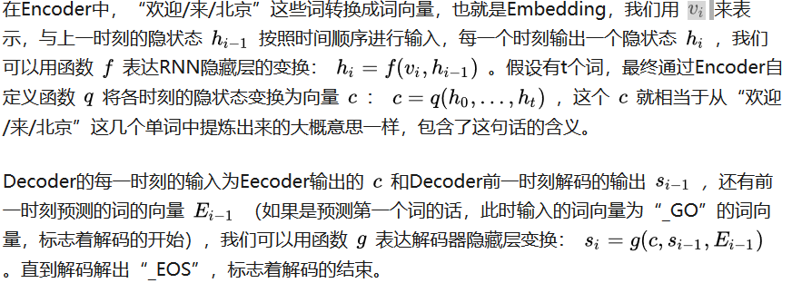

## 作业8 简要说明采用Seq2Seq模型实现机器翻译的原理
Seq2Seq模型是输出的长度不确定时采用的模型，这种情况一般是在机器翻译的任务中出现，将一句中文翻译成英文，那么这句英文的长度有可能会比中文短，也有可能会比中文长，所以输出的长度就不确定了。

seq2seq属于encoder-decoder结构的一种，这里看看常见的encoder-decoder结构，基本思想就是利用两个RNN，一个RNN作为encoder，另一个RNN作为decoder。encoder负责将输入序列压缩成指定长度的向量，这个向量就可以看成是这个序列的语义，这个过程称为编码，获取语义向量最简单的方式就是直接将最后一个输入的隐状态作为语义向量C。也可以对最后一个隐含状态做一个变换得到语义向量，还可以将输入序列的所有隐含状态做一个变换得到语义变量。而decoder则负责根据语义向量生成指定的序列，这个过程也称为解码，最简单的方式是将encoder得到的语义变量作为初始状态输入到decoder的RNN中，得到输出序列。可以看到上一时刻的输出会作为当前时刻的输入，而且其中语义向量C只作为初始状态参与运算，后面的运算都与语义向量C无关。

目前Seq2Seq模型在机器翻译，语音识别，文本摘要，问答系统等领域取得了巨大的成功。如图1所示，Seq2Seq其实就是Encoder-Decoder结构的网络，它的输入是一个序列，输出也是一个序列。在Encoder中，将序列转换成一个固定长度的向量，然后通过Decoder将该向量转换成我们想要的序列输出出来。Encoder和Decoder一般都是RNN，通常为LSTM或者GRU，图中每一个方格都为一个RNN单元。

