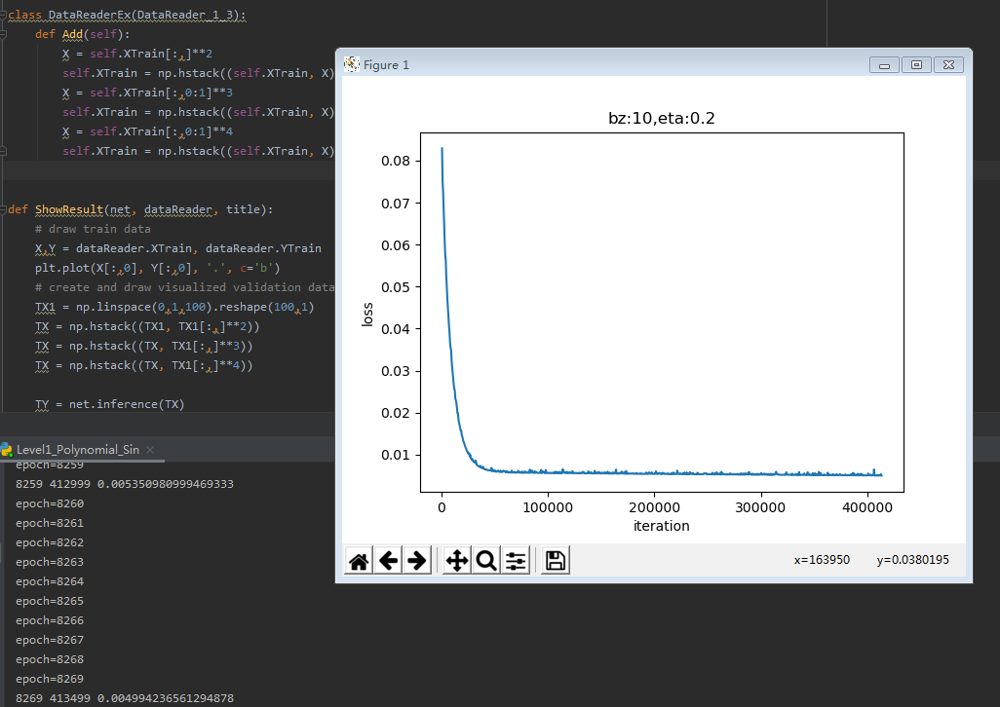
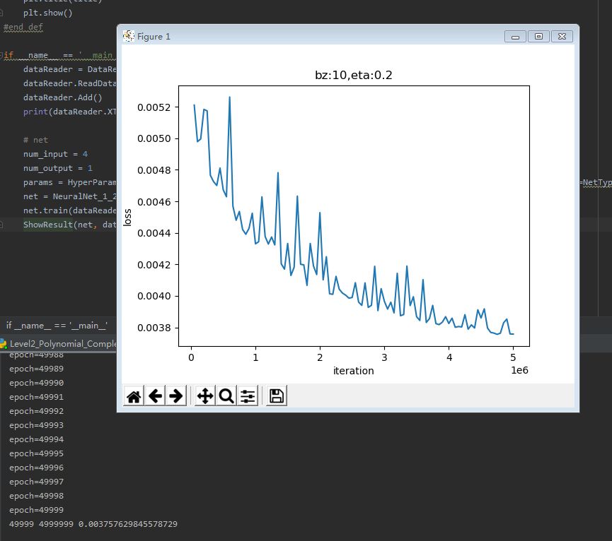
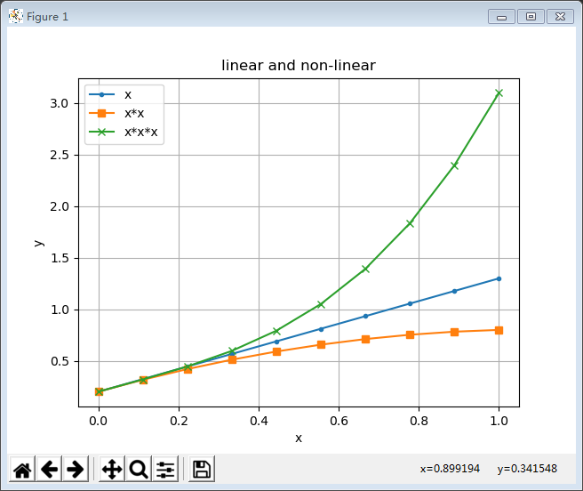
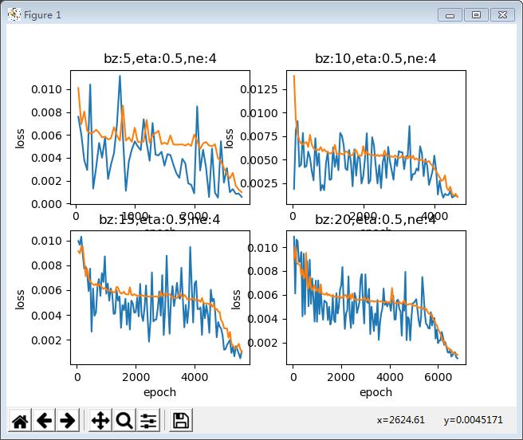

# 第四章 NonLinearRegression
# 激活函数
## 激活函数的基本作用

看神经网络中的一个神经元，为了简化，假设该神经元接受三个输入，分别为$x_1, x_2, x_3$，那么：

$$z=x_1 w_1 + x_2 w_2 + x_3 w_3 +b \tag{1}$$
$$a = \sigma(z) \tag{2}$$


激活函数也就是$a=\sigma(z)$这一步了，他有什么作用呢？

1. 给神经网络增加非线性因素，这个问题在第1章《神经网络基本工作原理》中已经讲过了；
2. 把公式1的计算结果压缩到[0,1]之间，便于后面的计算。

激活函数的基本性质：

+ 非线性：线性的激活函数和没有激活函数一样
+ 可导性：做误差反向传播和梯度下降，必须要保证激活函数的可导性
+ 单调性：单一的输入会得到单一的输出，较大值的输入得到较大值的输出

在物理试验中使用的继电器，是最初的激活函数的原型：当输入电流大于一个阈值时，会产生足够的磁场，从而打开下一级电源通道，如下图所示：


用到神经网络中的概念，用‘1’来代表一个神经元被激活，‘0’代表一个神经元未被激活。

这个Step函数有什么不好的地方呢？主要的一点就是，他的梯度（导数）恒为零（个别点除外)。反向传播公式中，梯度传递用到了链式法则，如果在这样一个连乘的式子其中有一项是零，这样的梯度就会恒为零，是没有办法进行反向传播的。

## 何时会用到激活函数

激活函数用在神经网络的层与层之间的连接，神经网络的最后一层不用激活函数。

神经网络不管有多少层，最后的输出层决定了这个神经网络能干什么。在单层神经网络中，我们学习到了以下示例：

|网络|输入|输出|激活函数|分类函数|功能|
|---|---|---|---|---|---|
|单层|单变量|单输出|无|无|线性回归|
|单层|多变量|单输出|无|无|线性回归|
|单层|多变量|单输出|无|二分类函数|二分类|
|单层|多变量|多输出|无|多分类函数|多分类|

从上表可以看到，我们一直没有使用激活函数，而只使用了分类函数。对于多层神经网络也是如此，在最后一层只会用到分类函数来完成二分类或多分类任务，如果是拟合任务，则不需要分类函数。

很多文字材料中通常把激活函数和分类函数混淆在一起说，原因其实只有一个：在二分类任务中使用的Logistic分类函数与在神经网络之间连接的Sigmoid激活函数，是同样的形式。所以它既是激活函数，又是分类函数，是个特例。


##  挤压型激活函数 Squashing Function

又可以叫饱和型激活函数，因为在输入值域的绝对值较大的时候，它的输出在两端是饱和的。挤压型激活函数中，用的最多的是Sigmoid函数，所谓Sigmoid函数，原意是指一类函数，它们都具有S形的函数曲线以及压缩输入值域的作用，所以又叫挤压型激活函数。

### 对数几率函数 Sigmoid Function

对率函数，在用于激活函数时常常被称为Sigmoid函数，因为它是最常用的Sigmoid函数。

#### 公式

$$a(z) = \frac{1}{1 + e^{-z}}$$

#### 导数

$$a^{'}(z) = a(z) \odot (1 - a(z))$$

利用公式33，令：$u=1，v=1+e^{-z}$ 则：

$$
a' = \frac{u'v-v'u}{v^2}=\frac{0-(1+e^{-z})'}{(1+e^{-z})^2}
$$
$$
=\frac{e^{-z}}{(1+e^{-z})^2}
=\frac{1+e^{-z}-1}{(1+e^{-z})^2}
$$
$$
=\frac{1}{1+e^{-z}}-(\frac{1}{1+e^{-z}})^2
$$
$$
=a-a^2=a(1-a)
$$

#### 值域

输入值域：$[-\infty, \infty]$

输出值域：$[0,1]$

#### 函数图像


#### 优点

从函数图像来看，sigmoid函数的作用是将输入压缩到(0, 1)这个区间范围内，这种输出在0~1之间的函数可以用来模拟一些概率分布的情况。他还是一个连续函数，导数简单易求。  

从数学上来看，Sigmoid函数对中央区的信号增益较大，对两侧区的信号增益小，在信号的特征空间映射上，有很好的效果。 

从神经科学上来看，中央区酷似神经元的兴奋态，两侧区酷似神经元的抑制态，因而在神经网络学习方面，可以将重点特征推向中央区，
将非重点特征推向两侧区。

分类功能：我们经常听到这样的对白“你觉得这件事情成功概率有多大？”“我有六成把握能成功”。sigmoid函数在这里就起到了如何把一个数值转化成一个通俗意义上的把握的表示。值越大，那么这个神经元对于这张图里有这样一条线段的把握就越大，经过sigmoid函数之后的结果就越接近100%，也就是1这样一个值，表现在图里，也就是这个神经元越兴奋（亮）。

#### 缺点

exp()计算代价大。

反向传播时梯度消失：从梯度图像中可以看到，sigmoid的梯度在两端都会接近于0，根据链式法则，如果传回的误差是$\delta$，那么梯度传递函数是$\delta \cdot a'(z)$，而$a'(z)$这时是零，也就是说整体的梯度是零。这也就很容易出现梯度消失的问题，并且这个问题可能导致网络收敛速度比较慢，比如采取MSE作为损失函数算法时。

给个纯粹数学的例子吧，假定我们的学习速率是0.2，sigmoid函数值是0.9，如果我们想把这个函数的值降到0.5，需要经过多少步呢？

我们先来做数值计算：

第一步，求出当前输入的值

$$\frac{1}{1 + e^{-z}} = 0.9$$
$$e^{-z} = \frac{1}{9}$$
$$x = ln{9}$$

第二步，求出当前梯度

$$\Delta = a(z)\times(1 - a(z)) = 0.9 \times 0.1= 0.09$$

第三步，根据梯度更新当前输入值

$$z_{new} = z - \eta \times \Delta = ln{9} - 0.2 \times 0.09 = ln(9) - 0.018$$

第四步，判断当前函数值是否接近0.5

$$\frac{1}{1 + e^{-z_{new}}} = 0.898368$$

第五步，重复步骤2-3直到当前函数值接近0.5

###  Tanh函数

TanHyperbolic，双曲正切函数。

#### 公式  
$$a(z) = \frac{e^{z} - e^{-z}}{e^{z} + e^{-z}} = \frac{2}{1 + e^{-2z}} - 1$$

$$a(z) = 2 \cdot Sigmoid(2z) - 1$$

#### 导数公式

$$a'(z) = (1 + a(z)) \odot (1 - a(z))$$

利用基本导数公式23，令：$u={e^{z}-e^{-z}}，v=e^{z}+e^{-z}$ 则

$$
a'=\frac{u'v-v'u}{v^2} \tag{71}
$$
$$
=\frac{(e^{z}-e^{-z})'(e^{z}+e^{-z})-(e^{z}+e^{-z})'(e^{z}-e^{-z})}{(e^{z}+e^{-z})^2}
$$
$$
=\frac{(e^{z}+e^{-z})(e^{z}+e^{-z})-(e^{z}-e^{-z})(e^{z}-e^{-z})}{(e^{z}+e^{-z})^2}
$$
$$
=\frac{(e^{z}+e^{-z})^2-(e^{z}-e^{-z})^2}{(e^{z}+e^{-z})^2}
$$
$$
=1-(\frac{(e^{z}-e^{-z}}{e^{z}+e^{-z}})^2=1-a^2
$$

#### 值域

输入值域：$[-\infty, \infty]$

输出值域：$[-1,1]$

#### 函数图像


#### 优点

具有Sigmoid的所有优点。

无论从理论公式还是函数图像，这个函数都是一个和sigmoid非常相像的激活函数，他们的性质也确实如此。但是比起sigmoid，tanh减少了一个缺点，就是他本身是零均值的，也就是说，在传递过程中，输入数据的均值并不会发生改变，这就使他在很多应用中能表现出比sigmoid优异一些的效果。

#### 缺点

exp()计算代价大。

梯度消失。


##  半线性激活函数

又可以叫非饱和型激活函数。

###  ReLU函数 

Rectified Linear Unit，修正线性单元，线性整流函数，斜坡函数。

#### 公式

$$a(z) = max(0,z) = \begin{Bmatrix} 
  z & (z \geq 0) \\ 
  0 & (z < 0) 
\end{Bmatrix}$$

#### 导数

$$a'(z) = \begin{cases} 1 & z \geq 0 \\ 0 & z < 0 \end{cases}$$

#### 值域

输入值域：$[-\infty, \infty]$

输出值域：$[0,\infty]$

导数值域：$[0,1]$


#### 仿生学原理

相关大脑方面的研究表明生物神经元的信息编码通常是比较分散及稀疏的。通常情况下，大脑中在同一时间大概只有1%-4%的神经元处于活跃状态。使用线性修正以及正则化（regularization）可以对机器神经网络中神经元的活跃度（即输出为正值）进行调试；相比之下，逻辑函数在输入为0时达到  ，即已经是半饱和的稳定状态，不够符合实际生物学对模拟神经网络的期望。不过需要指出的是，一般情况下，在一个使用修正线性单元（即线性整流）的神经网络中大概有50%的神经元处于激活态。

#### 优点

- 反向导数恒等于1，更加有效率的反向传播梯度值，收敛速度快
- 避免梯度消失问题
- 计算简单，速度快
- 活跃度的分散性使得神经网络的整体计算成本下降

#### 缺点

无界。

梯度很大的时候可能导致的神经元“死”掉。


###  Leaky ReLU函数

PReLU，带泄露的线性整流函数。

#### 公式

$$a(z) = \begin{cases} z & z \geq 0 \\ \alpha * z & z < 0 \end{cases}$$

#### 导数

$$a'(z) = \begin{cases} z & 1 \geq 0 \\ \alpha & z < 0 \end{cases}$$

#### 值域

输入值域：$[-\infty, \infty]$

输出值域：$[-\infty,\infty]$

导数值域：$[0,1]$

#### 函数图像


#### 优点

继承了ReLU函数的优点。

相比较于relu函数，leaky relu同样有收敛快速和运算复杂度低的优点，而且由于给了$x<0$时一个比较小的梯度$\alpha$,使得$x<0$时依旧可以进行梯度传递和更新，可以在一定程度上避免神经元“死”掉的问题。

###  Softplus

#### 公式

$$a(z) = \ln (1 + e^z)$$

#### 导数

$$a'(z) = {e^z \over 1 + e^z}$$

#### 

输入值域：$[-\infty, \infty]$

输出值域：$[0,\infty]$

导数值域：$[0,1]$

#### 函数图像


## ELU

#### 公式

$$a(z) = \begin{cases} z & z \geq 0 \\ \alpha (e^z-1) & z < 0 \end{cases}$$

#### 导数

$$a'(z) = \begin{cases} z & 1 \geq 0 \\ \alpha e^z & z < 0 \end{cases}$$

#### 值域

输入值域：$[-\infty, \infty]$

输出值域：$[-\alpha,\infty]$

导数值域：$[0,1]$

#### 函数图像


## BenIdentity

#### 公式

$$a(z) = {\sqrt{z^2 + 1} -1\over 2}+z$$

#### 导数

$$a'(z) = {z \over 2\sqrt{z^2+1}}+1$$

#### 值域

输入值域：$[-\infty, \infty]$

输出值域：$[-\infty,\infty]$

导数值域：$[0.5,1.5]$


#  单入单出的双层神经网络

##  非线性回归

### 回归模型的评估标准

#### 基本数学概念

- 均值 mean

$$\bar{x}=\frac{1}{m}\sum_i^mx_i \tag{1}$$

- 标准差 stdandard deviation

$$
std=\sqrt{\frac{1}{m} \sum_i^m{(x_i-\bar{x})^2}} \tag{2}
$$

- 方差 variance

$$
var=\frac{1}{m} \sum_i^m{(x_i-\bar{x})^2}=std^2 \tag{3}
$$

- 协方差 covariance

$$
cov(X,Y)=\frac{1}{m} \sum_i^m{[(x_i-\bar{x})(y_i-\bar{y})]} \tag{4}
$$

- 样本方差

$$
var=\frac{1}{m-1} \sum_i^m{(x_i-\bar{x})^2}=std^2 \tag{5}
$$

- 样本协方差

$$
cov(X,Y)=\frac{1}{m-1} \sum_i^m{[(x_i-\bar{x})(y_i-\bar{y})]} \tag{6}
$$

如果结果为正，表示X,Y是正相关。

#### 回归模型评估标准

回归问题主要是求值，评价标准主要是看求得值与实际结果的偏差有多大，所以，回归问题主要以下方法来评价模型。

- 平均绝对误差 MAE

$$MAE={1 \over m} \sum_{i=1}^m \lvert a_i-y_i \rvert \tag{7}$$

MAE对异常值不如MSE敏感，类似中位数。

- MAPE

Mean Absolute Percentage Error，绝对平均值率误差。

$$MAPE={100 \over m} \sum^m_{i=1} \lvert {a_i - y_i \over y_i} \rvert \tag{8}$$

- 和方差 SSE

$$SSE=\sum_{i=1}^m (a_i-y_i)^2 \tag{9}$$

得出的值与样本数量有关系，假设有1000个测试样本，得到的值是120；如果只有100个测试样本，得到的值可能是11，我们不能说11就比120要好。

- 均方差 MSE

MSE （Mean Squared Error）叫做均方误差，公式如下：

$$MSE = \frac{1}{m} \sum_{i=1}^m (a_i-y_i)^2 \tag{10}$$

就是实际值减去预测值的平方再求期望，没错，就是线性回归的代价函数。由于MSE计算的是误差的平方，所以它对异常值是非常敏感的，因为一旦出现异常值，MSE指标会变得非常大。MSE越小，证明误差越小。

- 均方根误差 RMSE

RMSE（Root Mean Squard Error）均方根误差。

$$RMSE = \sqrt{\frac{1}{m} \sum_{i=1}^m (a_i-y_i)^2} \tag{11}$$

是MSE开根号的结果，其实实质和MSE是一样的。只不过用于数据更好的描述。

例如：要做房价预测，每平方是万元，我们预测结果也是万元，那么MSE差值的平方单位应该是千万级别的。假设我们的模型预测结果与真实值相差1000元，则用MSE的计算结果是1000,000，这个值没有单位，如何描述这个差距？于是就求个平方根就好了，这样误差可以是标签值是同一个数量级的，在描述模型的时候就说，我们模型的误差是多少元。

- R平方 R-Squared

上面的几种衡量标准针对不同的模型会有不同的值。比如说预测房价，那么误差单位就是元，比如3000元、11000元等。如果预测身高就可能是0.1、0.2米之类的。也就是说，对于不同的场景，会有不同量纲，因而也会有不同的数值，无法用一句话说得很清楚，必须啰啰嗦嗦带一大堆条件才能表达完整。

我们通常用概率来表达一个准确率，比如89%的准确率。那么线性回归有没有这样的衡量标准呢？答案就是R-Squared。

$$R^2=1-\frac{\sum (a_i - y_i)^2}{\sum(\bar y_i-y_i)^2}=1-\frac{MSE(a,y)}{Var(y)} \tag{12}$$

R平方是多元回归中的回归平方和（分子）占总平方和（分母）的比例，它是度量多元回归方程中拟合程度的一个统计量。R平方值越接近1，表明回归平方和占总平方和的比例越大，回归线与各观测点越接近，回归的拟合程度就越好。

- 如果结果是0，说明我们的模型跟瞎猜差不多；
- 如果结果是1，说明我们模型无错误；
- 如果结果是0-1之间的数，就是我们模型的好坏程度；
- 如果结果是负数，说明我们的模型还不如瞎猜。


##  用多项式回归法拟合正弦曲线

### 多项式回归的概念

多项式回归有几种形式：

#### 一元一次线性模型

因为只有一项，所以不能称为多项式了。它可以解决单变量的线性回归，我们在第4章学习过相关内容。其模型为：

$$z = x w + b \tag{1}$$

#### 多元一次多项式

多变量的线性回归，我们在第5章学习过相关内容。其模型为：

$$z = x_1 w_1 + x_2 w_2 + ...+ x_m w_m + b \tag{2}$$

这里的多变量，是指样本数据的特征值为多个，上式中的$x_1,x_2,...,x_m$代表了m个特征值。

#### 一元多次多项式

单变量的非线性回归，比如上面这个正弦曲线的拟合问题，很明显不是线性问题，但是只有一个x特征值，所以不满足前两种形式。如何解决这种问题呢？

有一个定理：任意一个函数在一个较小的范围内，都可以用多项式任意逼近。因此在实际工程实践中，有时候可以不管y值与x值的数学关系究竟是什么，而是强行用回归分析方法进行近似的拟合。

那么如何得到更多的特征值呢？对于只有一个特征值的问题，人们发明了一种聪明的办法，就是把特征值的高次方作为另外的特征值，加入到回归分析中，用公式描述：

$$z = x w_1 + x^2 w_2 + ... + x^m w_m + b \tag{3}$$

上式中x是原有的唯一特征值，$x^m$是利用x的m次方作为额外的特征值，这样就把特征值的数量从1个变为m个。

换一种表达形式，令：$x_1 = x，x_2=x^2，...，x_m=x^m$，则：

$$z = x_1 w_1 + x_2 w_2 + ... + x_m w_m + b \tag{4}$$

可以看到公式4和上面的公式2是一样的，所以解决方案也一样。

#### 多元多次多项式

在做多项式拟合之前，所有的特征值都会先做归一化，然后再获得x的平方值，三次方值等等。在归一化之后，x的值变成了[0,1]之间，那么x的平方值会比x值要小，x的三次方值会比x的平方值要小。假设$x=0.5，x^2=0.25，x^3=0.125$，所以次数越高，权重值会越大，特征值与权重值的乘积才会是一个不太小的数，以此来弥补特征值小的问题。

### 用二次多项式拟合

鉴于以上的认知，我们要考虑使用几次的多项式来拟合正弦曲线。在没有什么经验的情况下，可以先试一下二次多项式，即：

$$z = x w_1 + x^2 w_2 + b \tag{5}$$

#### 数据增强

在ch08.train.npz中，读出来的XTrain数组，只包含1列x的原始值，根据公式5，我们需要再增加一列x的平方值，所以代码如下：

```Python
import numpy as np
import matplotlib.pyplot as plt

from HelperClass.NeuralNet import *
from HelperClass.SimpleDataReader import *
from HelperClass.HyperParameters import *

file_name = "../../data/ch08.train.npz"

class DataReaderEx(SimpleDataReader):
    def Add(self):
        X = self.XTrain[:,]**2
        self.XTrain = np.hstack((self.XTrain, X))
```

从SimpleDataReader类中派生出子类DataReaderEx，然后添加Add()方法，先计算XTrain第一列的平方值放入矩阵X中，然后再把X合并到XTrain右侧，这样XTrain就变成了两列，第一列是x的原始值，第二列是x的平方值。


## 用多项式回归法拟合复合函数曲线

### 用四次多项式拟合

代码与正弦函数拟合区别不大，不再赘述，我们本次主要说明解决问题的思路。

超参的设置情况：

```Python
    num_input = 4
    num_output = 1    
    params = HyperParameters(num_input, num_output, eta=0.2, max_epoch=10000, batch_size=10, eps=1e-3, net_type=NetType.Fitting)
```
最开始设置max_epoch=10,000，运行结果如下：

|损失函数历史|曲线拟合结果|
|---|---|
|||

可以看到损失函数值还有下降的空间，并且拟合情况很糟糕。

```
9699 99 0.005015372990812302
9799 99 0.005149273288922641
9899 99 0.004994434937236122
9999 99 0.0049819495247358375
W= [[-0.70780292]
 [ 5.01194857]
 [-9.6191971 ]
 [ 6.07517269]]
B= [[-0.27837814]]
```

所以我们增加max_epoch到100,000再试一次：

|损失函数历史|曲线拟合结果|
|---|---|
|||

从上图看，损失函数值到了一定程度后就不再下降了，说明网络能力有限。再看下面打印输出的具体数值，似乎0.005左右是一个极限。

```
99699 99 0.004770323351034788
99799 99 0.004701067202962632
99899 99 0.004685711600240152
99999 99 0.005299305272730845
W= [[ -2.18904889]
 [ 11.42075916]
 [-19.41933987]
 [ 10.88980241]]
B= [[-0.21280055]]
```

###  用六次多项式拟合

接下来跳过5次多项式，直接用6次多项式来拟合。这次不需要把max_epoch设置得很大，可以先试试50000个epoch：

|损失函数历史|曲线拟合结果|
|---|---|
|||

打印输出：

```
999 99 0.005154576065966749
1999 99 0.004889156300531125
2999 99 0.004973132271850851
3999 99 0.004861537940283245
4999 99 0.00479384579608533
5999 99 0.004778358780580773
......
46999 99 0.004823741646005225
47999 99 0.004659351033377451
48999 99 0.0047460241904710935
49999 99 0.004669517756696059
W= [[-1.46506264]
 [ 6.60491296]
 [-6.53643709]
 [-4.29857685]
 [ 7.32734744]
 [-0.85129652]]
B= [[-0.21745171]]
```

从损失函数历史图看，好像损失值下降得比较理想，但是实际看打印输出时，损失值最开始几轮就已经是0.0047了，到了最后一轮，是0.0046，并不理想，说明网络能力还是不够。因此在这个级别上，不用再花时间继续试验了，应该还需要提高多项式次数。

### 用八次多项式拟合

再跳过7次多项式，直接使用8次多项式。先把max_epoch设置为50000试验一下：

|损失函数历史|曲线拟合结果|
|---|---|
|||

损失函数值下降的趋势非常可喜，似乎还没有遇到什么瓶颈；拟合的效果也已经初步显现出来了。下方的打印输出，损失函数值已经可以突破0.004的下限了。

```
......
48499 99 0.003761445941675411
48999 99 0.0037995913365186595
49499 99 0.004086918553033752
49999 99 0.0037740488283595657
W= [[ -2.44771419]
 [  9.47854206]
 [ -3.75300184]
 [-14.39723202]
 [ -1.10074631]
 [ 15.09613263]
 [ 13.37017924]
 [-15.64867322]]
B= [[-0.16513259]]
```

根据以上情况，可以认为8次多项式很有可能得到比较理想的解，所以我们需要增加max_epoch数值，让网络得到充分的训练。好，设置max_epoch=1000000试一下！没错，是一百万次！开始运行后，大家就可以去做些别的事情，一两个小时之后再回来看结果。

|损失函数历史|曲线拟合结果|
|---|---|
|||

从结果来看，损失函数值还有下降的空间和可能性，已经到了0.0016的水平（从后面的章节中可以知道，0.001的水平可以得到比较好的拟合效果），拟合效果也已经初步呈现出来了，所有转折的地方都可以复现，只是精度不够，相信更多的训练次数可以达到更好的效果。

```
......
995999 99 0.0015901747781799206
996999 99 0.0015873294515363775
997999 99 0.001596472587606985
998999 99 0.0015935143877633367
999999 99 0.0016124984420510522
W= [[  2.75832935]
 [-30.05663986]
 [ 99.68833781]
 [-85.95142109]
 [-71.42918867]
 [ 63.88516377]
 [104.44561608]
 [-82.7452897 ]]
B= [[-0.31611388]]
```

分析打印出的W权重值，x的原始特征值的权重值比后面的权重值小了一到两个数量级，这与归一化后x的高次幂的数值很小有关系。

至此，我们可以得出结论，多项式回归确实可以解决复杂曲线拟合问题，但是代价有些高，我们训练了一百万次，才得到初步满意的结果。下一节我们将要学习更好的方法。


### 代码运行
1. Level1_DrawActivators1


2. Level2_DrawActivators2


2. Level1_Polynomial_Sin


3. Level2_Polynomial_Complex


4. Level3_NN_Sin


5. Level4_NN_Complex


6. Level5_HowNNWorks


7. Level5_HowPolynomialWorks

8. Level6_TuneParams


