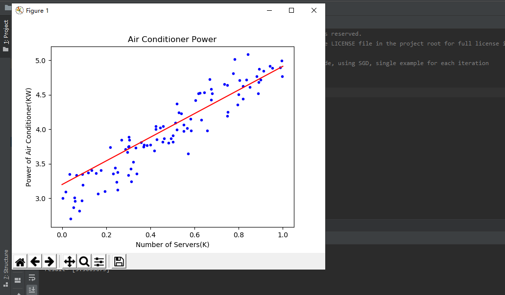
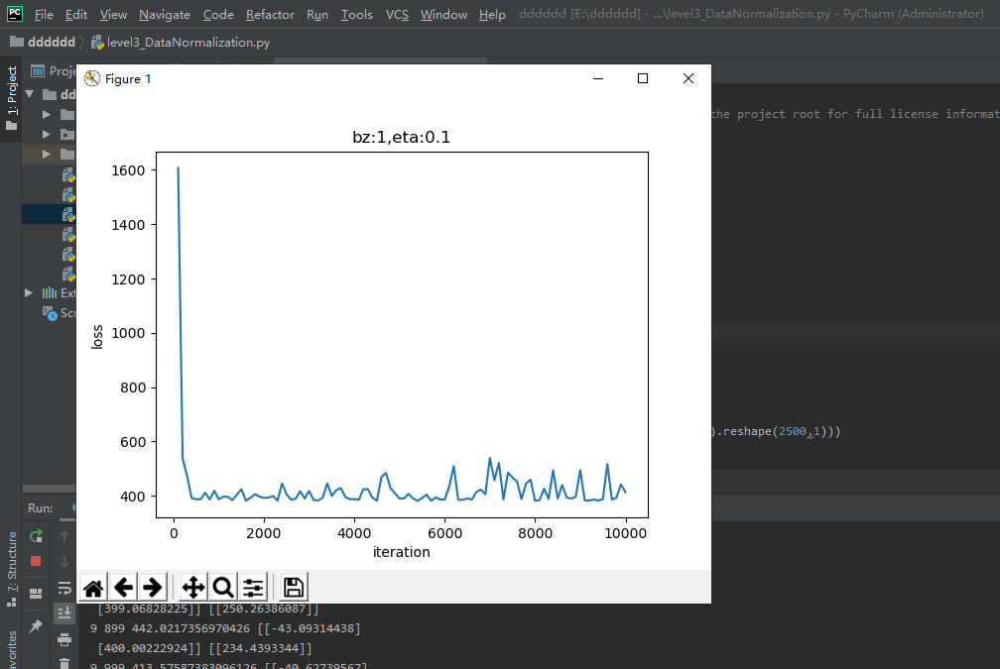

>>>>>>>>>>>>># 线性回归
### 最小二乘法：
+ 也叫做最小平方法（Least Square），它通过最小化误差的平方和寻找数据的最佳函数匹配。利用最小二乘法可以简便地求得未知的数据，并使得这些求得的数据与实际数据之间误差的平方和为最小。最小二乘法还可用于曲线拟合。
#### 数学原理
+ 线性回归试图学得：$$z(x_i)=w \cdot x_i+b \tag{1}$$  使得：$$z(x_i) \simeq y_i \tag{2}$$（$x_i$是样本特征值，$y_i$是样本标签值，$z_i$是模型预测值。）
#### 代码实现
+ 

### 梯度下降法
#### 数学原理：
+ x是样本特征值（单特征），y是样本标签值，z是预测值，下标 $i$ 表示其中一个样本。
+ 预设函数（为一个线性函数）：$$z_i = x_i \cdot w + b \tag{1}$$
+ 损失函数（为均方差函数）：$$loss(w,b) = \frac{1}{2} (z_i-y_i)^2 \tag{2}$$

#### 梯度计算：
+ 计算z的梯度：
    + 根据公式2： $$ {\partial loss \over \partial z_i}=z_i - y_i \tag{3} $$
+ 计算w的梯度：我们用loss的值作为误差衡量标准，通过求w对它的影响，也就是loss对w的偏导数，来得到w的梯度。由于loss是通过公式2->公式1间接地联系到w的，所以我们使用链式求导法则，通过单个样本来求导。
    + 根据公式1和公式3：$$ {\partial{loss} \over \partial{w}} = \frac{\partial{loss}}{\partial{z_i}}\frac{\partial{z_i}}{\partial{w}}=(z_i-y_i)x_i \tag{4} $$
+ 计算b的梯度
    + $$ \frac{\partial{loss}}{\partial{b}} = \frac{\partial{loss}}{\partial{z_i}}\frac{\partial{z_i}}{\partial{b}}=z_i-y_i \tag{5} $$
#### 代码运算：
+ 

### 神经网络：
#### 定义神经网络结构：
+ 最简单的单层神经元：
+ 输入层：此神经元在输入层只接受一个输入特征，经过参数w,b的计算后，直接输出结果。
+ 权重w/b：因为是一元线性问题，所以w/b都是一个标量。
+ 输出层：1个神经元，线性预测公式是：$$z_i = x_i \cdot w + b$$（z是模型的预测输出，y是实际的样本标签值，下标 $i$ 为样本。）
+ 损失函数：因为是线性回归问题，所以损失函数使用均方差函数。$$loss(w,b) = \frac{1}{2} (z_i-y_i)^2$$
#### 反向传播：
+ 计算w的梯度：
    + $$ {\partial{loss} \over \partial{w}} = \frac{\partial{loss}}{\partial{z_i}}\frac{\partial{z_i}}{\partial{w}}=(z_i-y_i)x_i $$
+ 计算b的梯度：
    + $$ \frac{\partial{loss}}{\partial{b}} = \frac{\partial{loss}}{\partial{z_i}}\frac{\partial{z_i}}{\partial{b}}=z_i-y_i $$
#### 代码运行：
+ 

### 梯度下降的三种形式：
#### 运行结果:
+ 全批量梯度下降: 
+ 单批量梯度下降: 
+ 小批量梯度下降:  

#### 实现逻辑非门：
#### 原理：
+ 单层神经网络，又叫做感知机，它可以轻松实现逻辑与、或、非门。由于逻辑与、或门，需要有两个变量输入。
+ 如图:
+ 代码运行与梯度下降的三种形式相同。

### 正规方程解法：
#### 简单的推导法：
+ 在做函数拟合（回归）时，我们假设函数H为：$$h(w,b) = b + x_1 w_1+x_2 w_2+...+x_n w_n \tag{2}$$
+ 令$b=w_0$，则：$$h(w) = w_0 + x_1 \cdot w_1 + x_2 \cdot w_2+...+ x_n \cdot w_n\tag{3}$$
+ x是一个样本的n个特征值，如果我们把m个样本一起计算，将会得到下面这个矩阵：$$H(w) = X \cdot W \tag{4}$$
+ X和W的矩阵形状如下：
    + $$ X^{(m \times (n+1))} = \begin{pmatrix} 1 & x_{1,1} & x_{1,2} & \dots & x_{1,n} \ 1 & x_{2,1} & x_{2,2} & \dots & x_{2,n} \ \dots \ 1 & x_{m,1} & x_{m,2} & \dots & x_{m,n} \end{pmatrix} \tag{5} $$
    + $$ W^{(n+1)}= \begin{pmatrix} w_0 \ w_1 \ \dots \ w_n \end{pmatrix} \tag{6} $$
+ 然后我们期望假设函数的输出与真实值一致，则有：$$H(w) = X \cdot W = Y \tag{7}$$
+ 其中，Y的形状如下：$$ Y^{(m)}= \begin{pmatrix} y_1 \ y_2 \ \dots \ y_m \end{pmatrix} \tag{8} $$
+ 把等式两边同时乘以X的转置矩阵，以便得到X的方阵：$$X^T X W = X^T Y \tag{9}$$
+ 其中，$X^T$是X的转置矩阵，$X^T X$一定是个方阵，并且假设其存在逆矩阵，把它移到等式右侧来：$$W = (X^T X)^{-1}{X^T Y} \tag{10}$$
#### 复杂推导方法：
+ 仍用均方差损失函数：$$J(w,b) = \sum (z_i - y_i)^2 \tag{11}$$
+ 把b看作是一个恒等于1的feature，并把z=XW计算公式带入，并变成矩阵形式：$$J(w) = \sum (x_i w_i -y_i)^2=(XW - Y)^T \cdot (XW - Y) \tag{12}$$
+ 对w求导，令导数为0，就是W的最小值解：$${\partial J(w) \over \partial w} = {\partial \over \partial w}[(XW - Y)^T \cdot (XW - Y)]$$ $$ ={\partial \over \partial w}[(X^TW^T - Y^T) \cdot (XW - Y)]$$ $$ ={\partial \over \partial w}[(X^TXW^TW -X^TW^TY - Y^TXW + Y^TY)] \tag{13}$$
#### 运行结果：
+ 

### 神经网络：
#### 定义神经网络：
+ 特点：
    + 没有中间层，只有输入项和输出层（输入项不算做一层）
    + 输出层只有一个神经元
    + 神经元有一个线性输出，不经过激活函数处理，即在下图中，经过$\Sigma$求和得到Z值之后，直接把Z值输出
    + 
+ 输入层
+ 权重W/B
+ 输出层
+ 损失函数
#### 反向传播：
+ 与上一章不同，本章中的前向计算是多特征值的公式：
    + $$z_i = x_{i1} \cdot w_1 + x_{i2} \cdot w_2 + b$$ $$ =\begin{pmatrix} x_{i1} & x_{i2} \end{pmatrix} \begin{pmatrix} w_1 \ w_2 \end{pmatrix}+b \tag{2} $$
#### 代码实现：
+ 

### 样本特征数据归一化：
#### 做归一化：
+ 理论层面上，神经网络是以样本在事件中的统计分布概率为基础进行训练和预测的，所以它对样本数据的要求比较苛刻。具体说明如下：
    + 样本的各个特征的取值要符合概率分布
    + 样本的度量单位要相同
    + 神经网络假设所有的输入输出数据都是标准差为1，均值为0，包括权重值的初始化，激活函数的选择，以及优化算法的的设计。
    + 数值问题
    + 梯度更新
    + 学习率
#### 基本概念：
+ 归一化：
    + Min-Max归一化:$$x_{new}={x-x_{min} \over x_{max} - x_{min}} \tag{1}$$
    + Min-Max归一化:$$x_{new}={x-x_{min} \over x_{max} - x_{min}} \tag{1}$$
    + 非线性归一化:对数转换： $$y=log(x) \tag{3}$$;反余切转换： $$y=atan(x) \cdot 2/π \tag{4}$$
+ 标准化：把每个特征值中的所有数据，变成平均值为0，标准差为1的数据，最后为正态分布。Z-score规范化（标准差标准化 / 零均值标准化，其中std是标准差）：$$x_{new} = (x - \bar{x})／std \tag{5}$$
+ 中心化：平均值为0，无标准差要求： $$x_{new} = x - \bar{x} \tag{6}$$
#### 运行结果：
+ 
+ 

### 归一化的后遗症
#### 代码实现：
+ 

### 正确的推理预测方法
#### 代码实现：
+ 

### 对标签值归一化：
#### 代码实现：
+ 