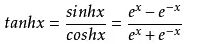

>>>>>> # 第七步 深度神经网络（DNN）
### 搭建深度神经网络框架
1. 
2. NeuralNet:来包装基本的神经网络结构和功能
    + Layers：神经网络各层的容器，按添加顺序维护一个列表。
    + Parameters：基本参数（包括普参和超参）
    + Loss Function：提供计算损失函数值，存储历史记录并最后绘图的功能
    + LayerManagement()：添加神经网络层
    + ForwardCalculation():调用各层的前向计算方法
    + BackPropagation()：调用各层的反向传播方法
    + PreUpdateWeights() ：预更新各层的权重参数
    + UpdateWeights()：更新各层的权重参数
    + Train()：训练
    + SaveWeights()：保存各层的权重参数
    + LoadWeights()：加载各层的权重参数
3. Layer：是一个抽象类，以及更加需要增加的实际类
    + 包括：
        + Fully Connected Layer
        + Classification Layer
        + Activator Layer
        + Dropout Layer
        + Batch Norm Layer
        + Convolution Layer（将来会包括）
        + Max Pool Layer（将来会包括）
    + 每个Layer都包括以下基本方法：
        + ForwardCalculation():调用各层的前向计算方法
        + BackPropagation()：调用各层的反向传播方法
        + PreUpdateWeights() ：预更新各层的权重参数
        + UpdateWeights()：更新各层的权重参数
        + SaveWeights()：保存各层的权重参数
        + LoadWeights()：加载各层的权重参数
4. Activator Layer：激活函数和分类函数
    + Identity：直传函数，即没有激活处理
    + Sigmoid：S型函数，也成S型生长曲线。由于其单增以及反函数单增等性质，在信息科学中，Sigmoid函数常被用作神经网络的阈值函数。
    + Tanh:双曲函数中的一个，tanh()双曲正切。
        + 公式：tanh(x)=2*sigmoid(2*x)-1和
    + Relu：线性整流函数，又称修正线性单元。
5. Classification Layer：分类函数
    + Sigmoid二分类
    + Softmax多分类
6. Parameters：基本神经网络运行参数：
    + 学习率
    + 最大epoch
    + batch size
    + 损失函数定义
    + 初始化方法
    + 优化器类型
    + 停止条件
    + 正则类型和条件
7. LossFunction：损失函数及帮助方法（之前有学过）
    + 均方差函数
    + 交叉熵函数二分类
    + 交叉熵函数多分类
    + 记录损失函数
    + 显示损失函数历史记录
    + 获得最小函数值时的权重参数
8. Optimizer：优化器
    + SGD：随机梯度下降。以单个样本为训练单元训练速度会很快，但牺牲了向量化运算所带来的便利性，在较大数据集上效率并不高。
    + Momentum：带动量的梯度下降。带动量的梯度下降考虑历史梯度的加权平均值作为速率进行优化。
        + 执行公式：  
    + Nag:
    + AdaGrad
    + AdaDelta
    + RMSProp
    + Adam:是在带动量的梯度下降法的基础上融合了一种称为 RMSprop（加速梯度下降）的算法而成的。
        + 计算公式： 
9. WeightsBias:权重矩阵，仅供全连接层使用
   + 初始化：
        + Zero, Normal, MSRA (HE), Xavier
        + 保存初始化值
        + 加载初始化值
    + Pre_Update：预更新
    + Update：更新
    + Save：保存训练结果值
    + Load：加载训练结果值
10. DataReader 样本数据读取器
    + ReadData：从文件中读取数据
    + NormalizeX：归一化样本值
    + NormalizeY：归一化标签值
    + GetBatchSamples：获得批数据
    + ToOneHot：标签值变成OneHot编码用于多分类
    + ToZeorOne：标签值变成0/1编码用于二分类
    + Shuffle：打乱样本顺序
    + MnistImageDataReader：读取MNIST数据（从中派生的数据读取器）
    + CifarImageReader：读取Cifar10数据（从中派生的数据读取器）

### 回归测试-万能近似定理
1. 搭建模型：一个双层的神经网络，第一层后面接一个Sigmoid激活函数，第二层直接输出拟合数据。
2. 超参数说明：
    + 输入层1个神经元，因为只有一个x值
    + 隐层4个神经元，对于此问题来说应该是足够了，因为特征很少
    + 输出层1个神经元，因为是拟合任务
    + 学习率=0.5
    + 最大epoch=10000轮
    + 批量样本数=10
    + 拟合网络类型
    + Xavier初始化
    + 绝对损失停止条件=0.001 
3. 训练结果：代码测试：
    + 
    + 

### 反向传播四大公式推导
+ 著名的反向传播四大公式：
     + $$\delta^{L} = \nabla_{a}C \odot \sigma_{'}(Z^L) \tag{80}$$ $$\delta^{l} = ((W^{l + 1})^T\delta^{l+1})\odot\sigma_{'}(Z^l) \tag{81}$$ $$\frac{\partial{C}}{\partial{b_j^l}} = \delta_j^l \tag{82}$$ $$\frac{\partial{C}}{\partial{w_{jk}^{l}}} = a_k^{l-1}\delta_j^l \tag{83}$$
+ 这个也挺难的，参考书是：矩阵求导术

### 回归任务 - 房价预测
+ 数据处理：
    + 原始数据只有一个数据集，需要自己把它分成训练集和测试集，比例大概为4:1。此数据集为csv文件格式，为了方便，我们把它转换成了两个扩展名为npz的numpy压缩形式：
        + house_Train.npz，训练数据集
        + house_Test.npz，测试数据集 
+ 搭建模型：
    +  个模型包含了四组全连接层-Relu层的组合，最后是一个单输出做拟合。
    +  超参数说明：
        + 学习率=0.1
        + 最大epoch=1000
        + 批大小=16
        + 拟合网络
        + 初始化方法Xavier
        + 停止条件为相对误差1e-7
        + net.train()函数是一个阻塞函数，只有当训练完毕后才返回
+ 代码运行结果：
    + 
    + 

### 二分类试验 - 双弧形非线性二分类
+ 搭建模型：同样是一个双层神经网络，但是最后一层要接一个Logistic二分类函数来完成二分类任务。
+ 超参数说明：
    + 输入层神经元数为2
    + 隐层的神经元数为3，使用Sigmoid激活函数
    + 由于是二分类任务，所以输出层只有一个神经元，用Logistic做二分类函数
    + 最多训练1000轮
    + 批大小=5
    + 学习率=0.1
    + 绝对误差停止条件=0.02
+ 代码运行结果：
    + 
    + 

### 二分类任务 - 居民收入
+ 字段解读：年龄、工作性质、权重、教育程度、受教育时长、婚姻状况、职业、家庭角色、性别、资本收益、资本损失、每周工作时长、祖籍
+ 数据处理：对于连续值，我们可以直接使用原始数据。对于枚举型，我们需要把它们转成连续值。以性别举例，Female=0，Male=1即可。对于其它枚举型，都可以用从0开始的整数编码。
+ 搭建模型：搭建一个与房价预测一样的网络结构，不同的是为了完成二分类任务，在最后接一个Logistic函数。
+ 超参数说明：
    + 学习率=0.1
    + 最大epoch=100
    + 批大小=16
    + 二分类网络类型
    + MSRA初始化
    + 相对误差停止条件1e-3
    + net.train()是一个阻塞函数，只有当训练完毕后才返回
+ 训练结果：
    + 

### 多分类功能测试 - “铜钱孔分类”问题
+ 搭建模型
    + 模型一：
        + 模型：使用Sigmoid做为激活函数的两层网络
        + 超参数说明
            + 隐层8个神经元
            + 最大epoch=5000
            + 批大小=10
            + 学习率0.1
            + 绝对误差停止条件=0.08
            + 多分类网络类型
            + 初始化方法为Xavier
            + net.train()函数是一个阻塞函数，只有当训练完毕后才返回。
    + 模型二：
        + 模型：使用Relu做为激活函数的三层网络。 
        + 超参数说明
            + 隐层8个神经元
            + 最大epoch=5000
            + 批大小=10
            + 学习率0.1
            + 绝对误差停止条件=0.08
            + 多分类网络类型
            + 初始化方法为MSRA
+ 运行结果：
    + 
    + 
    + 
    + 

### 多分类任务 - MNIST手写体识别
+ 搭建模型：一共4个隐层，都用Relu()激活函数连接，最后的输出层接Softmax分类函数
+ 运行结果：
    + 

