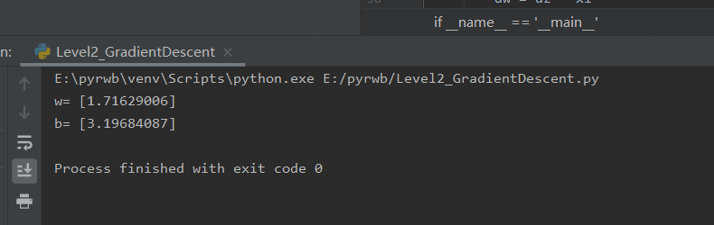
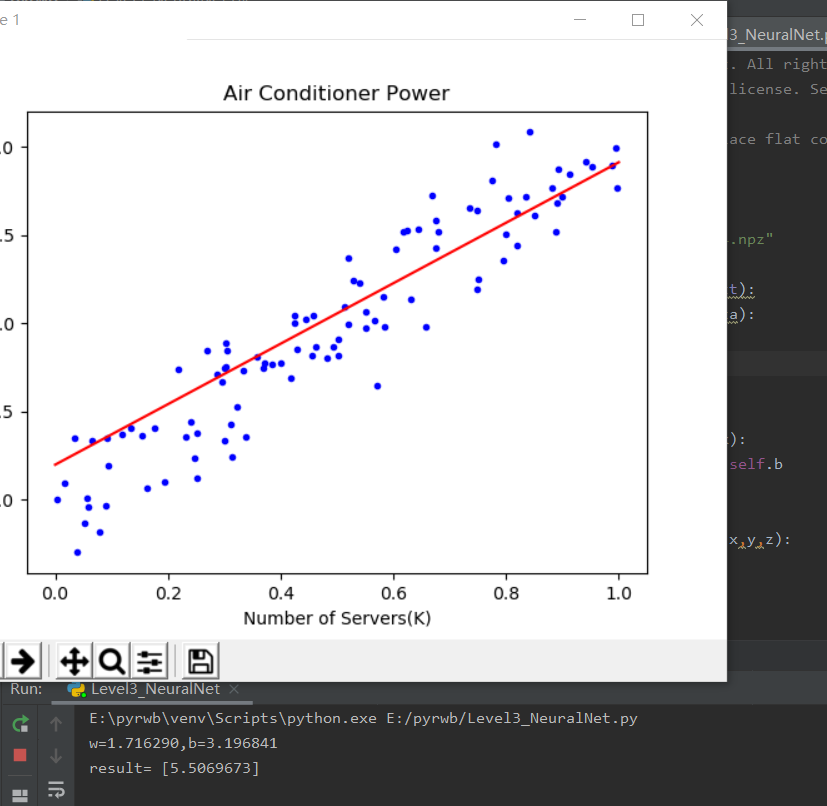
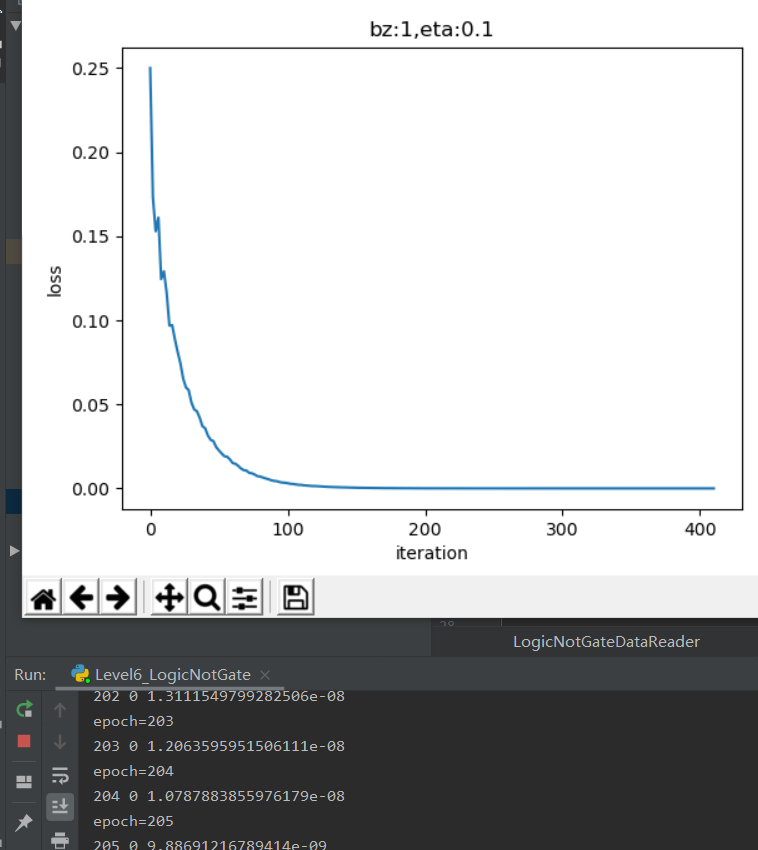
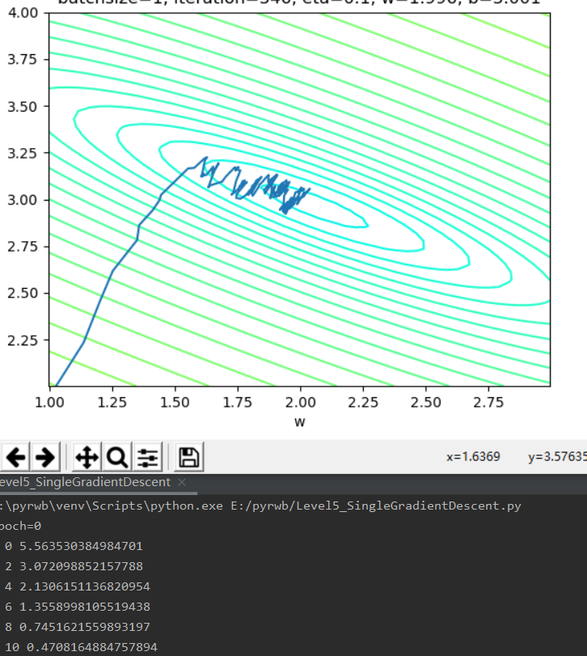
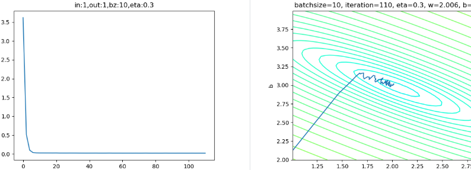
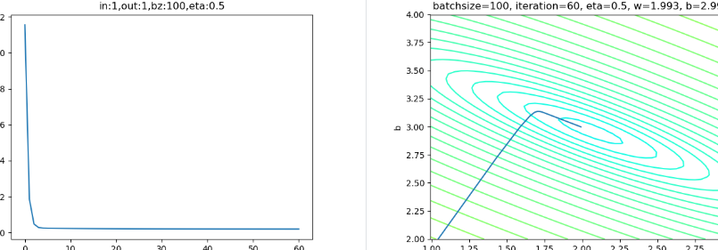

#      
总结

今天我们学习了神经网络的线性回归相关的分类，分析相关的线性回归问题，进一步了解和分析神经网络.
### 1.神经网络之线性回归
线性回归输出是一个连续值，因此适用于回归问题。回归问题在实际中很常见，如预测房屋价格、气温、销售额等连续值的问题。与回归问题不同，分类问题中模型的最终输出是一个离散值。我们所说的图像分类、垃圾邮件识别、疾病检测等输出为离散值的问题都属于分类问题的范畴。softmax回归则适用于分类问题。
单层的神经网络，其实就是一个神经元，可以完成一些线性的工作，比如拟合一条直线，这用一个神经元就可以实现。当这个神经元只接收一个输入时，就是单变量线性回归，可以在二维平面上用可视化方法理解。当接收多个变量输入时，叫做多变量线性回归，此时可视化方法理解就比较困难了，通常我们会用变量两两组对的方式来表现
### 单变量线性回归问题
+ 一元线性回归模型：
  回归分析是一种数学模型。当因变量和自变量为线性关系时，它是一种特殊的线性模型。
  最简单的情形是一元线性回归，由大体上有线性关系的一个自变量和一个因变量组成，模型是：
  $$Y=a+bX+ε \tag{1}$$
  X是自变量，Y是因变量，ε是随机误差，a和b是参数，在线性回归模型中，a和b是我们要通过算法学习出来的
  + 模型：从常规概念上讲，是人们通过主观意识借助实体或者虚拟表现来构成对客观事物的描述，这种描述通常是有一定的逻辑或者数学含义的抽象表达方式。
  + 线性回归模型相关概念：
    通常假定随机误差的均值为0，方差为σ^2（σ^2﹥0，σ^2与X的值无关）
    若进一步假定随机误差遵从正态分布，就叫做正态线性模型
    一般地，若有k个自变量和1个因变量（即公式1中的Y），则因变量的值分为两部分：一部分由自变量影响，即表示为它的函数，函数形式已知且含有未知参数；另一部分由其他的未考虑因素和随机性影响，即随机误差
    当函数为参数未知的线性函数时，称为线性回归分析模型
    当函数为参数未知的非线性函数时，称为非线性回归分析模型
    当自变量个数大于1时称为多元回归
    当因变量个数大于1时称为多重回归
### 对于左侧线性回归问题一般用
    最小二乘法
    最小二乘法，也叫做最小平方法（Least Square），它通过最小化误差的平方和寻找数据的最佳函数匹配。利用最小二乘法可以简便地求得未知的数据，并使得这些求得的数据与实际数据之间误差的平方和为最小。最小二乘法还可用于曲线拟合。其他一些优化问题也可通过最小化能量或最大化熵用最小二乘法来表达。
    数学原理：性回归试图学得：
$$z(x_i)=w \cdot x_i+b \tag{1}$$
使得：
$$z(x_i) \simeq y_i \tag{2}$$
其中，$x_i$是样本特征值，$y_i$是样本标签值，$z_i$是模型预测值。
如何学得w和b呢？均方差(MSE - mean squared error)是回归任务中常用的手段： $$ J = \sum_{i=1}^m(z(x_i)-y_i)^2 = \sum_{i=1}^m(y_i-wx_i-b)^2 \tag{3} $$
$J$称为损失函数。实际上就是试图找到一条直线，使所有样本到直线上的残差的平方和最小。
代码实现运行结果：
    梯度下降法:
梯度下降法（英语：Gradient descent）是一个一阶最优化算法。 要使用梯度下降法找到一个函数的局部极小值，必须向函数上当前点对应梯度（或者是近似梯度）的反方向的规定步长距离点进行迭代搜索。如果相反地向梯度正方向迭代进行搜索，则会接近函数的局部极大值点；这个过程则被称为梯度上升法。
    数学原理：
在下面的公式中，规定x是样本特征值（单特征），y是样本标签值，z是预测值，下标 $i$ 表示其中一个样本。
预设函数（Hypothesis Function）
为一个线性函数：
$$z_i = x_i \cdot w + b \tag{1}$$
损失函数（Loss Function）
为均方差函数：
$$loss(w,b) = \frac{1}{2} (z_i-y_i)^2 \tag{2}$$
与最小二乘法比较可以看到，梯度下降法和最小二乘法的模型及损失函数是相同的，都是一个线性模型加均方差损失函数，模型用于拟合，损失函数用于评估效果。
区别在于，最小二乘法从损失函数求导，直接求得数学解析解，而梯度下降以及后面的神经网络，都是利用导数传递误差，再通过迭代方式一步一步逼近近似解。
代码实现运行结果： 
    简单的神经网络法:神经网络做线性拟合的原理
初始化权重值
根据权重值放出一个解
根据均方差函数求误差
误差反向传播给线性计算部分以调整权重值
是否满足终止条件？不满足的话跳回2
输入层
此神经元在输入层只接受一个输入特征，经过参数w,b的计算后，直接输出结果。这样一个简单的“网络”，只能解决简单的一元线性回归问题，而且由于是线性的，我们不需要定义激活函数，这就大大简化了程序，而且便于大家循序渐进地理解各种知识点。
严格来说输入层在神经网络中并不能称为一个层。
权重w/b
因为是一元线性问题，所以w/b都是一个标量。
输出层
输出层1个神经元，线性预测公式是：
$$z_i = x_i \cdot w + b$$
z是模型的预测输出，y是实际的样本标签值，下标 $i$ 为样本。
损失函数
因为是线性回归问题，所以损失函数使用均方差函数。
$$loss(w,b) = \frac{1}{2} (z_i-y_i)^2$$
计算梯度运行结果：
## 梯度下降的三种形式
 + 单样本随机梯度下降:特点:训练样本：每次使用一个样本数据进行一次训练，更新一次梯度，重复以上过程。
优点：训练开始时损失值下降很快，随机性大，找到最优解的可能性大。
缺点：受单个样本的影响最大，损失函数值波动大，到后期徘徊不前，在最优解附近震荡。不能并行计算。
结果 
结果 
 + 小批量样本梯度下降:特点
训练样本：选择一小部分样本进行训练，更新一次梯度，然后再选取另外一小部分样本进行训练，再更新一次梯度。
优点：不受单样本噪声影响，训练速度较快。
缺点：batch size的数值选择很关键，会影响训练结果
运行结果：
 + 全批量样本梯度下降:特点:
训练样本：每次使用全部数据集进行一次训练，更新一次梯度，重复以上过程。
优点：受单个样本的影响最小，一次计算全体样本速度快，损失函数值没有波动，到达最优点平稳。方便并行计算。
缺点：数据量较大时不能实现（内存限制），训练过程变慢。初始值不同，可能导致获得局部最优解，并非全局最优解。运行结果：