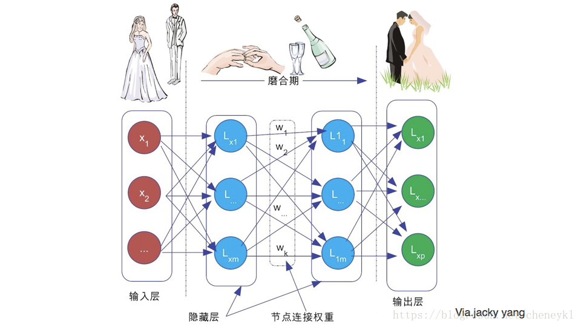
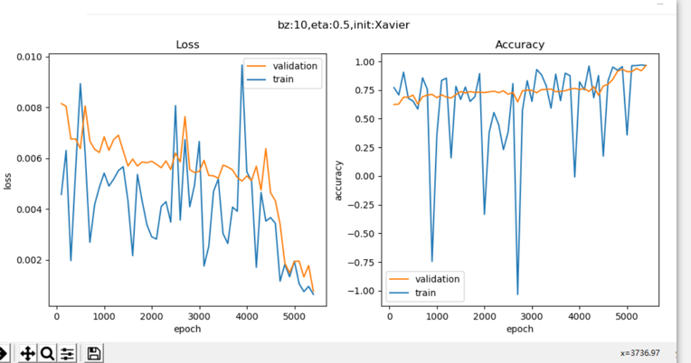
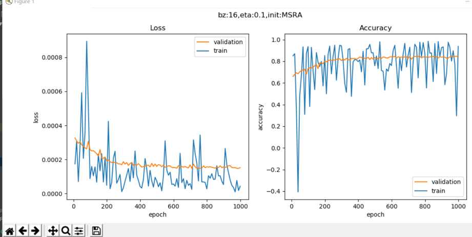
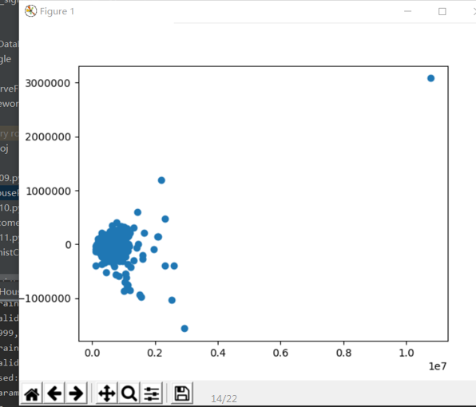
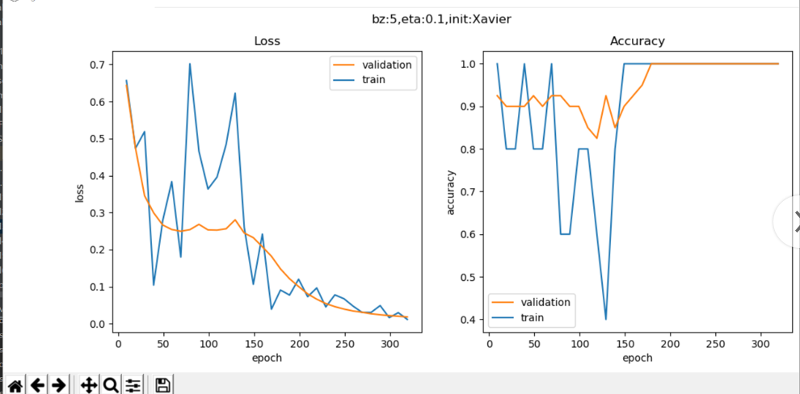
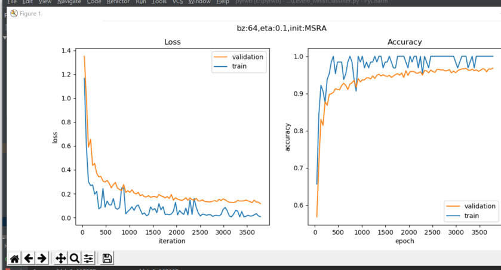
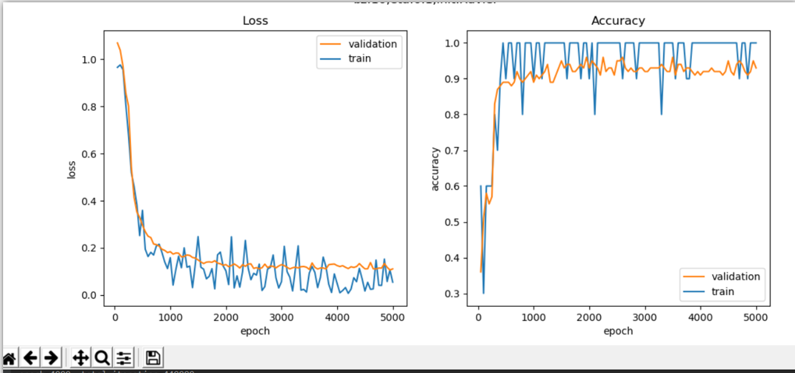

## 总结
今天学习了深度神经网络（Deep Neural Networks， 以下简称DNN），深度神经网络是深度学习的基础，从这一部分开始，探讨深度学习的一些细节，如权重矩阵初始化、梯度下降优化算法、批量归一化等高级知识。并且通过回归任务，二任务，多任务的测试和分析，更加深入的了解了这门课。

## 1. DNN的基本结构
 DNN的基本结构
神经网络是基于感知机的扩展，而DNN可以理解为有很多隐藏层的神经网络。多层神经网络和深度神经网络DNN其实也是指的一个东西，DNN有时也叫做多层感知机（Multi-Layer perceptron,MLP）。
从DNN按不同层的位置划分，DNN内部的神经网络层可以分为三类，输入层，隐藏层和输出层,如下图示例，一般来说第一层是输入层，最后一层是输出层，而中间的层数都是隐藏层

层与层之间是全连接的，也就是说，第i层的任意一个神经元一定与第i+1层的任意一个神经元相连。虽然DNN看起来很复杂，但是从小的局部模型来说，还是和感知机一样，一个线性关系加上一个激活函数。

## 2. 搭建深度神经网络

NeuralNet
我们首先需要一个NeuralNet类，来包装基本的神经网络结构和功能：

Layers - 神经网络各层的容器，按添加顺序维护一个列表

Parameters - 基本参数，包括普通参数和超参

Loss Function - 提供计算损失函数值，存储历史记录并最后绘图的功能

LayerManagement() - 添加神经网络层

ForwardCalculation() - 调用各层的前向计算方法

BackPropagation() - 调用各层的反向传播方法

PreUpdateWeights() - 预更新各层的权重参数

UpdateWeights() - 更新各层的权重参数

Train() - 训练

SaveWeights() - 保存各层的权重参数

LoadWeights() - 加载各层的权重参数

Layer
是一个抽象类，以及更加需要增加的实际类，包括：

Fully Connected Layer

Classification Layer

Activator 

Dropout Layer

Batch Norm Layer

将来还会包括：

Convolution Layer
Max Pool Layer
每个Layer都包括以下基本方法：

ForwardCalculation() - 调用本层的前向计算方法

BackPropagation() - 调用本层的反向传播方法

PreUpdateWeights() - 预更新本层的权重参数

UpdateWeights() - 更新本层的权重参数

SaveWeights() - 保存本层的权重参数

LoadWeights() - 加载本层的权重参数
Activator Layer
激活函数和分类函数：

Identity - 直传函数，即没有激活处理
Sigmoid
Tanh
Relu
Classification Layer
分类函数，包括：

Sigmoid二分类
Softmax多分类
Parameters
基本神经网络运行参数：

学习率
最大epoch
batch size
损失函数定义
初始化方法
优化器类型
停止条件
正则类型和条件
LossFunction
损失函数及帮助方法：

均方差函数
交叉熵函数二分类
交叉熵函数多分类
记录损失函数
显示损失函数历史记录
获得最小函数值时的权重参数
Optimizer
优化器：

SGD
Momentum
Nag
AdaGrad
AdaDelta
RMSProp
Adam
WeightsBias
权重矩阵，仅供全连接层使用：

初始化
Zero, Normal, MSRA (HE), Xavier
保存初始化值
加载初始化值
Pre_Update - 预更新
Update - 更新
Save - 保存训练结果值
Load - 加载训练结果值
DataReader
样本数据读取器：

ReadData - 从文件中读取数据
NormalizeX - 归一化样本值
NormalizeY - 归一化标签值
GetBatchSamples - 获得批数据
ToOneHot - 标签值变成OneHot编码用于多分类
ToZeorOne - 标签值变成0/1编码用于二分类
Shuffle - 打乱样本顺序
从中派生出两个数据读取器：

MnistImageDataReader - 读取MNIST数据
CifarImageReader - 读取Cifar10数据

## 3回归实验-万能近似定理
+ 搭建模型
这个模型很简单，一个双层的神经网络，第一层后面接一个Sigmoid激活函数，第二层直接输出拟合数据：
def model():
    dataReader = LoadData()
    num_input = 1
    num_hidden1 = 4
    num_output = 1

    max_epoch = 10000
    batch_size = 10
    learning_rate = 0.5

    params = HyperParameters_4_0(
        learning_rate, max_epoch, batch_size,
        net_type=NetType.Fitting,
        init_method=InitialMethod.Xavier,
        stopper=Stopper(StopCondition.StopLoss, 0.001))

    net = NeuralNet_4_0(params, "Level1_CurveFittingNet")
    fc1 = FcLayer_1_0(num_input, num_hidden1, params)
    net.add_layer(fc1, "fc1")
    sigmoid1 = ActivationLayer(Sigmoid())
    net.add_layer(sigmoid1, "sigmoid1")
    fc2 = FcLayer_1_0(num_hidden1, num_output, params)
    net.add_layer(fc2, "fc2")

    net.train(dataReader, checkpoint=100, need_test=True)

    net.ShowLossHistory()
    ShowResult(net, dataReader)

    训练和运行结果：   

##   回归任务 - 房价预测
+  数据处理
     原始数据只有一个数据集，所以需要我们自己把它分成训练集和测试集，比例大概为4:1。此数据集为csv文件格式，为了方便，我们把它转换成了两个扩展名为npz的numpy压缩形式：
   + house_Train.npz，训练数据集
   +   house_Test.npz，测试数据集
+  搭建模型

在不知道一个问题的实际复杂度之前，我们不妨把模型设计得复杂一些。如下图所示，这个模型包含了四组全连接层-Relu层的组合，最后是一个单输出做拟合。 

训练和运行结果:
看下面的打印输出部分，用R2_Score法得到的值为0.841，而用数据城堡官方的评测标准，得到的MSE值为2384411，还比较大，说明模型精度还应该有上升的空间。

## 4. 二分类试验 - 双弧形非线性二分类 
 搭建模型
同样是一个双层神经网络，但是最后一层要接一个Logistic二分类函数来完成二分类任务：

运行结果:
 
## 5. 多分类任务 - MNIST手写体识别
MNIST数据本身是图像格式的，我们用mode="vector"去读取，转变成矢量格式的
搭建模型:
运行结果:

## 6. 二分类任务 - 居民收入
收入调查与预测，即给定一个居民的各种情况，如工作、家庭、学历等，来预测该居民的年收入是否可以大于$50K/年，所以大于$50K的就是正例，而小于等于$50K的就是负例
   + 数据处理
数据分析和数据处理实际上是一门独立的课，超出类本书的范围，所以我们只做一些简单的数据处理，以便神经网络可以用之训练。
对于连续值，我们可以直接使用原始数据。对于枚举型，我们需要把它们转成连续值。以性别举例，Female=0，Male=1即可。对于其它枚举型，都可以用从0开始的整数编码。
一个小技巧是利用python的list功能，取元素下标，即可以作为整数编码：
sex_list = ["Female", "Male"]
array_x[0,9] = sex_list.index(row[9].strip())
strip()是trim掉前面的空格，因为是csv格式，读出来会是这个样子："_Female"，前面总有个空格。index是取列表下标，这样对于字符串"Female"取出的下标为0，对于字符串"Male"取出的下标为1。
把所有数据按行保存到numpy数组中，最后用npz格式存储：
np.savez(data_npz, data=self.XData, label=self.YData)
原始数据已经把train data和test data分开了，所以我们针对两个数据集分别调用数据处理过程一次，保存为Income_Train.npz和Income_Test.npz。
  + 搭建模型 
  + 训练结果
下图左边是损失函数图，右边是准确率图。忽略测试数据的波动，只看红色的验证集的趋势，损失函数值不断下降，准确率不断上升。 

损失函数图和准确度图： 
分类效果图: 

