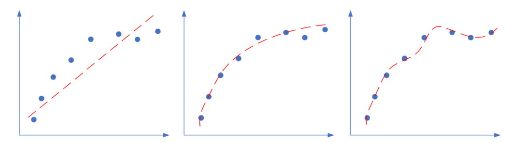
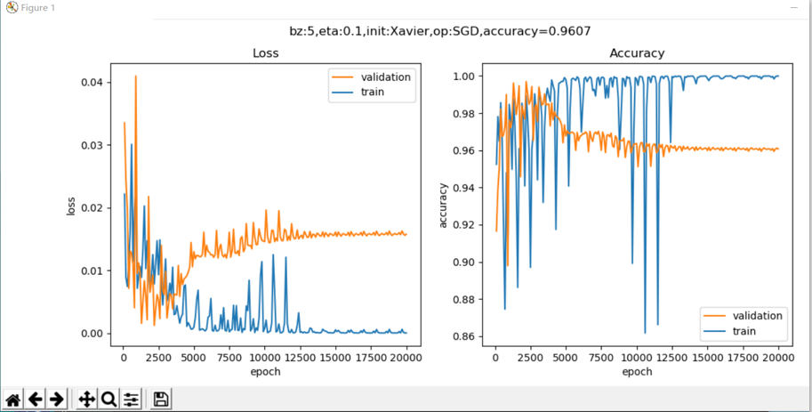
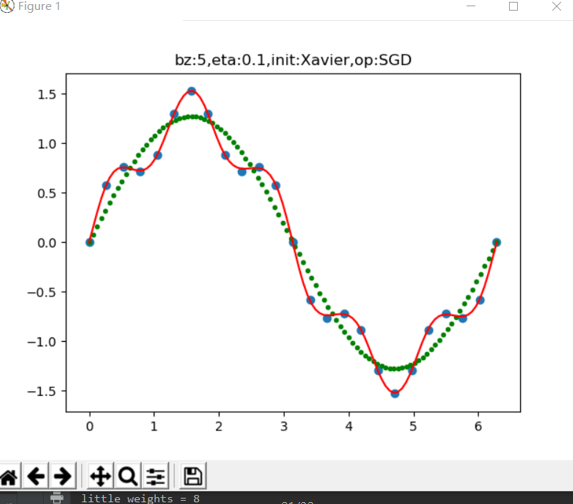
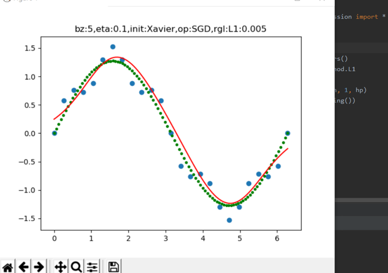
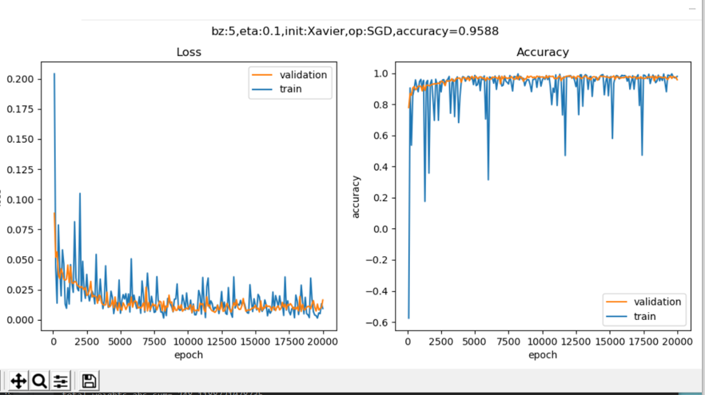
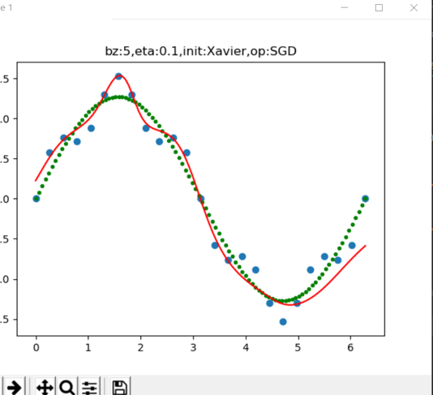
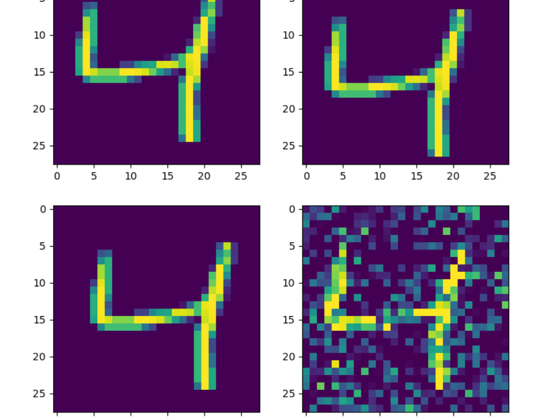

## 总结
今天早上，我们学习了正则化来防止过拟合，了解了过拟合产生的原因以及解决过拟合的方法，，通过学习正则化，进一步的深刻了解神经网络。

### 1.正则化 
     正则化的英文为Regularization，用于防止过拟合。

+ 过拟合
 拟合程度比较
在深度神经网络中，我们遇到的另外一个挑战，就是网络的泛化问题。所谓泛化，就是模型在测试集上的表现要和训练集上一样好。经常有这样的例子：一个模型在训练集上千锤百炼，能到达99%的准确率，拿到测试集上一试，准确率还不到90%。这说明模型过度拟合了训练数据，而不能反映真实世界的情况。解决过度拟合的手段和过程，就叫做泛化。

神经网络的两大功能：回归和分类。这两类任务，都会出现欠拟合和过拟合现象，如下图所示：
 
上图是回归任务中的三种情况，依次为：欠拟合、正确的拟合、过拟合。
 
上图是分类任务中的三种情况，依次为：分类欠妥、正确的分类、分类过度。由于分类可以看作是对分类边界的拟合，所以我们经常也统称其为拟合。

上图中对于“深入敌后”的那颗绿色点样本，正确的做法是把它当作噪音看待，而不要让它对网络产生影响。而对于上例中的欠拟合情况，如果简单的（线性）模型不能很好地完成任务，我们可以考虑使用复杂的（非线性或深度）模型，即加深网络的宽度和深度，提高神经网络的能力。

但是如果网络过于宽和深，就会出现第三张图展示的过拟合的情况。
+ 出现过拟合的原因：

  + 训练集的数量和模型的复杂度不匹配，样本数量级小于模型的参数
  + 训练集和测试集的特征分布不一致
  + 样本噪音大，使得神经网络学习到了噪音，正常样本的行为被抑制
  + 迭代次数过多，过分拟合了训练数据，包括噪音部分和一些非重要特征

既然模型过于复杂，那么我们简化模型不就行了吗？为什么要用复杂度不匹配的模型呢？有两个原因：
因为有的模型以及非常成熟了，比如VGG16，可以不调参而直接用于你自己的数据训练，此时如果你的数据数量不够多，但是又想使用现有模型，就需要给模型加正则项了。
使用相对复杂的模型，可以比较快速地使得网络训练收敛，以节省时间。
+ 解决过拟合问题：有了直观感受和理论知识，如何解决过拟合问题：
  + 数据扩展
  +  正则
  + 丢弃法
  + 早停法
  + 集成学习法
特征工程（属于传统机器学习范畴，不在此处讨论）
简化模型，减小网络的宽度和深度
运行结果： 

## 2.偏差和方差
 直观的解释
先用一个直观的例子来理解偏差和方差。比如打靶，如下图所示：

神经网络训练的例子
我们在前面讲过数据集的使用，包括训练集、验证集、测试集。在训练过程中，我们要不断监测训练集和验证集在当前模型上的误差，和上面的打靶的例子一样，有可能产生四种情况：
在本例中，偏差衡量训练集误差，方差衡量训练集误差和验证集误差的比值。

上述四种情况的应对措施：

情况1

效果很好，可以考虑进一步降低误差值，提高准确度。

情况2

训练集和验证集同时出现较大的误差，有可能是：迭代次数不够、数据不好、网络设计不好，需要继续训练，观察误差变化情况。

情况3

训练集的误差已经很低了，但验证集误差很高，说明过拟合了，即训练集中的某些特殊样本影响了网络参数，但类似的样本在验证集中并没有出现

情况4

两者误差都很大，目前还看不出来是什么问题，需要继续训练
除了用上面的试验来估计泛化误差外，我们还希望在理论上分析其必然性，这就是偏差-方差分解的作用，bias-variance decomposition

各个项的含义是：

+ 偏差：度量了学习算法的期望与真实结果的偏离程度，即学习算法的拟合能力。
+ 方差：训练集与验证集的差异造成的模型表现的差异。
+ 噪声：当前数据集上任何算法所能到达的泛化误差的下线，即学习问题本身的难度。

  想当然地，我们希望偏差与方差越小越好，但实际并非如此。一般来说，偏差与方差是有冲突的，称为偏差-方差窘境 (bias-variance dilemma)。
  给定一个学习任务，在训练初期，由于训练不足，网络的拟合能力不够强，偏差比较大，也是由于拟合能力不强，数据集的特征也无法使网络产生显著变化，也就是欠拟合的情况。
  随着训练程度的加深，网络的拟合能力逐渐增强，训练数据的特征也能够渐渐被网络学到。
  充分训练后，网络的拟合能力已非常强，训练数据的微小特征都会导致网络发生显著变化，当训练数据自身的、非全局的特征被网络学到了，则将发生过拟合。

  ## 3. L1正则
    + 基本数学知识:拉普拉斯分布
    $$f(x)=\frac{1}{2b}exp(-\frac{|x-\mu|}{b})$$ $$= \frac{1}{2b} \begin{cases} exp(\frac{x-\mu}{b}), & x \lt \mu \ exp(\frac{\mu-x}{b}), & x \gt \mu \end{cases}$$

    L0范数与L1范数

    L0范数是指向量中非0的元素的个数。如果我们用L0范数来规则化一个参数矩阵W的话，就是希望W的大部分元素都是0，即让参数W是稀疏的。

    L1范数是指向量中各个元素绝对值之和，也叫“稀疏规则算子”（Lasso regularization）。为什么L1范数会使权值稀疏？有人可能会这样给你回答“它是L0范数的最优凸近似”。实际上，还存在一个更美的回答：任何的规则化算子，如果他在$w_i=0$的地方不可微，并且可以分解为一个“求和”的形式，那么这个规则化算子就可以实现稀疏。w的L1范数是绝对值，所以$|w|$在$w=0$处是不可微。

    测试结果： 

    ## 4. L2正则

       + 范数的基本概念：
      $$L_p = \lVert x \rVert_p = ({\sum^n_{i=1}\lvert x_i \rvert^p})^{1/p} \tag{1}$$
      范数包含向量范数和矩阵范数，我们只关心向量范数。我们用具体的数值来理解范数。假设有一个向量
      a：
      $$a=[1,-2,0,-4]$$
      $$L_0=3 \tag{非0元素数}$$ $$L_1 = \sum^3_{i=0}\lvert x_i \rvert = 1+2+0+4=7 \tag  {绝对值求和}$$ $$L_2 = \sqrt[2]{\sum^3_{i=0}\lvert x_i \rvert^2} =\sqrt[2]{21}=4.5826 \tag{平方和求方根}$$ $$L_{\infty}=4 \tag{最大值的绝对值}$$
     注意p可以是小数，比如0.5：
     $$L_{0.5}=19.7052$$

   +  L1范数是个菱形体，在平面上是一个菱形
   +  L2范数是个球体，在平面上是一个圆

测试结果： 

 ##   5. 丢弃法 Dropout
Dropout可以作为训练深度神经网络的一种正则方法供选择。在每个训练批次中，通过忽略一部分的神经元（让其隐层节点值为0），可以明显地减少过拟合现象。这种方式可以减少隐层节点间的相互作用，高层的神经元需要低层的神经元的输出才能发挥作用，如果高层神经元过分依赖某个低层神经元，就会有过拟合发生。在一次正向/反向的过程中，通过随机丢弃一些神经元，迫使高层神经元和其它的一些低层神经元协同工作，可以有效地防止神经元因为接收到过多的同类型参数而陷入过拟合的状态，来提高泛化程度。 
  + 算法与实现
前向计算
正常的隐层计算公式是：
$$ Z = W \cdot X + B \tag{1} $$
加入随机丢弃步骤后，变成了：
$$ r \sim Bernoulli(p) \tag{2} $$ $$Y = r \cdot X \tag{3}$$ $$Z = Y \cdot W + B \tag{4} $$
公式2是得到一个分布概率为p的伯努利分布，伯努利分布在这里可以简单地理解为0、1分布，p=0.5时，会生产与X相同数量的0、1，假设一共10个数，则： $$ r=[0,0,1,1,0,1,0,1,1,0] $$ 或者 $$ r=[0,1,1,0,0,1,0,1,0,1] $$ 或者其它一些分布。

从公式3，Y将会是X经过r的mask的结果，1的位置保留原x值，0的位置相乘后为0。

在反向传播时，和Relu函数的反向差不多，需要记住正向计算时得到的mask值，反向的误差矩阵直接乘以这个mask值就可以了。

训练和测试/阶段的不同
在训练阶段，我们使用正向计算的逻辑。在测试时，不能随机丢弃一些神经元，否则会造成测试结果不稳定，比如某个样本的第一次测试，得到了结果A；第二次测试，得到结果B。由于丢弃的神经元的不同，A和B肯定不相同，就会造成无法解释的情况

   + 测试结果：
     拟合效果： 

##  6. 早停法 Early Stopping
早停法，实际上也是一种正则化的策略，可以理解为在网络训练不断逼近最优解的过程种（实际上这个最优解是过拟合的），在梯度等高线的外围就停止了训练，所以其原理上和L2正则是一样的，区别在于得到解的过程。图中所示的等高线图，是当前带噪音的样本点所组成梯度图，并不代表测试集数据，所以其中心位置也不代表这个问题的最优解。我们假设红线是最优解，则早停法的目的就是在到达红线附近时停止训练。

 ### + 算法基础

一般的做法是，在训练的过程中，记录到目前为止最好的validation 准确率，当连续N次Epoch（比如N=10或者更多次）没达到最佳准确率时，则可以认为准确率不再提高了。此时便可以停止迭代了（Early Stopping）。这种策略也称为“No-improvement-in-N”，N即Epoch的次数，可以根据实际情况取，如10、20、30……

### + 实现方案
首先，在TrainingTrace类中，增加以下成员以支持早停机制：
early_stop：True表示激活早停机制判断
patience：忍耐次数上限，缺省值为5次
patience_counter：忍耐次数计数器
last_vld_loss：到目前为止最小的验证集损失值
测试结果： 
拟合效果:蓝点是样本，绿点是理想的拟合效果，红线是实际的拟合效果

7. 集成学习 Ensemble Learning

  + 集成学习的概念
    当数据集有问题，或者网络学习能力不足，或准确度不够时，我们可以采取集成学习的方法，来提升性能。说得通俗一些，就是发挥团队的智慧，根据团队中不同背景、不同能力的成员的独立意见，通过某种决策方法来解决一个问题。所以集成学习也称为多分类器系统(multi-classifier system)、基于委员会的学习(committee-based learning)等。一个简单的集成学习的示意图如下:

    Individual Learner 个体学习器
    如果所有的个体学习器都是同一类型的学习器，即同质模式，比如都用神经网路，称为“基学习器”（base learner），相应的学习算法称为“基学习算法”（base learning algorithm）。

     在传统的机器学习中，个体学习器可以是不同的，比如用决策树、支持向量机等，此时称为异质模式。
     Aggregator 结合模块
     个体学习器的输出，通过一定的结合策略，在结合模块中有机结合在一起，可以形成一个能力较强的学习器，所以有时称为强学习器，而相应地称个体学习器为弱学习器。
     个体学习器之间是否存在依赖关系呢？这取决于产生个体学习器的方法：
     Boosting系列算法，一系列的个体学习器需要一个个地串行生成，有前后依赖关系。
     Bagging算法和随机森林算法（Random Forest），个体学习器可以独立或并行生成，没有依赖关系。
    我们只讨论使用神经网络的同质个体学习方法，和Bagging集成算法。由于神经网络的复杂性，即使使用相同的网络参数，由于初始化的不同或者训练数据的不同，也可以得到差别很大的模型。

8. 数据增强
过拟合的原因之一是训练数据不够，而在现代的机器学习中，数据量却是不成问题，因为通过互联网上用户的交互行为，或者和手机App的交互行为，可以收集大量的数据用于网络训练。
但是对于一些图片类数据，不是很容易从原始渠道搞到，所以可以采用增加一些假数据的方式来满足需要，尤其是当这个任务是分类任务时，更加适合。

   + 缩放效果图           
      + 上：水平方向放大到1.2倍
      + 左：垂直方向放大到1.2倍
      + 中：原始图片
      + 右：垂直方向缩小到0.8倍
      + 下：水平方向缩小到0.8倍

   + 平移和添加噪音效果图  
       + 上左：原始图片
       + 上右：向下平移2像素
       + 下左：向右平移2像素
       + 下右：添加噪音