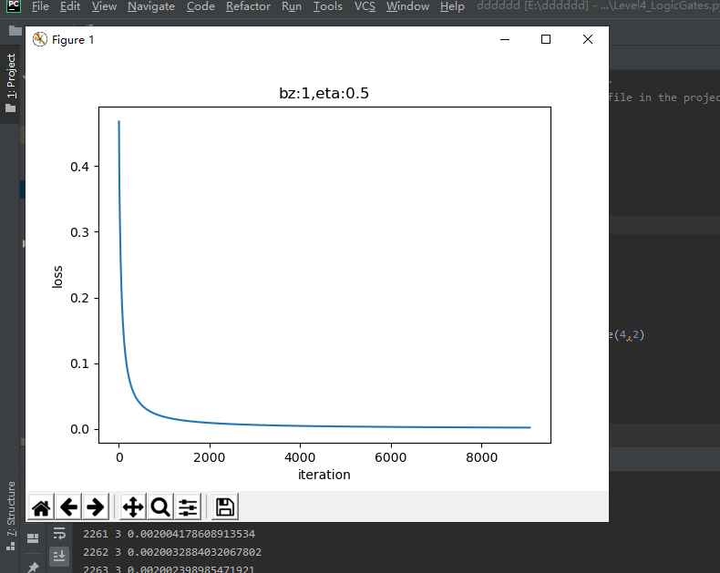

# 第3章 线性分类

## 一、二分类函数：
1. 对率函数Logistic Function，即可以做为激活函数使用，又可以当作二分类函数使用。
    + 公式:
       $$a(z) = \frac{1}{1 + e^{-z}}$$
    + 导数:
      $$a^{'}(z) = a(z)(1 - a(z))$$
    + 输入值域：
      $$(-\infty, \infty)$$
    + 输出值域：
      $$(0,1)$$ 
2. 正向传播：
    + 矩阵运算: 
       $$ z=x \cdot w + b \tag{1} $$
    + 分类计算：
     $$ a = Logistic(z)={1 \over 1 + e^{-z}} \tag{2} $$
    + 损失函数计算（二分类交叉熵损失函数）：
    $$ loss(w,b) = -[y \ln a+(1-y)\ln(1-a)] \tag{3} $$
3.  反向传播：
    + 损失函数loss对a的偏导：
    $$ \frac{\partial loss}{\partial a}=-[{y \over a}+{-(1-y) \over 1-a}]=\frac{a-y}{a(1-a)} \tag{4} $$
    + 损失函数a对z的偏导：
    $$ \frac{\partial a}{\partial z}= a(1-a) \tag{5} $$
    + 损失函数loss对z的偏导：
    $$ \frac{\partial loss}{\partial z}=a-y \tag{6} $$
    + 损失函数满足二分类的要求，无论是正例还是反例，都是单调的；
    + 损失函数可导，以便于使用反向传播算法；
    + 让计算过程非常简单，一个减法就可以搞定
## 二、线性二分类的神经网络实现：
1. 定义神经网络：
    + 这里神经元输出时使用了分类函数，所以有个A输出，而不是以往的z的直接输出。
    + 输入层（输入经度(x1)和纬度(x2)两个特征）：
       $$ x=\begin{pmatrix} x_{1} & x_{2} \end{pmatrix} $$
    + 权重矩阵：
        + 输入是2个特征，输出一个数，则W的尺寸就是2x1：
      $$ w=\begin{pmatrix} w_{1} \ w_{2} \end{pmatrix} $$
        + B的尺寸是1x1，行数永远是1，列数永远和W一样。
      $$ b=\begin{pmatrix} b_{1} \end{pmatrix} $$
    + 输出层：
  $$ z = x \cdot w + b =\begin{pmatrix} x_1 & x_2 \end{pmatrix} \begin{pmatrix} w_1 \ w_2 \end{pmatrix} $$ 
  $$ =x_1 \cdot w_1 + x_2 \cdot w_2 + b \tag{1} $$ 
  $$a = Logistic(z) \tag{2}$$
    + 损失函数（二分类交叉熵函损失数）：
  $$ loss(w,b) = -[yln a+(1-y)ln(1-a)] \tag{3} $$
2. 反向传播：
  $$ \frac{\partial loss}{\partial w}= \begin{pmatrix} {\partial loss / \partial w_1} \ {\partial loss / \partial w_2} \end{pmatrix} $$ 
 ## 三、线性二分类工作原理
1. 线性分类和线性回归的异同
   * 相同点：需要在样本群中找到一条直线
   * 不同：\
    线性回归：用直线来拟合所有样本，使得各个样本到这条直线的距离尽可能最短。\
    线性分类：用直线来分割所有样本，使得正例样本和负例样本尽可能分布在直线两侧（代数和几何）。
2. 二分类过程
   
* 正向计算

$$
z = x_1 w_1+ x_2 w_2 + b  \tag{1}
$$

* 分类计算

$$
a={1 \over 1 + e^{-z}} \tag{2}
$$

* 损失函数计算

$$
loss = -[y \ln (a)+(1-y) \ln (1-a)] \tag{3}
$$
## 四、实现逻辑与门和或门
+ 网络模型：用的是 神经元模型
+ 代码实现：
     
     
     
     
     
     
     
     
     
     
     
     
     
       
## 五、多入单出的单层神经网络
1. 多分类学习策略
+ 线性多分类：
+ 非线性多分类：
+ 二分类与多分类的关系：
+ 多分类解法：一对一、一对多、多对多 
2. 多分类结果可视化：
+ 代码运算：
+ 
+ 
+  
## 六、总结