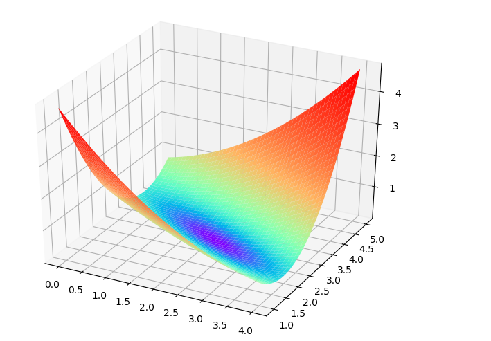
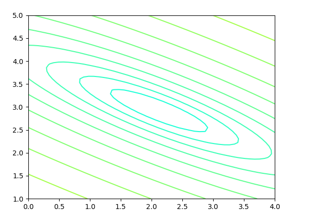

## 第二次课堂总结
#### 通过本节课的学习，我了解 了梯度下降、损失函数、均方差损失函数以及交叉熵损失函数。在上课前。老师让我们进行了预习。
### 对梯度下降函数和总结：
（1）梯度下降的数学公式：
$$\theta{n+1} = \theta{n} - \eta \cdot \nabla J(\theta) \tag{1}$$

(2) 梯度下降的三要素：当前点、方向、步长

(3) 单变量函数的梯度下降：

假设一个单变量函数：
$$J(x) = x ^2$$

我们的目的是找到该函数的最小值，于是计算其微分：
$$J'(x) = 2x$$

假设初始位置为：
$$x_0=1.2$$

假设学习率：
$$\eta = 0.3$$

根据公式(1)，迭代公式：
$$x{n+1} = x{n} - \eta \cdot \nabla J(x)= x_{n} - \eta \cdot 2x\tag{1}$$

假设终止条件为J(x)<1e-2，迭代过程是： x=0.480000, y=0.230400 x=0.192000, y=0.036864 x=0.076800, y=0.005898 x=0.030720, y=0.000944

(4) 双变量的梯度下降

假设一个双变量函数：
$$J(x,y) = x^2 + \sin^2(y)$$

我们的目的是找到该函数的最小值，于是计算其微分：
$${\partial{J(x,y)} \over \partial{x}} = 2x$$ $${\partial{J(x,y)} \over \partial{y}} = 2 \sin y \cos y$$

假设初始位置为：
$$(x0,y0)=(3,1)$$

假设学习率：
$$\eta = 0.1$$

根据公式(1)，迭代过程是的计算公式： $$(x{n+1},y{n+1}) = (xn,yn) - \eta \cdot \nabla J(x,y)$$ $$ = (xn,yn) - \eta \cdot (2x,2 \cdot \sin y \cdot \cos y) \tag{1}$$

根据公式(1)，假设终止条件为$J(x,y)<1e-2$，迭代过程：
||x|y|J(x,y)| |---|---|---|---| |1|3|1|9.708073| |2|2.4|0.909070|6.382415| |3|1.92|0.812114|4.213103| |...|...|...|...| |15|0.105553|0.063481|0.015166| |16|0.084442|0.050819|0.009711|
迭代16次后，J(x,y)的值为0.009711，满足小于1e-2的条件，停止迭代。

(5) 学习率η的选择

在code里，我们把学习率定义为learning_rate，或者eta，或者叫 $\alpha$。 针对上面的例子，当初始值为-0.8，学习率为1时，迭代的情况很尴尬：不断在一条水平线上跳来跳去，永远也不能下降。
### 对损失函数的总结
(1) 损失的概念：
损失就是所有样本的误差的总和，亦即： $$损失 = \sum^m{i=1}误差i$$ $$J = \sum_{i=1}^m loss$$

(2) 损失函数的作用：
计算神经网络每次迭代的前向计算结果与真实值的差距，从而指导下一步的训练向正确的方向进行。

使用损失函数的具体步骤：

1.用随机值初始化前向计算公式的参数

2.代入样本，计算输出的预测值

3.用损失函数计算预测值和标签值（真实值）的误差

4.根据损失函数的导数，沿梯度最小方向将误差回传，修正前向计算公式中的各个权重值

5.goto2，直到损失函数值达到一个满意的值就停止迭代

(3) 损失函数图像的理解

1.用二维函数图像理解单变量对损失函数的影响：
不断地改变变量的值，会造成损失函数值的上升和下降。而梯度下降算法会让我们沿着损失函数值下降的方向前进

2.用等高线图理解双变量对损失函数影响：横坐标是一个变量w，纵坐标是另一个变量b。两个变量的组合形成的损失函数值，在图中对应处于等高线上的唯一的一个坐标点。所有的不同的值的组合会形成一个损失函数值的矩阵，我们把矩阵中具有相同（相近）损失函数值的点连接起来，可以形成一个不规则椭圆，其圆心位置，是损失值为0的位置，也是我们要逼近的目标。
这个椭圆如同平面地图的等高线，来表示的一个洼地，中心位置比边缘位置要低，通过对损失函数的计算，对损失函数的求导，会带领我们沿着等高线形成的梯子一步步下降，无限逼近中心点。

(4) 神经网络中常用的损失函数：

均方差函数，主要用于回归

交叉熵函数，主要用于分类

二者都是非负函数，极值在底部，用梯度下降法可以求解。

### 对均方差函数的总结
均方差函数常用于线性回归即函数拟合

(1) 公式：
$$ loss = {1 \over 2}(z-y)^2 \tag{单样本} $$

$$ J=\frac{1}{2m} \sum{i=1}^m (zi-y_i)^2 \tag{多样本} $$

(2) 工作原理：
要想得到预测值a与真实值y的差距，最朴素的想法就是用$Error=ai-yi$。

对于单个样本来说，这样做没问题，但是多个样本累计时，$ai-yi$有可能有正有负，误差求和时就会导致相互抵消，从而失去价值。所以有了绝对值差的想法，即$Error=|ai-yi|$。

假设有三个样本的标签值是$y=[1,1,1]$：

|样本标签值|样本预测值|绝对值损失函数|均方差损失函数| |------|------|------|------| |$[1,1,1]$|$[1,2,3]$|$(1-1)+(2-1)+(3-1)=3$|$(1-1)^2+(2-1)^2+(3-1)^2=5$| |$[1,1,1]$|$[1,3,3]$|$(1-1)+(3-1)+(3-1)=4$|$(1-1)^2+(3-1)^2+(3-1)^2=8$| |||4/3=1.33|8/5=1.6|

可以看到5比3已经大了很多，8比4大了一倍，而8比5也放大了某个样本的局部损失对全局带来的影响，用不通俗的语言说，就是“对某些偏离大的样本比较敏感”，从而引起监督训练过程的足够重视，以便回传误差。

(3) 损失函数的可视化

1.损失函数值的3D示意图

2.损失函数值的2D示意图

### 对交叉熵损失函数的总结

(1) 交叉熵是Shannon信息论中一个重要概念，主要用于度量两个概率分布间的差异性信息。在信息论中，交叉熵是表示两个概率分布p,q的差异，其中p表示真实分布，q表示非真实分布，那么H(p,q)就称为交叉熵：
$$H(p,q)=\sumi pi \cdot log {1 \over qi} = - \sumi pi \log qi$$

交叉熵函数常用于逻辑回归

(2) 熵

$$H(p) = - \sumj^n p(xj) \log (p(x_j))$$

则上面的问题的熵是：$H(p) = -[p(A) \log p(A) + p(B) \log p(B) + p(C) \log p(C)]$$ $$=0.7 \times 0.36 + 0.2 \times 1.61 + 0.1 \times 2.30$$ $$=0.804$$

(3) 相对熵(KL散度)

用 KL 散度来衡量这两个分布的差异，这个相当于信息论范畴的均方差。

KL散度的计算公式：
$$D{KL}(p||q)=\sum{j=1}^n p(x_j) \log{p(xj) \over q(xj)}$$

n为事件的所有可能性。 D的值越小，表示q分布和p分布越接近。

(4) 交叉熵

在机器学习中，我们需要评估label和predicts之间的差距，使用KL散度刚刚好，即$D_{KL}(y||a)$，由于KL散度中的前一部分$H(y)$不变，故在优化过程中，只需要关注交叉熵就可以了。所以一般在机器学习中直接用用交叉熵做loss，评估模型。
$$loss =- \sum{j=1}^n yj \log a_j$$

(5) 二分类问题交叉熵

当y=1时，即标签值是1，是个正例：
$$loss = -log(a)$$
横坐标是预测输出，纵坐标是损失函数值。y=1意味着当前样本标签值是1，当预测输出越接近1时，Loss值越小，训练结果越准确。当预测输出越接近0时，Loss值越大，训练结果越糟糕。

(6) 多分类问题交叉熵

### 总结

  通过本节课的学习，我理解了梯度下降的概念，以及怎样使用损失函数，对均方差函数和交叉熵损失含函数有了进一步的理解和学习，知道了损失函数是用来估量你模型的预测值f(x)与真实值Y的不一致程度，衡量模型预测的好坏。它是一个非负实值函数,通常使用L(Y, f(x))来表示，损失函数越小，模型的鲁棒性就越好。损失函数是经验风险函数的核心部分，也是结构风险函数重要组成部分。