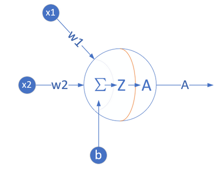
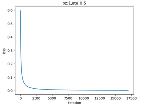
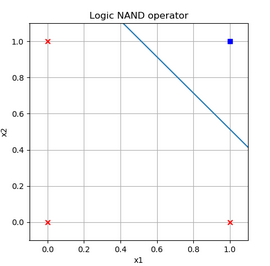
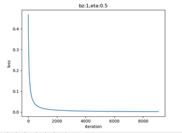
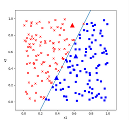
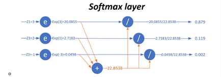
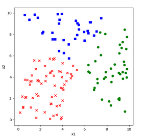
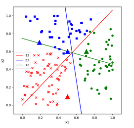

## 第四次课堂总结
  通过本节课的学习，我掌握了线性二分类以及线性多分类的相关知识。
  ### 二分类函数
对率函数Logistic Function，即可以做为激活函数使用，又可以当作二分类函数使用。而在很多不太正规的文字材料中，把这两个概念混用了，比如下面这个说法：“我们在最后使用Sigmoid激活函数来做二分类”，这是不恰当的。在本书中，我们会根据不同的任务区分激活函数和分类函数这两个概念，在二分类任务中，叫做Logistic函数，而在作为激活函数时，叫做Sigmoid函数。

(1) 公式

$$a(z) = \frac{1}{1 + e^{-z}}$$

导数:
$$a^{'}(z) = a(z)(1 - a(z))$$

输入值域:
$$(-\infty, \infty)$$

输出值域:
$$(0,1)$$

函数图像

使用方式:
此函数实际上是一个概率计算，它把$(-\infty, \infty)$之间的任何数字都压缩到$(0,1)$之间，返回一个概率值，这个概率值接近1时，认为是正例，否则认为是负例。
训练时，一个样本x在经过神经网络的最后一层的矩阵运算结果作为输入z，经过Logistic计算后，输出一个$(0,1)$之间的预测值。我们假设这个样本的标签值为0属于负类，如果其预测值越接近0，就越接近标签值，那么误差越小，反向传播的力度就越小。

(2) 正向传播

矩阵运算:
$$ z=x \cdot w + b \tag{1} $$

分类计算:
$$ a = Logistic(z)={1 \over 1 + e^{-z}} \tag{2} $$

损失函数计算:

二分类交叉熵损失函数：
$$ loss(w,b) = -[y \ln a+(1-y)\ln(1-a)] \tag{3} $$

(3) 反向传播

求损失函数loss对a的偏导：
$$ \frac{\partial loss}{\partial a}=-[{y \over a}+{-(1-y) \over 1-a}]=\frac{a-y}{a(1-a)} \tag{4} $$

求损失函数a对z的偏导：
$$ \frac{\partial a}{\partial z}= a(1-a) \tag{5} $$

求损失函数loss对z的偏导：

使用链式法则链接公式4和公式5：
$$ \frac{\partial loss}{\partial z}=\frac{\partial loss}{\partial a}\frac{\partial a}{\partial z} $$ $$ =\frac{a-y}{a(1-a)} \cdot a(1-a)=a-y \tag{6} $$
### 线性二分类的神经网络实现
(1) 定义神经网络结构

+ 输入层:
输入经度(x1)和纬度(x2)两个特征：
$$ x=\begin{pmatrix} x{1} & x{2} \end{pmatrix} $$

+ 权重矩阵:
输入是2个特征，输出一个数，则W的尺寸就是2x1：
$$ w=\begin{pmatrix} w{1} \ w{2} \end{pmatrix} $$

B的尺寸是1x1，行数永远是1，列数永远和W一样。

$$ b=\begin{pmatrix} b_{1} \end{pmatrix} $$

+ 输出层:
$$ z = x \cdot w + b =\begin{pmatrix} x1 & x2 \end{pmatrix} \begin{pmatrix} w1 \ w2 \end{pmatrix} $$ $$ =x1 \cdot w1 + x2 \cdot w2 + b \tag{1} $$ $$a = Logistic(z) \tag{2}$$

+ 损失函数:

二分类交叉熵函损失数：
$$ loss(w,b) = -[yln a+(1-y)ln(1-a)] \tag{3} $$

(2) 反向传播

### 线性二分类原理
(1) 二分类过程
+ 正向计算:
$$ z = x1 w1+ x2 w2 + b \tag{1} $$
+ 分类计算:
$$ a={1 \over 1 + e^{-z}} \tag{2} $$
+ 损失函数计算:
$$ loss = -[y \ln (a)+(1-y) \ln (1-a)] \tag{3} $$
### 二分类结果可视化

### 实现逻辑与门和或门
(1) 网络模型

(2) 代码实现

### 用双曲正切函数做二分类函数

(1) 增加双曲正切分类函数

Python def Tanh(z): a = 2.0 / (1.0 + np.exp(-2*z)) - 1.0 return a

(2) 修改前向计算方法

Python class NetType(Enum): Fitting = 1, BinaryClassifier = 2, MultipleClassifier = 3, BinaryTanh = 4,

(3) 修改反向传播方法

(4) 修改损失函数

交叉熵函数原公式为：
$$loss=-[yi \ln ai + (1-yi) \ln (1-ai)] \tag{2}$$

改成：
$$loss=-[(1+yi) \ln (1+ai) + (1-yi) \ln (1-ai)] \tag{7}$$

对公式7求导：
$$ {\partial loss \over \partial ai} = {2(ai-y_i) \over (1+ai)(1-ai)} \tag{8} $$

结合公式5的Tanh的导数：
$${\partial loss \over \partial zi}={\partial loss \over \partial ai}{\partial ai \over \partial zi}$$ $$ ={2(ai-yi) \over (1+ai)(1-ai)} (1+ai)(1-ai)$$ $$=2(ai-yi) \tag{9}$$

(5) 增加新的损失函数

Python class LossFunction(object): def CE2_tanh(self, A, Y, count): p = (1-Y) * np.log(1-A) + (1+Y) * np.log(1+A) LOSS = np.sum(-p) loss = LOSS / count return loss

(6) 修改反向传播方法

(7) 再次修改损失函数代码

(8) 修改样本数据标签值

### 多分类函数
(1) 正向传播

矩阵运算:
$$ z=x \cdot w + b \tag{1} $$

分类计算:
$$ aj = \frac{e^{zj}}{\sum\limits{i=1}^m e^{zi}}=\frac{e^{zj}}{e^{z1}+e^{z2}+\dots+e^{zm}} \tag{2} $$

损失函数计算:
计算单样本时，m是分类数： $$ loss(w,b)=-\sum{i=1}^m yi \ln a_i \tag{3} $$
计算多样本时，m是分类树，n是样本数： $$J(w,b) =- \sum{j=1}^n \sum{i=1}^m y{ij} \log a{ij} \tag{4}$$

图示如下：

### 线性多分类的神经网络实现
(1) 输入层：输入经度(x1)和纬度(x2)两个特征：
$$ x=\begin{pmatrix} x1 & x2 \end{pmatrix} $$

(2) 权重矩阵w/b

W权重矩阵的尺寸，可以从后往前看，比如：输出层是3个神经元，输入层是2个特征，则W的尺寸就是3x2。
$$ w=\begin{pmatrix} w{11} & w{12} & w{13}\ w{21} & w{22} & w{23} \end{pmatrix} $$
b的尺寸是1x3，列数永远和神经元的数量一样，行数永远是1。
$$ b=\begin{pmatrix} b1 & b2 & b_3 \end{pmatrix} $$

(3) 输出层:输出层三个神经元，再加上一个Softmax计算，最后有A1,A2,A3三个输出，写作：

$$ z = \begin{pmatrix}z1 & z2 & z3 \end{pmatrix} $$ $$ a = \begin{pmatrix}a1 & a2 & a3 \end{pmatrix} $$

其中，$Z=X \cdot W+B，A = Softmax(Z)$
### 线性多分类原理
(1) 多分类过程
+ 线性计算:

$$z1 = x1 w{11} + x2 w{21} + b1 \tag{1}$$ $$z2 = x1 w{12} + x2 w{22} + b2 \tag{2}$$ $$z3 = x1 w{13} + x2 w{23} + b3 \tag{3}$$

+  分类计算
$$ a1=\frac{e^{z1}}{\sumi e^{zi}}=\frac{e^{z1}}{e^{z1}+e^{z2}+e^{z3}} \tag{4} $$ $$ a2=\frac{e^{z2}}{\sumi e^{zi}}=\frac{e^{z2}}{e^{z1}+e^{z2}+e^{z3}} \tag{5} $$ $$ a3=\frac{e^{z3}}{\sumi e^{zi}}=\frac{e^{z3}}{e^{z1}+e^{z2}+e^{z3}} \tag{6} $$

+ 损失函数计算

单样本时，$n$表示类别数，$j$表示类别序号：
$$ loss(w,b)=-(y1 \ln a1 + y2 \ln a2 + y3 \ln a3) $$ $$ =-\sum{j=1}^{n} yj \ln a_j \tag{7} $$

批量样本时，$m$表示样本数，$i$表示样本序号：
$$J(w,b) =- \sum{i=1}^m (y{i1} \ln a{i1} + y{i2} \ln a{i2} + y{i3} \ln a{i3})$$ $$ =- \sum{i=1}^m \sum_{j=1}^n y{ij} \ln a{ij} \tag{8}$$

在交叉熵函数一节有详细介绍。
### 线性多分类结果可视化
实现代码：

