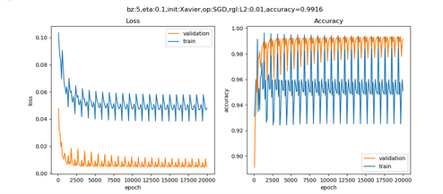
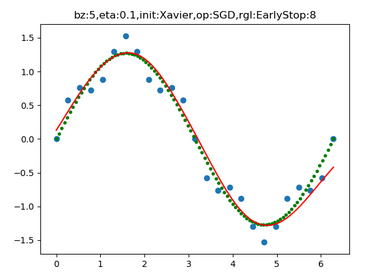
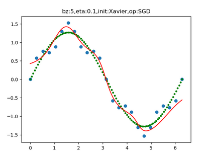

## 第七次课堂总结
 通过本节课的学习，我了解了正规化相关的知识，并很好的加以掌握和运用。
 ### 偏差与方差
 一般来说，偏差与方差是有冲突的，称为偏差-方差窘境 (bias-variance dilemma)。

+ 给定一个学习任务，在训练初期，由于训练不足，网络的拟合能力不够强，偏差比较大，也是由于拟合能力不强，数据集的特征也无法使网络产生显著变化，也就是欠拟合的情况。
+ 随着训练程度的加深，网络的拟合能力逐渐增强，训练数据的特征也能够渐渐被网络学到。
+ 充分训练后，网络的拟合能力已非常强，训练数据的微小特征都会导致网络发生显著变化，当训练数据自身的、非全局的特征被网络学到了，则将发生过拟合。
### L2正则
(1) 假设： - W参数服从高斯分布，即：$wj \sim N(0,\tau^2)$ - Y服从高斯分布，即：$yi \sim N(w^Tx_i,\sigma^2)$

贝叶斯最大后验估计：
$$ argmaxwL(w) = ln \prodi^n {1 \over \sigma\sqrt{2 \pi}}exp(-(\frac{yi-w^Txi}{\sigma})^2/2) \cdot \prodj^m{\frac{1}{\tau\sqrt{2\pi}}exp(-(\frac{wj}{\tau})^2/2)} $$
$$ =-\frac{1}{2\sigma^2}\sumi^n(yi-w^Tx_i)^2-\frac{1}{2\tau^2}\sumj^m{wj^2}-n\ln\sigma\sqrt{2\pi}-m\ln \tau\sqrt{2\pi} \tag{3} $$

因为$\sigma、b、n、\pi、m$等都是常数，所以损失函数J(w)的最小值可以简化为：
$$ argminwJ(w) = \sumi^n(yi-w^Txi)^2+\lambda\sumj^m{wj^2} \tag{4} $$

看公式4，相当于是线性回归的均方差损失函数，再加上一个正则项（也称为惩罚项），共同构成损失函数。如果想求这个函数的最小值，则需要两者协调，并不是说分别求其最小值就能实现整体最小，因为它们具有共同的W项，当W比较大时，第一项比较小，第二项比较大，或者正好相反。所以它们是矛盾组合体。

为了简化问题便于理解，我们用两个参数w1,w2举例。对于公式4的第一项，我们用前面学习过损失函数的等高线图来解释。对于第二项，形式应该是一个圆形，因为圆的方程是$r^2=x^2+y^2$。

(2) 关于bias偏置项的正则

上面的L2正则化没有约束偏置（biases）项。当然，通过修改正则化过程来正则化偏置会很容易，但根据经验，这样做往往不能较明显地改变结果，所以是否正则化偏置项仅仅是一个习惯问题。

值得注意的是，有一个较大的bias并不会使得神经元对它的输入像有大权重那样敏感，所以不用担心较大的偏置会使我们的网络学习到训练数据中的噪声。同时，允许大的偏置使我们的网络在性能上更为灵活，特别是较大的偏置使得神经元更容易饱和，这通常是我们期望的。由于这些原因，通常不对偏置做正则化。

(3) 损失函数的变化

假设是均方差损失函数：
$$J(w,b)=\frac{1}{2m}\sum{i=1}^m (zi-y_i)^2 + {\lambda \over 2m}\sum{j=1}^n{wj^2} \tag{5}$$

如果是交叉熵损失函数：
$$J(w,b)= -\frac{1}{m} \sum{i=1}^m [yi \ln ai + (1-yi) \ln (1-ai)]+ \frac{\lambda}{2m}\sum{j=1}^n{w_j^2} \tag{6}$$


(5) 代码运行


### L1正则

(1) 假设： - W参数服从拉普拉斯分布，即$wj \sim Laplace(0,b)$ - Y服从高斯分布，即$yi \sim N(w^Tx_i,\sigma^2)$

贝叶斯最大后验估计： $$ argmaxwL(w) = ln \prodi^n {1 \over \sigma\sqrt{2 \pi}}exp(-\frac{1}{2}(\frac{yi-w^Txi}{\sigma})^2) \cdot \prodj^m{\frac{1}{2b}exp(-\frac{\lvert wj \rvert}{b})} $$ $$ =-\frac{1}{2\sigma^2}\sumi^n(yi-w^Tx_i)^2-\frac{1}{2b}\sumj^m{\lvert wj \rvert}-n\ln\sigma\sqrt{2\pi}-m\ln b\sqrt{2\pi} \tag{1} $$

因为$\sigma、b、n、\pi、m$等都是常数，所以损失函数J(w)的最小值可以简化为：
$$ argminwJ(w) = \sumi^n(yi-w^Txi)^2+\lambda\sumj^m{\lvert wj \rvert} \tag{2} $$

我们仍以两个参数为例，公式2的后半部分的正则形式为：
$$L1 = \lvert w1 \rvert + \lvert w_2 \rvert \tag{3}$$

因为$w1、w2$有可能是正数或者负数，我们令$x=|w_1|、y=|w2|、c=L1$，则公式3可以拆成以下4个公式的组合：
$$ y=-x+c \quad (当w1 \gt 0, w2 \gt 0时) $$ $$ y=\quad x+c \quad (当w1 \lt 0, w2 \gt 0时) $$ $$ y=\quad x-c \quad (当w1 \gt 0, w2 \lt 0时) $$ $$ y=-x-c \quad (当w1 \lt 0, w2 \lt 0时) $$

所以上述4个公式（4条直线）会组成一个二维平面上的一个菱形。

(2) 损失函数的变化

假设我们以前使用的损失函数为$J_0$，则新的损失函数变成：
$$J = J0 + \frac{\lambda}{m} \sumi^m \lvert w_i \rvert$$

代码片段如下：
Python regular_cost = 0 for i in range(self.layer_count-1,-1,-1): layer = self.layer_list[i] if isinstance(layer, FcLayer): if regularName == RegularMethod.L1: regular_cost += np.sum(np.abs(layer.weights.W)) elif regularName == RegularMethod.L2: regular_cost += np.sum(np.square(layer.weights.W)) # end if # end for return regular_cost * self.params.lambd

可以看到L1部分的代码，先求绝对值，再求和。那个分母上的m是在下一段代码中处理的，因为在上一段代码中，没有任何样本数量的信息。

Python loss_train = self.lossFunc.CheckLoss(train_y, self.output) loss_train += regular_cost / train_y.shape[0] train_y.shape[0]就是样本数量。

(3)反向传播的变化

假设一个两层的神经网络，其前向过程是：
$$Z1=W1 \cdot X + B1$$ $$A1 = Sigmoid(Z1)$$ $$Z2=W2 \cdot A1 + B2$$ $$J(w,b) = J_0 + \lambda (\lvert W1 \rvert+\lvert W2 \rvert)$$

则反向过程为：
$$dW2=\frac{dJ}{dW2}=\frac{dJ}{dZ2}\frac{dZ2}{dW2}+\frac{dJ}{dW2}$$ $$=dZ2 \cdot A1^T+\lambda \odot sign(W2)$$ $$dW1= dZ1 \cdot X^T + \lambda \odot sign(W1) $$

从上面的公式中可以看到，正则项在方向传播过程中，唯一影响的就是求W的梯度时，要增加一个$\lambda \odot sign(W)$，sign是符号函数，返回该值的符号，即1或-1。

(4)运行结果


### 早停法 Early Stopping
(1) 算法

初始化 初始权重均值参数：theta = theta_0 迭代次数：i = 0 忍耐次数：patience = N (e.g. N=10) 忍耐次数计数器：counter = 0 验证集损失函数值：lastLoss = 10000 (给一个特别大的数值)

while (epoch < maxEpoch) 循环迭代训练过程 正向计算，反向传播更新theta 迭代次数加1：i++ 计算验证集损失函数值：newLoss = loss if (newLoss < lastLoss) // 新的损失值更小 忍耐次数计数器归零：counter = 0 记录当前最佳权重矩阵训练参数：thetabest = theta 记录当前迭代次数：ibest = i 更新最新验证集损失函数值：lastLoss = newLoss else // 新的损失值大于上一步的损失值 忍耐次数计数器加1：counter++ if (counter >= patience) 停止训练！！！ end if end while ```

此时，thetabest和ibest就是最佳权重值和迭代次数。

(2) 运行结果



### 丢弃法 Dropout
(1) 算法与实现

前向计算

正常的隐层计算公式是：
$$ Z = W \cdot X + B \tag{1} $$

加入随机丢弃步骤后，变成了：
$$ r \sim Bernoulli(p) \tag{2} $$ $$Y = r \cdot X \tag{3}$$ $$Z = Y \cdot W + B \tag{4} $$

公式2是得到一个分布概率为p的伯努利分布，伯努利分布在这里可以简单地理解为0、1分布，p=0.5时，会生产与X相同数量的0、1，假设一共10个数，则： $$ r=[0,0,1,1,0,1,0,1,1,0] $$ 或者 $$ r=[0,1,1,0,0,1,0,1,0,1] $$ 或者其它一些分布。

从公式3，Y将会是X经过r的mask的结果，1的位置保留原x值，0的位置相乘后为0。

(2) 反向传播

在反向传播时，和Relu函数的反向差不多，需要记住正向计算时得到的mask值，反向的误差矩阵直接乘以这个mask值就可以了。

(3) 运行结果



### 数据增强 Data Augmentation

旋转

定义图片中心和旋转角度，进行微小的旋转。

上图中，中间的是原始图片，左右是旋转后的图片。
选择操作的代码：
Python def rotate(image, angle): height, width = image.shape center = (height // 2, width // 2) rotation = cv2.getRotationMatrix2D(center, angle, 1) rotated_image = cv2.warpAffine(image, rotation, (width, height)) return rotated_image


+ 上：水平方向放大到1.2倍
+ 左：垂直方向放大到1.2倍
+ 中：原始图片
+ 右：垂直方向缩小到0.8倍
+ 下：水平方向缩小到0.8倍
+ 平移和添加噪音

+ 上左：原始图片
+ 上右：向下平移2像素
+ 下左：向右平移2像素
+ 下右：添加噪音

旋转


缩放


高斯噪声


### 集成学习 Ensemble Learning
(1) 概念

当数据集有问题，或者网络学习能力不足，或准确度不够时，我们可以采取集成学习的方法，来提升性能。说得通俗一些，就是发挥团队的智慧，根据团队中不同背景、不同能力的成员的独立意见，通过某种决策方法来解决一个问题。所以集成学习也称为多分类器系统(multi-classifier system)、基于委员会的学习(committee-based learning)等。

(2) 集成学习中的两个组件：

+ Individual Learner 个体学习器

如果所有的个体学习器都是同一类型的学习器，即同质模式，比如都用神经网路，称为“基学习器”（base learner），相应的学习算法称为“基学习算法”（base learning algorithm）。
在传统的机器学习中，个体学习器可以是不同的，比如用决策树、支持向量机等，此时称为异质模式。

+ Aggregator 结合模块

个体学习器的输出，通过一定的结合策略，在结合模块中有机结合在一起，可以形成一个能力较强的学习器，所以有时称为强学习器，而相应地称个体学习器为弱学习器。

个体学习器之间是否存在依赖关系呢？这取决于产生个体学习器的方法：

Boosting系列算法，一系列的个体学习器需要一个个地串行生成，有前后依赖关系。

Bagging算法和随机森林算法（Random Forest），个体学习器可以独立或并行生成，没有依赖关系。


