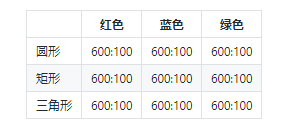
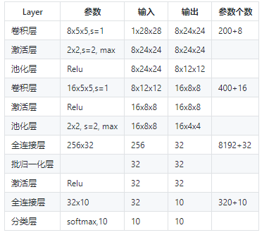

## 第九次课堂总结
  通过本节课的学习，我学习了经典卷积神经网络模型以及其分类，并对已加以掌握和运用。
### 实现颜色分类
(1) 用DNN解决问题

数据处理

由于输入图片是三通道的彩色图片，我们先把它转换成灰度图，
Python class GeometryDataReader(DataReader_2_0): def ConvertToGray(self, data): (N,C,H,W) = data.shape new_data = np.empty((N,H*W)) if C == 3: # color for i in range(N): new_data[i] = np.dot( [0.299,0.587,0.114], data[i].reshape(3,-1)).reshape(1,784) elif C == 1: # gray new_data[i] = data[i,0].reshape(1,784) #end if return new_data

向量[0.299,0.587,0.114]的作用是，把三通道的彩色图片的RGB值与此向量相乘，得到灰度图，三个因子相加等于1，这样如果原来是[255,255,255]的话，最后的灰度图的值还是255。如果是[255,255,0]的话，最后的结果是：

$$ \begin{aligned} Y &= 0.299 \cdot R + 0.586 \cdot G + 0.114 \cdot B \ &= 0.299 \cdot 255 + 0.586 \cdot 255 + 0.114 \cdot 0 \ &=225.675 \end{aligned} $$

也就是说粉色的数值本来是(255,255,0)，变成了单一的值225.675。六种颜色中的每一种都会有不同的值，所以即使是在灰度图中，也不会丢失“彩色”信息。

在转换成灰度图后，立刻用reshape(1,784)把它转变成矢量，该矢量就是每个样本的784维的特征值。

搭建模型

(2) 用CNN解决问题

普通的三层网络，两个隐层，神经元数量分别是128和64，一个输出层，最后接一个6分类Softmax。

(3) 1x1卷积

这样做可以达到两个目的： 1. 跨通道信息整合 2. 降维以减少学习参数

(4) 颜色分类可视化解释

### 实现几何图形分类

(1) 提出问题

有一种儿童玩具：在一个平板上面有三种形状的洞：圆形、三角形、正方形，让小朋友们拿着这三种形状的积木从对应的洞中穿过那个平板就算成功。如果形状不对是穿不过去的，比如一个圆形的积木无法穿过一个方形的洞。这就要求儿童先学会识别几何形状，学会匹配，然后手眼脑配合才能成功。

(2) 用DNN解决问题

(3) 用CNN解决问题

###  实现几何图形及颜色分类
(1) 提出问题

一共有3种形状及3种颜色：
||红色|蓝色|绿色| |---|---|---|---| |圆形|600:100|600:100|600:100| |矩形|600:100|600:100|600:100| |三角形|600:100|600:100|600:100|
表中列出了9种样本的训练集和测试集的样本数量比例，都是600:100，

(2)

### 解决MNIST分类问题
(1) 模型搭建

(2) 可视化

第一组的卷积可视化

每一个卷积核关注图像的一个特征，比如上部边缘、下部边缘、左下边缘、右下边缘等。这些特征的排列有什么顺序吗？没有。每一次重新训练后，特征可能会变成其它几种组合，顺序也会发生改变，这取决于初始化数值及样本顺序、批大小等等因素。

第二组的卷积可视化

二组的卷积、激活、池化层的输出结果：

+ Conv2：由于是在第一层的特征图上卷积后叠加的结果，所以基本不能理解
+ Relu2：能看出的是如果黑色区域多的话，说明基本没有激活值，此卷积核效果就没用
+ Pool2：池化后分化明显的特征图是比较有用的的特征，比如3、6、12、15、16，信息太多或者太少的特征图，都用途偏小

### Fashion-MNIST分类
(1) 提出问题

MNIST手写识别数据集，对CNN来说已经太简单了，于是科学家们增加了图片的复杂度，用10种物品代替了10个数字，下面是它们的部分样本：

T-Shirt，T恤衫（1-3行）
Trouser，裤子（4-6行）
Pullover，套头衫（7-9行）
Dress，连衣裙（10-12行）
Coat，外套（13-15行）
Sandal，凉鞋（16-18行）
Shirt，衬衫（19-21行）
Sneaker，运动鞋（22-24行）
Bag，包（25-27行）
Ankle Boot，短靴（28-30行）

### Cifar-10分类
(1) 提出问题

Cifar-10的样本数据：

airplane，飞机，6000张

automobile，汽车，6000张

bird，鸟，6000张

cat，猫，6000张

deer，鹿，6000张

dog，狗，6000张

frog，蛙，6000张

horse，马，6000张

ship，船，6000张

truck，卡车，6000张

Cifar-10 由60000张32*32的 RGB 彩色图片构成，共10个分类。50000张训练，10000张测试。分为6个文件，5个训练数据文件，每个文件中包含10000张图片，随机打乱顺序，1个测试数据文件，也是10000张图片。这个数据集最大的特点在于将识别迁移到了普适物体，而且应用于多分类（姊妹数据集Cifar-100达到100类，ILSVRC比赛则是1000类）。

(2) 环境搭建

使用Keras来训练模型，因为Keras是一个在TensorFlow平台上经过抽象的工具，它的抽象思想与我们在前面学习过的各种Layer的概念完全一致基本步骤列出。

安装Python 3.6（本书中所有案例在Python 3.6上开发测试）

安装CUDA（没有GPU的读者请跳过）

安装cuDNN（没有GPU的读者请跳过）

安装TensorFlow，有GPU硬件的一定要按照GPU版，没有的只能安装CPU版

安装Keras

(3) 训练结果

+ 在GPU上训练

在GPU上训练，每一个epoch大约需要1分钟；而在一个8核的CPU上训练，每个epoch大约需要2分钟（据笔者观察是因为并行计算占满了8个核）。所以即使读者没有GPU，用CPU训练还是可以接受的。

+ 在CPU上训练

在CPU上训练，只设置了10个epoch，一共半个小时时间，在测试集上达到63.61%的准确率。观察valloss和valacc的趋势，随着训练次数的增加，还可以继续优化。