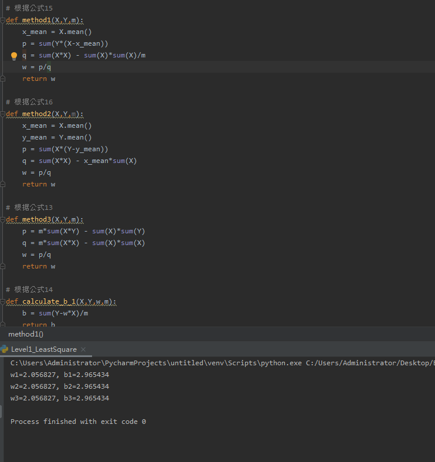
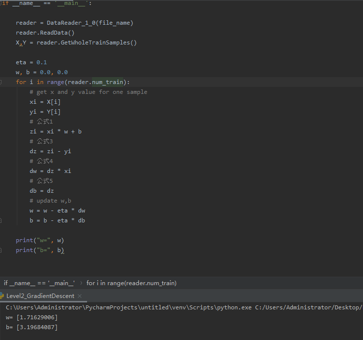
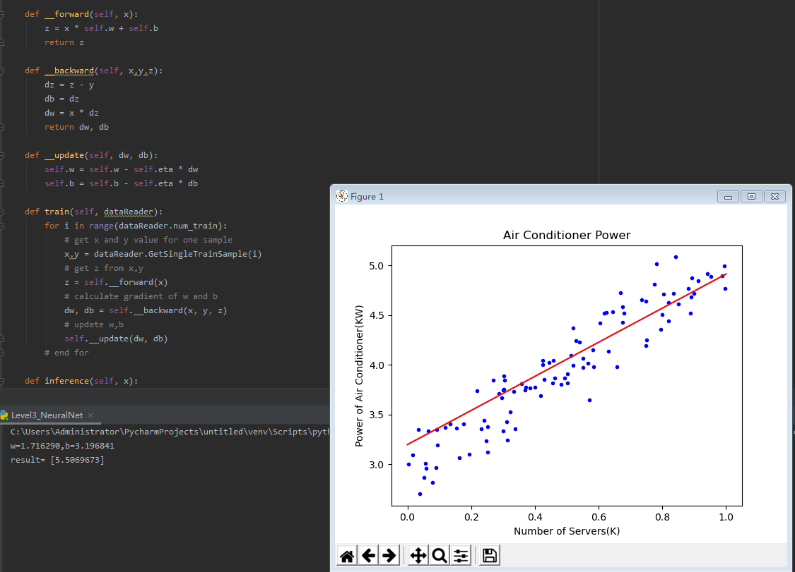
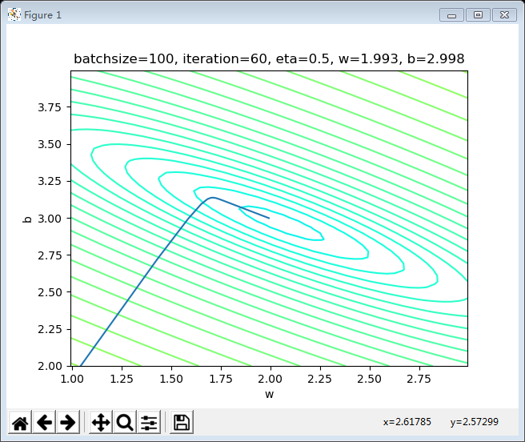
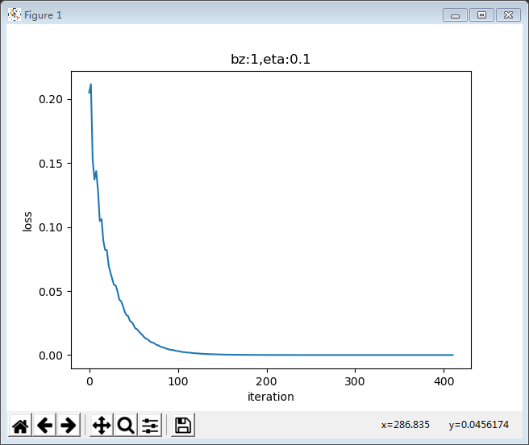
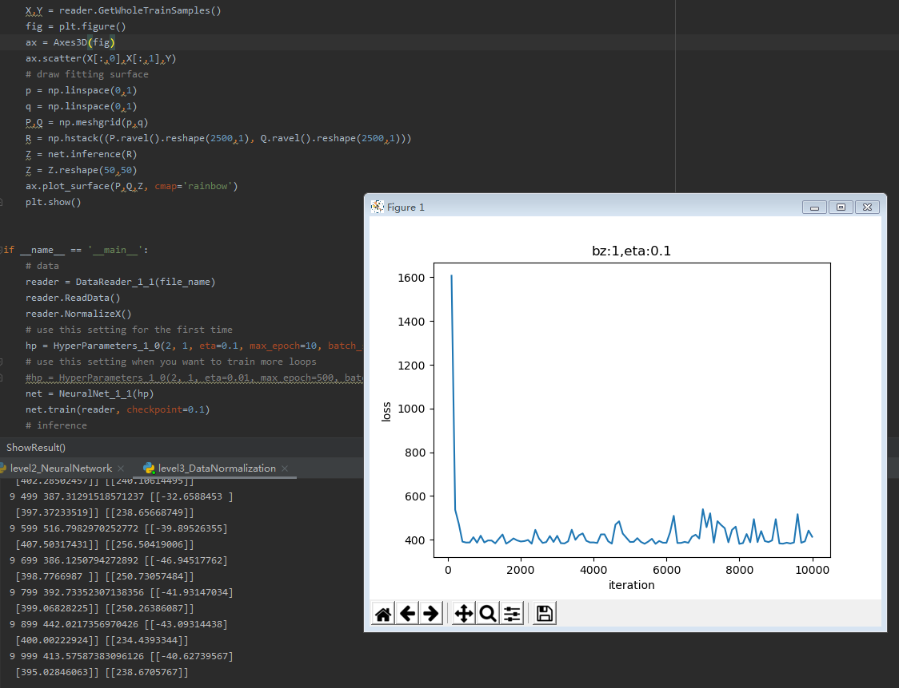
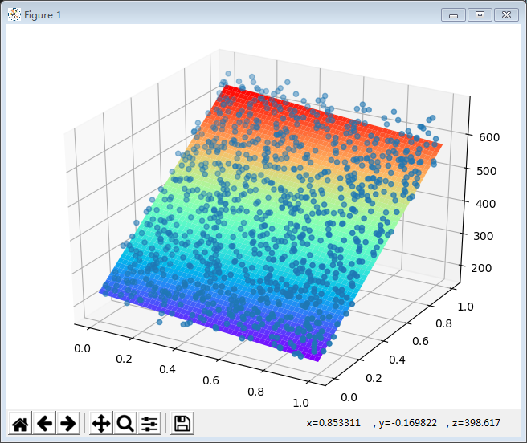
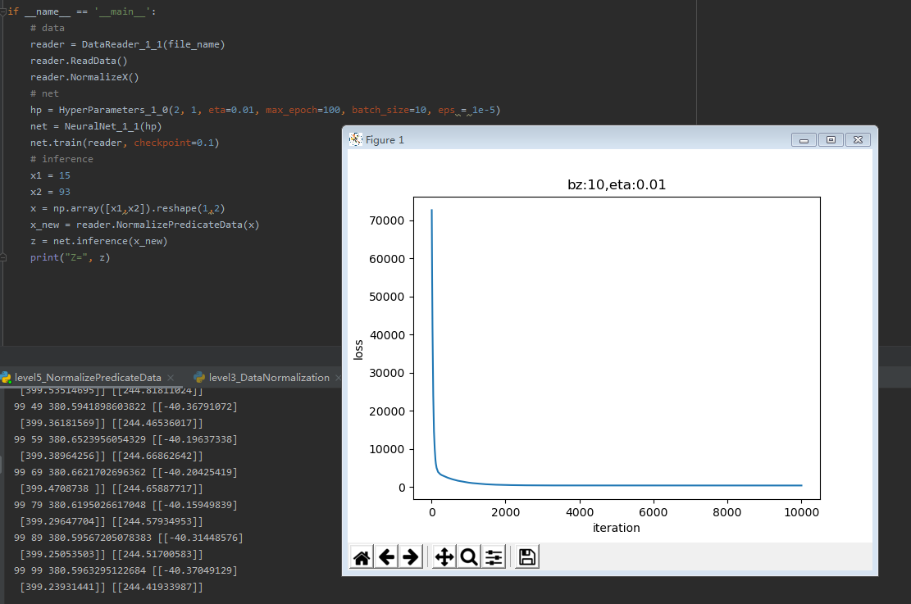

# 王振宇 step2总结
## 单入单出的单层神经网络
## 单变量线性回归问题
### 一元线性回归模型

回归分析是一种数学模型。当因变量和自变量为线性关系时，它是一种特殊的线性模型。

最简单的情形是一元线性回归，由大体上有线性关系的一个自变量和一个因变量组成，模型是：

$$Y=a+bX+ε \tag{1}$$

X是自变量，Y是因变量，ε是随机误差，a和b是参数，在线性回归模型中，a和b是我们要通过算法学习出来的。

什么叫模型？第一次接触这个概念时，可能会有些不明觉厉。从常规概念上讲，是人们通过主观意识借助实体或者虚拟表现来构成对客观事物的描述，这种描述通常是有一定的逻辑或者数学含义的抽象表达方式。

比如对小轿车建模的话，会是这样描述：由发动机驱动的四轮铁壳子。对能量概念建模的话，那就是爱因斯坦狭义相对论的著名推论：$E=mc^2$。

对数据建模的话，就是想办法用一个或几个公式来描述这些数据的产生条件或者相互关系，比如有一组数据是大致满足$y=3x+2$这个公式的，那么这个公式就是模型。为什么说是“大致”呢？因为在现实世界中，一般都有噪音（误差）存在，所以不可能非常准确地满足这个公式，只要是在这条直线两侧附近，就可以算作是满足条件。

对于线性回归模型，有如下一些概念需要了解：

- 通常假定随机误差的均值为0，方差为σ^2（σ^2﹥0，σ^2与X的值无关）
- 若进一步假定随机误差遵从正态分布，就叫做正态线性模型
- 一般地，若有k个自变量和1个因变量（即公式1中的Y），则因变量的值分为两部分：一部分由自变量影响，即表示为它的函数，函数形式已知且含有未知参数；另一部分由其他的未考虑因素和随机性影响，即随机误差
- 当函数为参数未知的线性函数时，称为线性回归分析模型
- 当函数为参数未知的非线性函数时，称为非线性回归分析模型
- 当自变量个数大于1时称为多元回归
- 当因变量个数大于1时称为多重回归

我们通过对数据的观察，可以大致认为它符合线性回归模型的条件，于是列出了公式1，不考虑随机误差的话，我们的任务就是找到合适的a和b，这就是线性回归的任务。
###  解决方案

我们接下来会用几种方法来解决这个问题：

1. 最小二乘法
2. 梯度下降法
3. 简单的神经网络法
4. 更通用的神经网络算法

### 最小二乘法

####  历史

最小二乘法，也叫做最小平方法（Least Square），它通过最小化误差的平方和寻找数据的最佳函数匹配。利用最小二乘法可以简便地求得未知的数据，并使得这些求得的数据与实际数据之间误差的平方和为最小。最小二乘法还可用于曲线拟合。其他一些优化问题也可通过最小化能量或最大化熵用最小二乘法来表达。

1801年，意大利天文学家朱赛普·皮亚齐发现了第一颗小行星谷神星。经过40天的跟踪观测后，由于谷神星运行至太阳背后，使得皮亚齐失去了谷神星的位置。随后全世界的科学家利用皮亚齐的观测数据开始寻找谷神星，但是根据大多数人计算的结果来寻找谷神星都没有结果。时年24岁的高斯也计算了谷神星的轨道。奥地利天文学家海因里希·奥尔伯斯根据高斯计算出来的轨道重新发现了谷神星。

高斯使用的最小二乘法的方法发表于1809年他的著作《天体运动论》中。法国科学家勒让德于1806年独立发明“最小二乘法”，但因不为世人所知而默默无闻。勒让德曾与高斯为谁最早创立最小二乘法原理发生争执。

1829年，高斯提供了最小二乘法的优化效果强于其他方法的证明，因此被称为高斯-马尔可夫定理。

#### 数学原理

线性回归试图学得：

$$z(x_i)=w \cdot x_i+b \tag{1}$$

使得：

$$z(x_i) \simeq y_i \tag{2}$$

其中，$x_i$是样本特征值，$y_i$是样本标签值，$z_i$是模型预测值。

如何学得w和b呢？均方差(MSE - mean squared error)是回归任务中常用的手段：
$$
J = \sum_{i=1}^m(z(x_i)-y_i)^2 = \sum_{i=1}^m(y_i-wx_i-b)^2 \tag{3}
$$

$J$称为损失函数。

## 4.2 梯度下降法

有了上一节的最小二乘法做基准，我们这次用梯度下降法求解w和b，从而可以比较二者的结果。

### 4.2.1 数学原理

在下面的公式中，我们规定x是样本特征值（单特征），y是样本标签值，z是预测值，下标 $i$ 表示其中一个样本。

#### 预设函数（Hypothesis Function）

为一个线性函数：

$$z_i = x_i \cdot w + b \tag{1}$$

#### 损失函数（Loss Function）

为均方差函数：

$$loss(w,b) = \frac{1}{2} (z_i-y_i)^2 \tag{2}$$

与最小二乘法比较可以看到，梯度下降法和最小二乘法的模型及损失函数是相同的，都是一个线性模型加均方差损失函数，模型用于拟合，损失函数用于评估效果。

区别在于，最小二乘法从损失函数求导，直接求得数学解析解，而梯度下降以及后面的神经网络，都是利用导数传递误差，再通过迭代方式一步一步逼近近似解。

### 梯度计算

#### 计算z的梯度

根据公式2：
$$
{\partial loss \over \partial z_i}=z_i - y_i \tag{3}
$$

#### 计算w的梯度

我们用loss的值作为误差衡量标准，通过求w对它的影响，也就是loss对w的偏导数，来得到w的梯度。由于loss是通过公式2->公式1间接地联系到w的，所以我们使用链式求导法则，通过单个样本来求导。

根据公式1和公式3：

$$
{\partial{loss} \over \partial{w}} = \frac{\partial{loss}}{\partial{z_i}}\frac{\partial{z_i}}{\partial{w}}=(z_i-y_i)x_i \tag{4}
$$

#### 计算b的梯度

$$
\frac{\partial{loss}}{\partial{b}} = \frac{\partial{loss}}{\partial{z_i}}\frac{\partial{z_i}}{\partial{b}}=z_i-y_i \tag{5}
$$

###  神经网络法

在梯度下降法中，我们简单讲述了一下神经网络做线性拟合的原理，即：

1. 初始化权重值
2. 根据权重值放出一个解
3. 根据均方差函数求误差
4. 误差反向传播给线性计算部分以调整权重值
5. 是否满足终止条件？不满足的话跳回2

###  定义神经网络结构

我们是首次尝试建立神经网络，先用一个最简单的单层单点神经元。

#### 输入层

此神经元在输入层只接受一个输入特征，经过参数w,b的计算后，直接输出结果。这样一个简单的“网络”，只能解决简单的一元线性回归问题，而且由于是线性的，我们不需要定义激活函数，这就大大简化了程序，而且便于大家循序渐进地理解各种知识点。

严格来说输入层在神经网络中并不能称为一个层。

#### 权重w/b

因为是一元线性问题，所以w/b都是一个标量。

#### 输出层

输出层1个神经元，线性预测公式是：

$$z_i = x_i \cdot w + b$$

z是模型的预测输出，y是实际的样本标签值，下标 $i$ 为样本。

#### 损失函数

因为是线性回归问题，所以损失函数使用均方差函数。

$$loss(w,b) = \frac{1}{2} (z_i-y_i)^2$$

###  反向传播

由于我们使用了和上一节中的梯度下降法同样的数学原理，所以反向传播的算法也是一样的，细节请查看4.2.2。

#### 计算w的梯度

$$
{\partial{loss} \over \partial{w}} = \frac{\partial{loss}}{\partial{z_i}}\frac{\partial{z_i}}{\partial{w}}=(z_i-y_i)x_i
$$

#### 计算b的梯度

$$
\frac{\partial{loss}}{\partial{b}} = \frac{\partial{loss}}{\partial{z_i}}\frac{\partial{z_i}}{\partial{b}}=z_i-y_i
$$

# 多入单出的单层神经网络
##  多变量线性回归问题
###  正规方程解法

英文名是 Normal Equations。

对于线性回归问题，除了前面提到的最小二乘法可以解决一元线性回归的问题外，也可以解决多元线性回归问题。

对于多元线性回归，可以用正规方程来解决，也就是得到一个数学上的解析解。它可以解决下面这个公式描述的问题：

$$y=a_0+a_1x_1+a_2x_2+\dots+a_kx_k \tag{1}$$

####  简单的推导方法

在做函数拟合（回归）时，我们假设函数H为：

$$h(w,b) = b + x_1 w_1+x_2 w_2+...+x_n w_n \tag{2}$$

令$b=w_0$，则：

$$h(w) = w_0 + x_1 \cdot w_1 + x_2 \cdot w_2+...+ x_n \cdot w_n\tag{3}$$

公式3中的x是一个样本的n个特征值，如果我们把m个样本一起计算，将会得到下面这个矩阵：

$$H(w) = X \cdot W \tag{4}$$

公式5中的X和W的矩阵形状如下：

$$
X^{(m \times (n+1))} = 
\begin{pmatrix} 
1 & x_{1,1} & x_{1,2} & \dots & x_{1,n} \\
1 & x_{2,1} & x_{2,2} & \dots & x_{2,n} \\
\dots \\
1 & x_{m,1} & x_{m,2} & \dots & x_{m,n}
\end{pmatrix} \tag{5}
$$

$$
W^{(n+1)}= \begin{pmatrix}
w_0 \\
w_1 \\
\dots \\
 w_n
\end{pmatrix}  \tag{6}
$$

然后我们期望假设函数的输出与真实值一致，则有：

$$H(w) = X \cdot W = Y \tag{7}$$

其中，Y的形状如下：

$$
Y^{(m)}= \begin{pmatrix}
y_1 \\
y_2 \\
\dots \\
y_m
\end{pmatrix}  \tag{8}
$$

直观上看，W = Y/X，但是这里三个值都是矩阵，而矩阵没有除法，所以需要得到X的逆矩阵，用Y乘以X的逆矩阵即可。但是又会遇到一个问题，只有方阵才有逆矩阵，而X不一定是方阵，所以要先把左侧变成方阵，就可能会有逆矩阵存在了。所以，先把等式两边同时乘以X的转置矩阵，以便得到X的方阵：

$$X^T X W = X^T Y \tag{9}$$

其中，$X^T$是X的转置矩阵，$X^T X$一定是个方阵，并且假设其存在逆矩阵，把它移到等式右侧来：

$$W = (X^T X)^{-1}{X^T Y} \tag{10}$$

至此可以求出W的正规方程。

####  复杂的推导方法

我们仍然使用均方差损失函数：

$$J(w,b) = \sum (z_i - y_i)^2 \tag{11}$$

把b看作是一个恒等于1的feature，并把z=XW计算公式带入，并变成矩阵形式：

$$J(w) = \sum (x_i w_i -y_i)^2=(XW - Y)^T \cdot (XW - Y) \tag{12}$$

对w求导，令导数为0，就是W的最小值解：

$${\partial J(w) \over \partial w} = {\partial \over \partial w}[(XW - Y)^T \cdot (XW - Y)]$$
$$
={\partial \over \partial w}[(X^TW^T - Y^T) \cdot (XW - Y)]$$
$$
={\partial \over \partial w}[(X^TXW^TW -X^TW^TY - Y^TXW + Y^TY)] \tag{13}$$

求导后：

第一项的结果是：$2X^TXW$

第二项和第三项的结果都是：$X^TY$

第四项的结果是：0

再令导数为0：

$$
J'(w)=2X^TXW - 2X^TY=0 \tag{14}
$$
$$
X^TXW = X^TY \tag{15}
$$
$$
W=(X^TX)^{-1}X^TY \tag{16}
$$

结论和公式10一样。

以上推导的基本公式可以参考第0章的公式60-69。

逆矩阵$(X^TX)^{-1}$可能不存在的原因是：
1. 特征值冗余，比如$x_2=x^2_1$，即正方形的边长与面积的关系，不能做为两个特征同时存在
2. 特征数量过多，比如特征数n比样本数m还要大

以上两点在我们这个具体的例子中都不存在。

### 神经网络解法

与单特征值的线性回归问题类似，多变量（多特征值）的线性回归可以被看做是一种高维空间的线性拟合。以具有两个特征的情况为例，这种线性拟合不再是用直线去拟合点，而是用平面去拟合点。

#### 定义神经网络结构

我们定义一个一层的神经网络，输入层为2或者更多，反正大于2了就没区别。这个一层的神经网络的特点是：
1. 没有中间层，只有输入项和输出层（输入项不算做一层），
2. 输出层只有一个神经元，
3. 神经元有一个线性输出，不经过激活函数处理，即在下图中，经过$\Sigma$求和得到Z值之后，直接把Z值输出。

与上一章的神经元相比，这次仅仅是多了一个输入，但却是质的变化，即，一个神经元可以同时接收多个输入，这是神经网络能够处理复杂逻辑的根本。

#### 输入层

单独看第一个样本是这样的：

$$
x_1 =
\begin{pmatrix}
x_{11} & x_{12}
\end{pmatrix} = 
\begin{pmatrix}
10.06 & 60
\end{pmatrix} 
$$

$$
y_1 = \begin{pmatrix} 302.86 \end{pmatrix}
$$

一共有1000个样本，每个样本2个特征值，X就是一个$1000 \times 2$的矩阵：

$$
X = 
\begin{pmatrix} 
x_1 \\ x_2 \\ \dots \\ x_{1000}
\end{pmatrix} =
\begin{pmatrix} 
x_{1,1} & x_{1,2} \\
x_{2,1} & x_{2,2} \\
\dots & \dots \\
x_{1000,1} & x_{1000,2}
\end{pmatrix}
$$

$$
Y =
\begin{pmatrix}
y_1 \\ y_2 \\ \dots \\ y_{1000}
\end{pmatrix}=
\begin{pmatrix}
302.86 \\ 393.04 \\ \dots \\ 450.59
\end{pmatrix}
$$

$x1$表示第一个样本，$x_{1,1}$表示第一个样本的一个特征值，$y1$是第一个样本的标签值。

#### 权重W和B

由于输入层是两个特征，输出层是一个变量，所以w的形状是2x1，而b的形状是1x1。

$$
W=
\begin{pmatrix}
w_1 \\ w_2
\end{pmatrix}
$$

$$B=(b)$$

B是个单值，因为输出层只有一个神经元，所以只有一个bias，每个神经元对应一个bias，如果有多个神经元，它们都会有各自的b值。

#### 输出层

由于我们只想完成一个回归（拟合）任务，所以输出层只有一个神经元。由于是线性的，所以没有用激活函数。
$$
z=
\begin{pmatrix}
  x_1 & x_2
\end{pmatrix}
\begin{pmatrix}
  w_1 \\ w_2
\end{pmatrix}
+(b)
=x_1w_1+x_2w_2+b
$$

写成矩阵形式：

$$Z^{(1 \times 1)} = X^{(1 \times 2)} \cdot W^{(2 \times 1)} + B^{(1 \times 1)}$$

上述公式中括号中的数字表示该矩阵的（行x列）数。

对于拟合，可以想象成用一支笔在一堆点中画一条直线或者曲线，而那一个神经元就是这支笔。如果有多个神经元，可以画出多条线来，就不是拟合了，而是分类。

#### 损失函数

因为是线性回归问题，所以损失函数使用均方差函数。

$$loss(w,b) = \frac{1}{2} (z_i-y_i)^2 \tag{1}$$

其中，$z_i$是样本预测值，$y_i$是样本的标签值。

###  反向传播

#### 单样本多特征计算

与上一章不同，本章中的前向计算是多特征值的公式：

$$z_i = x_{i1} \cdot w_1 + x_{i2} \cdot w_2 + b$$
$$
=\begin{pmatrix}
  x_{i1} & x_{i2}
\end{pmatrix}
\begin{pmatrix}
  w_1 \\
  w_2
\end{pmatrix}+b \tag{2}
$$

因为x有两个特征值，对应的W也有两个权重值。$x_{i1}$表示第$i$个样本的第1个特征值，所以无论是x还是w都是一个向量或者矩阵了，那么我们在反向传播方法中的梯度计算公式还有效吗？答案是肯定的，我们来一起做个简单推导。

由于W被分成了w1和w2两部分，根据公式1和公式2，我们单独对它们求导：

$$
\frac{\partial loss}{\partial w_1}=\frac{\partial loss}{\partial z_i}\frac{\partial z_i}{\partial w_1}=(z_i-y_i) \cdot x_{i1} \tag{3}
$$
$$
\frac{\partial loss}{\partial w_2}=\frac{\partial loss}{\partial z_i}\frac{\partial z_i}{\partial w_2}=(z_i-y_i) \cdot x_{i2} \tag{4}
$$

求损失函数对W矩阵的偏导，是无法求的，所以要变成求各个W的分量的偏导。由于W的形状是：

$$
W=
\begin{pmatrix}
w_1 \\ w_2
\end{pmatrix}
$$

所以求loss对W的偏导，由于W是个矩阵，所以应该这样写：

$$
\frac{\partial loss}{\partial W}=
\begin{pmatrix}
  \frac{\partial loss}{\partial w_1} \\
  \\
  \frac{\partial loss}{\partial w_2}
\end{pmatrix}
$$
$$
=\begin{pmatrix}
  (z_i-y_i)\cdot x_{i1} \\
  (z_i-y_i) \cdot x_{i2}
\end{pmatrix}
$$
$$
=\begin{pmatrix}
  x_{i1} \\
  x_{i2}
\end{pmatrix}
(z_i-y_i)
$$
$$
=\begin{pmatrix}
  x_{i1} & x_{i2}
\end{pmatrix}^T(z_i-y_i)=x_i^T(z_i-y_i) \tag{5}
$$
$$
{\partial loss \over \partial B}=z_i-y_i \tag{6}
$$
#### 多样本多特征计算

当进行多样本计算时，我们用m=3个样本做一个实例化推导：

$$
z_1 = x_{11}w_1+x_{12}w_2+b
$$
$$
z_2= x_{21}w_1+x_{22}w_2+b
$$
$$
z_3 = x_{31}w_1+x_{32}w_2+b
$$
$$
J(w,b) = \frac{1}{2 \times 3}[(z_1-y_1)^2+(z_2-y_2)^2+(z_3-y_3)^2]
$$
$$
\frac{\partial J}{\partial W}=
\begin{pmatrix}
  \frac{\partial J}{\partial w_1} \\
  \\
  \frac{\partial J}{\partial w_2}
\end{pmatrix}
$$
$$
=\begin{pmatrix}
  \frac{\partial J}{\partial z_1}\frac{\partial z_1}{\partial w_1}+\frac{\partial J}{\partial z_2}\frac{\partial z_2}{\partial w_1}+\frac{\partial J}{\partial z_3}\frac{\partial z_3}{\partial w_1} \\
  \\
  \frac{\partial J}{\partial z_1}\frac{\partial z_1}{\partial w_2}+\frac{\partial J}{\partial z_2}\frac{\partial z_2}{\partial w_2}+\frac{\partial J}{\partial z_3}\frac{\partial z_3}{\partial w_2}  
\end{pmatrix}
$$
$$
=\begin{pmatrix}
  \frac{1}{3}(z_1-y_1)x_{11}+\frac{1}{3}(z_2-y_2)x_{21}+\frac{1}{3}(z_3-y_3)x_{31} \\
  \frac{1}{3}(z_1-y_1)x_{12}+\frac{1}{3}(z_2-y_2)x_{22}+\frac{1}{3}(z_3-y_3)x_{32}
\end{pmatrix}
$$
$$
=\frac{1}{3}
\begin{pmatrix}
  x_{11} & x_{21} & x_{31} \\
  x_{12} & x_{22} & x_{32}
\end{pmatrix}
\begin{pmatrix}
  z_1-y_1 \\
  z_2-y_2 \\
  z_3-y_3
\end{pmatrix}
$$
$$
=\frac{1}{3}
\begin{pmatrix}
  x_{11} & x_{12} \\
  x_{21} & x_{22} \\
  x_{31} & x_{32} 
\end{pmatrix}^T
\begin{pmatrix}
  z_1-y_1 \\
  z_2-y_2 \\
  z_3-y_3
\end{pmatrix}
$$
$$
=\frac{1}{m}X^T(Z-Y) \tag{7}
$$
$$
{\partial J \over \partial B}={1 \over m}(Z-Y) \tag{8}
$$

### 代码运行
1. Level1_LeastSquare

2. Level2_GradientDescent

3. Level3_NeuralNet

4. Level5_FullBatchGradientDescent

5. Level5_MiniBatchGradientDescent

6. Level5_SingleGradientDescent

7. Level6_LogicNotGate

8. level1_NormalEquation

9. level2_NeuralNetwork
 
10. level3_DataNormalization
 
 
11. level4_DeNormalizeWB

12. level5_NormalizePredicateData
 
13. level6_NormalizeLabelData
 