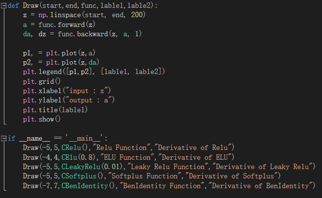

# 王振宇 step4总结
# **非线性回归**

>## 激活函数


看神经网络中的一个神经元，为了简化，假设该神经元接受三个输入，分别为$x_1, x_2, x_3$，那么：

$$z=x_1 w_1 + x_2 w_2 + x_3 w_3 +b \tag{1}$$
$$a = \sigma(z) \tag{2}$$


激活函数也就是$a=\sigma(z)$这一步了，他有什么作用呢？

1. 给神经网络增加非线性因素，这个问题在第1章《神经网络基本工作原理》中已经讲过了；
2. 把公式1的计算结果压缩到[0,1]之间，便于后面的计算。

激活函数的基本性质：

+ 非线性：线性的激活函数和没有激活函数一样
+ 可导性：做误差反向传播和梯度下降，必须要保证激活函数的可导性
+ 单调性：单一的输入会得到单一的输出，较大值的输入得到较大值的输出

**[何时会用到激活函数]**

|网络|输入|输出|激活函数|分类函数|功能|
|---|---|---|---|---|---|
|单层|单变量|单输出|无|无|线性回归|
|单层|多变量|单输出|无|无|线性回归|
|单层|多变量|单输出|无|二分类函数|二分类|
|单层|多变量|多输出|无|多分类函数|多分类|

>##  挤压型激活函数 Squashing Function

>### 对数几率函数 Sigmoid Function

#### 公式

$$a(z) = \frac{1}{1 + e^{-z}}$$

#### 导数

$$a^{'}(z) = a(z) \odot (1 - a(z))$$

利用公式33，令：$u=1，v=1+e^{-z}$ 则：

$$
a' = \frac{u'v-v'u}{v^2}=\frac{0-(1+e^{-z})'}{(1+e^{-z})^2}
$$
$$
=\frac{e^{-z}}{(1+e^{-z})^2}
=\frac{1+e^{-z}-1}{(1+e^{-z})^2}
$$
$$
=\frac{1}{1+e^{-z}}-(\frac{1}{1+e^{-z}})^2
$$
$$
=a-a^2=a(1-a)
$$

#### 值域

输入值域：$[-\infty, \infty]$

输出值域：$[0,1]$

#### 优点

从函数图像来看，sigmoid函数的作用是将输入压缩到(0, 1)这个区间范围内，这种输出在0~1之间的函数可以用来模拟一些概率分布的情况。他还是一个连续函数，导数简单易求。  

从数学上来看，Sigmoid函数对中央区的信号增益较大，对两侧区的信号增益小，在信号的特征空间映射上，有很好的效果。 

从神经科学上来看，中央区酷似神经元的兴奋态，两侧区酷似神经元的抑制态，因而在神经网络学习方面，可以将重点特征推向中央区，
将非重点特征推向两侧区。

分类功能：我们经常听到这样的对白“你觉得这件事情成功概率有多大？”“我有六成把握能成功”。sigmoid函数在这里就起到了如何把一个数值转化成一个通俗意义上的把握的表示。值越大，那么这个神经元对于这张图里有这样一条线段的把握就越大，经过sigmoid函数之后的结果就越接近100%，也就是1这样一个值，表现在图里，也就是这个神经元越兴奋（亮）。

**[代码实现]**
 


>### Tanh函数

#### 公式  
$$a(z) = \frac{e^{z} - e^{-z}}{e^{z} + e^{-z}} = \frac{2}{1 + e^{-2z}} - 1$$

$$a(z) = 2 \cdot Sigmoid(2z) - 1$$

#### 值域

输入值域：$[-\infty, \infty]$

输出值域：$[-1,1]$

#### 优点

具有Sigmoid的所有优点。

无论从理论公式还是函数图像，这个函数都是一个和sigmoid非常相像的激活函数，他们的性质也确实如此。但是比起sigmoid，tanh减少了一个缺点，就是他本身是零均值的，也就是说，在传递过程中，输入数据的均值并不会发生改变，这就使他在很多应用中能表现出比sigmoid优异一些的效果。

#### 缺点

exp()计算代价大。

梯度消失。

**[代码实现]**
 
 

>## 单入单出的双层神经网络

>### 用二次多项式拟合

#### 数据增强

在ch08.train.npz中，读出来的XTrain数组，只包含1列x的原始值，根据公式5，我们需要再增加一列x的平方值，所以代码如下：
```Python
import numpy as np
import matplotlib.pyplot as plt

from HelperClass.NeuralNet import *
from HelperClass.SimpleDataReader import *
from HelperClass.HyperParameters import *

file_name = "../../data/ch08.train.npz"

class DataReaderEx(SimpleDataReader):
    def Add(self):
        X = self.XTrain[:,]**2
        self.XTrain = np.hstack((self.XTrain, X))
```
#### 主程序
在主程序中，先加载数据，做数据增强，然后建立一个net，参数num_input=2，对应着XTrain中的两列数据，相当于两个特征值，

```Python
if __name__ == '__main__':
    dataReader = DataReaderEx(file_name)
    dataReader.ReadData()
    dataReader.Add()
    print(dataReader.XTrain.shape)

    # net
    num_input = 2
    num_output = 1
    params = HyperParameters(num_input, num_output, eta=0.2, max_epoch=10000, batch_size=10, eps=0.005, net_type=NetType.Fitting)
    net = NeuralNet(params)
    net.train(dataReader, checkpoint=10)
    ShowResult(net, dataReader, params.toString())
```
#### 运行结果

|损失函数值|拟合结果|
|---|---|
|||

从loss曲线上看，没有任何损失值下降的趋势；再看拟合情况，只拟合成了一条直线。这说明二次多项式不能满足要求。以下是最后几行的打印输出：

```
......
9979 49 0.09450642750766584
9989 49 0.09410913779071385
9999 49 0.09628814270449357
W= [[-1.72915813]
 [-0.16961507]]
B= [[0.98611283]]
```
>## 双层神经网络实现非线性回归

>### 定义神经网络结构
 
#### 输入层

输入层就是一个标量x值。

$$X = (x)$$

#### 权重矩阵W1/B1

$$
W1=
\begin{pmatrix}
w^1_{11} & w^1_{12} & w^1_{13}
\end{pmatrix}
$$

$$
B1=
\begin{pmatrix}
b^1_{1} & b^1_{2} & b^1_{3} 
\end{pmatrix}
$$

#### 隐层

我们用3个神经元：

$$
Z1 = \begin{pmatrix}
    z^1_1 & z^1_2 & z^1_3
\end{pmatrix}
$$

$$
A1 = \begin{pmatrix}
    a^1_1 & a^1_2 & a^1_3
\end{pmatrix}
$$


#### 权重矩阵W2/B2

W2的尺寸是3x1，B2的尺寸是1x1。
$$
W2=
\begin{pmatrix}
w^2_{11} \\
w^2_{21} \\
w^2_{31}
\end{pmatrix}
$$

$$
B2=
\begin{pmatrix}
b^2_{1}
\end{pmatrix}
$$

#### 输出层

由于我们只想完成一个拟合任务，所以输出层只有一个神经元：

$$
Z2 = 
\begin{pmatrix}
    z^2_{1}
\end{pmatrix}
$$

**[代码实现]**
 
#### 反向传播
```Python
class NeuralNet2(object):
    def backward(self, batch_x, batch_y, batch_a):
        # 批量下降，需要除以样本数量，否则会造成梯度爆炸
        m = batch_x.shape[0]
        # 第二层的梯度输入 
        dZ2 = self.A2 - batch_y
        # 第二层的权重和偏移 
        self.wb2.dW = np.dot(self.A1.T, dZ2)/m 
        # 公式7 对于多样本计算，需要在横轴上做sum，得到平均值
        self.wb2.dB = np.sum(dZ2, axis=0, keepdims=True)/m 
        # 第一层的梯度输入 
        d1 = np.dot(dZ2, self.wb2.W.T) 
        # 第一层的dZ 公式10
        dZ1,_ = Sigmoid().backward(None, self.A1, d1)
        # 第一层的权重和偏移 
        self.wb1.dW = np.dot(batch_x.T, dZ1)/m
        # 公式12 对于多样本计算，需要在横轴上做sum，得到平均值
        self.wb1.dB = np.sum(dZ1, axis=0, keepdims=True)/m 
```
反向传播部分的代码完全按照公式推导的结果实现。
