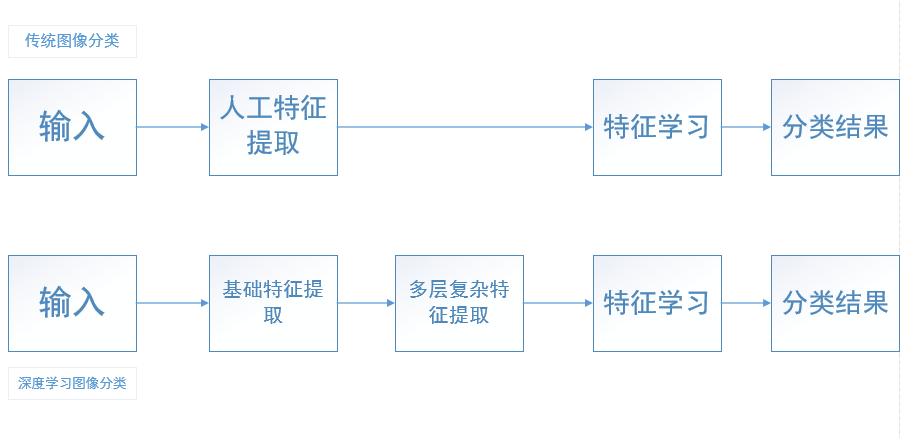

# 基于深度卷积神经网络的图像分类
## 前言
目前，目标识别的方法基本都使用了机器学习。为了提高目标识别的性能，我们收集了更大的数据集，学习更强大的模型，来防止过拟化。这样，简单的目标识别都可以在数据集上很好地实现。但对于图像分类来说，不仅数据集十分庞大，而且对象识别也较为复杂，这时我们需要应用比机器学习更深的领域——深度学习。卷积神经网络是深度学习算法中的的一种，具有结构简单、适应性强等特点。所以我们需要通过卷积神经网络来构建模型，通过改变它们的广度和深度来控制。并且为了更好地实现图像分类，我们会用到更深的卷积神经网络来减轻网络训练。这样，我们才能更加保证图像分类的精准性。
## 数据集
ImageNet数据集拥有超过1500万的标注高分辨率图像，这些图像大约属于22000个类别。这些图像基本都是从网上收集的，并使用了Amazon’s Mechanical Turk的众包工具通过人工标注的。而比赛中ImageNet的一个子集，就有1000个类别，每个类别又有大约1000张图像。总计，大约有120万训练图像，50000张验证图像和15万测试图像。
ImageNet包含各种分辨率的图像，而我们的系统要求不变的输入维度。因此，我们需要将图像进行下采样到固定的256×256分辨率。给定一个矩形图像，我们首先缩放图像短边长度为256，然后从结果图像中裁剪中心的256×256大小的图像块。除了在训练集上对像素减去平均活跃度外，我们不对图像做任何其它的预处理。因此我们在原始的RGB像素值（中心的）上训练我们的网络。
## 深度学习
深度学习是与机器学习相应的产物，学习方法与机器学习类似，也是监督学习与非监督学习的合理配合。
首先预训练阶段先用到无监督学习的方法对网络中的每一层去训练来获得特征，训练的输出紧接着就成为了下一层的输入，依次进行。这就是深度学习第一步的优势之处，这样我们可以更容易地获得最优的初值，然后第二步，当网络数据达到最高层再利用监督学习的方法去微调模型，使得数据误差更少，进一步完善模型的结构。深度学习图像分类的核心就在能自组织地利用浅显的初级特征组合成复杂的高级特征。
传统图像分类与深度学习图像分类的区别：

## 人工神经网络
人工神经网络是受生物神经网络的启发，由多组模拟生物神经元细胞的基元通过某种规则相互连接组成，其中每个基元有一定数量的输入（可能来自其他基元的输出），并产生单一的实数输出（也可能作为其他很多基元的输入）。
### 卷积神经网络
卷积神经网络是一种比较常见的人工神经网络，也是深度学习的一种学习模型。原理上，是一个利用卷积计算处理图像矩阵的前馈神经网络，在图像分类的领域中，无论是识别率还是识别速度相比于其他模型，都有很大的领先。而CNN最大的优势就是网络能够通过神经元之间建立局部连接来替代全连接，并且能进行图像转置相关属性来减少网络的神经元参数，极大减少运算量和计算时间的同时还可以获得网络的平移不变性，使得CNN可以适应更多的情况。
#### 卷积的网络结构
典型结构：
##### 卷积层
卷积层主要是通过局部连接和权值共享来改善网络的架构，从而减少参数，降低计算的复杂度，减轻实验过拟合的目的。
##### 池化层
卷积层在进行局部特征提取和权值共享之后，CNN提取的特征结果还是拥有着极大的数据量。而池化层就是用来解决计算量庞大的问题。
池化层的作用与卷积层类似，采用类似卷积核的过滤器来进行特征提取，通过移动过滤器来实现前向传播，不同点是池化层的过滤器不进行卷积计算加权和。
CNN中卷积层与池化层的交替运算：
（1）首先对输入图像利用不同的卷积核进行滤波操作，加上适当的偏置函数来提取局部特征。
（2）然后对卷积核滤波的输出结果利用非线性的激活函数进行处理。
（3）再对处理结果进行池化操作来降采样，不改变显著的特征，达到合理分类的目的。
通过卷积层和池化层的处理得到合适的图像矩阵送入全连接层，全连接层CNN最后一道工序，具体职能类似于传统神经网络的输出层，经过多轮的卷积层和池化层之后，在CNN的最后一般连接1到2个全连接层输出最后的分类结果。
#### 图像分类的代码实现
这里为了实现图像分类，我们需要一些经典的卷积神经网络模型。
##### VGG
部分代码如下：
class VGG(nn.Module):
def __init__(self, features, num_classes=1000, init_weights=True):
    super(VGG, self).__init__()
    self.features = features
    self.avgpool = nn.AdaptiveAvgPool2d((7, 7))
    self.classifier = nn.Sequential(
        nn.Linear(512 * 7 * 7, 4096),
        nn.ReLU(True),
        nn.Dropout(),
        nn.Linear(4096, 4096),
        nn.ReLU(True),
        nn.Dropout(),
        nn.Linear(4096, num_classes),
        )
    if init_weights:
        self._initialize_weights()
def forward(self, x):
        x = self.features(x)
        x = self.avgpool(x)
        x = torch.flatten(x, 1)
        x = self.classifier(x)
        return x
def _initialize_weights(self):
    for m in self.modules():
    if isinstance(m, nn.Conv2d):
        nn.init.kaiming_normal_(m.weight, mode='fan_out', nonlinearity='relu')

        if m.bias is not None:
        nn.init.constant_(m.bias, 0)
        elif isinstance(m, nn.BatchNorm2d:
            nn.init.constant_(m.weight, 1)
            nn.init.constant_(m.bias, 0)
        elif isinstance(m, nn.Linear):
            nn.init.normal_(m.weight, 0, 0.01)
            nn.init.constant_(m.bias, 0)
def make_layers(cfg, batch_norm=False):
    layers = []
    in_channels = 3
    for v in cfg:
        if v == 'M':
            layers += [nn.MaxPool2d(kernel_size=2, stride=2)]
        else:
            conv2d = nn.Conv2d(in_channels, v, kernel_size=3, padding=1)
            if batch_norm:
                layers += [conv2d, nn.BatchNorm2d(v), nn.ReLU(inplace=True)]
            else:
                layers += [conv2d, nn.ReLU(inplace=True)]
            in_channels = v
    return nn.Sequential(*layers)
cfgs = {
    'A': [64, 'M', 128, 'M', 256, 256, 'M', 512, 512, 'M', 512, 512, 'M'],
    'B': [64, 64, 'M', 128, 128, 'M', 256, 256, 'M', 512, 512, 'M', 512, 512, 'M'],
    'D': [64, 64, 'M', 128, 128, 'M', 256, 256, 256, 'M', 512, 512, 512, 'M', 512, 512, 512, 'M'],
    'E': [64, 64, 'M', 128, 128, 'M', 256, 256, 256, 256, 'M', 512, 512, 512, 512, 'M', 512, 512, 512, 512, 'M'],
}
def _vgg(arch, cfg, batch_norm, pretrained, progress, **kwargs):
    if pretrained:
        kwargs['init_weights'] = False
    model = VGG(make_layers(cfgs[cfg], batch_norm=batch_norm), **kwargs)
    if pretrained:
        state_dict = load_state_dict_from_url(model_urls[arch],progress=progress)
        model.load_state_dict(state_dict)
    return model；
##### ResNet
部分代码如下：
class BasicBlock(nn.Module):
expansion = 1
def __init__(self, inplanes, planes, stride=1, downsample=None, groups=1,
base_width=64, dilation=1，norm_layer=None):
    super(BasicBlock, self).__init__()
    if norm_layer is None:
            norm_layer = nn.BatchNorm2d
    if groups != 1 or base_width != 64:
    raise ValueError('BasicBlock only supports groups=1 and base_width=64')
    if dilation > 1:
    raise NotImplementedError("Dilation > 1 not supported in BasicBlock")
         stride != 1
        self.conv1 = conv3x3(inplanes, planes, stride)
        self.bn1 = norm_layer(planes)
        self.relu = nn.ReLU(inplace=True)
        self.conv2 = conv3x3(planes, planes)
        self.bn2 = norm_layer(planes)
        self.downsample = downsample
        self.stride = stride
    def forward(self, x):
        identity = x
        out = self.conv1(x)
        out = self.bn1(out)
        out = self.relu(out)
        out = self.conv2(out)
        out = self.bn2(out)
    if self.downsample is not None:
            identity = self.downsample(x)
        out += identity
        out = self.relu(out)
        return out

##### GoogleNet
部分代码如下：
def identity(inputs):
    return inputs
def load_image(im_path, read_channel=None, pf=identity):
    if read_channel is None:
        im = scipy.misc.imread(im_path)
    elif read_channel == 3:
        im = imageio.imread(im_path, pilmode='RGB')
    else：
        im = imageio.imread(im_path, flatten=True)
    if len(im.shape) < 3:
        im = pf(im)
        im = np.reshape(im, [im.shape[0], im.shape[1], 1])
    else:
        im = pf(im)
    return im
##### Inception
部分代码如下：
def inception_resnet_stem(input):
    if K.image_dim_ordering() == "th":
        channel_axis = 1
    else:
        channel_axis = -1
    c = Convolution2D(32, 3, 3, activation='relu', subsample=(2, 2))(input)
    c = Convolution2D(32, 3, 3, activation='relu', )(c)
    c = Convolution2D(64, 3, 3, activation='relu', )(c)
    c = MaxPooling2D((3, 3), strides=(2, 2))(c)
    c = Convolution2D(80, 1, 1, activation='relu', border_mode='same')(c)
    c = Convolution2D(192, 3, 3, activation='relu')(c)
    c = Convolution2D(256, 3, 3, activation='relu', subsample=(2,2), border_mode='same')(c)
    b = BatchNormalization(axis=channel_axis)(c)
    b = Activation('relu')(b)
    return b

## 总结
图像分类是现在深度学习研究领域的一个重要方向。在图像分类的领域中，卷积神经网络的出现给图像分类带来了新的研究思路，它在结构上采用局部连接、权值共享、下采样技术使其充分考虑图像目标在空间中符合的平移、旋转和缩放不变性，在识别物体发生变化时，也能完成识别任务。而卷积神经网络具有的结构简单、适应性强、训练参数少且连接多等特点，使其在图像分类的领域上，也必然会大放异彩。
