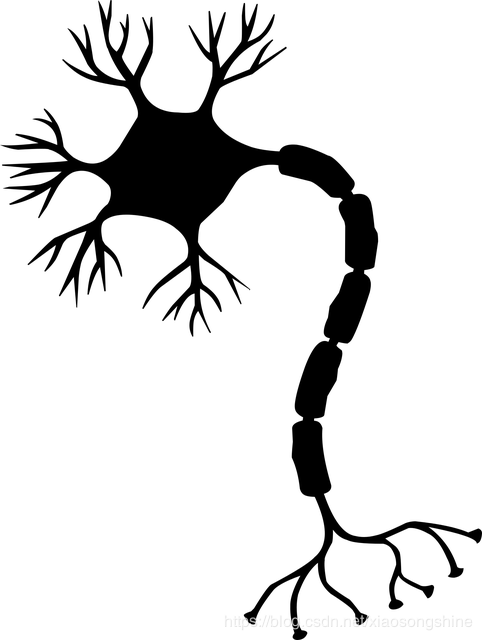

   #                                
设计报告
 
   ## 1. 深度学习简介
   + 深度学习是一种特殊的机器学习，用概念组成的网状层级结构来表示这个世界，每一个概念
     简单的概念相连，抽象的概念通过没那么抽象的概念计算,深度学习的概念源于人工神经网络的研究，含多隐层的多层感知器就是一种深度学习结构.深度学习通过组合低层特征形成更加抽象的高层表示属性类别或特征，以发现数据的分布式特征表示.
     深度学习可以让那些拥有多个处理层的计算模型来学习具有多层次抽象的数据的表示。这些方法在很多方面都带来了显著的改善，包含最先进的语音识别、视觉对象识别、对象检測和很多其他领域，比如药物发现和基因组学等。深度学习可以发现大数据中的复杂结构。它是利用BP算法来完毕这个发现过程的。BP算法可以指导机器怎样从前一层获取误差而改变本层的内部參数，这些内部參数可以用于计算表示。深度卷积网络在处理图像、视频、语音和音频方面带来了突破，而递归网络在处理序列数据。比方文本和语音方面表现出了闪亮的一面。
     深度学习的灵感来自人类大脑过滤信息的方式。深度学习试图模拟新皮层中神经元层的活动。深度学习的目的是模仿人类大脑的工作方式,人类大脑中，大约有1000亿个神经元，每个神经元与大约10万个神经元相连。从本质上说，这就是我们想要创造的，在某种程度上，这对机器来说是可行的。如图：

     机器学习系统被用来识别图片中的目标。将语音转换成文本，匹配新闻元素，依据用户兴趣提供职位或产品。选择相关的搜索结果。逐渐地，这些应用使用一种叫深度学习的技术。传统的机器学习技术在处理未加工过的数据时，体现出来的能力是有限的。几十年来，想要构建一个模式识别系统或者机器学习系统。须要一个精致的引擎和相当专业的知识来设计一个特征提取器。把原始数据（如图像的像素值）转换成一个适当的内部特征表示或特征向量，子学习系统，一般是一个分类器。对输入的样本进行检測或分类。特征表示学习是一套给机器灌入原始数据，然后能自己主动发现须要进行检測和分类的表达的方法。深度学习就是一种特征学习方法。把原始数据通过一些简单的可是非线性的模型转变成为更高层次的，更加抽象的表达。
   + 深度学习模型可以是有监督的，半监督的和无监督的。
   + + 有监督的学习：
     有监督的机器学习是学习一个函数的任务，该函数基于示例输入-输出对，将输入映射到输出。它适用于由训练样例组成的标记训练数据。每个示例都是一对由输入对象（通常是向量）和你想要的输出值（也称为监控信号）组成的对。
     基本上，它会查看带有标记的东西，并使用它从标记中学到的东西来预测其他东西的标签。
     分类任务往往取决于监督学习。这些任务可能包括：
     + +  检测图像中的面部，身份和面部表情
     + + 识别图像中的物体，如停车标志，行人和车道标记
     + + 识别垃圾邮件
     + + 识别视频中的手势
     + + 检测语音并识别录音中的情绪
     + + 识别发言人
     + + 语音转文本
   + + 半监督学习：
    监督学习可以被称为转导（推断给定数据的正确标签）或归纳（推断从X到Y的正确映射）。
    为此，深度学习算法必须至少做出以下假设之一：
     + + 彼此接近的点可能共享标记（连续性假设）
     + + 形成集群的数据和聚集在一起的点可能共享一个标记（集群假设）
     + + 数据位于比输入空间更低的流形维度上（流形假设）
   + 深度学习发展历程
     如图所示：
  
     深度学习架构已应用于社交网络过滤，图像识别，金融欺诈检测，语音识别，计算机视觉，医学图像处理，自然语言处理，视觉艺术处理，药物发现和设计，毒理学，生物信息学，客户关系管理，以及许多其他领域和概念
## 2. 人工神经网络
   + 现代深度学习架构大多数基于人工神经网络（ANN），并使用多层非线性处理单元进行特征提取和转换。每个连续层使用前一层的输出作为其输入。他们学到的东西构成了一个概念层次结构，每个层次都学会将其输入数据转换为抽象和复合的表征。
   这意味着对于图像，例如，输入可能是像素矩阵，而第一层可能编码边框并组成像素，然后下一层可能排列边，再下一层可能编码鼻子和眼睛，然后可能会识别图像包含人脸……虽然你可能需要进行一些微调，但是深度学习过程会自行学习将哪些特性放置在哪个级别。
   深度学习中的“深层”只是指数据转换的层数（它们具有实质的CAP，即从输入到输出的转换链）。对于前馈神经网络，CAP的深度是网络的深度和隐藏层的数量加1（输出层）。对于递归神经网络，一个信号可能会在一个层中传播不止一次，所以上限深度可能是无限的。大多数研究人员认为深度学习CAP depth >2。神经网络基本模型 例：前向神经网络

   上图描述的是一个目前研究最为成熟Shallow 结构的神经网络（只含有单层隐藏层神经元的结构）。第一层为输入层 (input layer )，第二层称为隐藏层 ( hidden layer )，最后一层为输出层( output layer )。神经元之间都是由低层出发，终止于高层神经元的一条有向边进行连接，每条边都有自己的权重。每个神经元都是一个计算单元，如在Feed-forward neural network 中，除输入层神经元外，每个神经元为一个计算单元，可以通过一个计算函数 f()  来表示，函数的具体形式可以自己定义，现在用的较多的是 感知器计算神经元，如果你对感知器有所了解的话，理解起来会容易很多。 可以计算此时神经元所具有的能量值，当该值超过一定阀值的时候神经元的状态就会发生改变，神经元只有两种状态，激活或未激活。在实际的人工神经网络中，一般是用一种概率的方式去表示神经元是否处于激活状态，可以用 h(f) 来表示，f 代表神经元的能量值，h(f) 代表该能量值使得神经元的状态发生改变的概率有多大，能量值越大，处于激活状态的概率就越高。到这部分你已经接触到了关于神经网络的几个基本术语，神经元的能量值 通过 f() 计算得到, 神经元的激活状态  h(f)，h表示激活函数。
   + 卷积神经网络
      卷积神经网络与普通神经网络的区别在于，卷积神经网络包含了一个由卷积层和子采样层构成的特征抽取器。在卷积神经网络的卷积层中，一个神经元只与部分邻层神经元连接。在CNN的一个卷积层中，通常包含若干个特征平面(featureMap)，每个特征平面由一些矩形排列的的神经元组成，同一特征平面的神经元共享权值，这里共享的权值就是卷积核。卷积核一般以随机小数矩阵的形式初始化，在网络的训练过程中卷积核将学习得到合理的权值。共享权值（卷积核）带来的直接好处是减少网络各层之间的连接，同时又降低了过拟合的风险。子采样也叫做池化（pooling），通常有均值子采样（mean pooling）和最大值子采样（max pooling）两种形式。子采样可以看作一种特殊的卷积过程。卷积和子采样大大简化了模型复杂度，减少了模型的参数。
      卷积的运算过程：对一幅图像的一个完整的卷积运算过程为：卷积核以一定的间隔滑动，并对所覆盖的区域进行卷积运算得到值Z，直至遍历完整幅图像。如图：
     + + 三维卷积（拓展）
    一种是常见的多通道图像（如RGB彩色图像）的三维卷积（也是实际中最常用的卷积方式）
    如图：

     该卷积过程中，卷积核n（包含3个小卷积核） 中的每个小卷积核分别与原图像中所对应的图层进行卷积运算（如卷积核1中左边的小卷积核与原图像中左边的红色图层进行卷积运算，得到红色的单通道特征图；卷积核1中中间的小卷积核则与原图像中间的绿色图层进行卷积运算，得到绿色的单通道特征图，以此类推），分别生成3个单通道特征图，然后将这3个特征图按元素对应相加，即可得到卷积核n 生成的单通道特征图，最后将 n 个特征图相叠加即可得到最终的 n通道特征图。

     第二种三维卷积优点类似于卷积的局部连接，但该类卷积运算的卷积核并非只与原图像中的某几层相连接（在一个固定平面内滑动），而是以空间滑动的方式与原图像的所有像素进行卷积。
     如图：

## 3. 神经网络的本质
   神经网络由大量的节点（或称“神经元”，卷积神经网络中为“特征图”）相互连接构成，每个节点代表一种特定的函数，称为激活函数（Activation Function）。节点之间的连接具有特定的权重，信号经过会进行加权，代表神经网络的记忆。网络的输出则依网络的连接方式、权重值和激活函数的不同而不同。网络本身则代表对自然界某种算法或者函数的逼近，也可以是一种逻辑策略的表达。

## 4. 基于深度学习框架(tinynn)的 MNIST 分类
###  + 组件抽象

    首先考虑神经网络运算的流程，神经网络运算主要包含训练 training 和预测 predict （或 inference） 两个阶段，训练的基本流程是：输入数据 -> 网络层前向传播 -> 计算损失 -> 网络层反向传播梯度 -> 更新参数，预测的基本流程是 输入数据 -> 网络层前向传播 -> 输出结果。从运算的角度看，主要可以分为三种类型的计算：

     + + 数据在网络层之间的流动：前向传播和反向传播可以看做是张量 Tensor（多维数组）在网络层之间的流动（前向传播流动的是输入输出，反向传播流动的是梯度），每个网络层会进行一定的运算，然后将结果输入给下一层
     + + 计算损失：衔接前向和反向传播的中间过程，定义了模型的输出与真实值之间的差异，用来后续提供反向传播所需的信息
     + + 参数更新：使用计算得到的梯度对网络参数进行更新的一类计算
  
    基于这个三种类型，我们可以对网络的基本组件做一个抽象

    tensor 张量，这个是神经网络中数据的基本单位。

    layers 网络层，负责接收上一层的输入，进行该层的运算，将结果输出给下一层，由于 tensor 的流动有前向和反向两个方向，因此对于每种类型网络层我们都需要同时实现 forward 和 backward 两种运算。

    losses 损失，在给定模型预测值与真实值之后，该组件输出损失值以及关于最后一层的梯度。（用于梯度回传）

    optimizer 优化器，负责使用梯度更新模型的参数然后我们还需要一些组件把上面这个 4 种基本组件整合到一起，形成一个 pipeline。

    nn 组件负责管理 tensor 在 layers 之间的前向和反向传播，同时能提供获取参数、设置参数、获取梯度的接口。

    model 组件负责整合所有组件，形成整个 pipeline。即 nn 组件进行前向传播 -> losses 组件计算损失和梯度 -> nn 组件将梯度反向传播 -> optimizer 组件将梯度更新到参数。其基本的框架图如下图：
###  + 组件实现
  
    按照上面的抽象，我们可以写出整个流程代码如下。首先定义 net，net 的输入是多个网络层，然后将 net、loss、optimizer 一起传给 model。model 实现了 forward、backward 和 apply_grad 三个接口分别对应前向传播、反向传播和参数更新三个功能。

    # define model
    net = Net([layer1, layer2, ...])

    model = Model(net, loss_fn, optimizer)

    # training
    pred = model.forward(train_X)

    loss, grads = model.backward(pred, train_Y)

    model.apply_grad(grads)

    # inference
    test_pred = model.forward(test_X)
    接下来我们看这里边各个部分分别如何实现。

+ tensor

    tensor 张量是神经网络中基本的数据单位，我们这里直接使用 numpy.ndarray 类作为 tensor 类的实现（numpy 底层使用了 C 和 Fortran，并且在算法层面进行了大量的优化，运算速度也不算慢）

+ layers

    上面流程代码中 model 进行 forward 和 backward，其实底层都是网络层在进行实际运算，因此网络层需要有提供 forward 和 backward 接口进行对应的运算。同时还应该将该层的参数和梯度记录下来。先实现一个基类如下

# layers.py
class Layer(object):

    def __init__(self, name):
        self.name = name

        self.params, self.grads = None, None

    def forward(self, inputs):

        raise NotImplementedError

    def backward(self, grad);

         raise NotImplementedError

最基础的一种网络层是全连接网络层，实现如下。forward 方法接收上层的输入 inputs，实现 的运算；backward 的方法接收来自上层的梯度，计算关于参数 和输入的梯度，然后返回关于输入的梯度。这三个梯度的推导可以见附录，这里直接给出实现。w_init 和 b_init 分别是参数 weight 和 bias 的初始化器，这个我们在另外的一个实现初始化器中文件 initializer.py 去实现，这部分不是核心部件，所以在这里不展开介绍。

# layers.py
class Dense(Layer):
    def __init__(self, num_in, num_out,
                 w_init=XavierUniformInit(),
                 b_init=ZerosInit()):
        super().__init__("Linear")

        self.params = {
            "w": w_init([num_in, num_out]),
            "b": b_init([1, num_out])}

        self.inputs = None

    def forward(self, inputs):
        self.inputs = inputs
        return inputs @ self.params["w"] + self.params["b"]

    def backward(self, grad):
        self.grads["w"] = self.inputs.T @ grad
        self.grads["b"] = np.sum(grad, axis=0)
        return grad @ self.params["w"].T
同时神经网络中的另一个重要的部分是激活函数。激活函数可以看做是一种网络层，同样需要实现 forward 和 backward 方法。我们通过继承 Layer 类实现激活函数类，这里实现了最常用的 ReLU 激活函数。func 和 derivation_func 方法分别实现对应激活函数的正向计算和梯度计算。

# layers.py
class Activation(Layer):

		"""Base activation layer"""
    def __init__(self, name):
        super().__init__(name)
        self.inputs = None

    def forward(self, inputs):
        self.inputs = inputs
        return self.func(inputs)

    def backward(self, grad):
        return self.derivative_func(self.inputs) * grad

    def func(self, x):
        raise NotImplementedError

    def derivative_func(self, x):
        raise NotImplementedError

class ReLU(Activation):

		"""ReLU activation function"""
    def __init__(self):
        super().__init__("ReLU")

    def func(self, x):
        return np.maximum(x, 0.0)

    def derivative_func(self, x):
        return x > 0.0
+ nn

  上文提到 nn 类负责管理 tensor 在 layers 之间的前向和反向传播。forward 方法很简单，按顺序遍历所有层，每层计算的输出作为下一层的输入；backward 则逆序遍历所有层，将每层的梯度作为下一层的输入。这里我们还将每个网络层参数的梯度保存下来返回，后面参数更新需要用到。另外 nn 类还实现了获取参数、设置参数、获取梯度的接口，也是后面参数更新时需要用到

# nn.py
class Net(object):
    def __init__(self, layers):
        self.layers = layers

    def forward(self, inputs):
        for layer in self.layers:
            inputs = layer.forward(inputs)
        return inputs

    def backward(self, grad):
        all_grads = []
        for layer in reversed(self.layers):
            grad = layer.backward(grad)
            all_grads.append(layer.grads)
        return all_grads[::-1]

    def get_params_and_grads(self):
        for layer in self.layers:
            yield layer.params, layer.grads

    def get_parameters(self):
        return [layer.params for layer in self.layers]

    def set_parameters(self, params):
        for i, layer in enumerate(self.layers):
            for key in layer.params.keys():
                layer.params[key] = params[i][key]
+ losses

  上文我们提到 losses 组件需要做两件事情，给定了预测值和真实值，需要计算损失值和关于预测值的梯度。我们分别实现为 loss 和 grad 两个方法，这里我们实现多分类回归常用的 SoftmaxCrossEntropyLoss 损失。这个的损失 loss 和梯度 grad 的计算公式推导进文末附录，这里直接给出结果：
 
  多分类 softmax 交叉熵的损失为

  $$ J_{CE}(y, \hat{y}) = -\sum_{i=1}^N \mathbb{log}(\hat{y_i^{c}}) $$
  梯度稍微复杂一点，目标类别和非目标类别的计算公式不同。对于目标类别维度，其梯度为对应维度模型输出概率减一，对于非目标类别维度，其梯度为对应维度输出概率本身。

  $$ \frac{\partial J_{ce}}{\partial o^c}= \begin{cases} (\hat{y}^c-1) / N & \text{目标类别 } c\\ y^{\tilde{c}} / N & \text{非目标类别 } \tilde{c} \end{cases} $$
  代码实现如下

# losses.py
class BaseLoss(object):
    def loss(self, predicted, actual):
        raise NotImplementedError

    def grad(self, predicted, actual):
        raise NotImplementedError

class CrossEntropyLoss(BaseLoss):
  	def loss(self, predicted, actual):
        m = predicted.shape[0]
        exps = np.exp(predicted - np.max(predicted, axis=1, keepdims=True))
        p = exps / np.sum(exps, axis=1, keepdims=True)
        nll = -np.log(np.sum(p * actual, axis=1))
        return np.sum(nll) / m

    def grad(self, predicted, actual):
        m = predicted.shape[0]
        grad = np.copy(predicted)
        grad -= actual
        return grad / m
+ optimizer

  optimizer 主要实现一个接口 compute_step，这个方法根据当前的梯度，计算返回实际优化时每个参数改变的步长。我们在这里实现常用的 Adam 优化器。

# optimizer.py
class BaseOptimizer(object):
    def __init__(self, lr, weight_decay):
        self.lr = lr
        self.weight_decay = weight_decay

    def compute_step(self, grads, params):
        step = list()
        # flatten all gradients
        flatten_grads = np.concatenate(
            [np.ravel(v) for grad in grads for v in grad.values()])
        # compute step
        flatten_step = self._compute_step(flatten_grads)
        # reshape gradients
        p = 0
        for param in params:
            layer = dict()
            for k, v in param.items():
                block = np.prod(v.shape)
                _step = flatten_step[p:p+block].reshape(v.shape)
                _step -= self.weight_decay * v
                layer[k] = _step
                p += block
            step.append(layer)
        return step

    def _compute_step(self, grad):
        raise NotImplementedError

class Adam(BaseOptimizer):
    def __init__(self, lr=0.001, beta1=0.9, beta2=0.999,
                 eps=1e-8, weight_decay=0.0):
        super().__init__(lr, weight_decay)
        self._b1, self._b2 = beta1, beta2
        self._eps = eps

        self._t = 0
        self._m, self._v = 0, 0

    def _compute_step(self, grad):
        self._t += 1
        self._m = self._b1 * self._m + (1 - self._b1) * grad
        self._v = self._b2 * self._v + (1 - self._b2) * (grad ** 2)
        # bias correction
        _m = self._m / (1 - self._b1 ** self._t)
        _v = self._v / (1 - self._b2 ** self._t)
        return -self.lr * _m / (_v ** 0.5 + self._eps)

+ model

   最后 model 类实现了我们一开始设计的三个接口 forward、backward 和 apply_grad ，forward 直接调用 net 的 forward ，backward 中把 net 、loss、optimizer 串起来，先计算损失 loss，然后反向传播得到梯度，然后 optimizer 计算步长，最后由 apply_grad 对参数进行更新

# model.py
class Model(object):
    def __init__(self, net, loss, optimizer):
        self.net = net
        self.loss = loss
        self.optimizer = optimizer

    def forward(self, inputs):
        return self.net.forward(inputs)

    def backward(self, preds, targets):
        loss = self.loss.loss(preds, targets)
        grad = self.loss.grad(preds, targets)
        grads = self.net.backward(grad)
        params = self.net.get_parameters()
        step = self.optimizer.compute_step(grads, params)
        return loss, step

    def apply_grad(self, grads):
        for grad, (param, _) in zip(grads, self.net.get_params_and_grads()):
            for k, v in param.items():
                param[k] += grad[k]
### + 整体架构
如图：

   其中 evaluator.py 和 initializer.py 这两个模块由于不是核心的模块，上面没有展开讲，这里简单讲下他们的主要功能，evaluator.py 主要是实现了一些常见的评价指标（如均方差、预测准确率等等），initializer.py 主要实现了常见的参数初始化方法，用于给网络层初始化参数。
   
## MNIST 例子
框架基本搭起来后，我们找一个例子来用 tinynn 这个框架 run 起来。这个例子的基本一些配置如下
+ 数据集：MNIST

+ 任务类型：多分类

+ 网络结构：三层全连接 INPUT(784) -> FC(400) -> FC(100) -> OUTPUT(10)，这个网络接收 的输入，其中 是每次输入的样本数，784 是每张 的图像展平后的向量，输出维度为 ，其中 是样本数，10 是对应图片在 10 个类别上的概率

+ 激活函数：ReLU

+ 损失函数：SoftmaxCrossEntropy

+ optimizer：Adam(lr=1e-3)

+ batch_size：128

+ Num_epochs：20

核心的网络结构定义和训练代码如图：

其运行结果：如图：
从上述运行结果来看：可以看到测试集 accuracy 随着训练进行在慢慢提升，这说明数据在框架中确实按照正确的方式进行流动和计算。

## 5. 总结
tinynn是一个易于扩展的深度学习框架 ，在上述中所设计的只是一个简单的雏形，tinynn 还有很多可以继续完善的地方受限于时间还没有完成。在设计和实现 tinynn 的过程中个人学习确实到了很多东西，包括如何抽象、如何设计组件接口、如何更效率的实现、算法的具体细节等等。对于我而言这个写这个小框架除了了解深度学习框架的设计与实现之外还有一个好处：如何优化算法 ，如何修改参数等。还有我觉得深度学习的未来充满了潜力。关于神经网络最显著的是它能够处理大量不同的数据。现在，我们生活在一个先进的智能传感器时代，这一点变得越来越重要，每时每秒都会收集到大量数据。目前，我们每天都会生成庞大的数据。虽然传统计算机难以从如此多的数据中得出结论，但随着数据量的增加，深度学习实际上变得更加高效。神经网络框架将会变得越来越复杂而精密，神经网络是模拟人脑神经元功能，通过建模和连接，来研制一种具有学习、联想、记忆和模式识别等智能信息处理功能的人工系统。它的一个重要特性是，能够从环境中学习，并把学习的结果存储在网络的连接中。深度学习和强化学习的交叉在继续，在深度学习和强化学习领域，出现了一些让人振奋的事情。如端对端机器人就是通过使用深度学习和强化学习，让原始传感器数据直接过渡到实际动作执行器上以及开发实现基于神经网络学习的智能机器人，这就可是划时代的发明和创新了。最后这篇报告只是一个简单的介绍，我只是学到了一些皮毛，希望在后续的学习中可以更加的了解深度学习和神经网络的算法和应用。